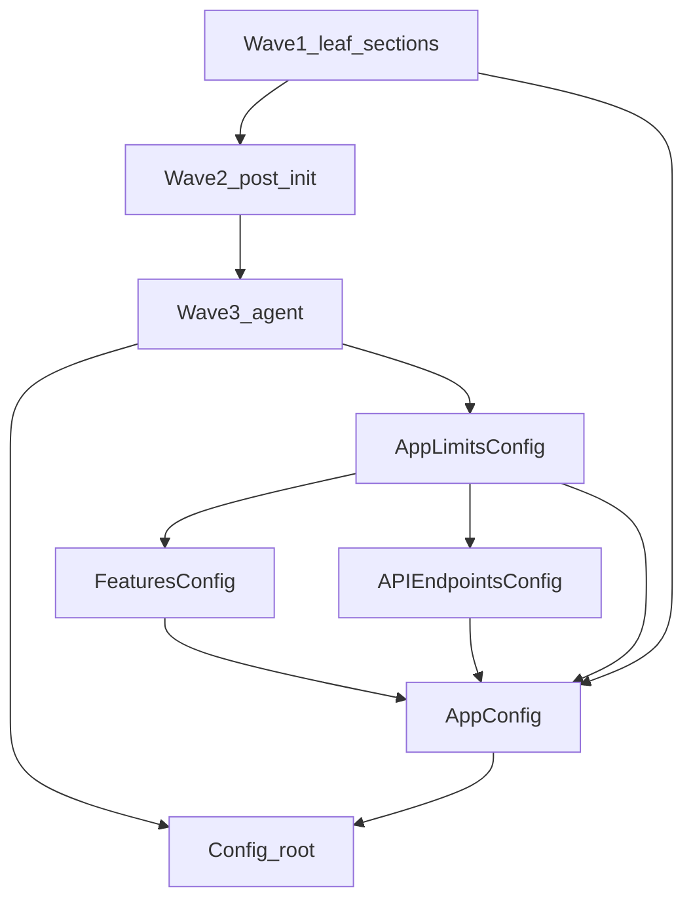

# 增量迁移：`app/utils/config.py` dataclass → Pydantic `BaseModel`

本文档供人类或自动化按**任务单元**执行；每完成一个任务应能通过当时适用的测试（至少 `pytest tests/app/utils/test_config.py`，最终以全量 CI 为准）。

## 目标与约束

- **运行时兼容**：属性访问、嵌套结构、`@property`（如 `DatabaseSettings.url`）、以及 [`_validate_config`](app/utils/config.py) 对 `config.app.limits` 等字段的**原地修改**在迁移完成前必须保持有效。
- **加载兼容**：[`load_config`](app/utils/config.py) 继续读取现有 YAML 形状；未知键策略需与当前 `**dict` 构造行为对齐（通常 `model_config = ConfigDict(extra="ignore")`）。
- **Pydantic 版本**：仓库为 Pydantic v2（见根目录 `requirements.txt`）。
- **非迁移项**：模块级常量、`Environment`、`CompanionMemoryBootstrapType`、`_validate_config` / `_parse_surprise_snap_config` 的**语义**可保留；随类迁移可把部分逻辑收进 `field_validator` / `model_validator`（可选，非每任务必做）。

## 迁移策略（总览）

1. **自下而上**：先叶子配置类，再含嵌套类型的 `AppConfig`，最后根类型 `Config`。
2. **根仍为 dataclass 的中间态**：在 `Config` 未迁移前，已变为 `BaseModel` 的子配置由 `load_config` 用 `Model.model_validate(section_dict)` 构造，再传入 `Config(...)` — Python 类型注解更新为对应 `BaseModel` 即可。
3. **不要**在中间态对全局 `Config` 实例开启 `frozen=True` 或 `validate_assignment=True`，以免破坏 `_validate_config` 与测试中就地赋值。
4. **每类迁移的机械步骤**（自动化可照此模板执行）：
   - 将 `@dataclass` 改为 `class Foo(BaseModel)`；
   - `field(default_factory=...)` → `Field(default_factory=...)`；
   - `x: List[T] = None` 这类注解 → `Optional[list[T]] = None`（或等价）；
   - `__post_init__` → `model_validator(mode="after")` 或 `field_validator`；
   - 嵌套 `Enum` / `StrEnum` 保持引用或改为 Pydantic 友好字段类型；
   - 在 `load_config` 中把 `Foo(**d)` / `Foo(**dict)` 改为 `Foo.model_validate(d)`（或对已预处理对象用 `model_validate`）；
   - 运行 `pytest tests/app/utils/test_config.py`。

## 依赖图（任务阻塞关系）

说明：`AppConfig` 依赖 `LimitsConfig`、`FeaturesConfig`、`APIEndpointsConfig` 及若干 Wave1 段；`Config` 依赖所有 section 类型。

---

## 任务表（按执行顺序）

以下 `task_id` 建议作为自动化流水线的稳定标识符；`depends_on` 为空表示仅依赖模块已有符号/标准库。

| task_id | status | class | depends_on | load_config 触达 YAML 键 | 备注 |
|--------|--------|-------|------------|---------------------------|------|
| CFG-PYD-01 | done | `LoggingConfig` | — | `logging` | 已迁移为 `BaseModel`；`colorize` 格式覆盖由 `model_validator(after)` 保持 |
| CFG-PYD-02 | done | `SecurityConfig` | — | `security` | 已迁移为 `BaseModel`；纯字段 |
| CFG-PYD-03 | done | `DatabaseSettings` | — | `database` | 已迁移为 `BaseModel`；保留 `@property`：`url` / `async_url` / `async_replica_url` |
| CFG-PYD-04 | done | `GoogleOAuthConfig` | — | `google_oauth` | 已迁移为 `BaseModel`；纯字段 |
| CFG-PYD-05 | done | `VerificationConfig` | — | `verification` | 已迁移为 `BaseModel`；纯字段 |
| CFG-PYD-06 | done | `APIEndpointsConfig` | — | `app.api_endpoints`（预处理 dict） | 已迁移为 `BaseModel`；被 `AppConfig` 引用；先迁移便于 `AppConfig` 一次到位 |
| CFG-PYD-07 | done | `EmbeddingConfig` | — | `embedding` | 已迁移为 `BaseModel`；纯字段 |
| CFG-PYD-08 | done | `GCSConfig` | — | `gcs` | 已迁移为 `BaseModel`；纯字段 |
| CFG-PYD-09 | done | `FirebaseConfig` | — | `firebase` | 已迁移为 `BaseModel`；纯字段 |
| CFG-PYD-10 | todo | `GooglePlayConfig` | — | `google_play` | 修正 `fallback_tracks: list[str] = None` 等为 `Optional[...]` |
| CFG-PYD-11 | todo | `CloudflareConfig` | — | `cloudflare` | 纯字段 |
| CFG-PYD-12 | todo | `ElevenLabsConfig` | — | `elevenlabs` | 必填 `api_key`：保留无默认或 `Field(...)` |
| CFG-PYD-13 | todo | `FalConfig` | — | `fal` | 纯字段 |
| CFG-PYD-14 | todo | `SurpriseSnapConfig` | — | `_parse_surprise_snap_config` 返回值 | 与解析函数联动；解析函数可改为返回已 validate 的模型 |
| CFG-PYD-15 | todo | `UserAnalyticsReportConfig` | — | `user_analytics_report` | 纯字段 |
| CFG-PYD-16 | todo | `GeminiLiveConfig` | — | `gemini_live` | 纯字段 |
| CFG-PYD-17 | todo | `TTSConfig` | — | `tts` | 纯字段 |
| CFG-PYD-18 | todo | `MemoryExtractionConfig` | — | `memory_extraction` | 内含 `WorkflowMode`；`__post_init__` 字符串→枚举 |
| CFG-PYD-19 | todo | `PushNotificationConfig` | — | `push_notification` | `stages` 默认 dict；`__post_init__` → `model_validator(after)` |
| CFG-PYD-20 | todo | `FeaturesConfig` | — | `app.features`（预处理 dict） | `companion_transcript_compaction` 等；`__post_init__` 校验 bootstrap / context_mode |
| CFG-PYD-21 | todo | `AgentConfig` | — | `agent` | 体量大；无其它 *Config* dataclass 交叉引用 |
| CFG-PYD-22 | todo | `AppConfig.LimitsConfig` | CFG-PYD-01..21 中与 app 树无冲突者 | `app.limits`（预处理 dict） | **仅嵌套类**：先改为 `BaseModel`，父 `AppConfig` 仍为 dataclass 亦可 |
| CFG-PYD-23 | todo | `AppConfig` | CFG-PYD-06, CFG-PYD-20, CFG-PYD-22 | `app` | 含 `backend_cors_origins` 等；修正 `List[AnyHttpUrl] = None` 为 `Optional[...]`；`LimitsConfig` / `features` / `api_endpoints` 默认值用 `Field(default_factory=...)`；`__post_init__` 合并进 validator |
| CFG-PYD-24 | todo | `Config` | CFG-PYD-01..23 | 根对象：`Config(...)` 整段 | 最后一跳；`load_config` 返回类型为 Pydantic `Config`；各子键一律 `model_validate` |

**并行建议**：`CFG-PYD-01`～`CFG-PYD-19` 中凡 `depends_on` 仅为「无」且互不修改同一代码块的，可由自动化并行尝试；冲突时以文件级锁串行。

---

## 每任务验收清单（可复制到 CI 步骤）

适用于每个 `CFG-PYD-xx`：

1. [ ] 目标类已继承 `BaseModel`，已移除 `@dataclass` / `dataclasses.field`。
2. [ ] 默认值与 `default_factory` 行为与迁移前一致（含 `FeaturesConfig.companion_transcript_compaction` 深拷贝语义）。
3. [ ] `load_config` 中对应构造已改为 `Model.model_validate(...)`（或对已是模型实例的短路）。
4. [ ] `pytest tests/app/utils/test_config.py` 通过。
5. [ ] 若该类型被 `from app.utils.config import ...` 在类型注解中使用，运行 mypy/ruff（若仓库 CI 启用）无新增错误。

根任务 **CFG-PYD-24** 额外：

6. [ ] `app/core/config.py`、`backend/alembic/env.py` 等仅导入 `Config`/`load_config` 的模块无需改签名即可工作（或仅更新类型存根）。
7. [ ] 全量 `pytest -m "not noci"` 或团队约定子集通过。

---

## `load_config` 增量修改说明（给自动化）

当前结构（逻辑锚点，行号随变更漂移以代码为准）：

- 读取 `yaml.safe_load` 后，对 `app` 子树：`limits`、`features`、`api_endpoints`、`environment` 预处理。
- 根 `return Config(app=AppConfig(**app_data), security=SecurityConfig(...), ...)`。

**每迁移一个 section 类 `X`**：将 `X(**data.get("key", {}))` 改为 `X.model_validate(data.get("key") or {})`，并处理已是 dict 的嵌套（如 `app_data["limits"]` 在迁移 `LimitsConfig` 后为 dict 时需 `LimitsConfig.model_validate`）。

**`CFG-PYD-14`（SurpriseSnap）**：保持 `_parse_surprise_snap_config` 的 ISO 时间解析行为，返回 `SurpriseSnapConfig.model_validate({...})` 或在内联构造处等价。

---

## 可选后续（非阻塞任务）

| task_id | 描述 |
|--------|------|
| CFG-PYD-OPT-01 | 将 `_validate_config` 中仅依赖单个子树的规则拆入对应 `BaseModel` 的 `model_validator` |
| CFG-PYD-OPT-02 | 为 YAML 根定义顶层 `RootConfig` 单模型，合并 `load_config` 与 `surprise_snap` 特例（减少手写拼装） |
| CFG-PYD-OPT-03 | 删除重复的 `from loguru import logger` 等无关清理 |

---

## 参考文件

- 实现与校验逻辑：[`app/utils/config.py`](../../app/utils/config.py)
- 导入侧：[`app/core/config.py`](../../app/core/config.py)
- 回归测试：[`tests/app/utils/test_config.py`](../../tests/app/utils/test_config.py)
