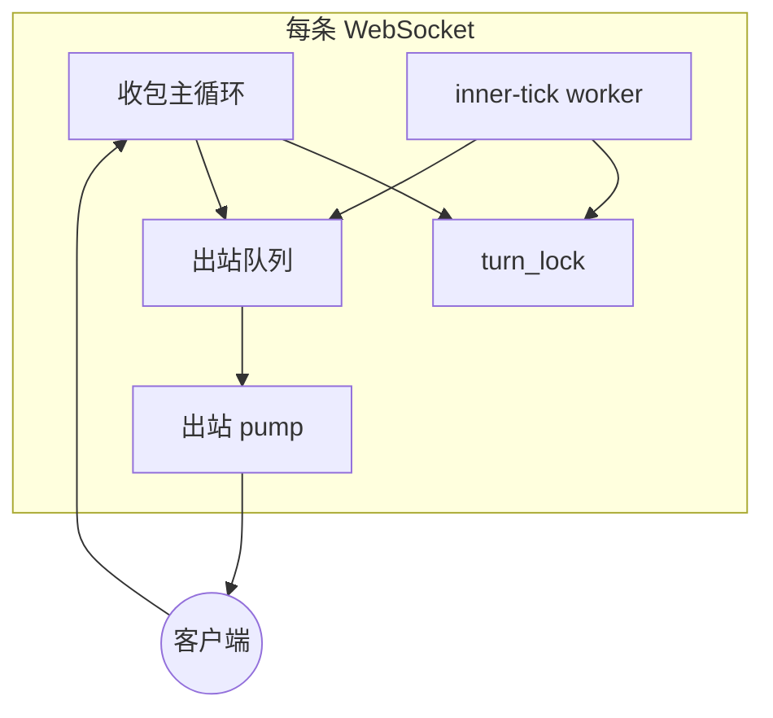
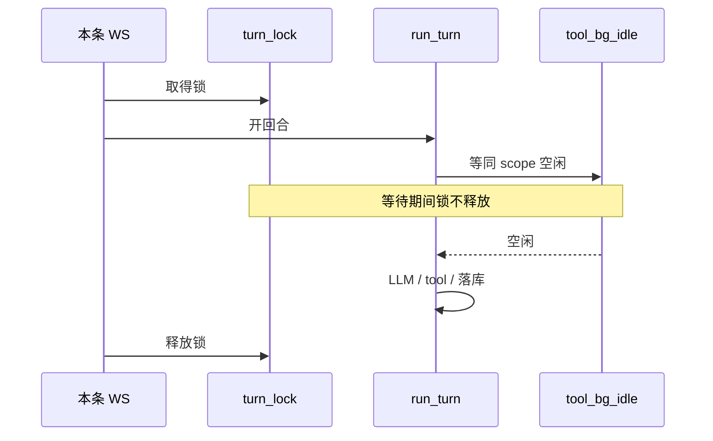

# Companion `/ws`：收包循环、`turn_lock` 串行与队头阻塞

**归属（先读）**：**`turn_lock` → WebSocket 连接**；**`tool_bg_idle` → `CompanionSession`（scope）**。下文按此归属展开。

**一句话**：每条 WebSocket 用收包循环分发帧，业务 JSON 经 FIFO 写出；连接上一把 `turn_lock` 串行 companion 回合；`run_turn` 在持锁期间还可能等同 scope 的 `tool_bg_idle`——两层叠加即队头阻塞。

## 适用边界

- 端点：`/api/v1/chat/ws` 伴侣路径（经 harness `run_turn`）。
- 不含：`/ws/verify`、HTTP REST chat、Live Chat 语音 WS。

## 连接上有什么

| 组件 | 职责 |
|------|------|
| **收包主循环** | 收用户帧、处理 tool 完成事件；用户 chat 一轮未结束前，通常不会开始处理下一条用户 chat。 |
| **出站队列 + pump** | 助手/业务 JSON 按 FIFO 写出；ping、context ack 等控制帧绕过队列直发。 |
| **协调器（每连接一份）** | 持有 `turn_lock`、heartbeat 坐标、tool 完成事件通道等。 |
| **inner-tick worker** | 独立任务，按周期尝试 proactive / maintenance / scheduled；与用户帧 **抢同一把 `turn_lock`**。 |

## 各路径在编排上的差别（不是两套 harness）

| 路径 | 是否挡住收包循环处理下一条用户 chat | 是否抢 `turn_lock` |
|------|-------------------------------------|-------------------|
| **user_signed_on → greeting** | 否（先 ack，回合异步入队） | 是 |
| **用户 chat** | 是（整轮结束才继续收） | 是 |
| **inner-tick** | 否（独立 worker） | 是 |
| **tool 完成通知** | 仅在与收包竞胜的那一轮 | 是 |

Greeting 与用户消息 **共用** 同一套伴侣管线与同一把锁；差别只在 **先 ack 再排队** vs **主循环内等整轮结束**。

## 队头阻塞：两层、两种归属

| 原语 | 挂在谁身上 | 等什么 |
|------|------------|--------|
| **`turn_lock`** | **本条 WebSocket** | 同连接上其它回合（greeting、用户 chat、inner-tick、tool 收尾组包）释放锁 |
| **`tool_bg_idle`** | **companion scope** `(user, agent, chat)` | 同 scope 上一轮 `tool_background` 线程宣告空闲 |

简记：**锁归连接，event 归 scope。**

- **层 1**：任意来源长时间占 `turn_lock`（例如 maintenance 整轮 LLM + tool），其它来源在该连接上排队。
- **层 2**：已拿到锁的 `run_turn` 在加载 transcript 之前可能长时间等 `tool_bg_idle`；等待期间 **不释放** `turn_lock`，对外等价于长时间占锁。
- **僵死 tool**：event 长期不 set → 可反复接近配置上限的空等；超时 **不会** 自动把 event 置回空闲，下一轮仍可能再卡。

**双连接边角**：同一 scope 两条 WS → 两把 `turn_lock`、一个 `tool_bg_idle`；产品侧通常单连接。

典型现象：用户消息已入站，数分钟无 chat 回复；其间可见 proactive inner-tick 的 `[SILENT]`——**不是**对该用户消息的回复。

## 断开与生命周期（意图 vs 现状）

- **现状**：连接结束或进程 shutdown 会 **cancel** 仍在飞的回合任务。
- **目标（TODO）**：断连后让回合跑完、落库并标 undelivered，供下次 `user_signed_on` 拉取——**尚未实现**。

## 观测与调查（2026-05-17）

- **现象**：REPL 已显示 `user-input`，数分钟无 `chat`；其间有 proactive `[SILENT]`。
- **根因链（本地一次复现）**：maintenance inner-tick 启动 `tool_background` → 子步骤模型 JSON 失败、父 trace 长期 pending → 用户消息已入站但 `run_turn` 未开跑 → 约 600s `tool_bg_idle` 超时后才进入正常 chat 回合。
- **调查**：`.cursor/skills/inty-backend-inspect/`（卡住 tool + turn_lock）；REPL 勿把 `[SILENT]` 当用户回复——`inspect-repl-message-metadata`。
- **临时缓解**：重启 backend 或断线重连后再发。

## 后续待办

- 用户消息不应被 maintenance / 僵死 `tool_bg` 拖住整段占锁期（优先级、可抢占，或 user lane 与 inner-tick lane 分离）。
- `tool_bg_idle` 超时后应能安全恢复（强制空闲 + 隔离僵死 tool 线程）。
- tool 模型 JSON 失败应限时收尾，避免子步骤长期 pending。
- 实现断连 finish + undelivered，替代 `cancel_all`。
