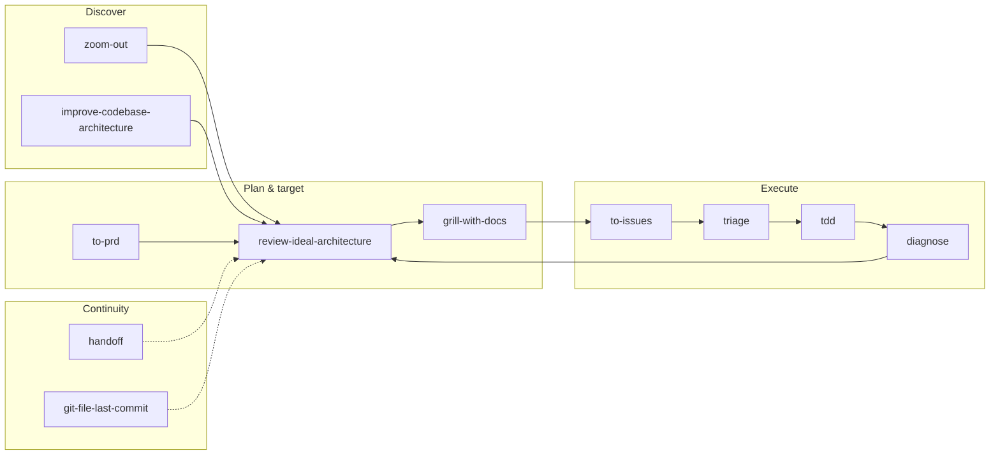

# Agentic coding lifecycle — skill loop

<!-- Generated entirely by Cursor agent for closed-loop dev workflow alignment. -->

Balanced workflow: alternate **top-down** (plan, ideal target) and **bottom-up** (friction, depth), with human gates at design and ticket boundaries.

## When to invoke each

| Phase | Skill | Question it answers |
| --- | --- | --- |
| Unfamiliar area | `zoom-out` | What modules exist and who calls whom? |
| Organic friction | `improve-codebase-architecture` | Where are modules shallow; what deepening helps testability? |
| Intent capture | `to-prd` | What are we building and why? |
| **Target structure** | **`review-ideal-architecture`** | **Given plan + snapshot, where should everything live?** |
| Decision hardening | `grill-with-docs` | Does the target violate glossary or ADRs? |
| Work breakdown | `to-issues` | What tracer-bullet slices ship independently? |
| Queue hygiene | `triage` | What is ready for an AFK agent? |
| Implementation | `tdd` | Red → green → refactor per slice. |
| Regression | `diagnose` | Reproduce → fix → regression test. |
| Session bridge | `handoff` | What should the next agent load? |
| Spec drift | `git-file-last-commit` | What changed since the spec last matched main? |

## Re-entry triggers

Re-run **`review-ideal-architecture`** when:

- A major refactor phase merges (update phase status)
- Plan doc amends (reconcile new target)
- `improve-codebase-architecture` surfaces a candidate that changes package boundaries (amend plan first, then re-run)
- Before `to-issues` on a multi-phase refactor — issues should slice the **ideal** tree, not today's accident

## Inty companion harness defaults

| Artifact | Path |
| --- | --- |
| Refactoring plan | `docs/companion_harness/REFACTOR_PLAN.md` |
| Phase 3 slices | `docs/companion_harness/REFACTOR_PLAN_PHASE3_SLICES.md` |
| Architecture invariants | `docs/companion_harness/ARCH.md` |
| Glossary | `docs/companion_harness/GLOSSARY.md` |
| Code root | `app/core/companion_harness/` |
