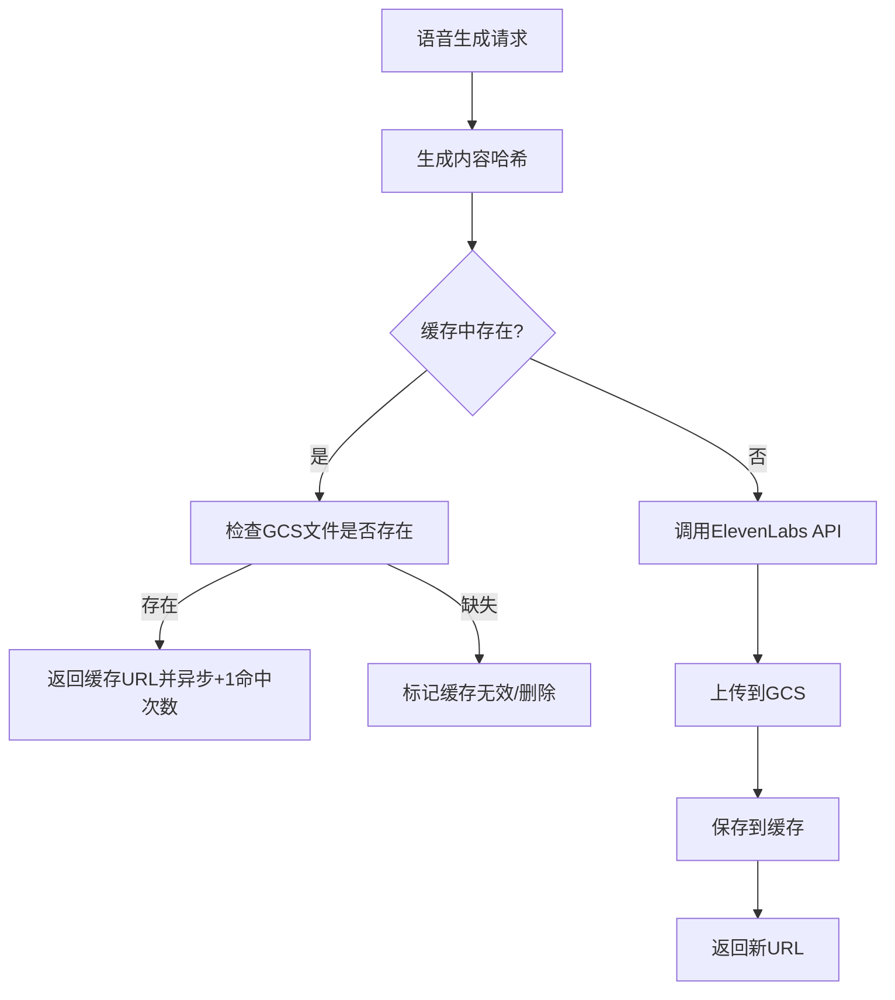

# AI 语音系统文档

## 概述

InTy 后端集成了先进的 AI 语音回复系统，使用 ElevenLabs API 为用户提供高质量的语音体验。系统支持自动语音生成、智能缓存、成本优化等功能。

## 核心特性

### 🎵 高质量语音合成

- **ElevenLabs Flash v2.5 模型**：75ms 超低延迟，专为实时应用优化
- **多语音支持**：支持多种语音角色，可为不同 Agent 配置专属语音
- **移动端优化**：使用 `mp3_22050_32` 格式，文件小传输快
- **32种语言支持**：包含中文、英文等主流语言

### ⚡ 智能播放控制

- **自动播放模式**：基于 `chat_settings.voice_enabled` 配置
- **手动播放模式**：用户点击播放按钮触发语音生成
- **个性化设置**：用户级别和聊天级别的语音偏好设置

### 🚀 极速响应优化

- **并行处理**：AI回复与聊天设置同时获取
- **缓存优先**：优先检查语音缓存，秒级返回
- **异步生成**：文本立即返回，语音后台生成
- **智能任务管理**：语音生成任务状态跟踪

### 💰 成本优化策略

- **智能缓存系统**：基于内容哈希的语音文件缓存
- **文件压缩**：优化的音频格式减少存储和传输成本
- **定期清理**：自动清理过期缓存文件
- **重复利用**：相同内容自动复用已生成的语音

## 文本清洗与默认音色

- **文本清洗规则**：`VoiceService._clean_text_for_voice` 仅移除中文 `（ ... ）` 与英文 `( ... )` 括号内的动作/心理描写，并折叠连续空白字符，避免把星号等其他符号意外删除。
- **超长文本截断**：当清洗后的文本长度超过 `config.elevenlabs.max_text_length`（默认 5000）时会就地截断，确保 SDK 不报错。
- **语音默认值**：在没有显式 `voice_id` 时，会先根据 `agent_gender` 使用 `GENDER_VOICE_MAPPING = {"MALE": "rHWSYoq8UlV0YIBKMryp", "FEMALE": "4tRn1lSkEn13EVTuqb0g", "OTHER": "O7p2vmz2iEYgMXxkbsif"}`，再回退到配置里的 `voice_id`，确保所有 Agent 都能生成语音。
- **空文本保护**：如果清洗后文本为空，会直接跳过语音生成，避免无意义的 SDK 调用。

## 系统架构

### 核心服务组件

```
┌─────────────────┐    ┌──────────────────┐    ┌─────────────────┐
│   Chat API      │───▶│  Voice Service   │───▶│  ElevenLabs API │
│   (chats.py)    │    │                  │    │                 │
└─────────────────┘    └──────────────────┘    └─────────────────┘
         │                       │                       │
         ▼                       ▼                       ▼
┌─────────────────┐    ┌──────────────────┐    ┌─────────────────┐
│ Chat Settings   │    │ Voice Cache      │    │    GCS Storage  │
│ (voice_enabled) │    │ Service          │    │   (Audio Files) │
└─────────────────┘    └──────────────────┘    └─────────────────┘
```

### 数据库设计

#### voice_cache 表

```sql
CREATE TABLE voice_cache (
    id UUID PRIMARY KEY,                                   -- 由服务端生成的 UUID
    content_hash VARCHAR(32) UNIQUE NOT NULL,              -- MD5(text + voice_id + model + language)
    text_content TEXT NOT NULL,                            -- 原始文本（最多 1000 字符）
    voice_id VARCHAR(255) NOT NULL,
    model VARCHAR(255) NOT NULL,
    language VARCHAR(16) NOT NULL,
    audio_url TEXT NOT NULL,                               -- GCS 文件 URL
    duration DOUBLE PRECISION DEFAULT 0,                   -- 音频时长（秒）
    file_size INTEGER DEFAULT 0,                           -- 音频大小（字节）
    hit_count INTEGER DEFAULT 0,                           -- 缓存命中次数
    last_accessed TIMESTAMPTZ DEFAULT NOW(),
    created_at TIMESTAMPTZ DEFAULT NOW(),
    is_active BOOLEAN DEFAULT TRUE                         -- 文件失效后会被置为 false
);
```

- `VoiceCacheService` 会在保存时将 `text_content` 截断为 1000 字符，并在命中后异步更新 `hit_count` 与 `last_accessed`。
- 命中缓存后仍会二次确认 GCS 中的文件是否存在，不存在时会把该条记录标记为 `is_active = false`。

#### chat_settings 表 (语音相关字段)

```sql
voice_enabled BOOLEAN DEFAULT true -- 是否启用语音自动播放
```

- ORM 默认值设置为 `true`，以保持与旧版客户端的兼容性。
- `chat_service.get_or_create_chat_settings` 在创建新聊天时会显式写入 `voice_enabled = false`，只有用户在 App 内打开自动播放时才会变为 `true`。

#### agents 表 (语音相关字段)

```sql
voice_id VARCHAR(255) -- Agent 专属语音 ID，为空时使用默认语音
```

- `app/models/agent.py` 中字段为可选字符串，配合 `agent.gender` 信息一起决定最终使用的音色。

## 配置说明

### config.yaml 配置

```yaml
elevenlabs:
  api_key: "sk_your_api_key_here" # ElevenLabs API 密钥
  model: "eleven_flash_v2_5" # 推荐模型 (75ms 延迟)
  voice_id: "EXAVITQu4vr4xnSDxMaL" # 默认语音 ID (Sarah - 温柔女声)
  output_format: "mp3_22050_32" # 移动端优化格式
  enabled: true # 是否启用语音功能
  max_text_length: 5000 # 最大文本长度限制
```

### 推荐语音配置

#### 女声选项

- `EXAVITQu4vr4xnSDxMaL` - Sarah (温柔女声) ✅ 推荐
- `VR6AewLTigWG4xSOukaG` - Jessica (专业女声)
- `AZnzlk1XvdvUeBnXmlld` - Domi (活泼女声)
- `ThT5KcBeYPX3keUQqHPh` - Dorothy (成熟女声)

#### 男声选项

- `pNInz6obpgDQGcFmaJgB` - Adam (标准男声)
- `JBFqnCBsd6RMkjVDRZzb` - George (深沉男声)

### 输出格式选择

- `mp3_44100_128` - 高质量，文件较大
- `mp3_22050_32` - **移动端推荐**，小文件快传输
- `pcm_44100` - 无压缩格式，需要 Pro 套餐

## 额度与限流

- **生成前检查**：当 `voice_service.generate_voice` 同时拿到 `user` 与 `db` 时，会调用 `subscription_service.check_voice_generation_limit` 确保用户配额未被耗尽。
- **命中缓存也记账**：无论语音是新生成还是命中缓存，都会通过 `subscription_service.record_usage` 写入 `voice_generation` 用量，并在 `extra_data` 中标记 `cached`、`voice_id` 与 `text_length`。
- **聊天额度共存**：语音配额独立于 `chat` 配额；即使语音生成被拒绝，文本回复仍然会返回。

## API 接口

### v1 聊天接口（仍在生产，带语音）

```http
POST /api/v1/chat/completions/{agent_id}
Content-Type: application/json

{
  "messages": [
    {
      "role": "user",
      "content": "Hello"
    }
  ],
  "stream": false,
  "model": "chatbot",
  "language": "zh"
}
```

- 该路由会根据 `chat_settings.voice_enabled` 决定是否调用 `voice_service.generate_voice`，并把生成得到的 `audio_url` 合并进响应。
- 路由在代码层标记为 `deprecated`，但仍是 App 正在使用的主路径。

### v2 聊天接口（实验中）

```http
POST /api/v2/chat/completions/{agent_id}
Content-Type: application/json

{
  "messages": [
    {
      "role": "user",
      "content": "Hello"
    }
  ],
  "stream": false,
  "model": "chatbot",
  "language": "zh"
}
```

- v2 版本沿用了相同的 `VoiceService`，但当前接口仍处于未完成状态（接口描述中明确标记）。
- 两个版本都不支持 `stream = true`。

#### 响应格式 (包含语音)

```json
{
  "id": "chatcmpl-xxx",
  "object": "chat.completion",
  "created": 1642723200,
  "model": "chatbot",
  "choices": [
    {
      "index": 0,
      "message": {
        "role": "assistant",
        "content": "Hello! How can I help you?",
        "audio_url": "https://storage.googleapis.com/inty-static/voice/202507/voice_xxx.mp3"
      },
      "finish_reason": "stop"
    }
  ],
  "usage": {
    "prompt_tokens": 10,
    "completion_tokens": 20,
    "total_tokens": 30
  }
}
```

### 语音生成控制逻辑

```python
# 自动语音生成逻辑
if chat_settings.voice_enabled:
    # 使用 Agent 的专属语音 ID，如果没有则使用默认
    voice_id = agent.voice_id or config.elevenlabs.voice_id

    # 生成语音并返回 URL
    voice_result = await voice_service.generate_voice(
        text=response_content,
        voice_id=voice_id,
        language=request.language,
        db=db
    )

    # 在响应中包含语音 URL
    if voice_result:
        audio_url, audio_duration = voice_result
        response["choices"][0]["message"]["audio_url"] = audio_url
    else:
        logger.warning("语音生成失败或达到配额限制，继续返回文本")
```

## 缓存策略

### 缓存键生成

```python
def generate_cache_key(text: str, voice_id: str, model: str, language: str = "zh") -> str:
    """生成缓存键 (内容哈希)"""
    content = f"{text}_{voice_id}_{model}_{language}"
    return hashlib.md5(content.encode()).hexdigest()
```

### 缓存命中流程



- `VoiceCacheService.get_cached_voice` 命中后会立刻返回 `(audio_url, duration)`，并通过 `asyncio.create_task` 异步更新 `hit_count`。
- 如果检测到 GCS 文件不存在，会在独立事务中把记录置为 `is_active = false`，防止后续继续命中。

### 缓存清理策略

- `cleanup_old_cache`：根据 `cache_ttl_days = 30` 删除 30 天未访问的记录，并尝试同时删除 GCS 文件。
- `cleanup_invalid_cache`：遍历活跃记录，发现 GCS 文件不存在时将 `is_active` 设为 `false`。
- `get_cache_stats`：可在管理后台展示缓存数量、今日命中总数以及总文件体积，为后续容量治理提供依据。

## 成本优化

### 1. 缓存重用

- **命中率监控**：通过 `voice_cache_service.get_cache_stats` 获取命中次数、总量与存储体积，为后续优化提供数据。
- **内容去重**：基于 `MD5(text + voice_id + model + language)` 的哈希键，天然避免重复生成浪费。
- **冷热分层**：`hit_count` 字段可用于将来拓展 LRU/按热度清理策略。

### 2. 格式优化

- **压缩率**：`mp3_22050_32` 比 `mp3_44100_128` 文件小约70%
- **质量平衡**：22.05kHz 采样率对语音质量足够
- **传输效率**：小文件降低CDN和存储成本

### 3. API 调用优化

- **并发控制**：缓存命中和 GCS 上传使用 `asyncio` 并行任务，缩短等待时间。
- **失败隔离**：语音生成异常不会影响文本回复，且会记录 warning 日志便于排查。
- **配额保护**：依赖 `subscription_service` 的前置检查与用量记录，避免滥用造成的成本失控。

## 监控与日志

### 关键监控指标

```yaml
语音系统监控:
  - 生成成功率: > 99%
  - 平均生成时间: < 2秒
  - 缓存命中率: > 70%
  - 文件上传成功率: > 99.5%
  - API错误率: < 1%
```

### 日志记录

```python
# 关键日志点
logger.info(f"开始语音生成: voice_id={voice_id}, text_length={len(text)}")
logger.info(f"缓存命中: {cache_hit}, URL={audio_url}")
logger.info(f"ElevenLabs API调用成功，音频大小: {len(audio_data)} bytes")
logger.info(f"GCS上传成功: {gcs_url}")
logger.error(f"语音生成失败: {error_message}")
```

## 故障排除

### 常见问题

#### 1. ElevenLabs API 错误

```bash
# 400 Bad Request: 模型不支持语言参数
ERROR: Model 'eleven_multilingual_v2' does not support language_code parameter
解决: 使用 eleven_flash_v2_5 或移除 language_code 参数
```

#### 2. 语音文件访问错误

```bash
# GCS 权限问题
ERROR: 403 Forbidden - Caller does not have storage.objects.get access
解决: 检查 GCS 服务账号权限配置
```

#### 3. 缓存问题

```bash
# 缓存表不存在
ERROR: relation "voice_cache" does not exist
解决: 运行数据库迁移 alembic upgrade head
```

### 性能优化建议

1. **启用 CDN**：为 GCS 存储配置 CDN 加速
2. **监控缓存命中率**：低于 70% 时优化缓存策略
3. **定期清理**：避免存储空间无限增长
4. **API 限流**：避免超出 ElevenLabs API 限额

## 开发指南

### 添加新语音角色

```python
# 1. 在 config.yaml 中配置新语音
# 2. 在 Agent 模型中设置 voice_id
# 3. 测试语音生成效果

# 示例：为特定 Agent 设置专属语音
agent.voice_id = "VR6AewLTigWG4xSOukaG"  # Jessica 专业女声
```

### 扩展支持的音频格式

1. 在配置（如 `devops/config.yaml.template`）里更新 `elevenlabs.output_format`。
2. 若输出格式不再是 MP3，需要同步调整 `GCSService.upload_voice_file(..., content_type="audio/mpeg")` 的 `content_type`，确保浏览器可正确播放。
3. ElevenLabs 不同套餐支持的格式不同，切换前需确认账号权限；若 SDK 报错可在日志中看到明确提示。

### 集成其他语音服务（规划）

- 当前 `VoiceService` 直接使用 ElevenLabs SDK；若要接入其它 TTS 服务，可创建新的 `CustomVoiceService`，实现与现有 `generate_voice` 相同的签名与返回值 `(audio_url, duration)`。
- 将 `app/services/voice_service.py` 中的 `voice_service = VoiceService()` 替换或封装为工厂，即可在 API 层无感切换。
- 推荐尽量复用 `VoiceCacheService` 与 `GCSService`，这样即使底层供应商不同，缓存、配额与监控逻辑也能保持一致。

## 更新日志

### v1.0.0 (2025-07-16)

- ✅ 集成 ElevenLabs API
- ✅ 实现智能缓存系统
- ✅ 支持自动/手动播放模式
- ✅ 移动端格式优化
- ✅ GCS 文件管理
- ✅ 成本优化策略

### 后续计划

- 🔄 支持实时语音流
- 🔄 多语音服务切换
- 🔄 语音情感控制
- 🔄 批量语音生成
- 🔄 语音质量评估
