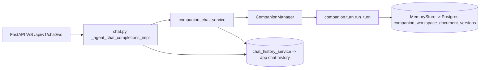
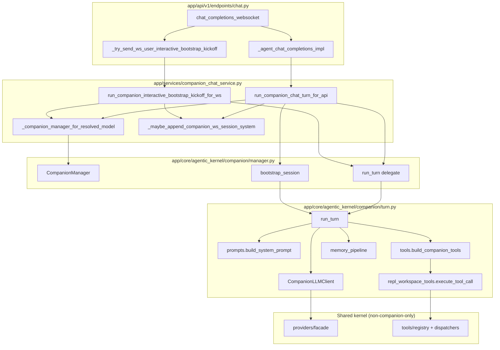

# Agentic kernel architecture (WebSocket to companion)

This document describes how **`WS /api/v1/chat/ws`** reaches the agentic **companion** stack under `app/core/agentic_kernel/`, and how that stack relates to other `agentic_kernel` packages. It is based on the current code layout, not on historical YAML names.

## Two chat paths

| Route | Core stack | `agentic_kernel` role |
| --- | --- | --- |
| `POST /api/v1/chat/completions/{agent_id}` | Legacy `app.core.agent.agent.Agent` (LangChain history, etc.) | Optional: `providers/*`, `tools/runtime`, `prompting/assembler` (see `Agent` imports). **Does not** run `companion.turn.run_turn`. |
| `WS /api/v1/chat/ws` | `app.services.companion_chat_service` + `CompanionManager` + `companion.turn.run_turn` | Primary: `companion/*` plus shared `providers/facade`, `tools/registry`, `tools/dispatchers/*`. |

WebSocket handler: `app/api/v1/endpoints/chat.py` (`router` prefix `/chat`, so full path is `/api/v1/chat/ws` when mounted under `API_V1_PREFIX`).

## WebSocket entry and companion gate

1. `chat_completions_websocket` accepts the socket, resolves `current_user`, optional `assume_user_id`, reads `appVersionCode`.
2. If query param `agent_id` is set, `_try_send_ws_user_interactive_bootstrap_kickoff` may send **one** proactive assistant JSON (interactive bootstrap only). See `app.features.companion_workspace_bootstrap_type` in config.
3. Main loop: parse `ChatWebSocketRequest`, merge time context, call `_agent_chat_completions_impl(..., chat_route="websocket")`.
4. Inside `_agent_chat_completions_impl`, `use_companion = (chat_route == "websocket")`. When true, text reply comes from `companion_chat_service.run_companion_chat_turn_for_api` (not from `Agent.generate_message...`).

## Service and session layer

- **`app/services/companion_chat_service.py`**
  - Builds `CompanionConfig` / `CompanionLLMConfig` from `global_config_loaded_from_config_yaml` (`app.features`, `agent.chat_llm_*`, `agent.api_key`, `database.url` for MemoryStore DSN).
  - LRU-caches `CompanionManager` per resolved chat model id + runtime fingerprint.
  - `run_companion_chat_turn_for_api`: `get_or_create_session`, optional `bootstrap_session` (**LEGACY** only), optional `_maybe_append_companion_ws_session_system` (**USER_INTERACTIVE**), then `manager.run_turn`.
  - `run_companion_interactive_bootstrap_kickoff_for_ws`: connect-time kickoff using fixed internal user line from `bootstrap_user_interactive.py`.

- **`app/core/agentic_kernel/companion/manager.py`**
  - `get_or_create_session`: registers `MemoryStore` for workspace path `.../user_id/companion_id/chat_id`, seeds `context.json`, optionally `ensure_minimal_workspace_documents_in_store`.
  - `bootstrap_session`: **LEGACY** only, delegates to `bootstrap.run_workspace_bootstrap_loop`.
  - `run_turn`: thin async wrapper calling `companion.turn.run_turn` with session store and config flags.

## Core turn (`companion/turn.py`)

One user line (or heartbeat synthetic text) executes:

1. Load `ContextMeta` and `PromptBundle` from `MemoryStore` (`models.load_context_meta`, `load_prompt_bundle`).
2. Load `transcript.jsonl`, optional transcript compaction (`transcript_compaction.py`).
3. `build_system_prompt` (`prompts.py`), including interactive-bootstrap append when `workspace_bootstrap_type == USER_INTERACTIVE` and phase not completed.
4. `build_companion_tools` (`tools.py` -> `repl_workspace_tools.build_openai_repl_tools`), tool list shrinks during interactive bootstrap.
5. Tool loop: `CompanionLLMClient.chat_completion` -> OpenAI-compatible HTTP via **`app/core/agentic_kernel/providers/facade.py`** (`llm_client.py`).
6. Tool execution: **`repl_workspace_tools`** -> **`app/core/agentic_kernel/tools/registry.py`** and **`tools/dispatchers/workspace.py`** / **`media.py`** for shared parsing; companion-specific logic stays under `companion/`.
7. Append user/assistant (and tool traces as designed) to transcript; `schedule_memory_update_after_turn` / `memory_pipeline.py` for post-turn curation.

**`companion/turn_engine.py`**: helpers for **local REPL** (`tools/inty_v2_repl`) to assemble base OpenAI messages and transcript rows. Production **`WS /api/v1/chat/ws`** does not import `turn_engine`; it goes through `turn.run_turn` inside `companion_chat_service`.

## Bootstrap modes (`companion_workspace_bootstrap_type`)

| Value | Session create | First user message on API path |
| --- | --- | --- |
| `NONE` (default) | Minimal seed docs in store | `run_turn` only |
| `LEGACY` | No minimal seed at create (per manager) | Consumed by `bootstrap_session` / `run_workspace_bootstrap_loop` until workspace init predicate passes |
| `USER_INTERACTIVE` | Minimal seed + `context.json` flags for interactive phase | Always `run_turn`; model uses `companion_update_prompt_slice` / `companion_bootstrap_user_interactive_complete` (`bootstrap_user_interactive.py`); SOUL lock rules in `memory_pipeline` + `repl_workspace_tools` |

Implementation references: `manager.py` (session create), `companion_chat_service.py` (branching), `bootstrap.py` (LEGACY loop).

## Shared `agentic_kernel` building blocks (companion path)

These are imported by companion code on the WebSocket path:

- **`providers/facade.py`** (+ `openai_compatible.py`): HTTP chat/completions client used by `CompanionLLMClient`.
- **`tools/registry.py`**, **`tools/dispatchers/*`**: REPL tool registry and shared workspace/media dispatch helpers from `repl_workspace_tools.py`.

**LEGACY bootstrap only** additionally uses:

- **`tools/runtime.py`** (`resolve_official_assistant_tool_loop`): wired from `companion/bootstrap.py`.

## Not on the WebSocket companion path

The following live under `app/core/agentic_kernel/` but are **not** imported by `companion/turn.py` or the WebSocket -> `companion_chat_service` chain:

- **`contracts/`** (`turn.py`, `tool.py`, `prompt.py`, `heartbeat.py`): used by **`runtime/turn_orchestrator.py`**, **`runtime/persistence.py`**, **`bridges/experimental_bridge.py`** - a separate typed turn pipeline, not the companion REPL loop.
- **`runtime/turn_orchestrator.py`**: orchestrates `TurnInput` / `TurnOutput`; not used for `/chat/ws` companion replies today.

Do not assume WebSocket companion behavior from `contracts/` alone; follow `companion/turn.py` and `repl_workspace_tools.py`.

## Persistence (conceptual)

- **Workspace authority** for API companion: documents and transcript versions go through **`MemoryStore`** (ORM-backed), not local disk as source of truth when DSN is configured (see `app/api/ENDPOINTS.md` companion section).
- **Product chat history**: user/assistant (and optional system / kickoff metadata) via `chat_history_service` after companion returns.

## End-to-end control flow (WebSocket + companion)

## Related docs

- `app/api/ENDPOINTS.md` - public endpoint behavior and feature flags summary.
- `app/core/agentic_kernel/companion/README.md` - in-tree companion module notes (if present).
- `docs/FR_INTY_V2_CHAT_WS_INTEGRATION_PLAN.md` - product integration plan and known limits.

## Maintenance

When changing WebSocket or companion wiring, update this file if:

- a new stage runs before `run_turn` (e.g. extra kickoff or persistence),
- companion starts importing a new top-level `agentic_kernel` package (add to "Shared" or "Not on path" section),
- the HTTP vs WebSocket routing split changes.
