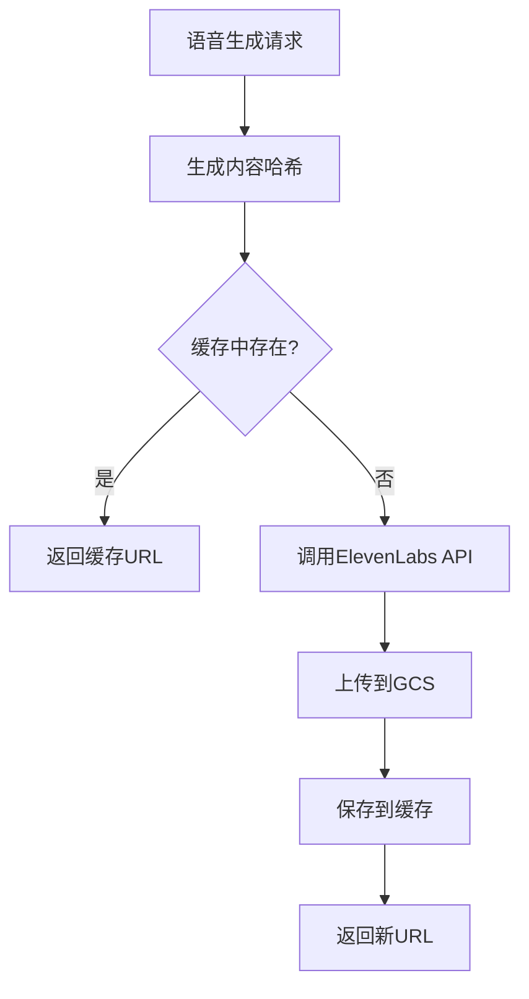

# AI语音系统文档

## 概述

InTy 劳动力集成了先进的AI语音回复系统，使用ElevenLabs API为用户提供高质量的语音体验。系统支持自动语音生成、智能存储、成本优化等功能。

## 核心特性

### 🎵 高质量语音合成

- **ElevenLabs Flash v2。5模型**：75ms超低延迟，专为实时应用优化
- **多语音支持**：支持多种语音角色，配置不同代理配置专属语音
- **移动端优化**：使用`mp3_22050_32` 格式，文件小传输快
- **32种语言支持**：包含中文、英文等主流语言

### ⚡ 智能播放控制

- **自动播放模式**：基于 `chat_settings.voice_enabled` 配置
- **手动播放模式**：用户点击播放按钮触发语音生成
- **个性化设置**：用户级别和聊天级别的语音偏好设置

### 🚀 极速响应优化

- **并行处理**：AI回复与聊天设置同时获取
- **缓存优先**：优先检查语音缓存，秒级返回
- **异步生成**：文本立即返回，语音后台生成
- **智能任务管理**：语音生成任务状态跟踪

### 💰 成本优化策略

- **智能缓存系统**：基于内容哈希的语音文件缓存
- **文件压缩**：优化的音频格式减少存储和传输成本
- **定期清理**：自动清理过期缓存文件
- **重复利用**：相同内容自动复用已生成的语音

## 系统架构

### 核心服务组件

```
┌─────────────────┐    ┌──────────────────┐    ┌─────────────────┐
│   Chat API      │───▶│  Voice Service   │───▶│  ElevenLabs API │
│   (chats.py)    │    │                  │    │                 │
└─────────────────┘    └──────────────────┘    └─────────────────┘
         │                       │                       │
         ▼                       ▼                       ▼
┌─────────────────┐    ┌──────────────────┐    ┌─────────────────┐
│ Chat Settings   │    │ Voice Cache      │    │    GCS Storage  │
│ (voice_enabled) │    │ Service          │    │   (Audio Files) │
└─────────────────┘    └──────────────────┘    └─────────────────┘
```### 数据库设计

#### voice_cache 表```sql
CREATE TABLE voice_cache (
    id SERIAL PRIMARY KEY,
    content_hash VARCHAR(64) UNIQUE NOT NULL,  -- 内容哈希 (text + voice_id + model)
    audio_url TEXT NOT NULL,                   -- GCS 文件 URL
    file_size INTEGER NOT NULL,               -- 文件大小 (bytes)
    created_at TIMESTAMP DEFAULT NOW(),       -- 创建时间
    last_accessed TIMESTAMP DEFAULT NOW(),    -- 最后访问时间
    access_count INTEGER DEFAULT 1            -- 访问次数
);
```#### chat_settings 表（语音相关字段）```sql
-- voice_enabled: 是否启用语音自动播放
-- 优先级高于用户全局设置
ALTER TABLE chat_settings ADD COLUMN voice_enabled BOOLEAN DEFAULT false;
```#### 代理表（语音相关字段）```sql
-- voice_id: Agent 专属语音 ID，为空时使用默认语音
ALTER TABLE agents ADD COLUMN voice_id VARCHAR(255);
```## 配置说明

### 配置。yaml 配置```yaml
elevenlabs:
  api_key: "sk_your_api_key_here" # ElevenLabs API 密钥
  model: "eleven_flash_v2_5" # 推荐模型 (75ms 延迟)
  voice_id: "EXAVITQu4vr4xnSDxMaL" # 默认语音 ID (Sarah - 温柔女声)
  output_format: "mp3_22050_32" # 移动端优化格式
  enabled: true # 是否启用语音功能
  max_text_length: 5000 # 最大文本长度限制
```

### 推荐语音配置

#### 女声选项

- `EXAVITQu4vr4xnSDxMaL`- Sarah (温柔女声) ✅推荐
-`VR6AewLTigWG4xSOukaG`- Jessica (专业女声)
-`AZnzlk1XvdvUeBnXmlld` - Domi (活泼女声)
- `ThT5KcBeYPX3keUQqHPh`- Dorothy (成熟女声)

#### 男声选项

-`pNInz6obpgDQGcFmaJgB` - Adam (标准男声)
- `JBFqnCBsd6RMkjVDRZzb`- 乔治 (深沉男声)

### 输出格式选择

-`mp3_44100_128` - 高质量，文件较大
- `mp3_22050_32` - **移动端推荐**，小文件快传输
- `pcm_44100`- 无压缩格式，需要Pro套餐

## API 接口

### 标准聊天接口（带语音）```http
POST /api/v1/chats/agents/{agent_id}/chat/completions
Content-Type: application/json

{
  "messages": [
    {
      "role": "user",
      "content": "Hello"
    }
  ],
  "stream": false,
  "model": "chatbot",
  "language": "zh"
}
```

### 极速聊天接口 (推荐)

```http
POST /api/v1/chats/agents/{agent_id}/chat/fast
Content-Type: application/json

{
  "messages": [
    {
      "role": "user",
      "content": "Hello"
    }
  ],
  "stream": false,
  "model": "chatbot",
  "language": "zh"
}
```

#### 响应格式 (包含语音)

```json
{
  "id": "chatcmpl-xxx",
  "object": "chat.completion",
  "created": 1642723200,
  "model": "chatbot",
  "choices": [
    {
      "index": 0,
      "message": {
        "role": "assistant",
        "content": "Hello! How can I help you?",
        "audio_url": "https://storage.googleapis.com/inty-static/voice/202507/voice_xxx.mp3"
      },
      "finish_reason": "stop"
    }
  ],
  "usage": {
    "prompt_tokens": 10,
    "completion_tokens": 20,
    "total_tokens": 30
  }
}
```

### 语音生成控制逻辑

```python
# 自动语音生成逻辑
if chat_settings.voice_enabled:
    # 使用 Agent 的专属语音 ID，如果没有则使用默认
    voice_id = agent.voice_id or config.elevenlabs.voice_id

    # 生成语音并返回 URL
    audio_url = await voice_service.generate_voice(
        text=response_content,
        voice_id=voice_id,
        language=request.language,
        db=db
    )

    # 在响应中包含语音 URL
    if audio_url:
        response["choices"][0]["message"]["audio_url"] = audio_url
```

## 缓存策略

### 缓存键生成

```python
def generate_cache_key(text: str, voice_id: str, model: str, language: str = "zh") -> str:
    """生成缓存键 (内容哈希)"""
    content = f"{text}_{voice_id}_{model}_{language}"
    return hashlib.md5(content.encode()).hexdigest()
```

### 缓存命中流程



### 缓存清理策略

```python
# 定期清理策略
- 清理30天未访问的缓存
- 清理总大小超过限制的最旧缓存
- 清理访问次数为1且超过7天的缓存
```

## 成本优化

### 1. 缓存重用

- **命中率监控**：跟踪缓存命中率，优化缓存策略
- **智能预热**：为热门内容预生成语音
- **内容去重**：相同内容自动复用已生成语音

### 2. 格式优化

- **压缩率**：`mp3_22050_32` 比 `mp3_44100_128` 文件小约70%
- **质量平衡**：22.05kHz 采样率对语音质量足够
- **传输效率**：小文件降低CDN和存储成本

### 3. API 调用优化

- **批量处理**：支持批量语音生成（如需要）
- **错误重试**：智能重试机制减少失败浪费
- **限流控制**：防止API调用超限

## 监控与日志

### 关键监控指标

```yaml
语音系统监控:
  - 生成成功率: > 99%
  - 平均生成时间: < 2秒
  - 缓存命中率: > 70%
  - 文件上传成功率: > 99.5%
  - API错误率: < 1%
```

### 日志记录

```python
# 关键日志点
logger.info(f"开始语音生成: voice_id={voice_id}, text_length={len(text)}")
logger.info(f"缓存命中: {cache_hit}, URL={audio_url}")
logger.info(f"ElevenLabs API调用成功，音频大小: {len(audio_data)} bytes")
logger.info(f"GCS上传成功: {gcs_url}")
logger.error(f"语音生成失败: {error_message}")
```## 故障排除

### 常见问题

#### 1.ElevenLabs API 错误```bash
# 400 Bad Request: 模型不支持语言参数
ERROR: Model 'eleven_multilingual_v2' does not support language_code parameter
解决: 使用 eleven_flash_v2_5 或移除 language_code 参数
```

#### 2. 语音文件访问错误

```bash
# GCS 权限问题
ERROR: 403 Forbidden - Caller does not have storage.objects.get access
解决: 检查 GCS 服务账号权限配置
```

#### 3. 缓存问题

```bash
# 缓存表不存在
ERROR: relation "voice_cache" does not exist
解决: 运行数据库迁移 alembic upgrade head
```### 性能优化建议

1. **启用CDN**：为 GCS 存储配置 CDN 加速
2. **监控缓存命中率**：低于70% 时优化服务器策略
3. **定期清理**：避免存储空间无限增长
4.**API限流**：避免超出ElevenLabs API侵犯

## 开发指南

### 添加新语音角色```python
# 1. 在 config.yaml 中配置新语音
# 2. 在 Agent 模型中设置 voice_id
# 3. 测试语音生成效果

# 示例：为特定 Agent 设置专属语音
agent.voice_id = "VR6AewLTigWG4xSOukaG"  # Jessica 专业女声
```

### 扩展支持的音频格式

```python
# 在 VoiceService 中添加新格式支持
SUPPORTED_FORMATS = [
    "mp3_44100_128",
    "mp3_22050_32",
    "pcm_44100",     # 需要 Pro 套餐
    "wav_44100"      # 新增格式
]
```

### 集成其他语音服务

```python
# 创建抽象基类
class VoiceServiceBase:
    async def generate_voice(self, text: str, **kwargs) -> str:
        raise NotImplementedError

# 实现新的语音服务
class AzureVoiceService(VoiceServiceBase):
    async def generate_voice(self, text: str, **kwargs) -> str:
        # Azure Speech Services 实现
        pass
```

## 更新日志

### v1.0.0 (2025-07-16)

- ✅ 集成 ElevenLabs API
- ✅ 实现智能缓存系统
- ✅ 支持自动/手动播放模式
- ✅ 移动端格式优化
- ✅ GCS 文件管理
- ✅ 成本优化策略

### 后续计划

- 🔄 支持实时语音流
- 🔄 多语音服务切换
- 🔄 语音情感控制
- 🔄 批量语音生成
- 🔄 语音质量评估
