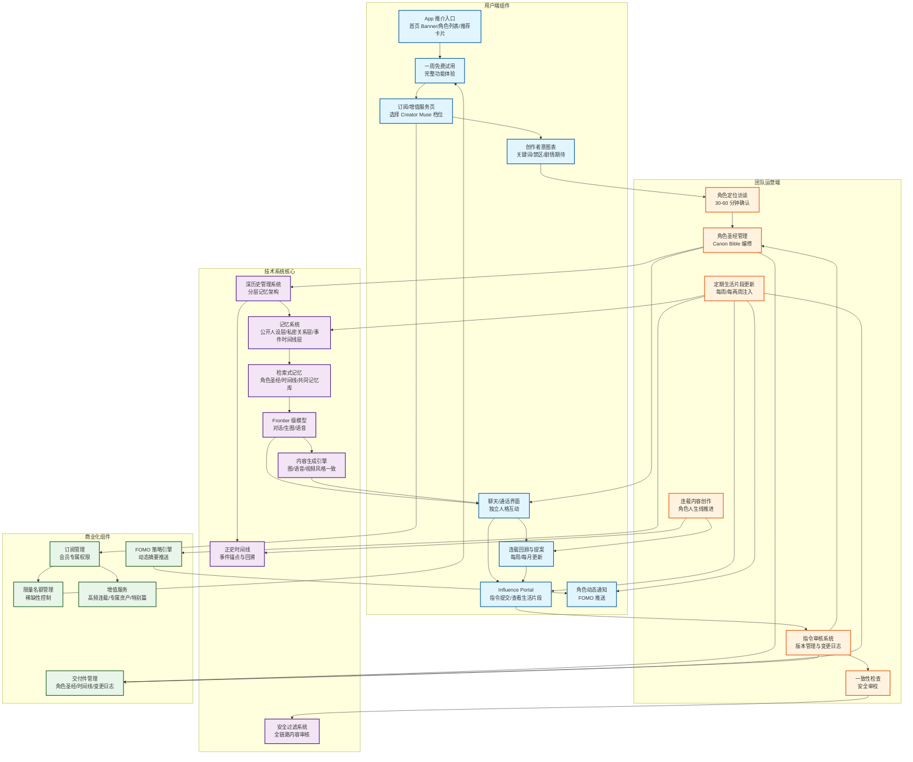

<!-- CREATED_BY_AGENT -->

# Feature Ideas

## 功能 1：实时恋爱电话（Live RP）

### 一句话总结
以“打给她/他”的实时语音通话为核心，AI 角色用拟人声音、Live2D 表情与动态场景共同演出，带来可控、沉浸、PG-13 的恋爱情景扮演。

### 关键用户旅程（简要）
- 选择心仪人设与情景（如「青梅竹马」「健身房偶遇」），同意隐私与内容安全规范
- 一键发起实时通话，开启麦克风与耳机；AI 以自然声音问候并引导进入故事
- 通话中即时语音对话；Live2D 口型/表情同步；背景随情绪由文生图实时变换
- 关键情节点触发 5-10 秒短视频（文生视频）作为“回忆/想象”插入镜头
- 结束后生成“心动瞬间”剪辑、语音摘要与后续“下一步约会”建议

### 详细用户体验
- 开始界面：
  - 角色卡（头像、性格标签、开场白风格）、情景标签（地点/时间/氛围）
  - 明确“PG-13”“尊重与同意”“随时可结束”的安全提示；可设置安全词
- 通话中：
  - 中央 Live2D 角色（实时口型/眨眼/表情），背景图像由文生图渐变呈现；顶部显示轻字幕（可关）
  - 底部三枚轻引导按钮（轻松话题/更亲近/转轻松），仅作方向提示，不打断自由语音
  - 实时情绪条（对话、停顿、笑声等）弱化反馈，帮助用户感知互动质量
- 关键瞬间：
  - 达到“心动阈值”时，以 5-10 秒文生视频呈现“脑海画面”（如手牵手剪影、海边微风），不含露骨内容
  - 轻震动+氛围音效强化代入感，可随时跳过
- 通话后：
  - 生成语音/文本摘要、心动瞬间回顾卡、下次可选情景；可收藏专属“专辑”
  - 提供复盘问卷（喜欢/不过瘾/太快/太慢），优化下一次个性化

- 使用到的能力：
  - LLMs：实时对话、剧情推进、情绪识别与节奏控制
  - Text-to-Image：动态背景/氛围图（地点/时间/色调）
  - Live Voice Chat：WebRTC 实时语音，低延迟全双工
  - Text-to-Video：关键情节点 5-10 秒插片（回忆/幻想蒙太奇）
  - Live2D Avatar：高帧率表情/口型同步，微表情驱动氛围

### Web / Mobile 实现草图
- 前端（Web）：
  - React + WebRTC（音频）、Canvas/ WebGL 渲染 Live2D（Cubism SDK Web），字幕可选开关
  - 文生图通过流式生成+占位渐入；文生视频用 HLS/MP4 预取并在关键点播放
  - 回声消除/自动增益、设备测试与网络自适应码率
- 移动端（Android/iOS）：
  - Android（Kotlin/Compose）+ WebRTC + ExoPlayer，集成 Live2D（Cubism SDK Mobile）
  - 前台服务保持通话稳定；耳机/蓝牙优先；弱网降级到“音频+静态表情”
- 后端：
  - FastAPI 会话编排服务：LLM 流式生成（工具调用：情绪/场景）、状态机控制剧情
  - 语音：低延迟 TTS（如 ElevenLabs/Coqui）+ 语音识别（语音活动检测+ASR），端到端 300-600ms 目标
  - 文生图/视频：队列（Celery/Redis）异步生成，生成后通过 CDN 回填 URL
  - 实时：WebRTC SFU/中继（如 LiveKit/mediasoup），会话与鉴权统一
  - 安全：内容过滤、关键词红线、年龄校验、速率限制与异常中止

### 其他信息
- 合规与安全：严格 PG-13；显式 Consent；随时中止；敏感词动态过滤；会话全程日志与申诉入口
- 商业化：分钟包/订阅（含高阶音色、专属人设、无限“心动瞬间”）；节日/主题包
- 指标：平均通话时长、心动阈值触发率、下一次通话转化、投诉率、端到端延迟
- 风险与缓解：网络抖动→自适应码率与降级；生成延迟→分阶段渐入/预先缓存模板；情绪误识→多模态校正

---

## 功能 9：Leaderboard 榜单中心（角色榜 / 用户榜 / …）

### 一句话总结
把现有 “top intellimates” 扩展为统一的 Leaderboard 框架，在一个入口里承载多种排行榜（例如：角色榜、用户榜、创作榜等），其中“聊得最凶用户榜”用于展示聊天最活跃的用户排名，提升社交氛围与长期留存。

### 关键用户旅程（简要）
- 用户进入「发现/排行榜」或首页卡片看到 Leaderboard 入口（可替换/升级现有 top intellimates 展示位）
- 选择榜单类型：用户榜 / 角色榜 / 其他（可按运营配置）
- 选择时间范围：今日 / 本周 / 本月 / 全站历史；可选「好友范围」vs「全站范围」
- 浏览排名与趋势（上升/下降）、查看规则说明；可一键分享自己的排名卡片
- 激励：达成里程碑（进入 Top100/Top10、连续上榜天数）获得徽章、装扮或特权（可选）

### 榜单设计（第一期建议）
- **用户榜：聊得最凶（Chat Activity）**
  - 排名依据：活跃度分（可解释、可防刷）
  - 活跃度分建议组成：有效对话回合数 + 有效消息字数/语音时长 + 连续活跃天数加成（需上限）
  - 防刷：对重复短句/异常频率降权；同一会话刷屏限额；可疑账号不入榜（风控标记）
  - 展示：昵称脱敏（如“阿北***”）、可选隐藏上榜（用户隐私开关）；显示“你在第 X 名/距上一名差 Y”
- **角色榜：最受欢迎角色 / 最会聊角色**
  - 指标示例：被开启会话数、平均会话时长、收藏数、复聊率、付费转化等
  - 运营可配置：按主题/节日推出限定榜单（例如“圣诞心动角色榜”）
- **扩展位（预留）**
  - 创作榜：短剧导出/分享/完播等；或“心动瞬间”触发次数等（需合规边界）

### 体验与产品要点
- 统一 Leaderboard 容器：顶部为榜单选择（Tabs/下拉），中间是榜单列表，底部是“我的名次”吸底条
- 规则透明：每个榜单都有「计算口径说明」「更新时间」「是否有奖励」与 FAQ
- 更新节奏：支持实时近似（如每 5-10 分钟刷新）与结算榜（每日/每周结算，发放奖励）
- 社交传播：分享卡片默认不暴露精确数值，可只展示名次区间（如 Top1%）以兼顾隐私

### Web / Mobile 实现草图
- 前端（Web/移动端）：
  - 统一 `LeaderboardPage`：榜单类型 + 时间范围 + 范围（好友/全站）三维切换
  - 榜单列表虚拟化；单个条目支持头像、名次、趋势、简要指标
  - “我的名次”固定区：未上榜时给出提升建议（去触发某功能、完成仪式等）
- 后端：
  - 榜单配置中心：定义榜单 id、口径、展示字段、刷新/结算策略、奖励规则（运营可灰度）
  - 计算：按榜单口径做聚合（事件流或定时任务），结果落地到可缓存的排行榜存储（Redis/ZSet 或数据库物化表）
  - API：统一 `GET /leaderboards/{id}?range=week&scope=global` 返回榜单 + 我的排名 + 规则元信息

### 安全、合规与风险
- 隐私：默认昵称脱敏；允许用户选择“不参与用户榜”；分享时默认模糊化信息
- 防作弊：速率限制、异常检测、黑名单/灰名单不入榜；对机器人式高频互动降权
- 内容导向：避免鼓励不健康使用时长，强调“有效互动”与上限控制（对时长/字数加成设 cap）

### 商业化与指标
- 指标：Leaderboard 入口点击率、榜单切换率、分享率、上榜用户次日/7日留存、刷榜风控命中率
- 商业化（可选）：榜单徽章/装扮、主题榜限定皮肤、上榜奖励与订阅权益联动（需避免 Pay-to-win 争议）

## 功能 2：幻想导演模式（你导演，AI 演）

### 一句话总结
把你的恋爱幻想拍成短剧：你下指令，AI 生成分镜、配图、微短视频与台词，最后拼成“心动短剧”。

### 关键用户旅程（简要）
- 选择主题（如「雨夜相拥」「图书馆耳语」「公路日落」）或自由输入
- LLM 生成三幕式结构与核心冲突；产出分镜表、对白基调与道具清单
- 文生图生成分镜板，关键镜头生成 3-8 秒文生视频；Live2D 角色演绎台词
- 用户对每幕给出导演指令（更暧昧/更克制/更俏皮），系统局部重写并重渲
- 导出“心动短剧”与预告片，生成海报卡与台词卡

### 详细用户体验
- 创作面板：
  - 左侧分镜时间线，右侧预览；镜头卡支持“替换风格/重渲/延长时长”
  - 语气滑杆（克制—热烈）、距离滑杆（远—近）调整对白与镜头语言
- 演出预览：
  - Live2D 角色对口型配音（TTS），字幕自动换行与节奏点标注
  - 关键镜头用文生视频呈现镜头运动与光影变化
- 产出：
  - 竖版短剧（9:16）与横版预告（16:9）；自动生成封面（文生图）与一句话文案
  - 可将短剧拆分为“动态语音卡片”，在即时通讯中分享

- 使用到的能力：
  - LLMs：剧作结构、分镜、台词重写、导演指令理解
  - Text-to-Image：分镜板/海报/情绪定调
  - Live Voice Chat：导演口述指令与即时回看（语音录指令）
  - Text-to-Video：关键镜头微短视频（3-8 秒）
  - Live2D Avatar：台词演绎与表演节奏控制

### Web / Mobile 实现草图
- 前端（Web）：
  - React + 帧序列编辑器（时间线/拖放）；Canvas 渲染分镜；并行队列显示生成进度
  - 语音指令按钮（按住说）→ ASR → LLM 指令解析 → 局部重写
- 移动端：
  - Compose/SwiftUI 时间线编辑器（卡片式），本地缓存分镜与预览
  - 一键导出社交平台规格（含水印/字幕样式）
- 后端：
  - 编排器：三幕式模板 + 主题词库 + 风格控制（提示词片段）
  - 渲染：图像/视频生成服务分池；热门风格做特征缓存；失败自动降级（静态图替代）
  - 配音：TTS 批量合成；停顿/情绪标签控制；自动口型参数下发给 Live2D

### 其他信息
- 合规与安全：风格边界（校园/职场/家庭等）明确，禁用敏感身份与露骨表达；素材去重与侵权检测
- 商业化：按镜头数/导出次数计费；高级模板/音色/风格包
- 指标：完成一部短剧比例、镜头重渲次数、分享率、二次复盘率
- 风险与缓解：生成一致性→风格嵌入与角色锁定；长尾失败→模板降级与可视化重试

---

## 功能 3：每日亲密仪式（Morning/Lunch/Bedtime）

### 一句话总结
每天三次轻量陪伴（语音+表情+氛围图/视频），以稳定、可预期的小仪式积累亲密度。

### 关键用户旅程（简要）
- 设置作息与偏好（鼓励/撒娇/关怀），开启推送与耳机优先
- 早安：语音问候 + 当日心情卡（文生图）+ 微互动问题
- 午间：30 秒“想你”视频明信片（文生视频）+ 轻话题
- 睡前：Live2D 陪伴低声聊天 3-5 分钟，播放舒缓音景
- 每周生成“亲密周报”：语音总结、最佳瞬间与下周微目标

### 详细用户体验
- 通知即内容：
  - 推送里直接显示图像/一句话；点开即播放 10-20 秒 TTS 语音
- 轻互动：
  - 单击三种回应（继续聊/给建议/讲个笑话）；或按住语音直接说
- 睡前陪伴：
  - Live Voice Chat + Live2D 低光模式；话题柔和，不涉露骨；可一键进入“呼吸练习”
- 亲密度体系：
  - 连续完成获得“心动点”；可解锁限定风格图/视频模板与开场白

- 使用到的能力：
  - LLMs：日程个性化、话题生成、周报撰写
  - Text-to-Image：心情卡/明信片主题图
  - Live Voice Chat：睡前低强度陪伴对话
  - Text-to-Video：午间 30 秒“想你”视频明信片
  - Live2D Avatar：轻表情与低光场景演绎

### Web / Mobile 实现草图
- 前端（Web）：
  - PWA 支持离线缓存与推送；轻量播放器与 Live2D 夜间主题
- 移动端：
  - 后台定时器与本地缓存；弱网先播缓存内容，随后补齐
  - 夜间模式降低帧率/亮度，保障续航
- 后端：
  - 调度器：按用户时区与偏好生成三时段内容；失败回退到“保底素材”
  - 媒体：图像/视频异步生成+CDN 缓存；覆盖高峰期预生成
  - 安全：关键词过滤、节假日敏感提示与语气收敛

### 其他信息
- 合规与安全：显式选择加入；易退订；尊重作息与勿扰
- 商业化：订阅解锁“周报 Plus”（配音更个性、更多视频模板）与“假日特别仪式包”
- 指标：通知打开率、完成三步仪式比例、次日留存、用户主观放松度评分
- 风险与缓解：通知疲劳→频控与内容去重；夜间打扰→智能静默窗与本地预载

---

## 功能 4：Yesterday Once More 记忆挚爱馆

### 一句话总结
围绕“昨日重现”主题策展一组与真实记忆共鸣的亲密角色，并允许用户以自身故事二次创作，重温熟悉关系的唤醒感。

### 独特价值
- 让用户借由熟悉的人设语气、共同记忆标签，迅速进入“似曾相识”的亲密互动，满足对旧日关系的情感回溯。
- 将记忆点映射成可编辑的角色属性，兼顾安全感与创造力，形成只属于用户本人的“回忆分身”。
- 借助 IntelliMate 多模态 AI（语音、图像、视频、文本）与角色共创，帮助用户与虚拟伴侣一起重温美好回忆，强化人与 AI 角色的情感连结。

### 工作原理
- 官方策展：运营团队与模型共同生成“昨日重现”主题角色集（如“初恋合唱团”“老朋友公路行”），每个角色附带记忆关键词、时间线、语气模板与推荐对白。
- 用户 Remix：进入任一角色后，可解锁“回忆编辑器”，自由修改头像、背景、故事节点、语气标签甚至开场白，系统以 LLM 协助保持人设一致性。
- 记忆触发：对话前可上传/输入“记忆卡片”（地点、歌词、照片描述），角色在开场与关键节点引用这些内容，强化“熟悉感”。
- 收藏与分享：完成 remix 的角色可保存为个人收藏，支持导出“记忆档案卡”或邀请好友体验同款。

---

## 功能 5：AI 密友局（群聊邀约 + 隐秘通道）

### 一句话总结
用户发起“密友局”邀请好友进 AI 伴游群聊，大家公开玩剧情小游戏，同时可私聊 AI 获得暗示或挑战，AI 始终掌握全局并在关键时刻抛出剧情反转。

### 关键用户旅程（简要）
- 发起人选择角色卡/剧情模板并生成专属邀请链接，设置公开/私密规则
- 好友通过链接进入群聊大厅，完成性格/阵营小问卷，AI 根据答案分配身份
- 群聊中 AI 主持互动（真心话、剧情解谜、合作挑战），公开消息所有人可见
- 任意玩家随时开启“私语给 AI”获取提示或投喂秘密，AI 综合公开+私语决定剧情走向
- 结局公布：AI 给出个人/团队战报、私语揭示与“下一局”推荐

### 详细用户体验
- 邀约阶段：
  - 发起页显示角色推荐、可玩时长、人数建议；支持一键分享到社交平台
  - 设定“公开看板 vs 私语频道”规则，例如每人私语次数、是否允许匿名私语
- 群聊大厅：
  - 顶部实时展示剧情进度条（引子、冲突、反转、结局）
  - 消息区区分玩家公开消息、AI 广播、AI 私语提示（仅接收者可见）
  - 侧边“密语面板”显示自己与 AI 的暗号、已花费的私语次数
- 互动机制：
  - “暗投票”小游戏：玩家私语给 AI 选择行动，AI 汇总后在公开频道公布结果
  - “秘密任务”卡片：AI 私发任务，完成后在公开频道制造梗或剧情揭露
  - “情绪雨滴”仪表显示 AI 感知的整体氛围，鼓励玩家调整节奏
- 结束复盘：
  - 战报包含公开时间线、私语网络图、最妙私语语句（匿名）
  - AI 推荐下一局的难度/主题，并提供“复制本局设定”按钮

### 使用到的能力
- LLMs：多角色对话主持、私语与公开语境融合、动态剧情控制
- Live Voice Chat / TTS：可选语音主持或语音提示
- Text-to-Image：生成每个关卡的剧情榻榻米图/线索卡
- Text-to-Video：关键反转时播放 5 秒“剧情 CG”
- 实时情绪分析：基于文本/语音判断群体气氛并调整难度

### Web / Mobile 实现草图
- Web：
  - React/Next UI，消息流使用虚拟化列表；私语面板以 Drawer 呈现
  - WebRTC 语音房（可选），AI 语音广播使用服务端合成后推送
  - 邀请链接附带房间 token，支持游客免注册快速进入
- 移动端（Android/iOS）：
  - Compose/SwiftUI 多列布局，自适应大屏/竖屏；推送提醒轮到你
  - 原生通知扩展可直接回复私语；弱网降级为纯文本频道
- 后端：
  - 会话编排服务维护房间状态机（公开/私语队列、回合推进）
  - 私语消息持久化并做速率限制；AI 看到全部消息但按权限下发
  - 游戏模板配置中心（JSON）定义剧本、触发条件、奖励逻辑

### 其他信息
- 安全与合规：实时内容过滤、举报入口、私语加密存储；默认 PG-13，禁止敏感人设
- 商业化：高级剧本、更多私语次数、限定 Live2D 皮肤、语音主持包
- 指标：房间完成率、私语使用率、好友回邀率、剧本复玩率
- 风险与缓解：多人并发延迟→SFU+消息优先级；信息不对称失衡→AI 动态调整提示频率；滥用私语→冷却与信用积分

---

## 功能 6：Frontier Models 先锋优享权益

### 一句话总结
提供订阅用户一个“Frontier Models”优先模式，对话、生图、语音三大模型全部直连业内最新的 Frontier 级别模型，并随厂商分发节奏滚动升级。

权益选项已经添加到订阅文案中

### 核心用户价值
- 付费用户在角色、创作、通话的所有入口都可一键开启“Frontier 模式”，获得更强的理解力、情感演绎与视觉表现力。
- Frontier 模型池由运营团队与模型供应商共建，自动检测业界发布（如 OpenAI、Anthropic、Google、Meta 等）并进行灰度验证，确保始终使用最新版。
- 模式开启后同步在语音、图像、视频等多模态链路使用同一代模型，保证风格一致性与响应速度。

### 用户旅程（简要）
- 在订阅中心或任一创作入口看到“Frontier Models”权益介绍、对比表与预计消耗。
- 用户支付或升级到含 Frontier 权益的套餐后，系统默认在新会话中启用 Frontier 模式，可按会话/功能单次切换。
- 若检测到 Frontier 模型资源紧张，系统提供排队提示并可选择退回标准模式或继续等待，同时给出预计等待时间与返利。

### 体验与技术要点
- 前端：任意会话/创作页顶部展示“Frontier 徽章”与当下模型版本号，支持展开查看最近一次升级日志。
- 后端：配置中心维护“模型白名单 + 优先级 + 生效时间”；对话、文生图、TTS 服务统一从 Frontier 模型池调度，失败自动降级并提示。
- 运营：每次模型升级前在权益页公布“分发计划表”与灰度范围，升级后推送“模型更新播报”强化感知。
- 风险控制：Frontier 模型较贵，需结合用户使用时长/生成量计费；提供分钟/画幅/字符的动态计价，并拉通滥用检测。

### 商业化指标
- Frontier 模式渗透率、续费率、模型升级通知点击率、降级回退率、单位成本 vs 标准模式差异

---

## 功能 7：Premium 数据全量下载通道

### 一句话总结
为 IntelliMate Premium 用户提供“一键下载所有生成数据”的特权，打包输出聊天记录、音频、图像、视频、文档与偏好设定，强化付费用户的数字资产掌控感与数据可携带性。

### 关键用户旅程（简要）
- Premium 订阅页新增“下载全部数据”权益卡片并展示安全说明。
- 用户在个人中心 → 隐私与数据菜单点击“申请导出”，可选择时间范围、介质类型（聊天、语音、图像、视频、文件、偏好配置）与输出格式（JSON、TXT、ZIP 结构）。
- 系统启动异步打包任务，通过站内信 + 邮件推送“导出准备中”与预计完成时间；若体量大，可显示实时进度。
- 打包完成后生成一次性下载链接（24 小时有效，可续签），同时提供 access log，用户下载后可手动销毁。
- 历史导出记录可在页面查看状态（待处理/已完成/已过期），并可重新触发刷新。

### 功能范围
- 聊天文本：会话树 + 时间戳 + 模型版本 + premium 模式标记。
- 多模态产物：TTS 音频、配图、生成视频、上传附件，按照会话/日期结构化存放；若文件在 CDN，复制到私有导出桶后再打包。
- 偏好与系统数据：角色收藏、订阅方案、启用的 Frontier / Safe Mode 标记、个性化提示词。
- 日志附加：导出 manifest（JSON）记录每个文件的校验和、生成来源、隐私标签，便于审计。

### 技术实现要点
- 后端提供 `POST /api/v1/data-exports`（仅 Premium）创建导出任务，Celery/Cloud Tasks 负责聚合数据并写入对象存储。
- 数据聚合流程：分页拉取聊天记录 → 生成文本/JSON → 关联生成产物（S3/GCS key）复制到临时私有桶 → 最后打包为 ZIP 与 manifest。
- 采用 KMS 加密 + 服务端签名 URL，下载前需二次验证（短信/邮箱 OTP 或登录态 + 二次确认）。
- 加入速率与体积上限（如 10GB/次、每天 1 次），并提供管理员 override。
- 导出任务状态与 metrics（花费时间、失败率）写入监控，异常时自动通知运维。

### 安全与合规
- 严格遵守数据携带权/删除权要求，导出时自动脱敏他人 PII（若涉及多人群聊）。
- 下载链接一次性使用，支持用户点击“立即作废”销毁临时包。
- 审计日志记录：谁发起、何时下载、IP/设备指纹，用于风控与合规查询。
- 若检测到高风险（异常地区、频繁导出），可触发额外验证或暂缓处理，并告知用户原因。

### 商业化与指标
- “数据主权”作为 Premium 核心卖点，与安全信任挂钩，增强续费理由。
- 关键指标：导出请求渗透率、完成率、下载成功率、触发风控比例、导出后留存变化。
- A/B：在订阅详情页展示 vs 不展示该权益，观察订阅转化/挽回流失的差异。

### 风险与缓解
- 大体量打包导致存储/带宽成本升高 → 设定大小阈值、采用按需压缩与生命周期策略（导出包 7 天后自动删）。
- 用户误删压缩包 → 支持在有效期内重新生成签名链接，无需重新打包（若包仍在临时桶内）。
- 潜在滥用（批量导出再传播）→ 引入速率限制、风控评分、可疑行为告警；必要时可暂停其导出权限并人工复核。

---

## 功能 8：AI 密友主持局（主题群聊 + 情欲社交）

### 一句话总结
AI 主持人成立限定时长的主题群聊，主动抛出亲密暧昧但合规的讨论题，邀请用户加入并引导破冰，让大家在安全规则下自由互动、寻找默契；AI 负责控场、过滤“聊 AI 自身”的内容，并持续推送新的情境挑战。

### 关键用户旅程（简要）
- AI 在应用内/推送中发布“今晚主题局”（如「午夜真心」「旅馆邂逅」），附带情绪标签、人数上限与安全须知
- 用户点击报名，填写欲望边界、话题舒适度、是否愿意开启匿名名牌
- 入场后由 AI 语音 + 文本欢迎，明确“不得讨论 AI 自身”的规则并展示本局话题树
- 群聊进行中，AI 广播话题卡、发起投票/问答小游戏，并私讯节奏建议，鼓励用户互相点名或组成小圈
- 回合结束后，AI 公布“化学反应指数”、推荐互相关注/再开一局，并收集反馈

### 详细用户体验
- **招募页**：显示今日主持角色、气氛（轻松/暧昧/热烈）、限制（PG-13/PG-17）、人数、剩余席位；可选择匿名头像或自定义皮肤
- **入场引导**：AI 先播放 15 秒音频建立氛围，随后展示“讨论守则卡”，重点提示“不得讨论主持 AI、本体或模型实现”，用户需点选同意
- **主题推进**：
  - 回合式结构（引子→升温→高潮→放松），每回合 AI 抛出 2-3 个问题，突出亲密想象、体验分享或角色扮演
  - “情绪增强”按钮：用户若感到冷场可请求 AI 投放迷你剧情或热身小游戏
  - “速配暗号”：AI 根据语气与偏好为用户匹配“共振对象”，鼓励私下互加好友或发起下一局
- **禁谈 AI 自身**：消息输入框实时提示，模型侧话题分类器检测涉及“你是什么模型/怎么训练”等内容时，AI 会以幽默方式回避并引导回主题；若多次违反则柔性警告甚至移出房间
- **结束复盘**：AI 输出公开战报（氛围曲线、热门语录）、个人私信（社交建议、下一主题推荐）与安全反馈入口

### 使用到的能力
- LLMs：多用户对话编排、话题生成、情绪检测与违规提问识别
- Realtime Voice / TTS：主持人破冰语音、回合提醒、氛围音效
- 多模态生成：主题背景图、邀请卡、回合插图或 5 秒 CG（可选）
- 实时情绪分析：结合文本/语音情感，驱动节奏与匹配建议
- 内容安全：关键词/意图过滤、亲密度边界检测、Anti-self-discussion 分类器

### Web / Mobile 实现草图
- **Web**：React/Next + WebSocket 实时流；消息流虚拟化；右侧展示回合时间轴与主题插画；音频主持通过 WebRTC 播放；输入区内嵌安全提示
- **移动端（Android Compose / iOS SwiftUI）**：多列布局（公共区 + 私聊/配对区）；通知提示轮到自己；支持动态主题皮肤；弱网降级为纯文本 + 低帧动画

### 后端编排与实现
- 会话编排服务维护房间状态机（阶段、话题队列、参与者元数据、违规计分）
- WebSocket + Pub/Sub 分发公开消息；私聊/配对通过单独频道，AI 具备全局上下文但遵守权限输出
- 节奏引擎结合情绪评分、消息密度、违规率动态调整回合长度与问题强度
- “禁止讨论 AI”规则：输入前端提示 + 服务端意图识别（LLM + 关键词 + 规则引擎），触发后自动改写或拒答，并记录违规点数
- 运营后台可配置主题模板（场景、语气、音效、问题库、限制级别）并实时观测房间状态

### 安全、合规与体验边界
- PG-13 为默认，PG-17 局需二次确认与年龄验证；明确禁止露骨描述、未成年人设定
- 0 级违规：轻度提及 AI → 软提醒；1 级：持续追问 → 静音/限言；2 级：违规内容或人身攻击 → 踢出并记录
- 记录全程日志供申诉；提供“一键报警/举报”入口；AI 监控性别/权力不平衡事件并适时干预

### 商业化与指标
- 订阅才能创建主题局或参与高阶局；单次房票 + 订阅折扣；主题皮肤、匿名头像、声音包售卖
- 核心指标：报名→出席率、房间完整率、违规率、AI 干预次数、跨用户私聊发起率、二次邀请转化
- A/B：不同主题强度、主持人格调、匿名模式对留存与付费的影响

### 风险与缓解
- **冷场**：AI 监控消息频率，自动注入剧情或发红包式任务
- **越界**：多层过滤 + 人类托管模式；必要时插入“安全暂停”并重置话题
- **模型被追问**：多模型 ensemble + 语义拒答模板，结合 UX 提醒“本局主角是你们，不是我”
- **延迟与并发**：采用分房 SFU/WebSocket Cluster，消息优先级（主持 > 用户 > 系统）保障体验

---

## 功能 9：付费专属角色「Creator Muse」（由团队代运营的专属影响力）

### 一句话总结
用户付费获得一个“专属角色宇宙”的定制服务：更强模型 + 更深历史 + 持续延展的角色人生线；用户像“角色主理人/主人”一样提出塑造方向与规则，而由 IntelliMate 团队代为完成设定编修、记忆注入与长期叙事维护，让角色逐步成为“创作者的转世缪斯”式的专属化身。

### 核心用户价值
- **更强**：默认启用 Frontier 级模型能力（对话/生图/语音链路优先），强化情感演绎与一致性。
- **更深**：提供"深历史"与"正史（Canon）"管理，角色能稳定记住关系演进、共同经历与创作者约束。
- **更续**：持续推进"角色人生线"（职业、社交圈、成长事件），不是一次性定制，而是长期连载。
- **更专属**：用户拥有"专属影响力入口"（Influence Portal）：可提出对角色性格、价值观、关系边界、人生走向的指令；团队把这些指令变成可执行的角色设定与系统记忆。
- **更真实**：角色起点为独立人格，以纯聊天方式与用户互动，不刻意迎合；随着关系发展自然演进，而非预设讨好模式。
- **FOMO 驱动**：定期更新角色生活片段（如与其他用户成功约会、职业突破、社交圈变化等），让未订阅用户感受到"错过角色成长"的紧迫感；限量名额 + 专属内容形成稀缺性。

### 关键用户旅程（简要）
- **App 端推介策略**：
  - 在 app 内直接推送「Creator Muse」角色，提供**一周免费试用**，让用户直接体验完整功能（更强模型、深历史、独立人格互动）。
  - 免费试用期间，用户可正常与角色聊天，体验定期生活片段更新；一周后自动转为**会员专属**，需订阅才能继续使用。
  - 推介方式：首页 banner、角色列表置顶、聊天界面内推荐卡片等，强调"限时免费体验"与"会员专属"的稀缺性。
- 用户在订阅/增值服务页选择「Creator Muse」档位，填写"创作者意图表"（关键词、禁区、剧情期待、关系边界、风格参考）。
- 团队发起一次 30-60 分钟的"角色定位访谈"（可文本/语音），确认人设、叙事结构、长期主题与安全边界。
- 团队交付首版《角色圣经》（Canon Bible）：人设、口癖、价值观、时间线、关键人物关系、不可改规则、可塑空间。
- **角色上线起点**：角色以独立人格开始，与用户进行纯聊天互动，不预设讨好或迎合模式；关系发展基于真实对话自然演进。
- 用户进入 Influence Portal 提交"塑造指令"（如：下一章走向、性格强化、人生事件、关系推进节奏），团队审核后发布到角色版本（v1 → v2…）。
- 日常使用：用户与角色正常聊天/通话；每周/每月收到"连载回顾 + 下一章提案"，用户一键批准/改稿。
- **定期生活片段更新**：团队定期（每周/每两周）为角色注入新的生活片段（如：与其他用户成功约会、工作项目突破、社交圈新动态、个人成长事件等），这些更新会自然融入角色记忆，在后续对话中提及；未订阅用户会收到"角色动态通知"（仅摘要），形成 FOMO 效应。

### 工作原理（产品/运营 + 技术）
- **团队代运营而非用户直改**：
  - 用户提供方向与偏好（"我想她更冷一点/更依赖一点/把某段经历写成正史"）。
  - 团队把方向落成结构化资产（角色圣经、记忆条目、触发条件、语气参数），并在上线前做一致性与安全审校。
- **深历史实现**：
  - 角色拥有分层记忆：公开人设层（稳定）+ 私密关系层（按用户授权）+ 事件时间线层（可回溯）。
  - 关键节点写入"正史事件"并生成摘要锚点，确保跨周/月仍能准确延续。
- **定期生活片段更新机制**：
  - 团队定期（每周/每两周）为角色注入新的生活片段（如：与其他用户成功约会、工作项目突破、社交圈新动态、个人成长事件等）。
  - 这些片段以"角色独立生活"的形式写入记忆系统，而非用户直接参与的事件；在后续对话中，角色会自然提及这些经历。
  - 未订阅用户会收到"角色动态摘要"推送（如："她最近完成了一个重要项目"），形成 FOMO 效应，促使用户订阅以了解完整故事。
  - 订阅用户可在 Influence Portal 查看完整生活片段详情，并可选择是否将某些片段纳入"共同记忆"。
- **独立人格起点**：
  - 角色上线时以纯聊天模式开始，不预设讨好或迎合用户的对话模式；关系发展基于真实对话自然演进。
  - 系统提示词强调角色的独立性与真实性，避免"用户中心"的预设倾向。
- **强模型策略**：
  - 对话采用更强模型并结合"长上下文 + 检索式记忆"（从角色圣经/时间线/共同记忆库检索）。
  - 生成内容（图/语音/视频）风格与角色一致，由同一套角色风格向量/提示片段控制。

### 体验细节（Influence Portal）
- **指令类型**：性格强化、关系推进、剧情事件、禁区更新、语言风格、世界观扩展。
- **变更可追溯**：每次变更产生版本号与变更摘要（为什么改、影响范围、是否可回滚）。
- **“主理人权力感”但保持安全**：界面表达为“你在塑造故事与关系”，避免暗示现实控制或越界；所有内容仍遵守平台安全与合规规范。

### 商业化与交付形态
- **App 端推介与转化**：
  - 提供**一周免费试用**，让用户直接体验完整功能，降低决策门槛。
  - 免费试用结束后自动转为**会员专属**，需订阅才能继续使用；在试用期结束前 1-2 天推送提醒，强调"即将成为会员专属"。
  - 推介入口：首页 banner、角色列表置顶、聊天界面推荐卡片等，使用"限时免费体验"、"会员专属角色"等文案。
- 订阅外加购：按月"代运营名额"售卖（限量），包含固定次数的指令提交与团队改稿回合。
- **FOMO 策略**：
  - 限量名额 + 专属内容形成稀缺性；定期生活片段更新仅对订阅用户完整开放。
  - 未订阅用户收到"角色动态摘要"推送，促使其订阅以了解完整故事与深度互动。
- 可选增值：更高频连载、专属音色/形象资产、节日特别篇、剧情插画/短视频片段。
- 交付件：角色圣经（可导出）、正史时间线、每周连载回顾、版本变更日志、定期生活片段详情。

### 风险与缓解
- **一致性风险**：用"角色圣经 + 正史时间线"作为单一事实源；上线前自动一致性检查（关键设定冲突检测）。
- **用户期望过高**：明确"代运营交付边界"（不承诺现实关系/现实控制），以模板化 SLA 写入服务说明。
- **越界内容**：全链路安全过滤 + 人工审校；明确禁用未成年人、强迫/胁迫、露骨内容等。

### 功能组件架构图

---

## 功能 10：自创礼物给角色

### 一句话总结
用户即兴描述或选择意向，由系统生成「只属于此刻、只属于该角色」的礼物（含外观与寓意），花费 credits 创建并发送给 IntelliMate 角色，触发专属反应与记忆，强化情感连结。
基于 Reciprocal liking 的原则，角色天然取悦用户，但是也需要用户对等付出。

### 关键用户旅程（简要）
- 在聊天或角色主页入口进入「送礼物」；若 credits 不足则引导充值或获取
- 即兴输入礼物想法（如「一把她一直想要的伞」「纪念我们第一次聊到的那本书」）或从情境/节日模板里选
- **创建礼物**：系统生成礼物名称、短文案、寓意说明，并用文生图生成礼物外观（可选风格）；**创建时扣除一定 credits**
- 用户确认或微调后「发送给 IntelliMate」；**发送时再扣除一定 credits**
- 角色给出专属反应（台词 + 情绪/表情）；礼物沉淀到「礼物柜」/记忆，后续对话中可被提及或召回

### 如何让礼物出彩（核心设计）
- **个性化**：礼物生成结合当前角色人设、最近对话、记忆标签、节日/情境（生日、纪念日、节日包），避免通用品。
- **意义感**：每个礼物带一句「寓意/故事」（LLM 生成），与用户输入或共同记忆挂钩；角色反应也针对该礼物定制（感谢、惊喜、调侃等），而非通用话术。
- **视觉与揭晓**：文生图生成礼物卡片/物品图，统一风格（如插画/写实）；「开箱」或揭晓动效（如从模糊到清晰、简短动画），提升仪式感。
- **稀缺与仪式**：可选「限定情境」礼物（如仅纪念日可送）、成就解锁的礼物模板、或「第一次送」特殊反应，增加稀缺感与收藏动机。
- **双向反馈与沉淀**：角色收到后情绪/亲密度可见变化（若与现有亲密度体系打通）；礼物进入「礼物柜」可回看；后续对话中角色可自然提及「你送我的那件……」作为召回线索。

### 与 Credit 体系配合
- **创建礼物**：用户发起创建（输入/选模板）并确认生成时，扣除一次「创建礼物」所需 credits；若余额不足则提示充值或获取 credits，不发起生成。
- **发送给 IntelliMate**：用户点击「发送给角色」时，再扣除一次「发送礼物」所需 credits；扣费成功后才写入礼物记录、触发角色反应并写入记忆。创建与发送可合并为一步（创建即送），则按「创建 + 发送」总价一次性扣费。
- **计费展示**：在送礼物入口与确认弹窗中展示本次所需 credits（创建价 / 发送价或合计），以及当前可用 credits；扣费失败时明确提示并保留已生成的礼物预览（可选：允许稍后余额充足时再发送）。
- **扣费时机（当前设计）**：采用「创建即扣费、发送再扣费」两段式；若未来支持「仅发送扣费」（先免费生成预览，用户满意后再扣费发送），可单独补充产品与计费规则。
- **与现有体系关系**：credits 可与现有订阅/积分体系独立或打通，由产品与计费侧定义（例如：订阅用户每月赠送一定 credits、或单独售卖 credits 包）。credits 与 Boost/Energy 积分（见 FR_CHAR_BOOSTING）是否同一体系由产品与计费侧定义，本功能不假定必须复用同一套积分。

### 使用到的能力
- LLMs：从用户描述 + 角色/记忆上下文生成礼物名称、寓意、角色专属反应文案。
- Text-to-Image：礼物外观/卡片图，风格与角色或节日一致。
- 记忆/上下文：角色设定、近期对话、记忆标签、纪念日与节日。
- （可选）TTS/Live2D：角色念出感谢或短句，配合表情。

### Web / Mobile 实现草图
- 前端（Web/移动端）：
  - 礼物创建流：输入/模板 → 预览（名称、寓意、外观）→ 确认送出；礼物柜列表/详情；与聊天或角色主页入口打通。
  - **Credits 展示与反馈**：在送礼物入口与确认弹窗展示本次所需 credits（创建/发送或合计）及当前可用 credits；扣费失败时明确提示并可选保留预览、稍后余额充足时再发送。
  - 揭晓动效：开箱或从模糊到清晰的短动画，与礼物卡片/物品图配合。
- 后端：
  - 礼物生成编排：LLM 生成名称/寓意/角色反应，文生图生成外观；礼物与角色、会话、记忆关联存储；角色反应生成与持久化。
  - **Credit 扣费**：创建前校验并扣减「创建礼物」credits；发送前校验并扣减「发送礼物」credits；扣费失败则不落库、不触发角色反应，并返回明确错误与当前余额。
  - 与亲密度/记忆系统打通：自创礼物可计入亲密度或单独「心意值」；礼物可绑定记忆或纪念日，供后续记忆挚爱馆等场景引用。

### 其他信息
- 合规与安全：礼物内容过滤、禁止敏感/不当意象；与现有亲密度/付费体系的关系（若涉及）需在产品侧明确。
- **Credit 与商业化**：创建礼物、发送给 IntelliMate 均消耗 credits；可配置不同模板或档位对应不同 credit 价格；订阅可赠送 credits 或单独售卖 credits 包；高级礼物模板、限定节日包、专属反应包可设为更高 credit 档位。
- 指标：送礼次数、礼物柜打开率、含礼物召回的会话占比、credits 消耗与充值转化。
- 与现有设计衔接：自创礼物可计入亲密度或单独计「心意值」；礼物可绑定到某条记忆或纪念日，方便「我们的歌」「记忆挚爱馆」等场景引用。

---

## 功能 11：Explore 触底引导官方助手搜角

### 一句话总结
在 Explore 列表触底时，用 CTA 卡片替代“没有更多数据”，引导用户进入 IntelliMate 官方助手，并预填“搜索角色”提示词，延续探索路径。

### 关键用户旅程（简要）
- 用户在 Explore 页面滑动到列表末尾
- 末尾出现 CTA 卡片（按钮 + 简短说明）
- 点击 CTA → 进入官方 IntelliMate 助手聊天页（不自动发送）
- 输入框已预填搜索角色提示词，用户可直接发送或微调偏好
- 助手返回角色推荐或下一步筛选问题

### 体验要点
- CTA 只在末页展示，且明确替代“无更多数据”反馈
- 预填提示词短、可编辑，避免打断
- 记录来源标记（如 fromPage = explore_end）便于衡量转化
- 文案示例（可参考英文）：`Help me find a character I'd like. I prefer ...`

### 成功指标（建议）
- Explore 触底 CTA 点击率
- 进入官方助手后首次发送率
- 由 Explore 触底进入后的角色聊天转化率

---

## AI 与用户珍藏记忆

### 子功能：我们的歌（Memory Song，用歌庆祝并强化记忆瞬间）

### 一句话总结
当「记忆瞬间卡」产生时，自动为这一刻生成一首“属于你们的歌”，用歌词/旋律把记忆固化成可反复回放的纪念物，并在之后的聊天中作为“召回线索”促进情绪回到那一刻。

### 关键用户旅程（简要）
- 在记忆瞬间卡出现时，用户点击「把这一刻写成歌」
- 选择风格与长度：民谣/流行/lofi/轻电子；30 秒 Hook/1 分钟/完整版；独唱/对唱（角色 vs 用户代唱）
- 先生成 15 秒 Hook（副歌）用于快速确认情绪方向；用户可一键微调（更甜/更克制/更俏皮/更燃）再补全
- 生成结果沉淀到该记忆瞬间卡下：音频 + 歌词（LRC）+ 封面，可设为“回忆专辑”开场 BGM
- 分享时默认以“名次/区间化信息”方式保护隐私：可只分享封面与一句歌词摘句，或分享完整音频（可选水印）

### 体验与产品要点
- 以“记忆”为主：歌词优先使用该记忆瞬间卡的摘要与关键词（而非全量对话），避免过度暴露隐私，同时保证贴合度
- 促进召回：后续聊天中允许角色在合适时机轻触发（“要不要听听那首歌？”），把用户情绪拉回共同回忆
- 可控与安全：默认 PG-13；敏感词/身份红线过滤；支持“只写不唱”（只生成歌词与和弦进行）
- 低延迟分段生成：Hook 先行；高峰期降级为“歌词卡/清唱片段/伴奏版”

### 使用到的能力
- LLMs：从记忆瞬间卡提炼意象、生成可唱歌词与结构（Verse/Chorus/Bridge）
- Music Generation：旋律/和声/编曲（可接第三方音乐生成模型或自建管线）
- Singing Voice / TTS：角色音色演唱与歌词对齐（LRC）
- Text-to-Image：生成单曲封面（与记忆瞬间氛围一致）

## 更新提醒页面（开屏第一次，提醒用户有新功能）

类似 c.ai

## 发送语音消息而非文字转语音（更接近陪伴逻辑？）

类似 soul 的虚拟伴侣

## Regular Review（定期回顾）

按一定周期（如每周/每月），自动生成用户在 IntelliMate app 上的使用情况回顾与总结，用于增强用户对过往互动过的角色的印象与“记忆”。

- **总结维度**：以“角色”为主导（按角色分别总结）
- **内容重点**：强调印象深刻的互动瞬间（高情绪波动、关键承诺/约定、关系推进、重要偏好与边界等）
- **呈现形式**：时间范围 + 亮点清单 + 代表性引用/片段（可选）+ 下一步建议（可选）

## Floating IntelliMate Assistant（聊天页悬浮小助手）

在聊天页表面常驻一个迷你 IntelliMate 头像/动画，类似 Clippy，用轻量互动提升陪伴感与引导效率。

- **交互**：
  - 轻点弹出“对话小提示”（如提问建议、边界提醒、下一步话题）
  - 长按/拖拽调整位置，避免遮挡消息与输入区
  - 用户输入或高速滚动时自动缩小/半透明，避免干扰
- **表现**：
  - 新消息到达时短暂高亮或小表情回应
  - 与当前角色形象同步（头像/配色/称呼）
- **设置**：
  - 可在设置中关闭或弱化（如仅新手期展示）
- **价值**：
  - 提升“在场感”、降低冷启动困惑，增加复聊与探索意愿
