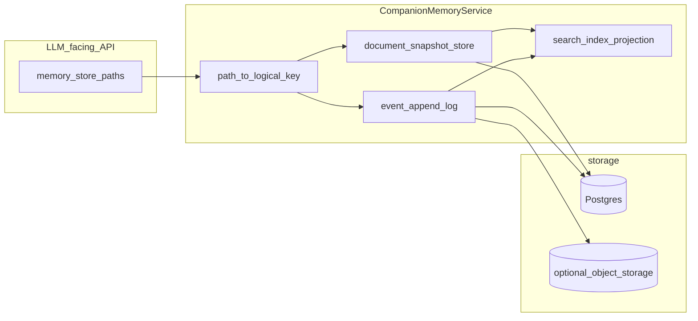

# Companion MemoryStore 与 DB 持久化

本文档描述当前实现的数据流与表模型、设计取舍与批判，以及面向长期 agentic companion 记忆的演进方向。**实现细节以源码为准。**

## 适用读者与边界

| 内容 | 说明 |
|------|------|
| 范围 | `MemoryStore`、Postgres 表 `companion_memory_document_versions`、进程内 registry、逻辑路径到 ORM 的映射 |
| 非目标 | 不重复逐行解释 [`/app/core/agentic_kernel/companion/memory_store.py`](/app/core/agentic_kernel/companion/memory_store.py) 的全部 API |
| 运维查数 | 参见 companion 目录 [`AGENTS.md`](/app/core/agentic_kernel/companion/AGENTS.md)「持久化与数据表」 |

## 一句话结论

当前实现是「**逻辑路径 → document_kind + calendar_date**」的 **append-only 全量快照版本表** + **进程内单例 MemoryStore + 每路径最新正文缓存**；启用 DSN 时 **Postgres 为权威**，**不以宿主机文件为权威**（见 `MemoryStore` 模块说明）。

---

## ASCII：数据流与组件

```
  CompanionManager.get_or_create_session(user_id, companion_id, chat_id)
       |
       v
  scope = CompanionScope(user_id, companion_id, chat_id)
       |
       v
  get_memory_store(scope, dsn=...)  [/app/core/agentic_kernel/companion/memory_registry.py]
       |
       +-- 若 dsn 非空: new SqlAlchemyMemoryRepository(user, companion, chat)
       |                    |
       |                    v
       |              MemoryStore(scope=scope, repository=repo)
       |
       +-- 若 dsn 空: MemoryStore(scope=scope, repository=None)  -> 仅进程内 MemoryCache（无跨进程持久化）

  进程内 _MEMORY_STORES:
       key = scope.registry_key()   # user_id:companion_id:chat_id
       => 单键单例；工具与前台回合共享同一 MemoryStore 实例引用（无 Path 别名）

  调用方（turn / models / tools / memory_pipeline）
       |
       |  read_document / write_document / append_*
       v
  +-------------------------------------------------------------+
  | MemoryStore                                                  |
  |   MemoryCache (thread-safe)：relative_path -> 最新 MemoryRecord |
  |                                                              |
  |   read: 先 cache -> miss 则 repository.read_document         |
  |         -> ORDER BY sequence_id DESC LIMIT 1 -> put cache  |
  |                                                              |
  |   write: repository.append_document(整段 content) 或 纯本地   |
  |         -> put_committed(按 sequence_id 单调接受)            |
  +-------------------------------------------------------------+
       |
       |  parse_memory_store_relative_path(rel_path)
       v
  [/app/core/agentic_kernel/companion/memory_store_document_mapping.py]
  "IDENTITY.md" -> (identity, NULL)
  "memory/daily/YYYY-MM-DD.md" -> (memory_daily_raw, date)
  ...

       |
       v
  PostgreSQL: companion_memory_document_versions
  PK: sequence_id (bigint autoincrement)
  列: user_id, companion_id, chat_id, document_kind, calendar_date?,
      content (Text), record_uuid, created_at
  「当前正文」:= 该 (scope, kind, calendar_date) 下 max(sequence_id) 那一行的 content
  索引: (user_id, companion_id, chat_id, document_kind, calendar_date, sequence_id)

  见 [/app/models/companion_memory_documents.py](/app/models/companion_memory_documents.py)
```

**读路径**：cache hit 则跳过 DB；miss 则按 scope 取 **最新一行** 并回填 cache。

**写路径**：每次 `write_document` 在 DB 中 **INSERT 新行**，`content` 为调用方传入的 **完整新正文**（全量快照版本）。

---

## 设计批判（相对「长期 agentic 记忆」）

| 维度 | 观察 | 影响 |
|------|------|------|
| **版本模型** | `write_document` / `append_jsonl_record` 均把 **合并后的整文件** 作为新版本落库 | `transcript.jsonl`、各类 `*.jsonl`、大块 `MEMORY.md` 会反复 **整文拷贝**；审计强、存储与 WAL 成本高 |
| **「append」语义** | `append_line` / `append_jsonl_record` 为 **读-合并-写** | 与高写入频率日志的 **行级 append** 模型不匹配 |
| **scope** | 权威键为 `(user_id, companion_id, chat_id)` | 跨会话共享人格/用户画像需 **显式上层 scope 或 projection**；当前单表未建模 |
| **路径与 ORM** | 仅 `memory_store_document_mapping` 支持的相对路径可入库 | 新增逻辑路径须同步维护映射，否则会 `ValueError` |
| **进程与缓存** | `MemoryCache` 进程内；`flush_now`/`shutdown` 为空实现 | 多 worker 下缓存不共享；多写入方下存在 **基于陈旧缓存 merge** 的理论风险 |
| **Path-free scope** | 进程内仅以 `CompanionScope` 注册/复用 `MemoryStore`；逻辑路径为 **POSIX 段规范化** 的 store 键，无合成磁盘根 | 消除 Path 与 `(user, companion, chat)` 漂移；工具线程须与会话对齐同一 `MemoryStore`（见 `tool_background` / runtime inspect overlay） |
| **优点** | append-only + `sequence_id` | 可审计、易按时间追溯；`memory_store_*` 工具仍以相对路径为 LLM 视图 |

---

## 目标设计方向（架构级，非当期排期）

面向 **情景事件、语义摘要、结构化事实、可追溯治理** 四类需求，建议渐进演进：

1. **分层存储**  
   - **事件流**：transcript、runtime events、工具轨迹等用 **行级事件** 或 **对象存储 + 游标**，避免每次 JSONL 追加都存整文件快照。  
   - **文档快照**：`IDENTITY` / `USER` / `MEMORY` 等保留「当前正文 + 可选历史」；revision 可绑定 `turn_id`、模型配置等元数据。  
   - **检索投影**：chunk + embedding 引用 `revision` / `event_id`，供压缩与 RAG。

2. **单一 scope 真源**：以 **显式 scope_id/session_id（UUID）** 为主键；POSIX 路径仅作 LLM 工具视图。

3. **跨会话记忆**：区分 **会话层** 与 **用户或对 companion 绑定的上层**；用离线或异步 **projection** 合并矛盾策略明示。

4. **并发**：读改写路径用 **期望版本号乐观锁**，或 JSONL **只追加物理行**。

5. **保留现状优点**：不改变 `memory_store_*` 工具的 **路径语义**；底层替换为分段 repository。



---

## 关键源码锚点

| 说明 | 路径 |
|------|------|
| MemoryStore / Repository / Cache | [/app/core/agentic_kernel/companion/memory_store.py](/app/core/agentic_kernel/companion/memory_store.py) |
| `get_memory_store`（`CompanionScope` 单键 registry） | [/app/core/agentic_kernel/companion/memory_registry.py](/app/core/agentic_kernel/companion/memory_registry.py) |
| ORM 表 | [/app/models/companion_memory_documents.py](/app/models/companion_memory_documents.py) |
| 路径到 document_kind | [/app/core/agentic_kernel/companion/memory_store_document_mapping.py](/app/core/agentic_kernel/companion/memory_store_document_mapping.py) |
| DSN 接线与会话装配 | [/app/core/agentic_kernel/companion/manager.py](/app/core/agentic_kernel/companion/manager.py) |
| Kernel 运维说明 | [/app/core/agentic_kernel/companion/AGENTS.md](/app/core/agentic_kernel/companion/AGENTS.md) |

落地迁移应配合 Alembic 与新 FR，分阶段替换 repository 实现，而非一次性大改工具契约。
