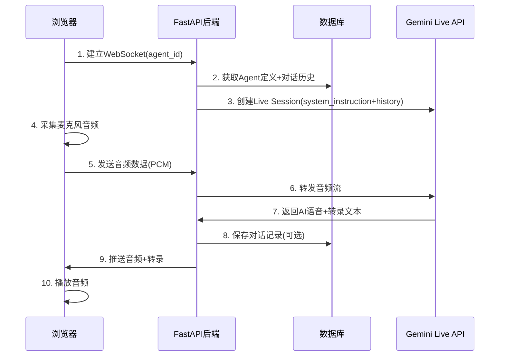

# FR_LIVE_VOICE_CHAT - Agent 实时语音通话功能

CREATED_BY_AGENT

## 功能概述

本功能实现了与智能体（Agent）的实时语音对话能力，用户可以通过麦克风与 Agent 进行自然的语音交流。系统使用 Google Gemini Live API 作为后端语音处理引擎，支持实时语音转文字、AI 回复生成和语音合成。

### 核心特性

- **实时双向语音通话**：用户说话实时传输，AI 回复实时播放
- **语音转文字**：自动将用户语音和 AI 回复转换为文字
- **与现有 Chat 系统集成**：复用 Agent 定义、对话历史和会话管理
- **可选历史保存**：语音对话可选择是否保存到聊天历史
- **会话恢复支持**：支持断线后会话恢复（session resumption）

## 架构设计



## 技术选型

选择 **WebSocket** 而非 WebRTC：

- Gemini Live API 本身使用 WebSocket 协议
- 无需 STUN/TURN 服务器配置
- 与现有 FastAPI 基础设施无缝集成

## 配置

### config.yaml

```yaml
gemini_live:
  enabled: true # 是否启用实时语音通话功能
  project_id: "inty-backend" # GCP 项目 ID
  location: "us-central1" # Vertex AI 区域
  model: "gemini-live-2.5-flash-preview-native-audio-09-2025" # Live API 模型
  send_sample_rate: 16000 # 上行音频采样率 (Hz)
  receive_sample_rate: 24000 # 下行音频采样率 (Hz)
  default_voice: "Zephyr" # 默认 AI 语音
  session_resumption: true # 启用会话恢复
  input_transcription: true # 启用用户语音转录
  output_transcription: true # 启用 AI 语音转录
  trigger_tokens: 10000 # 上下文压缩触发阈值
  target_tokens: 512 # 压缩后目标 token 数
  save_voice_history: true # 默认是否保存语音对话到聊天历史
```

### 认证配置

使用 Vertex AI SDK + 服务账户认证：

- 复用现有 `app.gcp_service_account_key` 配置
- 需要 `Vertex AI User` 角色权限

## API 端点

### WebSocket 端点

```
ws://<host>/api/v1/live-chat/{agent_id}
```

#### 鉴权方式（推荐）

WebSocket 与其他 HTTP 接口保持一致，使用请求头：

- `Authorization: Bearer <token>`

兼容旧方式：

- `Sec-WebSocket-Protocol: Bearer, <token>`
- `?token=<token>`（不推荐，仅用于兼容旧客户端）

#### 为什么 Swagger 看不到该 WS 接口

FastAPI 生成的 OpenAPI/Swagger **不会**包含 `@router.websocket(...)` 端点，这是框架常见行为；因此我们在本文档中维护 WebSocket 的使用方式与协议说明。

### 消息协议

| 方向 | 类型              | 内容                                              |
| ---- | ----------------- | ------------------------------------------------- |
| 上行 | `audio`           | Base64 编码的 16kHz PCM 音频                      |
| 上行 | `text`            | 可选文本输入（同时发送给 Gemini）                 |
| 上行 | `end`             | 结束通话                                          |
| 下行 | `audio_response`  | Base64 编码的 24kHz PCM 音频                      |
| 下行 | `transcript`      | AI 回复的转录文本                                 |
| 下行 | `user_transcript` | 用户语音的转录文本                                |
| 下行 | `status`          | 会话状态（connected, speaking, listening, error） |
| 下行 | `error`           | 错误消息                                          |

#### 配置说明

- **save_history**：语音对话默认保存到聊天历史，由后端配置 `gemini_live.save_voice_history` 控制（默认 `true`）
- **voice_id**：AI 语音使用 Agent 定义的默认语音或系统默认语音（`gemini_live.default_voice`）

### 状态查询接口

```
GET /api/v1/live-chat/status
```

返回实时语音通话服务的启用状态和配置信息。

## 文件结构

### 后端

| 文件路径                            | 说明                 |
| ----------------------------------- | -------------------- |
| `app/api/v1/endpoints/live_chat.py` | WebSocket 端点       |
| `app/services/live_chat_service.py` | Gemini Live 桥接服务 |
| `app/schemas/live_chat.py`          | 请求/响应模型        |

### 前端

| 文件路径                             | 说明             |
| ------------------------------------ | ---------------- |
| `evaluation/pages/VoiceChatPage.tsx` | 语音聊天页面     |
| `evaluation/services/liveChat.ts`    | WebSocket 客户端 |
| `evaluation/hooks/useLiveChat.ts`    | 状态管理 Hook    |

## 与现有系统的集成

### 复用的组件

- **Agent 定义**：`agent_manager.get_agent()`
- **对话历史存储**：`chat_history_service`
- **会话管理**：`chat_service.get_or_create_chat_by_agent()`
- **用量控制**：`subscription_service`

### 共享会话

语音通话与文本聊天共享同一个 `session_id`，对话历史可以相互查看。

## 使用说明

### 前端使用

1. 进入「语音通话」页面
2. 从左侧列表选择一个智能体
3. 点击「开始通话」按钮
4. 授权麦克风访问
5. 开始对话
6. 点击「结束通话」按钮结束

### 静音功能

通话过程中可以点击静音按钮暂停麦克风输入，再次点击恢复。

### 历史保存

语音对话的转录文本默认会保存到聊天历史中，可以在「单角色聊天」页面查看。此行为由后端配置控制，前端不提供动态开关。

## 音频规格

| 方向 | 采样率 | 格式         | 通道   |
| ---- | ------ | ------------ | ------ |
| 上行 | 16kHz  | PCM (16-bit) | 单声道 |
| 下行 | 24kHz  | PCM (16-bit) | 单声道 |

## 安全考虑

- WebSocket 连接需验证 Bearer Token（复用现有认证机制）
- 限制每用户并发语音会话数（建议：1 个）
- 语音数据不落盘，仅转录文本可选保存

## 依赖

- `google-genai`：Gemini Live SDK（已在项目中使用）
- 前端：原生 WebSocket 和 Web Audio API（无需新增依赖）

## 后续优化方向

- 添加语音活动检测（VAD）减少无效传输
- 支持多种 AI 语音选择
- 添加通话时长统计
- 支持 Android/iOS 客户端

## 已知问题与解决方案：音频多轮在同一 Live Session 卡死（#1224）

### 现象

- **第一轮语音正常**：用户说完后，Gemini 会返回音频（model_turn parts），并发送 `turn_complete=true`
- **第二轮开始后不再回复**：前端继续发送音频，但服务端 `receive()` 不再产出任何消息；WebSocket 连接本身不一定断开

该现象在我们的环境中可稳定复现，符合社区反馈的 “turn_complete 后 session 停止响应” 类问题（参考：[`googleapis/python-genai#1224`](https://github.com/googleapis/python-genai/issues/1224)）。

### 根因判断

这不是前端音频格式或 VAD 参数导致的单点问题，而是 Gemini Live（native audio）在部分模型/通道/SDK 组合下的已知缺陷：**同一 Live session 中的多轮音频对话会在首个 `turn_complete` 后进入无响应状态**。

### 解决方案（当前采用）

采用“**每轮重连 Live session**”的工程绕过方案：

- 当服务端收到 `turn_complete` 后，立刻重建一个新的 Gemini Live session
- 发送侧不再绑定局部 `gemini_session`，而是通过会话状态读取当前有效 session，避免第二轮语音被发到已卡死的旧 session
- **重连期间音频缓冲**：在重连窗口内缓存少量上行音频，并在新 session 建立完成后 flush 回放，降低用户紧接着说第二句话导致丢音的概率

对应代码位置：

- `app/services/live_chat_service.py`
  - `_receive_loop(...)`：收到 `turn_complete` 后触发重连
  - `_reconnect_gemini_session(...)`：重建 session，并在重连期间做音频缓冲/回放

### 影响与权衡

- **优点**：语音多轮稳定可用（解决“第二句话不回复”）
- **代价**：每轮增加一次 Live 连接建立开销（延迟/成本小幅上升）
