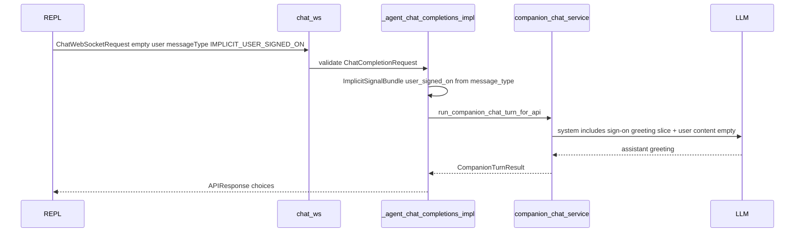

# FR: Implicit user sign-on greetings (companion WebSocket)

## Goal

Reduce awkwardness when the user returns to the chat channel by letting the client send a non-user-authored turn that the backend treats as an implicit signal: inject a system slice so the model briefly greets the user. The first proactive turn on a fresh connection with `?agent_id=` remains the existing USER_INTERACTIVE bootstrap kickoff; subsequent reconnects can use `messageType: IMPLICIT_USER_SIGNED_ON` (see REPL bridge).

## Protocol (summary)

- Optional field on `ChatCompletionRequest`: `messageType` (alias), enum `CompanionChatTurnMessageType`: `USER_MESSAGE` (default), `IMPLICIT_USER_SIGNED_ON`.
- `IMPLICIT_USER_SIGNED_ON` requires empty user message text; WebSocket companion only; maps to `ImplicitSignalBundle.user_signed_on` and skips persisting an empty user row.
- HTTP `/api/v1/chat/completions` rejects `IMPLICIT_USER_SIGNED_ON` with 400.

## Sequence (sign-on turn)

## References

- Schema: [`/app/schemas/chat.py`](/app/schemas/chat.py) (`CompanionChatTurnMessageType`, `ChatCompletionRequest.message_type`)
- Bundle: [`/app/schemas/implicit_signals.py`](/app/schemas/implicit_signals.py)
- Prompt slice: [`/app/core/agentic_kernel/companion/implicit_signal_messages.py`](/app/core/agentic_kernel/companion/implicit_signal_messages.py)
- Handler: [`/app/api/v1/endpoints/chat.py`](/app/api/v1/endpoints/chat.py)
- REPL client: [`/tools/inty_v2_repl/backend_chat_ws.py`](/tools/inty_v2_repl/backend_chat_ws.py)
