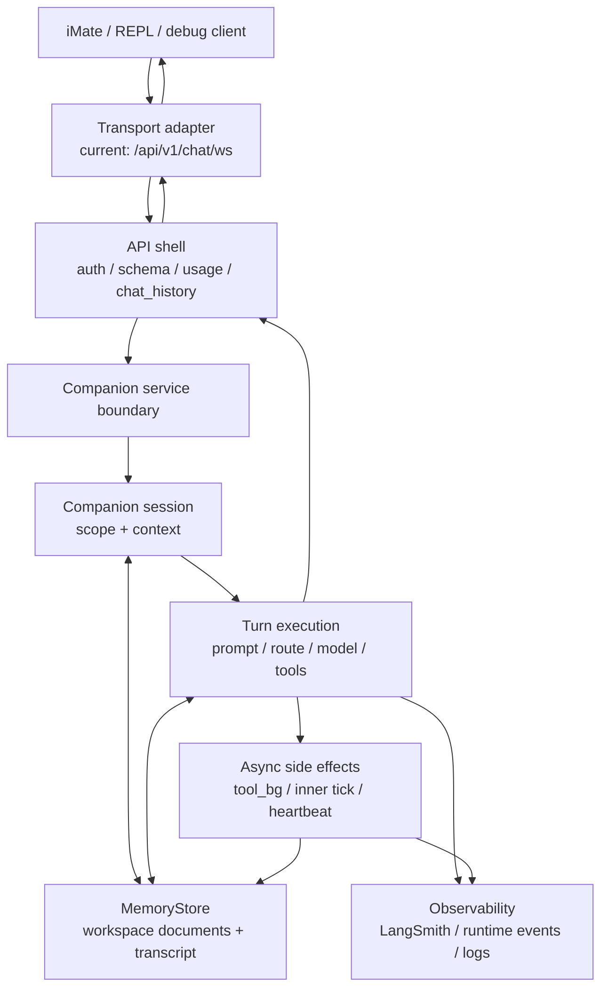

# iMate / Agentic Companion: 架构说明

## 一句话

Agentic Companion 是关系型智能体的后端内核：以会话上下文、长期记忆、模型回合、工具副作用和多媒介传输为五个独立层次组织当前生产路径，并把现有 WebSocket 文本聊天实现视为一个传输适配器，而不是内核本身。

## 读者定位

本文用于判断 agentic companion 当前架构的职责边界、已确认约束、关键取舍和演进方向；它不是逐函数代码索引，也不是目标态已经完成的声明。代码真相仍以 `/app/core/agentic_kernel/`、`/app/services/companion_chat_service.py`、`/app/api/v1/endpoints/chat.py` 和 schema 为准；本文只记录跨文件后仍成立的设计事实。

## 目标态

Agentic Companion 的目标是为用户提供长期关系中的“虚拟活人”体验。后端内核必须把以下能力视为一套连续系统，而不是聊天接口的附属功能：

- **关系连续性**：用户、companion、会话和跨会话记忆应有清晰层级；短期 transcript 不应替代长期关系记忆。
- **媒介无关回合**：文本、语音、图片、主动心跳、内在节拍和未来 phone / video / SMS 都应进入同一个 companion turn 语义，而不是各自绕开内核。
- **状态可追溯**：人设、用户理解、语义记忆、工具结果、运行时异常和用户可见历史必须能被审计，并能解释“为什么这一轮这样回应”。
- **低延迟与事实核验并存**：前台可快速回应，但后台工具和慢思考结果必须与 transcript、用户可见补帧、下一轮上下文保持一致。
- **传输可替换**：WebSocket 是当前 App 文本聊天传输，不是 companion 内核的边界。

## 非目标

- 本文不定义新的数据库 schema；MemoryStore 与向量 LTM 的目标设计见 `/docs/agentic_kernel/MEMORY_STORE.md`。
- 本文不复制 WebSocket payload 字段全集；协议真源见 `/app/schemas/chat_websocket.py` 与 `/app/api/v1/endpoints/chat.py`。
- 本文不把当前 `run_turn` 分支解释为最终编排抽象；通用 turn 合同与生产 companion 主链路仍未收敛。
- 本文不覆盖 Gemini Live audio 路径；它不是 `/api/v1/chat/ws` companion 文本通道。

## 不可变约束

| 约束 | 含义 |
| --- | --- |
| Companion 状态高于传输 | WebSocket、REPL、HTTP debug 或未来媒介只能适配 companion turn，不应拥有独立人格和记忆语义。 |
| 用户可见轨迹必须可追溯 | 用户消息、assistant 回复、后台可见补帧、主动心跳都必须能追到同一轮上下文和持久化状态。 |
| 长期关系记忆不能只绑定单个 chat | 当前生产 scope 是 `user_id + companion_id + chat_id`，但目标架构必须容纳 user-scoped / companion-scoped 关系记忆。 |
| 工具副作用不能绕过回合语义 | 后台工具、图像产物、状态修改和 inner tick 都必须进入可审计的 companion 状态，而不是仅作为 transport payload。 |
| Prompt 组装只允许单一主入口 | 工作区文档记忆、工具策略、experience profile、未来 LTM 切片必须在 companion 主 prompt 链路中统一排序。 |
| 失败应显性 | 记忆缺失、provider envelope 异常、tool background 失败、scope 冲突不应被静默吞掉；可降级但必须可观测。 |

## 当前生产架构

当前生产入口仍是 `/api/v1/chat/ws`。API 层负责鉴权、schema、用量、chat history 和 transport framing；companion 内核负责 session、MemoryStore、prompt、模型路由、工具链和 transcript。这个分层是现状，不是目标完成态：API 层仍承载过多 companion 相关协调逻辑。

## 核心层次

| 层次 | 当前职责 | 设计判断 |
| --- | --- | --- |
| Transport adapter | `/api/v1/chat/ws` 长连接、控制帧、业务帧 FIFO、REPL bridge。 | 应继续下沉为传输适配层；不能作为 companion 能力边界。 |
| API shell | 鉴权、版本门控、usage、chat_history、错误映射、客户端兼容。 | 可保留业务网关职责，但不应持有 turn 并发和后台补帧语义。 |
| Companion session | 按 `user_id + companion_id + chat_id` 绑定 `context.json`、工作区、transcript。 | 当前作用域偏会话；需要向 user / companion / chat 分层关系状态演进。 |
| Turn execution | 组装 prompt、解析 envelope、选择 route、调用模型、启动工具后台。 | 是内核主心跳；未来应收敛到单一编排合同，减少平行抽象。 |
| MemoryStore | 版本化文档、transcript、context、runtime events、状态 JSON。 | 当前是有效过渡层；长期应拆成事件流、可编辑文档和检索层。 |
| Async effects | tool background、proactive heartbeat、maintenance inner tick、图像等副作用。 | 必须与 turn / transcript / chat_history 保持一致，不应只表现为额外下行帧。 |
| Observability | `user_msg_uuid`、`inty_trace_id`、LangSmith、runtime events、log correlation。 | 是架构约束，不是排障附属品。 |

## 关键取舍

### 1. WebSocket 优先，而非媒介无关

当前 companion 只在 WebSocket chat route 进入生产内核，HTTP completions 仍走 legacy agent 路径。这让 App 文本聊天先跑通，但也造成能力边界被 `/api/v1/chat/ws` 污染：上线问候、heartbeat、后台工具补帧、transport FIFO 和 companion turn 被写在同一生产路径里。

**判断**：保留 WebSocket 作为现有客户端的稳定适配器，但新能力不应继续以“WebSocket 特例”进入内核。

### 2. MemoryStore 先统一工作区视图，而非先建完整长期记忆系统

当前 MemoryStore 用逻辑 POSIX 路径暴露 `IDENTITY.md`、`SOUL.md`、`USER.md`、`MEMORY.md`、`transcript.jsonl`、`context.json` 和运行状态。启用 Postgres DSN 时，正文写入 `companion_memory_document_versions`，路径只是 LLM 和工具友好的视图。

**判断**：路径式接口对模型友好，应保留；底层 append-only 整文档版本不是长期最优，尤其不适合高频 transcript、runtime events 和并发读改写。

### 3. 前台快回复 + 后台工具，而非同步全阻塞

当本轮需要工具时，前台可先生成用户可见 envelope，后台工具线程随后完成事实核验、状态副作用或可见补帧。该设计服务低延迟，但会制造两个风险：前台回复先于工具事实，后台补帧晚于用户下一次输入。

**判断**：这个取舍可以保留，但必须把“后台结果何时进入 transcript、何时影响下一轮、何时可见补帧”提升为明确合同。

### 4. 当前 `run_turn` 承载生产复杂度，而非通用 TurnOrchestrator

`runtime/TurnOrchestrator` 是通用 turn 合同和实验桥使用的并行抽象，生产 companion 主链路仍主要在 companion session、service、`run_turn` 和 API shell 之间完成。

**判断**：短期不强行迁移；中期必须收敛为一个生产编排抽象，否则 prompt、持久化、工具、副作用会继续分散。

## 淘汰路径

| 当前形态 | 问题 | 淘汰方向 |
| --- | --- | --- |
| WebSocket endpoint 持有 companion 协调状态 | transport 与内核边界混合。 | 提取 transport-neutral turn gateway；WebSocket 只负责连接和帧。 |
| `user_id + companion_id + chat_id` 作为唯一关系 scope | 长期关系记忆被会话粒度限制。 | 引入 user / companion / chat 分层 corpus；chat transcript 成为下层事件来源。 |
| MemoryStore 单表整文档 append-only 承载所有状态 | transcript 高频写、运行事件、可编辑文档和检索需求混在一起。 | 拆分 event log、document snapshot、search projection，同时保留路径式工具 API。 |
| API shell 负责 chat_history 与 tool_bg 汇合 | 持久化顺序和补帧语义散落在网关层。 | 由 companion turn result / event stream 统一输出用户可见事件和审计事件。 |
| `run_turn`、`turn_pipeline`、`turn_engine`、`TurnOrchestrator` 并行 | 多套抽象表达同一回合概念。 | 明确生产唯一编排入口；其它入口降级为 adapter 或删除。 |
| legacy HTTP completions 与 companion WS 双轨 | 客户端能力不一致，产品语义分裂。 | 以 companion turn 为新主路径；legacy 仅作为兼容层保留到客户端迁移完成。 |

## 当前功能边界

| 区域 | 当前事实 |
| --- | --- |
| iMate Android | 连接 `/api/v1/chat/ws`，发送聊天帧和 `user_signed_on` 控制帧，本地 repository 消费下行业务帧。 |
| IntelliMate Android | release 发送聊天仍以 HTTP completions 为主，debug 可走 WebSocket。 |
| 生产 companion 后端 | 只有 WebSocket chat route 会把一轮聊天交给 `/app/core/agentic_kernel/companion/`。 |
| `/api/v1/chat/ws/verify` | 复用 WebSocket framing 和队列形态，但不经过 `CompanionManager` / `run_turn`，不写 chat_history。 |
| REPL | 通过后端 WebSocket 桥接当前生产路径；自身只做传输、日志和终端交互。 |
| Gemini Live audio | 不属于本文描述的 `/api/v1/chat/ws` companion 文本链路。 |

## 回合语义

一轮 companion turn 在设计上应只有一个语义入口，不管触发来源是用户文本、上线问候、主动心跳还是维护性 inner tick。当前生产路径可以抽象为：

1. **绑定关系上下文**：确定用户、companion、chat、experience profile 和 bootstrap 状态。
2. **读取可用状态**：加载工作区文档、transcript、压实快照、运行状态和必要的 inner tick 上下文。
3. **组装模型上下文**：按固定顺序注入 axiom、安全基线、角色/关系文档、记忆、工具策略和近期对话。
4. **选择执行路由**：普通 chat、异步前台加后台工具、maintenance inner tick、proactive heartbeat。
5. **生成用户可见结果**：解析统一 envelope，避免把 provider reasoning 通道误当成回复。
6. **提交状态变化**：写 transcript、工作区文档、runtime events、工具结果和 chat_history。
7. **发布下行事件**：把用户可见 assistant 帧、可见 tool_bg 补帧或错误帧交给 transport adapter。

这个顺序是架构合同。具体函数可以变化，但不能让状态提交、用户可见事件和下一轮上下文彼此失配。

## 记忆模型

当前 companion 的“世界”主要由 MemoryStore 中的一组版本化文档、transcript 和工具副作用构成，还不是独立 world engine。文档记忆分三层：episodic、gist、semantic；详见 `/docs/agentic_kernel/MEMORY_PIPELINE.md`。

| 记忆/状态 | 当前作用 | 长期判断 |
| --- | --- | --- |
| `IDENTITY.md` / `SOUL.md` / `USER.md` | companion 身份、稳定边界、对用户的长期理解。 | 属于可编辑关系文档，应有版本、来源和冲突策略。 |
| `MEMORY.md` | 跨日语义记忆。 | 不能独自承担长期关系记忆；应与向量 LTM / provenance 并存。 |
| `memory/daily/{date}.md` / `memory/{date}.md` | 当日情景流水和 gist 摘要。 | 是关系事件的压缩视图，不应替代事件流。 |
| `transcript.jsonl` | 用户可见对话轨迹和下一轮上下文来源。 | 应从整文档 append-only 演进为事件级存储或 projection。 |
| `context.json` | session 元数据、experience profile、bootstrap 标志。 | 应继续作为当前 session binding 的显式状态。 |
| runtime/state JSON | 管线节拍、压实状态、image gate、异常事件等控制面状态。 | 应与用户关系文档分层，避免混用同一文档语义。 |

目标 MemoryStore 方向是保留模型友好的路径式接口，同时把底层拆成 document snapshot、event append log 和 search projection。完整目标说明见 `/docs/agentic_kernel/MEMORY_STORE.md`。

## 传输合同

当前 WebSocket 协议有两类下行：

- **业务事件**：assistant 回复、错误 envelope、可见 tool background 补帧，必须保持 per-connection FIFO。
- **连接控制**：`ping` / `pong`、client context ack、signed-on ack 等，只表达连接或时间上下文，不应进入 dialogue FIFO。

这个划分可以保留，但它只是 transport 层合同。Companion 内核更关心的是“哪些事件改变关系状态、哪些事件用户可见、哪些事件进入下一轮上下文”。

## 实现索引

| 主题 | 路径 |
| --- | --- |
| 生产 companion 内核 | `/app/core/agentic_kernel/companion/` |
| WebSocket API shell | `/app/api/v1/endpoints/chat.py` |
| WebSocket session pump | `/app/services/chat_websocket_session.py` |
| API 到 companion 的服务边界 | `/app/services/companion_chat_service.py` |
| WebSocket 协调状态 | `/app/core/agentic_kernel/companion/websocket_coordinator.py` |
| session 与 MemoryStore 绑定 | `/app/core/agentic_kernel/companion/manager.py` |
| 生产 turn 执行 | `/app/core/agentic_kernel/companion/turn.py` |
| route mode | `/app/core/agentic_kernel/companion/turn_routes.py` |
| prompt stack | `/app/core/agentic_kernel/companion/prompt_stack.py` |
| MemoryStore | `/app/core/agentic_kernel/companion/memory_store.py` |
| 记忆管线 | `/app/core/agentic_kernel/companion/memory_pipeline.py` |
| async tool background | `/app/core/agentic_kernel/companion/tool_background.py` |
| dual-LLM envelope | `/app/core/agentic_kernel/companion/significance_perception.py` |
| 通用 turn 合同 | `/app/core/agentic_kernel/contracts/turn.py` |
| 实验编排器 | `/app/core/agentic_kernel/runtime/turn_orchestrator.py` |
| WebSocket schema | `/app/schemas/chat_websocket.py` |
| MemoryStore 目标说明 | `/docs/agentic_kernel/MEMORY_STORE.md` |
| 记忆管线说明 | `/docs/agentic_kernel/MEMORY_PIPELINE.md` |

## 维护规则

- 新增架构内容必须先说明跨模块设计含义，再给实现入口。
- 不在本文记录可直接从单个函数读出的细节。
- 若某段内容只为排障服务，应移入对应目录 `AGENTS.md` 或专题 runbook。
- 若目标态与现状不同，必须显式标注“当前事实”和“淘汰方向”。
