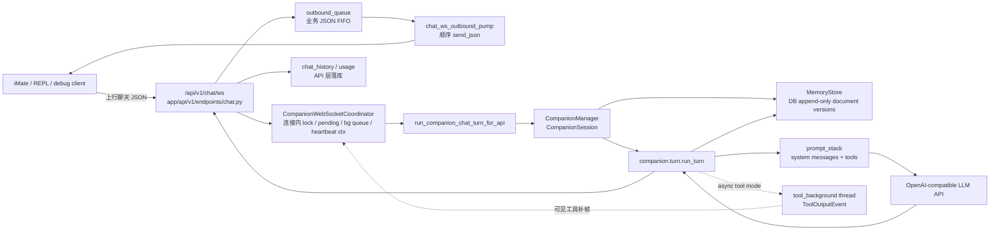

# iMate / Agentic Companion: 当前架构

本文面向维护 iMate Android、REPL 调试工具和后端 companion kernel 的工程师。

- 实现链条: [`chat.py`](/app/api/v1/endpoints/chat.py) `_agent_chat_completions_impl` · [`companion_chat_service`](/app/services/companion_chat_service.py) · [`turn.run_turn`](/app/core/agentic_kernel/companion/turn.py) · 帧与契约 [`app/api/AGENTS.md`](/app/api/AGENTS.md) · 包内细节 [`companion/AGENTS.md`](/app/core/agentic_kernel/companion/AGENTS.md)
- 分层记忆说明: [`MEMORY_PIPELINE.md`](/docs/agentic_kernel/MEMORY_PIPELINE.md)
- MemoryStore 与向量 LTM: [`MEMORY_STORE.md`](/docs/agentic_kernel/MEMORY_STORE.md)
- `/api/v1/chat/ws` 传输与帧约定 (English): 下文 [**WebSocket Protocol**](#websocket-protocol) 小节.

## 一句话总结

交互式伴侣内核是在 App 通过 **`/api/v1/chat/ws` 长连接**与后端对话时启用的路径：以 **`MemoryStore` 持久化工作区文档与 transcript**、由 **`CompanionManager`/`run_turn`** 驱动前台结构化回复与可选的后台工具链，并通过 **出站队列 + pump** 把多帧业务 JSON（含前台回复、`tool_bg`、错误码）顺序推回客户端。

## 一段话描述

会话逻辑文档（`IDENTITY.md`、`context.json`、`transcript.jsonl` 等）经 **`MemoryStore`**（启用 Postgres DSN 时写入 `companion_memory_document_versions`）读写；一轮推理由 **`app/core/agentic_kernel/companion/turn.py` 的 `run_turn`** 组装 system/transcript、可走 **双 LLM 前台 envelope + 异步 `tool_background` 线程**（`CompanionSession.tool_bg_idle` 协调顺序）。**WebSocket** 侧 `chat_completions_websocket`（`app/api/v1/endpoints/chat.py`）为每条业务下行使用 **`outbound_queue` + `chat_ws_outbound_pump`**，控制类帧（如 `ping`/`pong`、`user_signed_on_ack`）文档说明为不走该队列；前台回合在 **`CompanionWebSocketCoordinator.turn_lock`** 内调用 **`_agent_chat_completions_impl`**（`chat_route="websocket"`），其中 **`companion_chat_service.run_companion_chat_turn_for_api`** 接入 **`CompanionManager`**；后台工具完成时通过 **`background_sink` → `background_events`** 队列再组装 **`_build_companion_tool_background_ws_payload`** 入队。**`tools/inty_v2_repl`** 用 **`BackendChatWsBridge`** 在独立线程里维护 WebSocket，上行 **`ChatWebSocketRequest` JSON**（`post_turn`/`send_turn`），下行 **`code` 业务帧**进入队列并在终端打印——只做传输与日志，**不实现伴侣推理**（README 写明 companion 代码在 `app/core/agentic_kernel/companion/`）。

## 产品要点功能列表

- **长连接文本对话（伴侣内核）**：仅 WebSocket 路径启用 companion；**`POST /api/v1/chat/completions/{agent_id}`** 走 legacy **`Agent`** 栈（非 companion 内核）。
- **上线 / 隐式问候**：控制帧 **`user_signed_on`**、聊天帧 **`messageType: IMPLICIT_USER_SIGNED_ON`**（及 REPL 首次连接组合行为）。
- **分层持久「档案」与 transcript**：工作区逻辑路径 + **日记/摘要/语义记忆管线**（文档见 `companion/AGENTS.md`）。
- **工具调用、后台工具与生图元数据**：前台一帧后可跟 **`tool_bg`** 等额外下行；`meta_data` 可含 **`generated_image`**、significance 等。
- **语音回复**：按聊天设置与 companion 的 **`reply_modality` / `voice_message_script`** 走 **`synthesize_chat_assistant_audio`**。
- **主动心跳与维护性内在节拍（inner tick）**：配置项开启时由 **`companion_ws_inner_tick_worker`** 周期尝试触发。
- **订阅用量、聊天入库、运营类投递**：用量记录、**`chat_history`** 持久化；满足版本门控时 **节日/日常记忆提示** 投递；以及推送已读、Surprise Snap 等（与 HTTP 路径共用大量 `_agent_chat_completions_impl` 尾部逻辑）。

## 各功能 ↔ 架构要点

### 长连接文本对话（伴侣内核）

- **`app/api/v1/endpoints/chat.py`**：`@router.websocket("/ws")` → **`chat_completions_websocket`**；鉴权 **`_get_current_user_from_websocket`**（含 **`assume_user_id`** 扮演用户）；业务响应 **`outbound_queue.put`**。
- **`_agent_chat_completions_impl`**：`chat_route == "websocket"` 时 **`use_companion = True`**，调用 **`companion_chat_service.run_companion_chat_turn_for_api`**；WebSocket 要求 **`message_id` 可解析为 UUID**（**`_require_websocket_companion_message_id_uuid`**）。
- **`app/core/agentic_kernel/companion/manager.py`**：**`CompanionManager.run_turn`** → **`turn.run_turn`**；**`get_memory_store`** 绑定会话 scope。
- **并发**：**`CompanionWebSocketCoordinator.turn_lock`** 包裹整轮 `_agent_chat_completions_impl` 中的 companion 调用；与 **`background_events`** 队列并行接收（`asyncio.wait` 二选一）。

### 上线 / 隐式问候

- **`chat.py`**：**`_handle_chat_websocket_control_json`**（`ping`/`pong`、`client_context`）、**`_try_handle_ws_user_signed_on_frame`** / **`_try_handle_ws_user_signed_out_frame`**；**`ImplicitSignalBundle`** + **`IMPLICIT_USER_SIGNED_ON`** 分支。
- **`tools/inty_v2_repl/backend_chat_ws.py`**：首次连接 **`_ws_user_signed_on_json`**（含 **`implicit_greeting`**）；**`AGENTS.md`** 描述随后 **`IMPLICIT_USER_SIGNED_ON`** 聊天帧。
- **`app/core/agentic_kernel/companion/implicit_signal_messages.py`**：隐式信号作为 transcript 中的用户线处理（细节以该模块为准）。

### 分层持久档案与 transcript

- **`memory_store.py`** / **`memory_registry.py`**：进程内 registry + **append-only** 文档版本。
- **`memory_pipeline.py`**、**`memory_taxonomy.py`**：分层记忆路径与写入（见 **`companion/AGENTS.md`** 表格）。
- **API**：**`run_companion_chat_turn_for_api`** 使用 **`defer_memory_update=True`**（记忆管线更新时机以 **`companion_chat_service`** 内实现为准；未在此逐行读完则不作细节断言）。

### 工具调用、后台工具、图像元数据

- **`app/core/agentic_kernel`**：**`tool_background.py`**、**`tool_bg_routing.py`**、**`AGENTS.md`** 所述 **双 LLM envelope** 与 **`TurnRouteMode.ASYNC_FOREGROUND_CHAT_BACKGROUND_TOOL`** 顺序。
- **`chat.py`**：前台异常若 **`companion_tool_background_started`** 仍为 true，可保留 **`foreground_pending`** 项并补 persist user 消息 id；**`background_sink`** 把 **`ToolOutputEvent`** 投递到 **`background_events`**，再 **`_build_companion_tool_background_ws_payload`**。
- **前台模型 vs 工具模型**：**`app/services/companion_chat_service`** + 配置 **`companion_tool_call_model`**（见 **`app/core/agentic_kernel/AGENTS.md`** 引用链）；具体默认值以 **`global_config_loaded_from_config_yaml`** 为准。

### 语音回复

- **`chat.py`**：companion 分支得到 **`companion_reply_modality`**、**`companion_voice_script`** 后调用 **`synthesize_chat_assistant_audio`**（**`use_companion=True`**）。
- **`VoiceService`** 依赖注入与 **`chat_settings.voice_enabled`** / **`voice_id`** 等一同传入。

### 主动心跳与维护性 inner tick

- **`chat.py`**：**`companion_ws_inner_tick_worker`** 轮询配置 **`companion_ws_proactive_heartbeat_poll_seconds`**；分别调用 **`_try_fire_companion_ws_proactive_heartbeat`**、**`_try_fire_companion_ws_maintenance_inner_tick`**（需 **`CompanionWebSocketCoordinator.heartbeat_context`** 已由 **`user_signed_on` 等路径经 `store_heartbeat_coords` 填充**）。
- **`companion/heartbeat.py`**、**`inner_tick_schedule.py`**：节拍与时间间隔辅助（与 WS worker 的配合细节未在本次全部展开）。

### 订阅用量、历史、节日/日常记忆、推送已读、Surprise Snap

- **用量**：**`subscription_svc.check_chat_limit`** / **`record_usage`**（隐式上线回合同样计入 usage，代码注释 **TODO** 说明产品日后或可豁免）。
- **历史**：**`chat_history_service.add_ai_message_sync_async`**，**`meta_data`** 来自 **`_companion_ai_meta_from_turn_result`**。
- **节日/日常记忆**：**`is_festival_memory_enabled`** / **`is_daily_memory_enabled`**（依赖 **`appVersionCode`**）→ **`deliver_festival_memories_for_user_agent`** / **`deliver_daily_memories_for_user_agent`**。
- **推送已读**：**`mark_user_push_notifications_as_read`**。
- **Surprise Snap**：**`try_trigger_surprise_snap`**。
- **说明**：**付费预览（premium preview）** 在 **`not use_companion`** 条件下触发（**`_agent_chat_completions_impl`**），故 **伴侣 WebSocket 路径未走该块**。

**未在已读代码中确认**：`_build_companion_tool_background_ws_payload` 内字段全集；`run_companion_chat_turn_for_api` 在 **`defer_memory_update=True`** 下记忆管线何时 flush 的精确时序。

## 范围与边界

| 区域 | 当前事实 |
| --- | --- |
| iMate Android | [`ChatWebSocketRemoteDataSource`](/imate_android_app/app/src/main/java/com/inty/imate/chat/data/datasource/ChatWebSocketRemoteDataSource.kt) 连接 `api/v1/chat/ws`, 上行聊天帧和 `user_signed_on` 控制帧, 下行由 [`ChatMainRepository`](/imate_android_app/app/src/main/java/com/inty/imate/chat/data/ChatMainRepository.kt) 写入本地消息流。 |
| IntelliMate Android | 仍可保持主 WebSocket 连接；release 发送聊天仍以 HTTP completions 为主，debug 可走 WebSocket。见 [`app/api/AGENTS.md`](/app/api/AGENTS.md)。 |
| 生产 companion 后端 | 只有 WebSocket chat route 会把一轮聊天交给 `app.core.agentic_kernel.companion`。HTTP completions 仍是 legacy agent 路径。 |
| `/api/v1/chat/ws/verify` | 共用 WebSocket 出站队列和 pump, 但只做单次 `chat.completions`; 不经过 `CompanionManager` / `run_turn`, 不写 chat_history。 |
| WebSocket companion 连接 | 每个连接用 `CompanionWebSocketCoordinator.turn_lock` 串行化普通用户回合、proactive heartbeat 和 async tool background 补帧落库; assistant 业务帧仍经 outbound queue。 |
| `runtime/TurnOrchestrator` | 是通用 turn 合同和实验桥使用的并行管线, 当前生产 companion 主链路不经过它。 |

## WebSocket Protocol

English summary of **`/api/v1/chat/ws`** transport and framing (implementation: [`chat.py`](/app/api/v1/endpoints/chat.py); schema: [`ChatWebSocketRequest`](/app/schemas/chat.py)). This does **not** describe `/api/v1/live-chat/{agent_id}` (Gemini Live audio).

**Handshake and auth.** After `websocket.accept()`, the server resolves the user from `Authorization: Bearer <token>` or query `token`. On failure the socket closes with code **4001**. Optional query **`assume_user_id`** applies only when the bearer user is a **superuser** (same idea as HTTP `X-Assume-User-Id` for evaluation).

**Outbound (two paths).**

- **Business JSON** — Assistant payloads, error envelopes mapped from HTTP semantics, and optional async **tool background** (`tool_bg`) assistant frames are pushed to a per-connection **`asyncio.Queue`**. [`chat_ws_outbound_pump`](/app/services/chat_websocket_session.py) drains it and calls `send_json` in **strict FIFO** order.
- **Wire control** — Frames that only acknowledge transport or session metadata **bypass** that queue and are sent directly (e.g. `pong`, `client_context_ack`, `user_signed_on_ack`, `user_signed_out_ack`). This separates link/time-context handling from the dialogue FIFO.

**Inbound text frames.** JSON is parsed and dispatched in this order:

1. **`user_signed_on`** / **`user_signed_out`** — Companion session control (heartbeat coordinates, optional implicit greeting after sign-on, sign-out line in MemoryStore). May respond `ok: false` with `reason` when unsupported.
2. **Light control** — `ping` → `pong`; `client_context` with `time_context` (`UserTimeContext`) → `client_context_ack`; last successful context is reused if later chat frames omit `time_context`.
3. **Chat** — Must validate as **`ChatWebSocketRequest`**: top-level `agent_id` plus embedded **`ChatCompletionRequest`** as `request`. Handed to **`_agent_chat_completions_impl(..., chat_route="websocket")`** for persisted companion turns.

**Companion-specific rules.** Production expects **`request.message_id`** as an **RFC4122 UUID** (transcript / correlation). Optional **`request.messageType`**: `USER_MESSAGE` (default) or `IMPLICIT_USER_SIGNED_ON` (implicit open-chat signal; validation and PostgreSQL user-row rules per schema). Optional header **`appVersionCode`** for version gating.

**Receive loop.** The route **`asyncio.wait`**s on **`receive_text()`** (subject to configurable **idle timeout** — connection closes on timeout; **`ping` counts as uplink activity**) and the per-connection coordinator’s **`background_events`** queue, where the background tool thread posts **`ToolOutputEvent`** via **`background_sink`**. Tool completion correlates with **`foreground_pending`** by `user_msg_uuid`, builds a normal assistant-shaped payload, then **enqueues** it (never bypassing the business FIFO).

**Background tasks.** A connection-scoped worker may run **proactive heartbeat** and **maintenance inner tick** when feature flags allow; eligible turns enqueue assistant frames through the **same outbound queue**.

**`/api/v1/chat/ws/verify`.** Same queue + pump and frame shapes for connectivity checks; uses a **minimal** completion path and **does not** write `chat_history`. **`user_signed_on`** returns `not_supported` when heartbeat context is not wired.

## 生产消息路径



控制帧和业务帧分层处理:

- `ping`、`client_context_ack` 等连接控制帧由路由直接 `send_json`, 不进入业务下行队列。
- assistant 业务 JSON、LLM 错误映射帧、异步 tool 可见补帧经 `asyncio.Queue` 和 [`chat_ws_outbound_pump`](/app/services/chat_websocket_session.py) FIFO 写回客户端。
- REPL 的上行 `post_turn` 直接 `ws.send`; 下行由 `_response_q` 和 [`pop_downlink_item`](/tools/inty_v2_repl/repl_message_io.py) 消费。它不是和服务端共用一个端到端消息队列, 只是传输侧各自维护 FIFO。

### WebSocket 序列化与后台 tool 汇合

[`chat_completions_websocket`](/app/api/v1/endpoints/chat.py) 为每个生产 WebSocket 连接创建一个 [`CompanionWebSocketCoordinator`](/app/core/agentic_kernel/companion/websocket_coordinator.py)。它把四类 companion 协调状态显式化, endpoint 仍负责鉴权、帧解析、数据库落库和 outbound queue:

- `turn_lock`: 串行化 `_agent_chat_completions_impl`、proactive heartbeat、maintenance inner tick 和 async tool background 补帧的 chat_history / transcript 相关副作用。
- `background_events`: `background_sink` 从后台 tool 线程用 `loop.call_soon_threadsafe` 投递 `ToolOutputEvent`, WebSocket 主循环与 `receive_text()` 竞争消费。
- `foreground_pending`: 保存前台 assistant 帧对应的 user message 上下文, 后台可见 tool 结果到达后用同一个 `user_msg_uuid` 关联补帧。
- `heartbeat_context`: 记录 `user_signed_on` 或成功聊天后的 inner-tick 坐标, 并在同坐标刷新时保留 maintenance inner-tick 节流时间戳。

proactive heartbeat 和 maintenance inner tick 都不是客户端上行聊天帧: worker 按同一个 `CompanionWebSocketCoordinator.snapshot_heartbeat_coords()` 读取坐标。proactive 路径通过 [`_try_fire_companion_ws_proactive_heartbeat`](/app/api/v1/endpoints/chat.py) 直接调用 `run_companion_chat_turn_for_api`, 传入 `inner_tick_turn=True`、`InnerTickMode.PROACTIVE_CHAT` 和 `background_output_sink=None`; maintenance 路径传入 `InnerTickMode.MAINTENANCE` 与 `coordinator.background_sink`, 可走受限 inner-tick 工具集并产生后续 tool_bg 补帧。两条路径都由 API 层写 `chat_history` 并把 assistant 业务帧放入 outbound queue。

## `app/core/agentic_kernel` 包结构

| 路径 | 职责 |
| --- | --- |
| [`companion/`](/app/core/agentic_kernel/companion) | 生产 companion 内核。包含 `CompanionManager`, `run_turn`, prompt stack, MemoryStore, tool runtime, memory pipeline, inner tick, async tool background 和 WebSocket 连接协调状态。包内细节见 [`companion/AGENTS.md`](/app/core/agentic_kernel/companion/AGENTS.md)。 |
| [`companion/websocket_coordinator.py`](/app/core/agentic_kernel/companion/websocket_coordinator.py) | 生产 `/api/v1/chat/ws` 每连接 companion 协调状态: turn lock、后台 tool 事件队列、前台 pending 关联、inner-tick 坐标快照。它不做鉴权、DB 查询或 payload 构造。 |
| [`companion/manager.py`](/app/core/agentic_kernel/companion/manager.py) | `CompanionManager` / `CompanionSession`; 建立 `user_id + companion_id + chat_id` 会话, 写入 `context.json`, 委派 `run_turn`。 |
| [`companion/memory_store.py`](/app/core/agentic_kernel/companion/memory_store.py), [`companion/memory_registry.py`](/app/core/agentic_kernel/companion/memory_registry.py) | 版本化文档读写和进程内 scope/path 双键注册。 |
| [`companion/tool_background.py`](/app/core/agentic_kernel/companion/tool_background.py), [`companion/companion_tool_runtime.py`](/app/core/agentic_kernel/companion/companion_tool_runtime.py), [`companion/tool_bg_routing.py`](/app/core/agentic_kernel/companion/tool_bg_routing.py) | async tool 线程、工具执行和工具收尾 envelope 路由。 |
| [`companion/turn_engine.py`](/app/core/agentic_kernel/companion/turn_engine.py) | REPL-grade 消息组装与 transcript 写入辅助; 复用部分 prompt / transcript 约定, 但不是生产 WebSocket 主执行器。 |
| [`companion/significance_perception.py`](/app/core/agentic_kernel/companion/significance_perception.py) | 前台 chat 与部分 fallback 的 dual-LLM envelope schema、解析和重要性评分元数据转换。 |
| [`companion/memory_pipeline.py`](/app/core/agentic_kernel/companion/memory_pipeline.py) | episodic / gist / semantic / USER / SOUL 分层记忆更新管线。 |
| [`contracts/turn.py`](/app/core/agentic_kernel/contracts/turn.py) | `TurnInput` / `TurnOutput` / `MessageSnapshot` 通用合同。 |
| [`runtime/turn_orchestrator.py`](/app/core/agentic_kernel/runtime/turn_orchestrator.py) | `prepare_turn -> invoke_model -> handle_response -> persist` 的薄编排器。当前不承载生产 companion 回合。 |
| [`bridges/experimental_bridge.py`](/app/core/agentic_kernel/bridges/experimental_bridge.py) | 把通用 `TurnOrchestrator` 暴露成实验入口。 |
| [`llm/`](/app/core/agentic_kernel/llm) | OpenAI-compatible `chat.completions` 端口、OpenRouter tool 参数、LangSmith completion enrichment。 |
| [`providers/`](/app/core/agentic_kernel/providers) | OpenAI-compatible 缓存客户端 [`openai_compatible_clients.py`](/app/core/agentic_kernel/providers/openai_compatible_clients.py)、[`openai_compatible.py`](/app/core/agentic_kernel/providers/openai_compatible.py)；Gemini [`gemini.py`](/app/core/agentic_kernel/providers/gemini.py)。 |
| [`tools/`](/app/core/agentic_kernel/tools) | 通用 tool registry 和 official assistant 风格 tool loop; 与 companion 自己的 tool runtime 并存。 |
| [`prompting/assembler.py`](/app/core/agentic_kernel/prompting/assembler.py) | LangChain 风格提示拼装线, 不是生产 companion 的主要 prompt stack。 |

## Companion 回合执行

`run_companion_chat_turn_for_api` 先用 `user_id + agent_id + chat_id` 取 `CompanionSession`; 其中 API 的 `agent_id` 原样作为 companion 层的 `companion_id`。`CompanionManager` 初始化 `MemoryStore`, 在缺失时写入 `context.json`, 并通过 `memory_store_scope.ensure_minimal_documents_in_store` 确保 `IDENTITY.md`、`SOUL.md`、`USER.md`、`MEMORY.md`、`transcript.jsonl` 五个最小文档存在。`context.json` 是会话元数据文档, 不属于这五个模板/轨迹种子。

`USER_INTERACTIVE` bootstrap 下, API 适配层在调用 `run_turn` 前可能执行 `_maybe_append_companion_ws_session_system`: 对当前 WebSocket session 写一条 `companion_ws_session_system` system message 到 PostgreSQL `chat_history` 和 companion `transcript.jsonl`, 并在 `context.json` 中标记 `companion_ws_session_system_written=true`, 避免同一 session 重复注入。

`run_turn` 一轮执行包含以下阶段:

1. **加载状态**: 从 `MemoryStore` 读取 `context.json`, prompt bundle, `transcript.jsonl`; 如启用 transcript compaction, 先把旧对话折叠成 system snapshot。
2. **组装 prompt**: [`prompt_stack.companion_turn_tools_and_system_messages`](/app/core/agentic_kernel/companion/prompt_stack.py) 读取 `ContextMeta`、prompt bundle、inner tick 状态和 implicit signal, 生成多段 system messages 和本轮 tools。
3. **选择路由**: [`turn_routes.resolve_turn_route_mode`](/app/core/agentic_kernel/companion/turn_routes.py) 给本轮标记执行策略。
4. **调用模型**: `CompanionLLMClient` 走 `chat_llm_base_url` 的 OpenAI-compatible `chat.completions`。
5. **执行路由**: 无工具路由执行单次 chat completion。工具非空时进入异步双路: 前台先用 dual-LLM envelope 返回用户可见回复和重要性评分, 后台 tool thread 独立执行工具链, 最多 24 轮。
6. **落 transcript**: 用户行和助手行 append 到 `transcript.jsonl`; tool background 可额外 append `source=tool_bg` 助手行和 `tool_background.jsonl`。
7. **更新记忆**: 普通用户回合调度 `memory_update_after_turn`; inner tick 不走记忆管线。
8. **观测**: runtime inspect 与 LangSmith parent run 贯穿前台和 tool background。

### 路由模式

| `TurnRouteMode` | 触发条件 | 行为 |
| --- | --- | --- |
| `CHAT_ONLY_SYNC` | 非 inner tick, 本轮无 tools | 单次 chat completion; 可使用 dual structured response 解析 `significance_perception`。 |
| `ASYNC_FOREGROUND_CHAT_BACKGROUND_TOOL` | 本轮有 tools | 前台 chat 分支无 tools 先回复; tool 分支在后台线程执行, 最多 24 轮, 有用户可见结果时经同一 WebSocket 连接补 assistant 帧。 |
| `INNER_TICK_SYNC` | `inner_tick_turn=True`, maintenance | 合成用户文本驱动内在维护; 可使用受限 inner-tick tools; 跳过普通记忆更新管线。 |
| `HEARTBEAT_SYNC` | `inner_tick_turn=True`, proactive chat | 合成 proactive heartbeat 用户标记; 不启用 tools。 |

隐式上线问候 **产品侧** 由 **`user_signed_on`** + **`implicit_greeting`** 触发；载荷上与 **`messageType: IMPLICIT_USER_SIGNED_ON`** 聊天帧（及内部 synthetic）一致: API 层不写合成用户行到 PostgreSQL `chat_history`, companion transcript 写 synthetic user 行; prompt stack 去掉 tools, 模型走 chat-only 问候。

### Dual-LLM envelope 解析边界

前台双路 chat 和无工具 single-shot 可使用 [`DUAL_LLM_CHAT_RESPONSE_FORMAT`](/app/core/agentic_kernel/companion/significance_perception.py), 让模型输出同一 envelope: `user_facing_reply`、`output_to_user` 和三项 1-10 重要性评分。`run_turn` 不直接读取 `message.content` 后手写解析, 而是通过 `split_dual_llm_chat_branch_message` 统一处理:

- 先解析 `message.content` 中的 envelope。
- 当 OpenAI-compatible provider 把 structured JSON 放到 `message.reasoning` 或 `message.reasoning_details` 且 `content` 为空时, 只接受能通过 `DualLlmChatBranchEnvelope` 校验的 JSON。
- 非 JSON reasoning 文本不会作为用户可见回复透出, 避免把 provider 的推理侧通道误写入 transcript 或 WebSocket payload。

后台 tool finish 先由 [`tool_bg_routing.parse_dual_llm_chat_envelope_json`](/app/core/agentic_kernel/companion/tool_bg_routing.py) 解析工具路 `message.content` 中的同形 envelope; 需要额外 no-tools routing completion 时再复用 message-level 解析 helper。原始 tool loop assistant 文本仍以 `content` 为主, 无有效 envelope 时走保守静默 fallback。

## Memory 状态与持久化

当前 companion 的世界不是独立 world engine, 而是 `MemoryStore` 中的一组版本化文档加工具副作用。artifact、持久化表与向量 LTM（FR）的详细说明见 [`MEMORY_STORE.md`](/docs/agentic_kernel/MEMORY_STORE.md)。

| 文档或状态 | 作用 |
| --- | --- |
| `IDENTITY.md` | companion 身份和角色定位。 |
| `SOUL.md` | 稳定价值观、边界、互动承诺。 |
| `USER.md` | 对用户的长期理解。 |
| `MEMORY.md` | 跨日语义记忆。 |
| `memory/daily/{date}.md` | 当日逐轮情景记忆。 |
| `memory/{date}.md` | 当日 gist 摘要。 |
| `transcript.jsonl` | 权威对话轨迹, 也是下一轮上下文来源。 |
| `context.json` | `ContextMeta`, 包括 `context_mode`、`user_id`、`companion_id`、`chat_id` 和 bootstrap 标志。 |
| `CHAT_LOGS.md` | WebSocket `user_signed_out` 等运维流水; 默认不进入 LLM prompt。 |
| `.companion_runtime_events.jsonl` | LLM / tool background 等运行时异常事件, 供 `companion_runtime_inspect` 和排障使用。 |
| `.companion_*` JSON | memory pipeline 状态、context compaction 状态、schedule queue、image gate 等运行状态。 |

启用 PostgreSQL DSN 时, `MemoryStore` 通过 `SqlAlchemyMemoryRepository` 写入 `companion_memory_document_versions`。同一 `(user_id, companion_id, chat_id, document_kind, calendar_date)` 下 append-only 追加版本, 读取时取最新 `sequence_id`。生产配置 `repository_only_store_text=True`, 因此 `/var/lib/inty/companion_memory_scopes/...` 是用于路径归一化的合成根, 不是权威磁盘工作区。

## 记忆管线

分层 episodic / gist / semantic 写入与 prompt 注入综述见 [`MEMORY_PIPELINE.md`](/docs/agentic_kernel/MEMORY_PIPELINE.md)。

## 架构批判

| 观察 | 风险 |
| --- | --- |
| 生产 companion 主链路在 `companion.turn.run_turn`, 但包内另有 `runtime/TurnOrchestrator` 和实验桥。 | 新维护者容易误以为 `TurnOrchestrator` 是生产内核入口, 文档和代码命名需要持续澄清。 |
| `run_turn` 同时负责状态加载、prompt 组装、路由、LLM 调用、tool loop、持久化、记忆调度和观测。 | 单函数语义负载高; 修改路由或持久化时容易误伤其他阶段, 单元测试也难以只覆盖一个阶段。 |
| 生产 companion 工具路由已统一为 async foreground/background, 但 official assistant tool loop 仍与 companion tool runtime 并存。 | 工具协议和 prompt 刷新规则仍需要人工保持一致; 背景线程和全局 queue 增加竞态、取消和可观测性复杂度。 |
| MemoryStore 已经是生产权威, 但大量概念仍叫 workspace/path/file。 | 对线上排障不友好; 容易把合成路径误解为磁盘状态, 或漏查 append-only 版本表。 |
| `chat.py` 的 WebSocket 适配层同时承担鉴权、订阅、chat_history、companion 调用、错误映射和背景补帧汇合。 | 传输协议、业务落库和 agent runtime 的边界偏厚; WebSocket 相关回归测试成本上升。 |
| 连接内 companion 状态已收敛到 `CompanionWebSocketCoordinator`, 但 heartbeat worker、业务 payload 构造和 DB 落库仍在 WebSocket endpoint。 | 连接状态边界比以前清晰, 但 endpoint 仍偏厚; 后续迁移要避免把 FastAPI / SQLAlchemy 依赖反向带入 kernel 模块。 |

## Enhancements

已落地改进点: **抽出 dual-LLM envelope 解析边界, 先固定模型响应合同, 再拆 `run_turn` 阶段**。

本次把结构化前台回复与重要性评分的解析集中到 [`significance_perception.py`](/app/core/agentic_kernel/companion/significance_perception.py):

```text
message.content
  -> message.reasoning | message.reasoning_details (validated envelope only)
  -> visible reply + significance metadata + output_to_user
```

收益:

- `run_turn` 不再关心 provider 把 structured envelope 放在哪个 assistant message 字段, 只消费已校验的 companion 语义结果。
- foreground dual chat 与 tool-finish fallback 共享同一 envelope reader, 降低工具后台与前台评分合同漂移。
- 非 JSON reasoning 不会进入 transcript 或 WS payload, 保持用户可见文本和模型推理侧通道隔离。
- 为后续 `CompanionTurnPipeline` 拆阶段提供更清晰的 `execute_route -> parse_model_output -> persist_turn` 边界。

已落地改进点: **抽出生产 WebSocket companion 协调器, 先固定连接边界, 再拆 `run_turn` 阶段**。

本次新增一个面向 `/api/v1/chat/ws` 的 [`CompanionWebSocketCoordinator`](/app/core/agentic_kernel/companion/websocket_coordinator.py), 将 endpoint 局部状态显式化:

```text
receive_frame/control_frame
  -> serialize_companion_turn
  -> dispatch_foreground_turn | dispatch_proactive_heartbeat
  -> correlate_background_tool_event
  -> enqueue_business_payload
```

收益:

- 把 `turn_lock`、`background_events`、`foreground_pending`、`heartbeat_context`（`CompanionWebSocketCoordinator`）的状态职责收拢到一个可测试边界。
- 让 endpoint 保持鉴权、依赖注入和帧解析职责, companion 协调器负责连接内顺序、后台事件关联和业务下行。
- 更容易补 WebSocket 级回归测试: 普通前台回合、后台 tool 补帧、proactive heartbeat 三类路径可共享同一协调器夹具。
- 为后续拆分 `run_turn` 阶段提供稳定入口, 避免同时改 transport 边界和 kernel 内部阶段。

后续优先改进点: **把生产 companion 回合拆成显式阶段合同, 但不立即替换现有行为**。

建议新增一个面向生产的 `CompanionTurnPipeline` 或等价结构, 将 `run_turn` 当前隐含阶段显式化:

```text
load_state -> assemble_prompt -> resolve_route -> execute_route -> persist_turn -> schedule_memory -> build_result
```

收益:

- 让生产主链路拥有比通用 `TurnOrchestrator` 更贴近 companion 语义的阶段边界。
- foreground chat 与 async tool background 可共享 `assemble_prompt`、`refresh_prompt_stack`、`parse_model_output`、`persist_turn` 合同, 降低并行机制漂移。
- `MemoryStore`、transcript、chat_history、ToolOutputEvent 的写入边界更清楚, 便于为每个阶段增加窄测试。
- 后续若要把 `TurnOrchestrator` 合同用于生产, 可以通过 adapter 渐进迁移, 而不是一次性重写 `run_turn`。

不建议的改进顺序: 先抽象一个全局 kernel message queue。当前实现没有单一 kernel queue; 强行引入会掩盖 API 入站、出站 business queue、background tool queue、transcript store 之间的真实边界。
