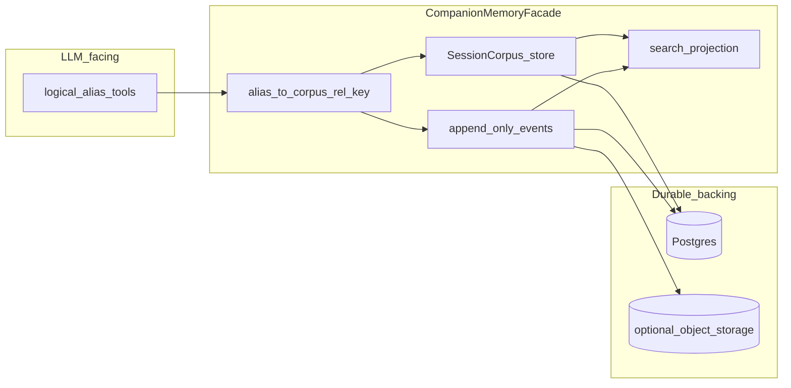

# MemoryStore 体系：合并后的目标设计

依据 [/.agents/maintenance/AGENTIC_KERNEL_ARCH_ENHANCEMENT.md](/.agents/maintenance/AGENTIC_KERNEL_ARCH_ENHANCEMENT.md)、[/docs/imate/MEMORY_STORE.md](/docs/imate/MEMORY_STORE.md)（含「期望设计方向」与 FR 向量 LTM）、持久化事实汇总 [/docs/FR_COMPANION_MEMORYSTORE_PERSISTENCE.md](/docs/FR_COMPANION_MEMORYSTORE_PERSISTENCE.md)，将 **MemoryStore** 定位为：**在稳定会话分区键之下，对外暴露稳定的逻辑键（含别名）式工具契约，对内按「事件流 / 文档快照 / 检索投影」分层实现，并与耐久契约一致地区分语料、耐久侧车与进程私有态**。向量长期记忆（**FR_AGENTIC_MEMORY_STORE**，kernel LTM）与此 **正交**：同属租户隔离语义，但 **不得混进 MemoryStore 的读写语义**。

## 现状与目标态（避免误读）

- 本文描述 **架构目标**；表结构、写入路径、乐观锁等与目标 **逐项对齐程度以代码为准**。
- **今日库表**：`companion_memory_document_versions` 等仍以 **`user_id` + `companion_id` + `chat_id` + `document_kind`（+ 可选日历键）** 为逻辑定位；文中 **`scope_id`** 指 **未来可引入的显式会话范围 UUID（独立列或视图）**，或与上述三元组 **等价的主键抽象**——**不是**断言仓库里已有名为 `scope_id` 的列。
- **`chat_id`（现行）**：即 PostgreSQL `chats.id`，创建会话时 `str(uuid.uuid4())`（见 `chat_service.create_chat` / `get_or_create_chat_by_agent`）；API 进入 companion 时传入 **`chat.id`**，与 **`CompanionScope(user_id, companion_id, chat_id)`** 同构。

---

## 1. 概念主轴（命名与职责）

| 范式术语（ARCH） | 在 MemoryStore 中的含义 |
|------------------|-------------------------|
| **SessionBinding** | 长期会话分区：与 **`CompanionScope(user_id, companion_id, chat_id)`** 同构；**权威语义以显式分区键为准**（演进上可归一为 **`scope_id` UUID**，或继续以三元组为复合主键）；**禁止用遗留拼接别名字符串反拆分区键充当权威**。 |
| **SessionCorpus** | 该 binding 下按 **`corpus_rel_key`** 寻址的版本化正文集合：`IDENTITY` / `SOUL` / `USER` / `MEMORY`、transcript、context、memory 分层下的条目等；实现上对应今日 **`MemoryStore` + `companion_memory_document_versions`**（及 `document_kind` 映射）；语义上 **`corpus_rel_key` 只属于逻辑命名空间**，不得等同于宿主或客户端上的任意挂载点。 |
| **DurableSidecar** | 重启后仍有意义的 **控制面/协同态**：节拍与压实状态、定时队列、image gate、生图索引元数据等（MEMORY_STORE 表格中已有）；**存放形态为 DB 行或结构化字段，契约写明「谁写、谁读、是否与默认 system 拼接」**（ARCH）。 |
| **ProcessPrivate** | 可丢弃或可重建：进程内 registry 缓存、短时锁、未持久化的合并队列视图等；**不依赖任何「根前缀」或宿主路径作为范式必备**（ARCH）。 |

**Kernel 消费方式**（ARCH）：编排层只消费当前 binding 下的 **corpus head** 与（只读）必要的 sidecar 视图；包内固定文案切片（如 **AXIOM**）与 SessionCorpus **并列**，避免「凡是长文本切片都属于可变语料」。

---

## 2. 内部分层存储模型（MEMORY_STORE + ARCH 耐久分级）

在 **单一 SessionBinding**（及演进中的 **`scope_id` 视图**）下，逻辑上拆为三层（可渐进迁移表结构，不必一次到位）：

1. **Append-only 事件层**  
   Transcript 记录、runtime events、工具轨迹等：**行级事件或对象存储 + 游标**，避免「每次小幅追加都对整条 transcript 序列做一次粗粒度整体重快照」；与 ARCH 的「语料默认版本化读 head」兼容——**事实流与文档 head 解耦**。  
   **阶段性现实**：物理上可 **继续以 Postgres 文档版本链 + 应用层仅追加语义** 承载 transcript，直至迁移为显式事件表或外部日志。

2. **可编辑文档层（SessionCorpus）**  
   `IDENTITY` / `USER` / `MEMORY` 等：**当前版本 + 可选历史**；目标写入契约含 **expected revision / 乐观锁** 或「DB 单行 current + 异步归档」，避免 lost update；revision 元数据可含 `turn_id`、模型 id、作者角色（MEMORY_STORE）。**是否与当前 ORM 写入路径完全一致以代码为准；此处为目标契约。**

3. **检索投影层**  
   从事件与文档派生 **chunk + embedding**（及全文通道），**外键锚定同一 `revision` 或 `event_id`**，供 RAG / 归档压缩；属于 **派生数据**，权威仍在事件与文档层（MEMORY_STORE）。  
   **与向量 LTM 区分**：本节 **MemoryStore 派生索引**（若建设）服务于 **本会话语料的检索与归档**；**FR_AGENTIC_MEMORY_STORE** 的 kernel LTM 为 **独立表与服务前缀**，**默认不等同**于本节投影；除非产品明确合并策略，否则 **存储与代码边界保持分离**。

**耐久契约**（ARCH）贯穿三层：每条数据须能回答「重启后是否必须接续」「以 DB 还是以进程重建为准」「是否进入默认 prompt」。Corpus head 与 sidecar 为 **Durable**；纯缓存与可重建队列为 **ProcessPrivate**。

---

## 3. 单一真理源与寻址

- **分区键先于存储形态**（ARCH）：一切读写先绑定 **SessionBinding**（及演进中的 **`scope_id`**），再谈对象存储或 PG 行。  
- **`corpus_rel_key` 与 `document_kind` 的稳定映射**落实到具体模块（与 [`/app/core/agentic_kernel/companion/memory_store_document_mapping.py`](/app/core/agentic_kernel/companion/memory_store_document_mapping.py) 一类代码同职责）；**禁止把「解析用的别名字符串」当作跨服务权威标识**。  
- **遗留配置项**若仍存在于部署：仅视为兼容层，范式陈述以 **Binding + Corpus** 为准（ARCH）。  
- **测试 / REPL / 本地 harness**：任何仅为便于跑通而存在的适配层 **不属于范式**；与 ARCH 中「adapter / harness」一致。

---

## 4. LLM-facing API 与服务内核

保留 MEMORY_STORE 图中的结构思想，用语与 ARCH 对齐：

- **Resolver**：工具传入 **逻辑别名** → 解析为 **`corpus_rel_key` + `document_kind`**；权威语义由 **SessionBinding（及演进中的 scope_id）+ 映射**决定，而非调用方字符串的自由拼接。  
- 工具命名可向 **`session_corpus_read` / `session_corpus_write`** 演进；若在过渡期保留旧 schema，须在描述中固定「语料逻辑键」语义（ARCH）。

---

## 5. 跨会话与多层人格（MEMORY_STORE）

- 区分 **user/companion 级人格层** 与 **chat 级对话层**；chat 层稳定事实经 **projection job** 合并到上层，**冲突策略显式化**（MEMORY_STORE）。  
- 在 ARCH 语言中：可表述为 **多个 SessionBinding** 或 **同一用户下多层 Corpus 命名空间**；检索与写入谓词必须始终带 **`user_id`（及既定的 agent/chat 维度）**，禁止仅靠相似度扫描（MEMORY_STORE FR 中的租户隔离原则同样适用于投影与索引）。

---

## 6. 与向量 LTM（kernel）的边界

来自 MEMORY_STORE 全文与 FR 段落，合并进「MemoryStore 体系」目标边界：

- **MemoryStore（SessionCorpus + 事件 + sidecar）**：**会话级语料与控制面**、markdown 记忆管线（`memory_pipeline`）的权威落点之一。  
- **AgenticKernelLtmStore（示例名）**：独立表与服务（**FR_AGENTIC_MEMORY_STORE**），**不**通过扩展 `SqlAlchemyMemoryRepository` 的职责塞进 MemoryStore；提示词组装在 **单一入口** 约定顺序（例如 axiom → SessionCorpus 文档块 → 向量 LTM → 工具策略 → transcript）（MEMORY_STORE）。  
- 二者 **租户隔离语义同构**（仿 `get_memory_store` 的 **按 scope 注册有状态运行时**），但 **代码与存储前缀强制分离**，且不触碰 legacy `memory` 表（MEMORY_STORE）。  
- **§2.3 检索投影层** 与 **kernel LTM**：默认 **两条线**；LTM 的混合检索与命名记忆 **不**自动等同于 SessionCorpus 的派生索引，除非产品定义统一检索网关。

---

## 7. 并发、观测与迁移话术

- **文档**：读-改-写走乐观锁或等价机制（**目标契约**）；**transcript**：底层呈 **仅追加记录序列**，避免用粗粒度整序列覆盖代替增量事实（MEMORY_STORE）。  
- **观测**：区分 corpus revision、event cursor、sidecar 版本，便于排障；目标状态是 **日志与指标按 Binding / corpus_rel_key / document_kind 标注**，而非 **仅凭**遗留别名。  
- **迁移**：对外保持 **稳定的逻辑别名契约**，底层替换为分段 repository，无需一次性推翻 API（MEMORY_STORE）。

---

## 8. 小结（一句话）

**MemoryStore 的目标形态**是：以 **SessionBinding**（演进上可对齐显式 **`scope_id`**，今日实现对应 **`CompanionScope` + `chats.id` 作为 `chat_id`**）为根，用 **SessionCorpus（corpus_rel_key + 版本 head）**、**append-only 事件流** 与 **检索投影** 实现分层存储；用 **DurableSidecar / ProcessPrivate** 严格划分耐久语义；对上保留 **经 Resolver 固定的逻辑键式工具契约**，对下以 **Postgres（及可选对象存储）** 为权威，并与 **kernel 向量 LTM（FR_AGENTIC_MEMORY_STORE）** 在存储与组装链路上 **硬边界分离**。
