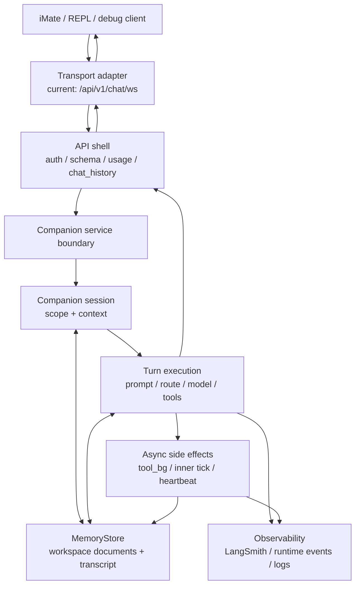

# Companion Harness: 架构说明

Companion Harness 是陪伴智能体的工作框架：以会话上下文、长期记忆、模型回合、工具副作用和多媒介传输为五个独立层次组织当前生产路径，并把现有 WebSocket 文本聊天实现视为一个传输适配器。Companion Harness 加上 LLMs 就形成了可运行的陪伴智能体。

## 目标态

Companion Harness 的目标是为用户提供长期关系中的“虚拟活人”体验。后端内核必须把以下能力视为一套连续系统：

- **关系连续性**：用户、companion、会话和跨会话记忆应有清晰层级；短期 transcript 不应替代长期关系记忆。
- **媒介无关回合**：文本、语音、图片、主动心跳、内在节拍和未来 phone / video / SMS 都应进入同一个 companion turn 语义，而不是各自绕开内核。
- **状态可追溯**：人设、用户理解、语义记忆、工具结果、运行时异常和用户可见历史必须能被审计，并能解释“为什么这一轮这样回应”。
- **低延迟与事实核验并存**：前台可快速回应，但后台工具和慢思考结果必须与 transcript、用户可见补帧、下一轮上下文保持一致。
- **传输可替换**：WebSocket 是当前 App 文本聊天传输，不是 companion 内核的边界。

## 非目标

- 本文不定义新的数据库 schema；MemoryStore 与向量 LTM 的目标设计见 `/docs/companion_harness/MEMORY_STORE.md`。
- 本文不复制 WebSocket payload 字段全集；协议真源见 `/app/schemas/chat_websocket.py` 与 `/app/api/v1/endpoints/chat.py`。
- 本文不把当前 `run_turn` 分支解释为最终编排抽象；通用 turn 合同与生产 companion 主链路仍未收敛。
- 本文不覆盖 Gemini Live audio 路径；它不是 `/api/v1/chat/ws` companion 文本通道。

## 不可变约束

| 约束 | 含义 |
| --- | --- |
| Companion 状态高于传输 | WebSocket、REPL、HTTP debug 或未来媒介只能适配 companion turn，不应拥有独立人格和记忆语义。 |
| 用户可见轨迹必须可追溯 | 用户消息、assistant 回复、后台可见补帧、主动心跳都必须能追到同一轮上下文和持久化状态。 |
| 长期关系记忆不能只绑定单个 chat | 当前生产 scope 是 `user_id + companion_id + chat_id`，但目标架构必须容纳 user-scoped / companion-scoped 关系记忆。 |
| 工具副作用不能绕过回合语义 | 后台工具、图像产物、状态修改和 inner tick 都必须进入可审计的 companion 状态，而不是仅作为 transport payload。 |
| Prompt 组装只允许单一主入口 | 工作区文档记忆、工具策略、experience profile、未来 LTM 切片必须在 companion 主 prompt 链路中统一排序。 |
| 失败应显性 | 记忆缺失、provider envelope 异常、tool background 失败、scope 冲突不应被静默吞掉；可降级但必须可观测。 |

## 当前生产架构

当前生产入口仍是 `/api/v1/chat/ws`。API 层负责鉴权、schema、用量、chat history 和 transport framing；companion 内核负责 session、MemoryStore、prompt、模型路由、工具链和 transcript。这个分层是现状，不是目标完成态：API 层仍承载过多 companion 相关协调逻辑。

## 核心层次

| 层次 | 当前职责 | 设计判断 |
| --- | --- | --- |
| Transport adapter | `/api/v1/chat/ws` 长连接、控制帧、业务帧 FIFO、REPL bridge。 | 应继续下沉为传输适配层；不能作为 companion 能力边界。 |
| API shell | 鉴权、版本门控、usage、chat_history、错误映射、客户端兼容。 | 可保留业务网关职责，但不应持有 turn 并发和后台补帧语义。 |
| Companion session | 按 `user_id + companion_id + chat_id` 绑定 `context.json`、工作区、transcript。 | 当前作用域偏会话；需要向 user / companion / chat 分层关系状态演进。 |
| Turn execution | 组装 prompt、解析 envelope、选择 route、调用模型、启动工具后台。 | 是内核主心跳；未来应收敛到单一编排合同，减少平行抽象。 |
| MemoryStore | 版本化文档、transcript、context、runtime events、状态 JSON。 | 当前是有效过渡层；长期应拆成事件流、可编辑文档和检索层。 |
| Async effects | tool background、proactive heartbeat、maintenance inner tick、图像等副作用。 | 必须与 turn / transcript / chat_history 保持一致，不应只表现为额外下行帧。 |
| Observability | `user_msg_uuid`、`inty_trace_id`、LangSmith、runtime events、log correlation。 | 是架构约束，不是排障附属品。 |

## 记忆模型

当前 companion 的“世界”主要由 MemoryStore 中的一组版本化文档、transcript 和工具副作用构成，还不是独立 world engine。文档记忆分三层：episodic、gist、semantic；详见 `/docs/companion_harness/MEMORY_PIPELINE.md`。

## 传输合同

当前 WebSocket 协议有两类下行：

- **业务事件**：assistant 回复、错误 envelope、可见 tool background 补帧，必须保持 per-connection FIFO。
- **连接控制**：`ping` / `pong`、client context ack、signed-on ack 等，只表达连接或时间上下文，不应进入 dialogue FIFO。

## 实现索引

| 主题 | 路径 |
| --- | --- |
| 生产 companion 内核 | `/app/core/companion_harness/companion/` |
| WebSocket API shell | `/app/api/v1/endpoints/chat.py` |
| WebSocket session pump | `/app/services/chat_websocket_session.py` |
| API 到 companion 的服务边界 | `/app/services/companion_chat_service.py` |
| WebSocket 协调状态 | `/app/core/companion_harness/companion/websocket_coordinator.py` |
| session 与 MemoryStore 绑定 | `/app/core/companion_harness/companion/manager.py` |
| 生产 turn 执行 | `/app/core/companion_harness/companion/turn.py` |
| route mode | `/app/core/companion_harness/companion/turn_routes.py` |
| prompt stack | `/app/core/companion_harness/companion/prompt_stack.py` |
| MemoryStore | `/app/core/companion_harness/memory/memory_store.py` |
| 记忆管线 | `/app/core/companion_harness/memory/memory_pipeline.py` |
| async tool background | `/app/core/companion_harness/tools/tool_background.py` |
| dual-LLM envelope | `/app/core/companion_harness/companion/significance_perception.py` |
| 通用 turn 合同 | `/app/core/companion_harness/contracts/turn.py` |
| WebSocket schema | `/app/schemas/chat_websocket.py` |
| MemoryStore 目标说明 | `/docs/companion_harness/MEMORY_STORE.md` |
| 记忆管线说明 | `/docs/companion_harness/MEMORY_PIPELINE.md` |
| 消息流术语（上行/下行/客户侧） | `/docs/companion_harness/GLOSSARY.md` |

## 维护规则

- 新增架构内容必须先说明跨模块设计含义，再给实现入口。
- 不在本文记录可直接从单个函数读出的细节。
- 若某段内容只为排障服务，应移入对应目录 `AGENTS.md` 或专题 runbook。
- 若目标态与现状不同，必须显式标注“当前事实”和“淘汰方向”。
