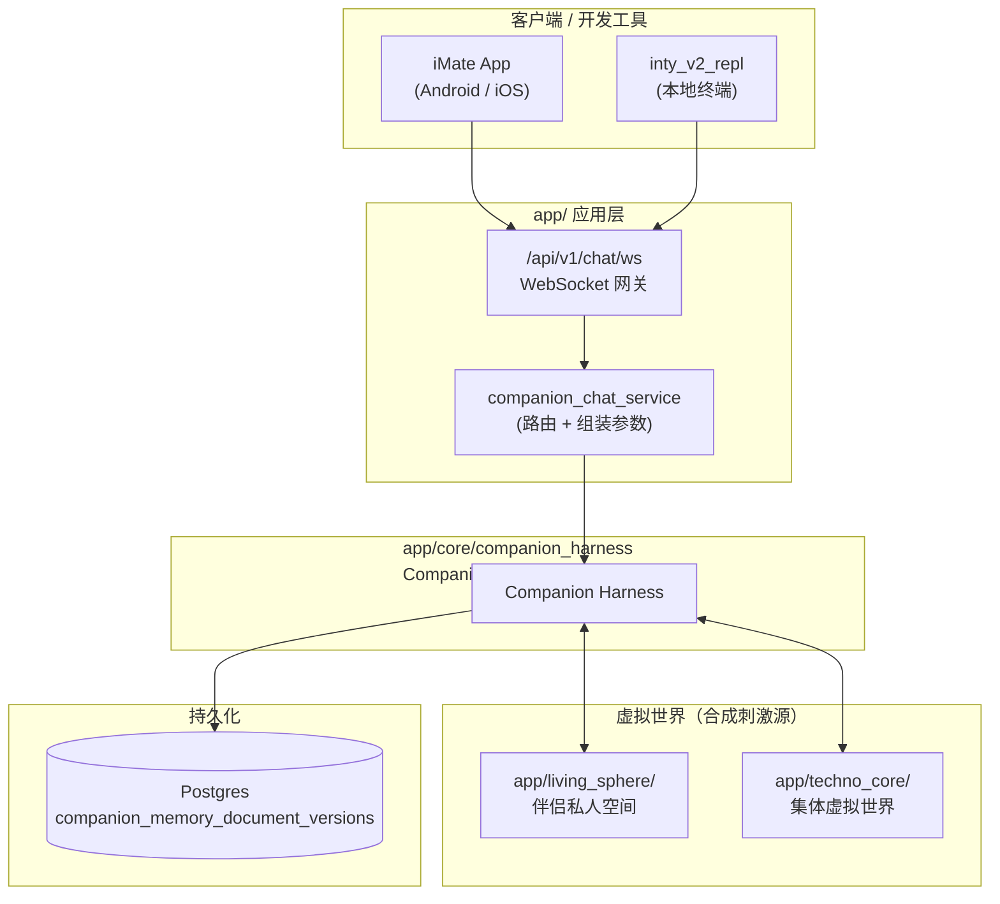
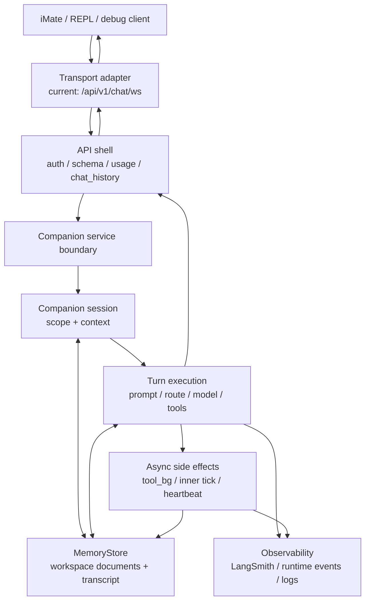

# Companion Harness: 架构说明

Companion Harness 是陪伴智能体的工作框架：以会话上下文、长期记忆、模型回合、工具副作用和多媒介传输为五个独立层次组织当前生产路径，并把现有 WebSocket 文本聊天实现视为一个传输适配器。Companion Harness 加上 LLMs 就形成了可运行的陪伴智能体。

## 重要下一步工作

### 将智能体运行环境收束成可移植可迁移的组件

- [ ] 用于支持 autonomous companion，可以在用户不在线时持续运行，同时可以暂停和重启（如 token 预算不足时）

### 推理编排显式化（参考 [Pie](https://pie-project.org/) 研究）

- [ ] 把各 `CompanionTurnTrack` 收成可组合的 **turn program spec**（允许的 LLM 调用序列、可写 memory 范围、与 `AwakeTurn` / `DreamingBatch` 相位对齐），减少 `run_turn` / `prompt_stack` 隐式分支
- [ ] 在 `prompt_stack` 层区分 **stable prefix**（SOUL / IDENTITY / STYLE / 长期 MemoryDoc）与 **volatile suffix**（近期 transcript / tool delta），为 provider prefix caching 与远期 KV 复用预留 seam
- [ ] 为 `tool_background` 引入 per-session **scratch working memory**（MemoryStore 文档或 JSONL delta），避免每轮 tool loop 重读整段 transcript

## 目标态

Companion Harness 的目标是为用户提供长期关系中的“虚拟活人”体验。后端内核必须把以下能力视为一套连续系统：

- **关系连续性**：用户、companion、会话和跨会话记忆应有清晰层级；短期 transcript 不应替代长期关系记忆。
- **媒介无关回合**：文本、语音、图片、主动心跳、内在节拍和未来 phone / video / SMS 都应进入同一个 companion turn 语义，而不是各自绕开内核。
- **状态可追溯**：人设、用户理解、语义记忆、工具结果、运行时异常和用户可见历史必须能被审计，并能解释“为什么这一轮这样回应”。
- **低延迟与事实核验并存**：前台可快速回应，但后台工具和慢思考结果必须与 transcript、用户可见补帧、下一轮上下文保持一致。
- **传输可替换**：WebSocket 是当前 App 文本聊天传输，不是 companion 内核的边界。

## 非目标

- 本文不定义新的数据库 schema；MemoryStore 与向量 LTM 的目标设计见 `/docs/companion_harness/MEMORY_STORE.md`。
- 本文不复制 WebSocket payload 字段全集；协议真源见 `/app/schemas/chat_websocket.py` 与 `/app/api/v1/endpoints/chat.py`。
- 本文不把当前 `run_turn` 分支解释为最终编排抽象；通用 turn 合同与生产 companion 主链路仍未收敛。
- 本文不覆盖 Gemini Live audio 路径；它不是 `/api/v1/chat/ws` companion 文本通道。

## 不可变约束

| 约束 | 含义 |
| --- | --- |
| Companion 状态高于传输 | WebSocket、REPL、HTTP debug 或未来媒介只能适配 companion turn，不应拥有独立人格和记忆语义。 |
| 用户可见轨迹必须可追溯 | 用户消息、assistant 回复、后台可见补帧、主动心跳都必须能追到同一轮上下文和持久化状态。 |
| 长期关系记忆不能只绑定单个 chat | 当前生产 scope 是 `user_id + companion_id + chat_id`，但目标架构必须容纳 user-scoped / companion-scoped 关系记忆。 |
| 工具副作用不能绕过回合语义 | 后台工具、图像产物、状态修改和 inner tick 都必须进入可审计的 companion 状态，而不是仅作为 transport payload。 |
| Prompt 组装只允许单一主入口 | 工作区文档记忆、工具策略、experience profile、未来 LTM 切片必须在 companion 主 prompt 链路中统一排序。 |
| 失败应显性 | 记忆缺失、provider envelope 异常、tool background 失败、scope 冲突不应被静默吞掉；可降级但必须可观测。 |

## 当前生产架构

下图把 `companion_harness` 收成单盒；内核模块（Manager、Turn、MemoryStore、Tools、LLM）在另图展开。

### 回合运行时（Harness 内）

当前生产入口仍是 `/api/v1/chat/ws`。API 层负责鉴权、schema、用量、chat history 和 transport framing；companion 内核负责 session、MemoryStore、prompt、模型路由、工具链和 transcript。这个分层是现状，不是目标完成态：API 层仍承载过多 companion 相关协调逻辑。

## 记忆模型

当前 companion 的「世界」主要由 MemoryStore 中的一组版本化 markdown 文档、transcript 和工具副作用构成，
**还不是独立 world engine**（目标态见 [FR_WORLD_ENGINE.md](./FR_WORLD_ENGINE.md)）。

记忆分 episodic / gist / semantic；慢路径巩固见 [`dreaming_consolidation`](../../app/core/companion_harness/memory/dreaming_consolidation.py) 与 [MEMORY_STORE.md](./MEMORY_STORE.md)。

## Websocket 上下行传输

当前 WebSocket 协议有两类下行：

- **业务事件**：assistant 回复、错误 envelope、可见 tool background 补帧，必须保持 per-connection FIFO。
- **连接控制**：`ping` / `pong`、client context ack、signed-on ack 等，只表达连接或时间上下文，不应进入 dialogue FIFO。
- **数据类型**：数据类型定义为 Pydantic model 位于 `app/schemas/chat_websocket.py`

### 连接生命周期

生产文本聊天把 WebSocket 视为一条可断可换的传输通道，而不是 companion scope 本身。客户端、REPL 和排障工具应按同一生命周期理解它：

1. **建立连接**：握手携带鉴权；调试与日志排障可携带稳定的传输连接 id。若本次连接要绑定某个 companion，客户端在连接后发送本地时间上下文，再发送 `user_signed_on`。这个信令会刷新 inner-tick / scheduled reminder 的投递坐标，并可能排入一条隐式问候业务事件。
2. **发送用户轮**：每个用户轮都必须带独立的业务消息 UUID。服务端按连接序列化 companion turn；assistant 主回复、业务错误和可见后台工具补帧走业务 FIFO，下游 UI 不应把控制 ack 当成聊天消息展示。
3. **非主动断线后重连**：客户端若观察到 socket 掉线，下一次成功连接后先发送 `ws_conn_dropped`，再恢复 `user_signed_on`。掉线声明只记录关系时间线和排障事实，不代表用户登出，也不清空聊天历史。
4. **主动退出或登出**：客户端应在关闭前发送 `user_signed_out` 并等待 ack。ack 只表示服务端接受了 teardown 请求；之后服务端会取消本连接尚未完成的 companion turn，并收束当前聊天 scope、记忆文档和聊天历史。客户端不要把普通断线当作登出，也不要在未收到新状态前假设旧历史已完成清理。
5. **服务端关闭或连接结束**：仍在运行的 companion turn 必须被取消，避免用户离开后继续产生孤儿回复、后台补帧或记忆写入。

## 3.2 单一核心循环（Runtime Loop）

`Inbound queue -> Inbound Event -> Routing/Orchestration -> Memory Extract/Update/Prompt-Assembling -> LLM-calls -> Output Queue -> Dispatch`

## 4. 代码层技术选型（Tech Stack）

- Python 3.12（与仓库环境一致）。

数据建模与契约：Pydantic v2，用途：

- 统一定义跨模块输入/输出契约（event/memory/plan）。
- 做边界校验、类型约束、序列化与反序列化。
- 防止 dataclass + dict 组合导致的字段漂移。

具体使用：

- Domain DTO 与 Adapter DTO 均使用 Pydantic BaseModel。
- 入站外部 payload 先过校验再进入业务层。

## 4.3 CLI：Cyclopts

用途：

- 实现统一命令入口：`serve inbound` / `serve scheduler` / `admin replay`。
- 替代散落的 argparse 子脚本。

原则：

- 明确 `main.py` 入口，不使用 `__main__.py`。

## LLM client：封装 OpenAI-SDK（OpenAI-compatible）

用途：

- 统一模型调用层（支持 OpenAI 兼容端点，如 OpenRouter）。
- 支持 chat completion + tool calling。
- 集成 LangSmith LLM tracing

原则：

- 在 `ModelGateway` 统一封装 SDK 调用、超时、重试、用量日志。
- 上层业务不直接调用 SDK 客户端。

## 4.5 配置管理：python-dotenv (repl) + config-files

用途：

- 本地/实验环境使用 dotenv 加载密钥。
- 服务级配置通过 config.yaml+[config.py](/app/utils/config.py)。

原则：

- 配置读取集中在 `config.yaml`，业务代码不直接 `os.environ[...]`。
- 缺失关键配置时启动即失败（fail fast）。

## 4.6 持久化

- PostgreSQL + SQLAlchemy（生产化、并发与查询能力）。
- 迁移：Alembic 管理 schema 版本。

## 4.8 可观测性与日志

- LangSmith：通过 LLM client 接入
- REPL: metadata (for debugging) & content messages
- 标准库 logging（结构化 key-value 风格）。
- 指标维度：inbound latency、LLM latency、dispatch latency、retry count、drop count。
- 错误分级：transient vs terminal。

## 推理编排与外部参考（Pie）

[Pie](https://pie-project.org/)（[arXiv:2510.24051](https://arxiv.org/html/2510.24051v1)）在 **inference 层**用 inferlet 编排 KV cache、decode 与 tool I/O；Inty 在 **应用层**用 `CompanionTurnTrack` + `TurnRouteMode` + `run_turn` 编排远程 API。二者「Serve programs, not prompts」同构，**当前不部署 Pie**。

- **已对齐**：多 track、`ASYNC_FOREGROUND_CHAT_BACKGROUND_TOOL` 前后台分叉、`AwakeTurn` / `DreamingBatch` 相位分离。
- **近期**（见上文 checklist）：turn program spec、stable/volatile prompt 分层、tool scratch memory。
- **远期**（自托管时）：prefix KV 复用、引擎内 tool loop（免每轮 re-prefill）。
- **非目标**：Pie server、Wasm inferlet、ToT/MCTS、KV rewind。

## See also

- [Pie](https://pie-project.org/) · [arXiv:2510.24051](https://arxiv.org/html/2510.24051v1) — 可编程 LLM serving 参考
- [SPECULATIVE_IDEAS.md](./SPECULATIVE_IDEAS.md) — 其他灵感条目
- [FR_WORLD_ENGINE.md](./FR_WORLD_ENGINE.md) — 多 agent 虚拟世界、共享 AgentHarness、sub-agent（firefly）目标态与两期交付
- [REFACTOR_PLAN.md](./REFACTOR_PLAN.md) — 包拆分与 `runtime/` / `environment/` 目标结构
- [AUTONOMY.md](./AUTONOMY.md) · [PRODUCT_DESIGN.md](./PRODUCT_DESIGN.md)
- [GLOSSARY.md](./GLOSSARY.md) · [MEMORY_STORE.md](./MEMORY_STORE.md)
