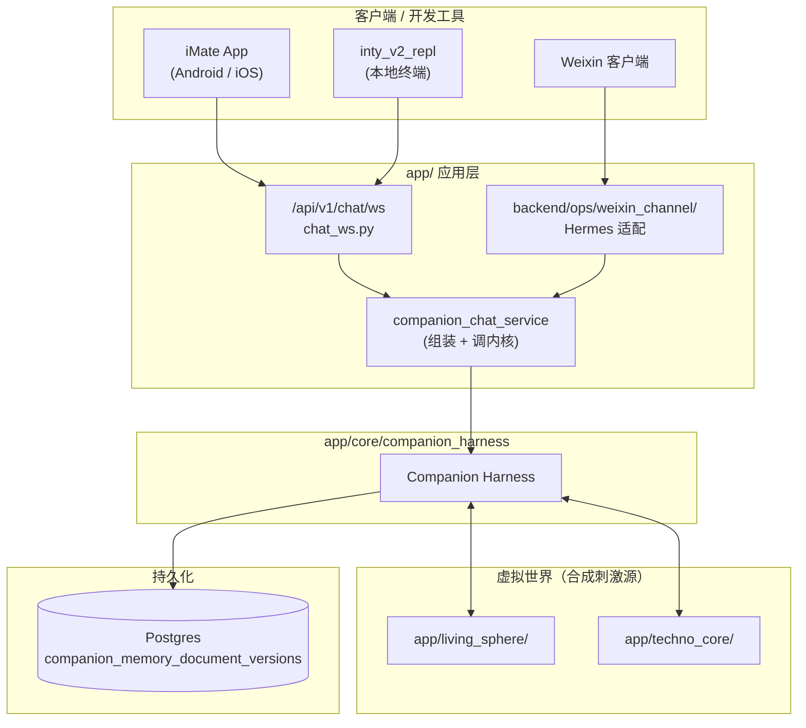
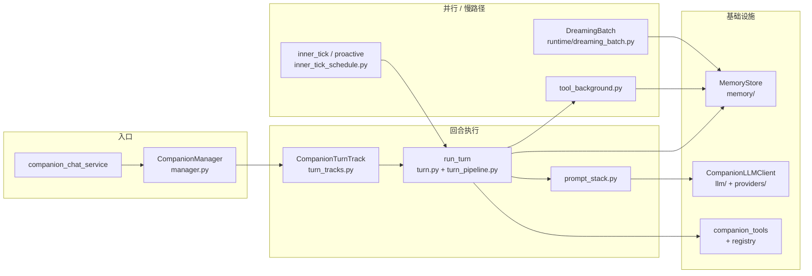
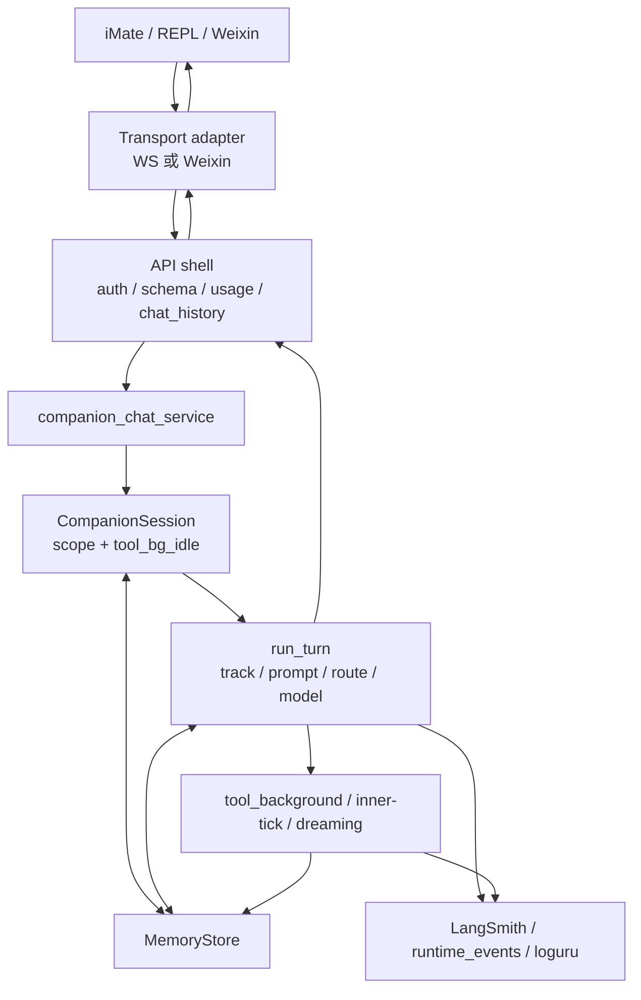

# Companion Harness: 架构说明

Companion Harness 是陪伴智能体的工作框架：以会话上下文、长期记忆、模型回合、工具副作用和多媒介传输为五个独立层次组织 companion 主链路，并把 WebSocket / Weixin 等实现视为传输适配器。Companion Harness 加上 LLMs 形成可运行的陪伴智能体。

**实现状态（2026-06）**：`companion_harness` 在代码中自标为 **PROTOTYPE**（见 `app/core/companion_harness/AGENTS.md`），聚焦文本聊天与单 presence；下文「当前路径」指已接入 `/api/v1/chat/ws` 与 Ops Weixin 的真实调用链，「目标态 / 差距」见文末对照表。

## 重要下一步工作

### 将智能体运行环境收束成可移植可迁移的组件

- [ ] 用于支持 autonomous companion，可以在用户不在线时持续运行，同时可以暂停和重启（如 token 预算不足时）

### 推理编排显式化（参考 [Pie](https://pie-project.org/) 研究）

- [ ] 把各 `CompanionTurnTrack` 收成可组合的 **turn program spec**（允许的 LLM 调用序列、可写 memory 范围、与 `AwakeTurn` / `DreamingBatch` 相位对齐），减少 `run_turn` / `prompt_stack` 隐式分支
- [ ] 在 `prompt_stack` 层区分 **stable prefix**（SOUL / IDENTITY / STYLE / 长期 MemoryDoc）与 **volatile suffix**（近期 transcript / tool delta），为 provider prefix caching 与远期 KV 复用预留 seam
- [ ] 为 `tool_background` 引入 per-session **scratch working memory**（MemoryStore 文档或 JSONL delta），避免每轮 tool loop 重读整段 transcript

### 更稳固健壮的异步多层级任务执行系统

- [ ] agent's sub-tasks, fan-in & fan-out, async & parallel execution
- [ ] agent's sub-agents, fan-in & fan-out, etc.

## 目标态

Companion Harness 的目标是为用户提供长期关系中的“虚拟活人”体验。后端内核必须把以下能力视为一套连续系统：

- **关系连续性**：用户、companion、会话和跨会话记忆应有清晰层级；短期 transcript 不应替代长期关系记忆。
- **媒介无关回合**：文本、语音、图片、主动心跳、内在节拍和未来 phone / video / SMS 都应进入同一个 companion turn 语义，而不是各自绕开内核。
- **状态可追溯**：人设、用户理解、语义记忆、工具结果、运行时异常和用户可见历史必须能被审计，并能解释“为什么这一轮这样回应”。
- **低延迟与事实核验并存**：前台可快速回应，但后台工具和慢思考结果必须与 transcript、用户可见补帧、下一轮上下文保持一致。
- **传输可替换**：WebSocket 是当前 App 文本聊天传输，不是 companion 内核的边界。

## 非目标

- 本文不定义新的数据库 schema；MemoryStore 与向量 LTM 的目标设计见 `/docs/companion_harness/MEMORY_STORE.md`。
- 本文不复制 WebSocket payload 字段全集；协议真源见 `/app/schemas/chat_websocket.py` 与 `/app/api/v1/endpoints/chat_ws.py`（REST 维护态 HTTP chat 在 `chat.py`，非 companion 主路径）。
- 本文不把当前 `run_turn` 分支解释为最终编排抽象；`contracts/turn.py` 中的通用 `TurnInput` / `TurnOutput` 尚未接入生产主链路。
- 本文不覆盖 Gemini Live audio 路径；它不是 `/api/v1/chat/ws` companion 文本通道。

## 不可变约束

| 约束 | 含义 |
| --- | --- |
| Companion 状态高于传输 | WebSocket、REPL、Weixin、HTTP debug 或未来媒介只能适配 companion turn，不应拥有独立人格和记忆语义。 |
| 用户可见轨迹必须可追溯 | 用户消息、assistant 回复、后台可见补帧、主动心跳都必须能追到同一轮上下文和持久化状态。 |
| 长期关系记忆不能只绑定单个 chat | 当前 scope 是 `user_id + companion_id + chat_id`，但目标架构必须容纳 user-scoped / companion-scoped 关系记忆。 |
| 工具副作用不能绕过回合语义 | 后台工具、图像产物、状态修改和 inner tick 都必须进入可审计的 companion 状态，而不是仅作为 transport payload。 |
| Prompt 组装只允许单一主入口 | 工作区文档记忆、工具策略、experience profile、未来 LTM 切片必须在 companion 主 prompt 链路中统一排序。 |
| 失败应显性 | 记忆缺失、provider envelope 异常、tool background 失败、scope 冲突不应被静默吞掉；可降级但必须可观测。 |

## 五层模型与代码映射

开篇五层是概念切分，不是五个独立进程；当前实现仍集中在 `companion/` 单包内，由 `CompanionManager` + `run_turn` 串接。

| 层次 | 职责 | 当前实现锚点 |
| --- | --- | --- |
| 会话上下文 | scope、`context.json`、experience profile、transcript 窗口 | `companion/scope.py`、`companion/models.py`（`ContextMeta`）、`memory/transcript_compaction.py` |
| 长期记忆 | MemoryDoc、daily gist、semantic、LivingSphere 快照 | `memory/memory_store.py`、`memory/dreaming_consolidation.py`、`runtime/dreaming_batch.py` |
| 模型回合 | track 路由、prompt、LLM、双模型 envelope | `companion/turn.py`、`companion/prompt_stack.py`、`companion/turn_routes.py`、`llm/chat_completions.py` |
| 工具副作用 | 前台/后台工具、图像索引、增量 MemoryDoc 写 | `tools/tool_background.py`、`tools/companion_tool_runtime.py` |
| 多媒介传输 | WS / Weixin framing、FIFO、presence 锁 | `app/api/v1/endpoints/chat_ws.py`、`companion/websocket_coordinator.py`、`backend/ops/weixin_channel/`、`companion/runtime_channel.py` |

## 当前路径架构

下图把 `companion_harness` 收成单盒；Harness 内模块展开见下一节。

### Harness 内核模块（实现展开）

### 回合运行时（端到端）

当前主入口是 `/api/v1/chat/ws` 与 Ops Weixin（均经 `companion_chat_service` 进入 `CompanionManager`）。API 层负责鉴权、schema、用量、chat history 和 transport framing；内核负责 session、MemoryStore、prompt、模型路由、工具链和 transcript。**现状**：`companion_chat_service` 与 `chat_ws.py` 仍承载较多编排（bootstrap interim、inner-tick 投递、chat history 物化），尚未收束到独立的 inbound runtime。

**并发（prototype）**：每个 paired user 假定 **单 presence**（单 tab / 单 wire）；`session.Coordinator.turn_lock` 串行 user chat、inner-tick 与 dreaming（见 `runtime/__init__.py`）。

## 记忆模型

当前 companion 的「世界」主要由 MemoryStore 中的一组版本化 markdown 文档、transcript 和工具副作用构成，**还不是独立 world engine**（目标态见 [FR_WORLD_ENGINE.md](./FR_WORLD_ENGINE.md)）。

| 心理学术语 | 存储形态 | 巩固路径 |
| --- | --- | --- |
| episodic | `transcript.jsonl`（用户可见对白轨） | AwakeTurn 追加；压实见 `transcript_compaction.py` |
| gist | `memory/daily/{date}.md` | DreamingBatch → `dreaming_consolidation.py` |
| semantic | `MEMORY.md`、`USER.md` 等 MemoryDoc | AwakeTurn 工具增量写 + DreamingBatch 批处理 |

慢路径与 invariant 详见 [`dreaming_consolidation`](../../app/core/companion_harness/memory/dreaming_consolidation.py)、[`turn_invariants.py`](../../app/core/companion_harness/companion/turn_invariants.py) 与 [MEMORY_STORE.md](./MEMORY_STORE.md)。

**记忆阶段不变量（已实现 + CI）**：

- **AwakeTurn**：所有 `CompanionTurnTrack` → `run_turn` + 可选 `tool_background`；仅允许 transcript JSONL 追加与工具侧增量写，**禁止** MemoryDoc 批处理策展。
- **DreamingBatch**：`run_dreaming_batch_if_due` → 仅经 `consolidate_memory_during_dreaming` 做 MemoryDoc 批处理。

## Turn 轨道（当前生产）

`CompanionTurnTrack`（`companion/models.py`）与 `run_turn` 一一对应；inner-tick 活动由 `InnerTickActivity` 区分。

| Track | 触发 | 用户可见 |
| --- | --- | --- |
| `USER_CHAT` / `USER_CHAT_BOOTSTRAP` | 用户消息 | 是 |
| `IMPLICIT_SIGN_ON_GREETING` | `user_signed_on` 隐式问候 | 是 |
| `INNER_TICK_PROACTIVE_CHAT` | idle poll | 是（主动心跳） |
| `INNER_TICK_SCHEDULED` | 定时队列 | 视配置 |
| `INNER_TICK_MAINTENANCE` | idle poll | 否（维护型；目标态收窄为 Autonomy，见 `AUTONOMY.md`） |
| Dreaming（非 turn） | idle poll | 否（`InnerTickActivity.DREAMING`） |

工具开启时，in-turn 路由固定为 `ASYNC_FOREGROUND_CHAT_BACKGROUND_TOOL`：前台 chat envelope 先返回用户可见文本，`tool_background` 在独立线程继续工具轮（`turn_routes.py`）。

## Websocket 上下行传输

当前 WebSocket 协议有两类下行：

- **业务事件**：assistant 回复、错误 envelope、可见 tool background 补帧，必须保持 per-connection FIFO。
- **连接控制**：`ping` / `pong`、client context ack、signed-on ack 等，只表达连接或时间上下文，不应进入 dialogue FIFO。
- **数据类型**：Pydantic model 位于 `app/schemas/chat_websocket.py`。

### 连接生命周期

生产文本聊天把 WebSocket 视为一条可断可换的传输通道，而不是 companion scope 本身：

1. **建立连接**：握手携带鉴权；若绑定 companion，客户端发送本地时间上下文后发送 `user_signed_on`（刷新 inner-tick 坐标，可能触发隐式问候）。
2. **发送用户轮**：每轮独立 `user_msg_uuid`；companion turn 在 presence `turn_lock` 上串行；业务 FIFO 承载 assistant / 错误 / 可见 tool_bg 补帧。
3. **非主动断线后重连**：先 `ws_conn_dropped`，再 `user_signed_on`；不视为登出，不清历史。
4. **主动退出**：`user_signed_out` + ack；服务端取消本连接未完成 turn，并收束 scope（实现见 `chat_ws.py`）。
5. **服务端关闭或连接结束（当前实现）**：`ChatWsInflightTurnTracker.cancel_all()` **取消**仍在运行的 companion turn，避免孤儿回复与写入。

> **设计与代码张力 (#3256)**：`websocket_coordinator.py` 标注目标态为断线后 **persist-first、可重放投递**，而非取消 in-flight turn。上文第 5 条描述的是 **当前** `chat_ws.py` 行为；生命周期章节在 #3256 落地前应以代码为准。

Weixin 路径不经 `/api/v1/chat/ws`，由 `backend/ops/weixin_channel/` 适配为同一 `companion_chat_service` / `run_user_chat` 语义，`TurnRuntimeContext.channel = WECHAT_WEIXIN` 影响 output-format prompt 切片。

## Runtime Loop

### 目标态（尚未落地为独立 inbound runtime）

`Inbound queue → Inbound Event → Routing/Orchestration → Memory Extract/Update/Prompt-Assembling → LLM-calls → Output Queue → Dispatch`

### 当前实现（同步调用链）

没有独立的 `Inbound queue` / `Output queue` 进程或包；实际是 **transport 事件 → `companion_chat_service` → `CompanionManager.run_*` → `run_turn`**，副作用通过 `tool_background` 线程、`inner_tick` 轮询与 `runtime/dreaming_batch.py` 挂接。

| 目标环节 | 当前锚点 |
| --- | --- |
| Routing / Orchestration | `companion_chat_service`、`turn_tracks.py`、`InnerTickActivity` 轮询 |
| Prompt assembling | `prompt_stack.py`（主入口）；`system_messages.py` 按 track 分支 |
| LLM calls | `CompanionLLMClient` → `create_chat_completion_sync`（`llm/chat_completions.py`） |
| Dispatch | `chat_ws.py` outbound queue；Weixin `transport.py` |
| 通用 turn 合同 | `contracts/turn.py`（**未接线**） |

## 代码层技术选型（Tech Stack）

### 语言与建模

- Python 3.12（与仓库环境一致）。
- **Pydantic v2**：跨边界 DTO（`models.py`、`CompanionConfig`、WS schema）；进程内不可变值对象用 `@dataclass(frozen=True)`（如 `TurnRuntimeContext`、`CompanionTurnDeps`）。
- **差距**：文档曾写「Domain / Adapter DTO 均用 BaseModel」——内核 prompt 消息列表仍为 `list[dict[str, Any]]`（OpenAI chat shape），尚未统一为 `MessageSnapshot`。

### CLI（目标 vs 现状）

| 项目 | 状态 |
| --- | --- |
| Cyclopts 统一入口 `serve inbound` / `serve scheduler` / `admin replay` | **未实现**；Cyclopts 仅用于 `tools/scripts/` 等零散脚本 |
| `companion_harness` 包级 `main.py` | **不存在** |

### LLM client（OpenAI-compatible）

- **现状**：`CompanionLLMClient`（`companion/llm_client.py`）+ `llm/chat_completions.py` + `providers/openai_compatible_clients.py`；可注入 `ChatCompletionsSyncPort`（`llm/ports.py`）。
- **差距**：文档旧称 `ModelGateway`——代码中 **无** `ModelGateway` 类型；超时/重试/用量分散在 client 与 chat_completions 层。
- LangSmith：经 LLM 调用 `langsmith_extra` 与 companion parent run 策略（`langsmith_parent_policy.py`）接入。

### 配置

- 服务级：`config.yaml` + `app/utils/config.py` / `app/core/config.py`。
- REPL / 本地：`python-dotenv`、`.env`。
- **差距**：`CompanionLLMConfig.from_openrouter_env()` 仍从 `os.environ` 读取 API key（凭据加载例外）；业务逻辑配置应以 yaml 为准。

### 持久化

- PostgreSQL + SQLAlchemy；MemoryStore → `companion_memory_document_versions`。
- Alembic 迁移：`backend/alembic/`。
- 生产路径 **必须** 非空 DSN（`memory_registry`）；`memory/file_store.py` 仅为 Path 工具，不是并列存储后端。

### 可观测性

- LangSmith（LLM + companion parent run）、`companion/runtime_events.py`、loguru 日志。
- REPL metadata 行（`langsmith_*_url` 等）用于本地排障。
- **差距**：文档列举的 inbound/dispatch latency、drop count 等 **指标维度尚未作为统一 metrics 导出**；当前以日志与 LangSmith 为主。

### 包结构（目标 vs 现状）

| 目标（见 [REFACTORING_PLAN.md](./REFACTORING_PLAN.md)） | 现状 |
| --- | --- |
| `runtime/` 收束 turn 编排 | 部分：`runtime/dreaming_batch.py`；主 orchestration 仍在 `companion/turn.py` |
| `environment/` 世界刺激 | **不存在**；LivingSphere / TechnoCore 在 `app/living_sphere`、`app/techno_core` |

## 设计与实现差距（审查清单）

以下为 2026-06 对照 `app/core/companion_harness/` 的系统性差距；修复优先级由人类队友决定，本文只记录事实。

| # | 设计 / 文档主张 | 当前实现 | 严重度 |
| --- | --- | --- | --- |
| 1 | 统一 inbound runtime + 队列化循环 | 直接 service 调用 `run_turn`；无 inbound/output queue | 架构 |
| 2 | `ModelGateway` 统一 SDK | `CompanionLLMClient` + `chat_completions` 分散 | 命名/分层 |
| 3 | Cyclopts harness CLI | 未实现 | 工具链 |
| 4 | `contracts/turn.py` 通用 turn 合同 | 未被 `run_turn` 使用；生产用 `CompanionTurnResult` | 契约 |
| 5 | `environment/` 包 | 未创建 | 目录 |
| 6 | 文档「生产架构」 vs AGENTS「PROTOTYPE」 | 并存：路径已接 App/Weixin，但明确非 production-grade | 术语 |
| 7 | 单 prompt 主入口 | `prompt_stack.py` 为主；`tool_background` 内 `refresh_companion_turn_prompt_stack` 为合法中途刷新 | 一致 |
| 8 | 媒介无关 user turn | `user_text: str`；`CompanionUserTurnInput` 多模态 **TODO**（Phase 1b/1c） | 功能 |
| 9 | user-scoped / companion-scoped 记忆 | 仅 `user_id+companion_id+chat_id` scope | 目标态 |
| 10 | 断线 persist-first 投递 | 当前 `cancel_all()` 取消 in-flight（#3256） | 行为 |
| 11 | autonomous / 可暂停 runtime | 无离线持续运行；inner-tick 依赖 presence 连接 | 目标态 |
| 12 | sub-task / sub-agent fan-out | 未实现 | 目标态 |
| 13 | 结构化 metrics（latency / drop） | 未统一导出 | 可观测性 |
| 14 | Maintenance inner-tick 语义 | 仍含 MemoryDoc 整理职责；计划收窄为 Autonomy + dreaming 分工 | 演进中 |
| 15 | `REFACTOR_PLAN.md` 链接 | 仓库文件名为 `REFACTORING_PLAN.md` | 文档 |

**已对齐要点（避免误判为差距）**：

- Prompt 主入口：`prompt_stack.companion_turn_tools_and_system_messages` / `refresh_companion_turn_prompt_stack`。
- AwakeTurn / DreamingBatch 分离：`turn_invariants.py` + CI 脚本强制。
- 双 LLM chat branch + 后台工具：`turn_routes.ASYNC_FOREGROUND_CHAT_BACKGROUND_TOOL`。
- Weixin 与 App 共用内核，channel 由 `TurnRuntimeContext` 区分。

## 推理编排与外部参考（Pie）

[Pie](https://pie-project.org/)（[arXiv:2510.24051](https://arxiv.org/html/2510.24051v1)）在 **inference 层**用 inferlet 编排 KV cache、decode 与 tool I/O；Inty 在 **应用层**用 `CompanionTurnTrack` + `TurnRouteMode` + `run_turn` 编排远程 API。二者「Serve programs, not prompts」同构，**当前不部署 Pie**。

- **已对齐**：多 track、`ASYNC_FOREGROUND_CHAT_BACKGROUND_TOOL` 前后台分叉、`AwakeTurn` / `DreamingBatch` 相位分离。
- **近期**（见上文 checklist）：turn program spec、stable/volatile prompt 分层、tool scratch memory。
- **远期**（自托管时）：prefix KV 复用、引擎内 tool loop（免每轮 re-prefill）。
- **非目标**：Pie server、Wasm inferlet、ToT/MCTS、KV rewind。

## See also

- [Pie](https://pie-project.org/) · [arXiv:2510.24051](https://arxiv.org/html/2510.24051v1) — 可编程 LLM serving 参考
- [SPECULATIVE_IDEAS.md](./SPECULATIVE_IDEAS.md) — 其他灵感条目
- [FR_WORLD_ENGINE.md](./FR_WORLD_ENGINE.md) — 多 agent 虚拟世界、共享 AgentHarness、sub-agent（firefly）目标态与两期交付
- [REFACTORING_PLAN.md](./REFACTORING_PLAN.md) — 包拆分与 `runtime/` / `environment/` 目标结构
- [AUTONOMY.md](./AUTONOMY.md) · [PRODUCT_DESIGN.md](./PRODUCT_DESIGN.md)
- [GLOSSARY.md](./GLOSSARY.md) · [MEMORY_STORE.md](./MEMORY_STORE.md)
