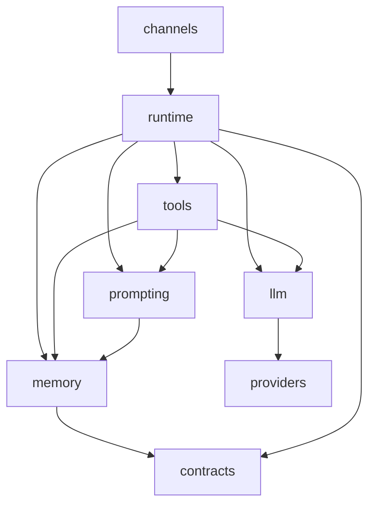

# Agentic Companion：设计 vs 实现差距审查

> **Generated entirely by Cursor Cloud Agent** — 2026-06-10。方法：`review-ideal-architecture`（计划 [REFACTOR_PLAN.md](./REFACTOR_PLAN.md) + 快照 `app/core/companion_harness/` + 域文档）。供人类队友评审；非实现工单。

## 1. Executive summary

- **迁移姿态**：Phase 3.1（`memory/`）**partial**；`runtime/` 仅 `dreaming_batch.py`；`companion/` 仍承载约 **46%**（39/84）Python 模块，是事实 monolith。
- **最大差距**：ARCH 五层（session / turn / memory / tools / transport）在文档已分层，但 **turn 编排、prompt、LLM、inner-tick、WS coordinator 仍堆在 `companion/`**；且 **harness ↔ `app.services` / `app.api` 双向耦合** 破坏「Companion 状态高于传输」约束。
- **建议下一 slice**：Phase 3.1 收尾 — 将 `CompanionScope`、`ChatMessage`、`utc` 迁至 `contracts/` 或 `memory/`，切断 `memory → companion` 四条 import（见 §7）。

## 2. Scope & non-goals

与 [ARCH.md](./ARCH.md) 一致：

- 目标：长期关系连续性、媒介无关 turn、状态可追溯、传输可替换
- 非目标：新 DB schema 全文、WS payload 全集、Gemini Live、生产级安全/商业化
- 原型态：单 presence、无 backward compatibility、无持久实例数据有效性顾虑（[companion_harness/AGENTS.md](../../app/core/companion_harness/AGENTS.md)）

## 3. Target package tree（理想态）

见 [REFACTOR_PLAN.md](./REFACTOR_PLAN.md)。各叶包职责摘要：

| 包 | 职责 | Must not |
| --- | --- | --- |
| `contracts/` | Turn 契约、共享值类型 | 业务编排 |
| `memory/` | MemoryStore、文档映射、transcript、dreaming consolidation | import `runtime/`、`companion/turn*` |
| `prompting/` | 唯一 system prompt 组装 | 直接调 SDK |
| `llm/` | ModelGateway chokepoint | import `companion/` |
| `tools/` | tool 定义与 `tool_background` | import `app.api` |
| `runtime/` | `run_turn`、inner-tick 调度、session 入口 | 持有 WS 帧组装 |
| `channels/` | transport adapter | 人格/记忆语义 |
| `companion/` | 收敛后的 domain 类型与 bootstrap | turn 编排 |



## 4. Current vs ideal 包树

| 理想包 | 当前状态 |
| --- | --- |
| `memory/` | ✓ 存在；**但** import `companion.scope/models/utc/dreaming` |
| `prompting/` | 仅 `bundle.py`；组装在 `companion/prompt_stack.py` + `prompts/` |
| `llm/` | 存在；**但** `chat_completions.py` import `companion.llm_*` |
| `runtime/` | **仅** `dreaming_batch.py`；`__init__.py` 声明的 turn/WS 职责未迁入 |
| `channels/` | **不存在**；`websocket_coordinator.py` 在 `companion/` |
| `contracts/` | `turn.py` 存在；**全仓零引用** |
| `companion/` | 39 模块：turn、manager、LLM、prompt、inner-tick、WS |

## 5. 设计文档 vs 代码：冲突与不一致

### 5.1 文档链断裂

| 问题 | 证据 |
| --- | --- |
| `REFACTOR_PLAN.md` 直至本次审查前**不存在** | [ARCH.md](./ARCH.md) L192、[FR_WORLD_ENGINE.md](./FR_WORLD_ENGINE.md) L11 链到 `./REFACTOR_PLAN.md` |
| `REFACTORING_PLAN.md` 几乎为空（单行 checkbox） | 与 skill 默认输入 `REFACTOR_PLAN.md` 不对齐 |
| GLOSSARY inner-tick 实现路径混用 | L48：`inner_tick_schedule.py` **与** `agentic_companion/session.py`；poll 实际在 `app/services/agentic_companion/inner_tick_poll.py` |

### 5.2 ARCH 不可变约束 vs 实现

| 约束（ARCH） | 实现差距 | 证据 |
| --- | --- | --- |
| Companion 状态高于传输 | WS coordinator 在 harness；inner-tick **fire** 在 services 且 import API | `companion/websocket_coordinator.py`；`app/services/agentic_companion/inner_tick_fire.py` L36 `from app.api.v1.endpoints.chat` |
| Prompt 组装单一主入口 | `turn.py` dual-LLM 路径**绕过** `prompt_stack` | `companion/turn.py` L207–212 直接 `build_system_messages_for_*` |
| 长期关系记忆不限于单 chat | 生产 scope 仍三键 `user_id:companion_id:chat_id` | `companion/scope.py`；ARCH L28 目标未建模 |
| 工具副作用进入可审计 companion 状态 | 基本成立；但 `tool_background` 与 `companion` **环形**依赖 | `tools/__init__.py` L7–9 明文承认 |
| 失败应显性 | 部分成立；`contracts/turn.py` 未接线导致 turn 边界无统一契约 | 零 import |

### 5.3 ARCH 技术选型 vs 实现

| 文档声称 | 代码事实 |
| --- | --- |
| `ModelGateway` 统一 SDK（ARCH L161） | **无** `ModelGateway` 符号；`CompanionLLMClient` + `llm/chat_completions.py` + `llm_chat_runtime.py` + `tool_background` fallback 多 chokepoint |
| Cyclopts CLI `serve inbound` / `scheduler` / `admin replay`（ARCH §4.3） | `companion_harness` 内零 Cyclopts |
| Runtime loop：`Inbound queue → … → Dispatch`（ARCH §3.2） | 无统一 inbound queue；WS 路径在 `chat_ws.py` + services 分散 |
| `memory/__init__.py`：「they import from here rather than the reverse」 | **相反**：4 个 memory 模块 import `companion.*` |
| `runtime/__init__.py`：持有 turn orchestration / WS coordination | 仅 `dreaming_batch.py` 已迁入 |

### 5.4 产品/功能设计 vs 实现

| 设计 | 状态 | 证据 |
| --- | --- | --- |
| [AUTONOMY.md](./AUTONOMY.md) 三轨 inner-tick（`PROACTIVE_CHAT` / `AUTONOMY` / `MAINTENANCE`） | **未实现** `AUTONOMY` 轨道与 `LIFE_CURRENTS.md` | `InnerTickActivity` 仅 `MAINTENANCE`、`PROACTIVE_CHAT`、`DREAMING`（`companion/models.py` L51–53）；poll 顺序 proactive→scheduled→maintenance→dreaming |
| AUTONOMY 调度顺序 `scheduled → proactive → autonomy → maintenance` | 代码为 proactive→scheduled→maintenance | `companion/models.py` L44 vs AUTONOMY.md L76 |
| [FR_WORLD_ENGINE.md](./FR_WORLD_ENGINE.md) `techno_core_events.jsonl` reader 回灌 | **仅 append**，无 reader 注入 prompt | `companion_tool_runtime.py` append；grep 无 read 路径入 `system_messages` |
| 共享 AgentHarness spine | **未抽出**；companion turn 与未来 sub-agent 仍共用 monolith | FR §2 vs `companion/turn*.py` |
| `CompanionUserTurnInput` 多模态用户轮 | Phase 1 TODO，未接线 | `user_turn_input.py`、`turn.py` L421 TODO |

### 5.5 依赖方向违规（blockers）

```
memory/ ──X──> companion/scope, models, utc, dreaming     (4 files)
llm/    ──X──> companion/llm_inference_errors, llm_runtime_events
tools/  ──X──> companion/* (10+ modules in tool_background alone)
runtime/──X──> companion/dreaming, manager
harness ──X──> app.services.agentic_companion.session
harness ──X──> app.services (subscription, phone_call), app.db
services──X──> app.api (inner_tick_fire 组装 WS 响应)
```

`tools ↔ companion` 为 **cycle**（`turn`/`prompt_stack` → tools；`tool_background` → companion LLM/turn），是 Phase 3.4 前最大 blocker。

## 6. Key seams（现状 vs 目标）

| Seam | 目标位置 | 现状 | 第二 adapter |
| --- | --- | --- | --- |
| MemoryStore | `memory/` | ✓ `get_memory_store(scope)` | Postgres ORM + test `repository=None` |
| Turn 契约 | `contracts/turn.py` | 定义未用 | 无 |
| Prompt 组装 | `prompting/` | `prompt_stack` 在 `companion/`；旁路存在 | 无 |
| LLM 调用 | `llm/` ModelGateway | 多入口 | `providers/` 工厂 |
| Turn 执行 | `runtime/` | `companion/turn*.py` | 无 |
| Transport | `channels/` | `companion/websocket_coordinator` + services downlink | REPL/WS 共用 |
| Inner-tick 调度 | `runtime/` | 条件在 harness，poll/fire 在 services | 无 |

## 7. Phase reconciliation

| Phase | Status | Evidence |
| --- | --- | --- |
| 3.1 `memory/` 独立 | **partial** | `memory/` 9 模块存在；`memory_store.py` 等仍 import `companion.scope/utc` |
| 3.2 ModelGateway | **not started** | 无 `ModelGateway`；`llm/` 依赖 `companion/` |
| 3.3 prompting 单入口 | **partial** | `prompt_stack` 存在；`turn.py` 旁路 |
| 3.4 `runtime/` turn | **not started** | 39 文件仍在 `companion/` |
| 3.5 `channels/` | **not started** | WS 在 harness + services；API 反向依赖 |
| 3.6 `contracts/turn` | **drift** | 文件已建，零引用 |
| 4.x AgentHarness | **not started** | FR_WORLD_ENGINE 设计态 |
| AUTONOMY 产品切片 | **not started** | 设计完整，代码 TODO |

## 8. Module placement ledger（节选）

| Current path | Target | Phase | Status |
| --- | --- | --- | --- |
| `companion/scope.py` | `contracts/` 或 `memory/` | 3.1 | not started |
| `companion/models.py` (`ChatMessage`) | `contracts/` | 3.1 | not started |
| `companion/utc.py` | `memory/` 或 `contracts/` | 3.1 | not started |
| `companion/llm_client.py` 等 | `llm/` | 3.2 | not started |
| `companion/prompt_stack.py`, `prompts/` | `prompting/` | 3.3 | not started |
| `companion/turn*.py`, `manager.py` | `runtime/` | 3.4 | not started |
| `companion/websocket_coordinator.py` | `channels/` | 3.5 | not started |
| `runtime/dreaming_batch.py` | `runtime/` | 3.4 | **done** |
| `contracts/turn.py` | `contracts/` | 3.6 | drift（未接线） |

完整 `companion/` 文件列表见 `find app/core/companion_harness/companion -name '*.py'`。

## 9. Remaining migration path

1. **3.1a** — 迁 `CompanionScope`、`ChatMessage`、`utc` → `contracts/`；改 memory 四处 import — **AFK** — 无 — `pytest tests/app/core/companion_harness/memory`
2. **3.2a** — 引入 `llm/gateway.py`，收敛 `CompanionLLMClient` + `create_chat_completion_sync` — **HITL**（模型路由策略）— 3.1 — `pytest tests/app/core/companion_harness/llm`
3. **3.3a** — `turn.py` dual-LLM 改经 `refresh_companion_turn_prompt_stack` — **AFK** — 3.2 — `pytest tests/.../companion/test_turn*.py`
4. **3.4a** — `git mv` `turn.py` → `runtime/`（保持 import 兼容层一轮）— **AFK** — 3.3 — `pytest tests/app/core/companion_harness/companion`
5. **3.5a** — 抽出 `channels/ws_coordinator.py`；`inner_tick_fire` 下行组装下沉到 `channels/` seam，去掉 `app.api` import — **HITL** — 3.4 — `tests/app/services/agentic_companion/`
6. **3.6** — `run_turn` 边界改用 `TurnInput`/`TurnOutput` — **HITL** — 3.4 — 新 `tests/.../contracts/`
7. **AUTONOMY-1** — `LIFE_CURRENTS.md` + `InnerTickActivity.AUTONOMY`（独立产品 epic，见 AUTONOMY.md 落地切片）— **HITL** — 3.4 — 人工 REPL 观察

## 10. Acceptance checks

```bash
# Phase 3.1
rg 'from app\.core\.companion_harness\.companion\.(scope|models|utc)' app/core/companion_harness/memory/

# Phase 3.2
rg 'CompanionLLMClient|create_chat_completion_sync' app/core/companion_harness --glob '!llm/**'

# Phase 3.3
rg 'build_system_messages_for_' app/core/companion_harness/companion/turn.py

# Phase 3.5
rg 'from app\.api' app/core/companion_harness/

# Regression
pytest tests/app/core/companion_harness -q --tb=no
```

## 11. Plan-amendment candidates

| 分歧 | 建议计划修订 | 理由 |
| --- | --- | --- |
| `REFACTORING_PLAN.md` vs `REFACTOR_PLAN.md` 双文件名 | 以 `REFACTOR_PLAN.md` 为权威；`REFACTORING_PLAN.md` 保留为重定向 | 消除 ARCH/FR 断链 |
| `companion/` 是否完全删除 | 计划保留为 **domain types** 包，非删除 | `bootstrap`、`message_format` 仍属领域 |
| AUTONOMY vs `MAINTENANCE` rename TODO | 代码 `models.py` TODO 与 AUTONOMY.md **语义冲突**（rename MAINTENANCE→AUTONOMY vs 新增第三轨） | 需 HITL 定稿后更新 AUTONOMY.md 或 models TODO |
| `environment/` 包 | 推迟到 World Engine Phase 1；当前 LS/TC 经 tools + memory curator | FR 与包拆分节奏不一致 |

## 12. 测试覆盖差距

| 区域 | 缺口 |
| --- | --- |
| `contracts/` | 无测试 |
| `providers/openai_compatible` | 无单测（仅 `gemini`） |
| `prompt_stack` 级 | 无独立目录；散落于 `companion/prompts/` tests |
| `inner_tick_fire.py` / `inner_tick_poll.py` | services 层无专测文件 |
| `runtime/` | 仅 `dreaming_batch` |

---

**评审后路由**：确认理想架构 → `grill-with-docs` 收紧命名；确认切片 → `to-issues`；实现 → TDD / AFK agent。
