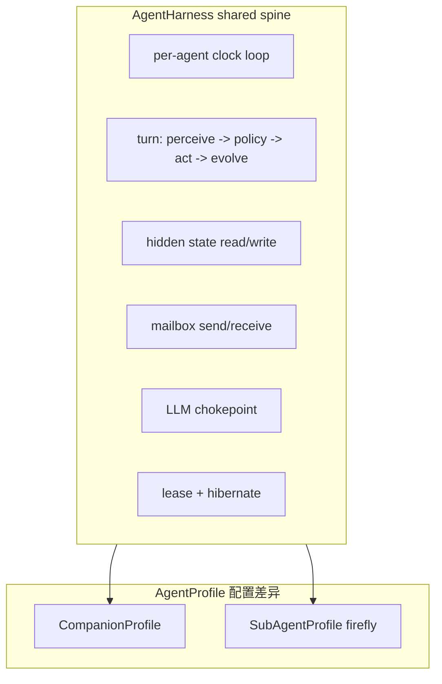
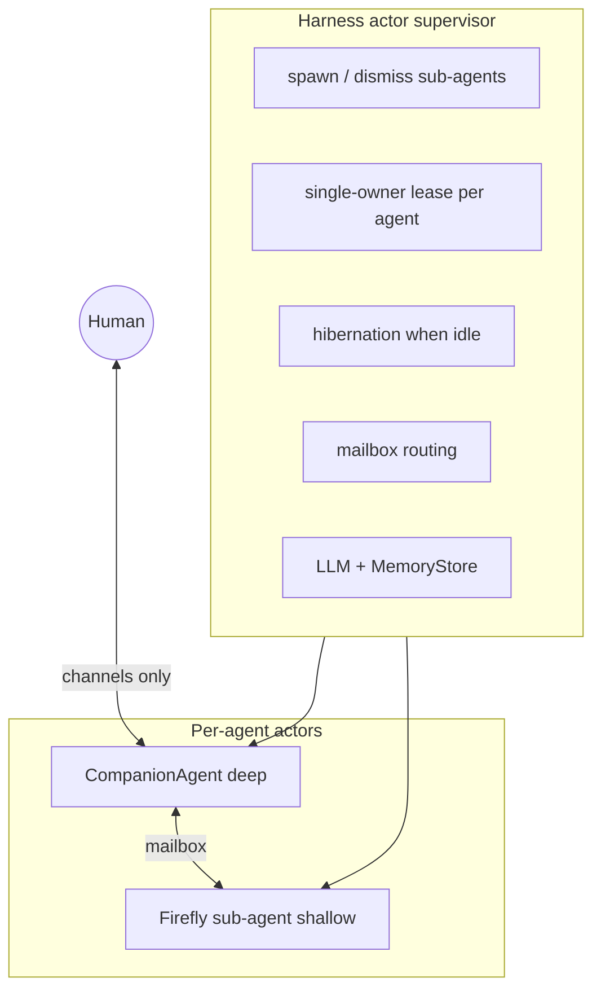

# FR：World Engine（多 agent 虚拟世界）

> **Generated entirely by Cursor Cloud Agent** from companion harness + sub-agent (firefly) design sessions.  
> 对齐 `main` @ `858f5d830`（#3306 文档精简之后）。本文是**概念与逻辑设计**；实现切片见 §9，不含 token 计费细节。

**一句话**：以 **bounded-coherent evolvable hidden state** 为地基，把 companion harness 建成 **actor supervisor**，用共享 **AgentHarness** 驱动 per-agent clock 的 companion 与 sub-agent（firefly 为首例）；**human 仅经 companion 触达世界**。

## See also

- [DESIGN.md](./DESIGN.md) — 当前生产架构与 transport 边界
- [REFACTOR_PLAN.md](./REFACTOR_PLAN.md) — `runtime/` / `environment/` 与共享 spine 的涌现方向（Phase 3）
- [AUTONOMY.md](./AUTONOMY.md) — companion 自主轨道（`LIFE_CURRENTS.md`）；与 sub-agent 世界互补，非替代
- [WORLD_CAPSULES.md](./WORLD_CAPSULES.md) — 共同想象设定巩固；与本 FR 的 agent 交往层正交
- [techno_core/DESIGN.md](../../techno_core/DESIGN.md) · [LIVING_SPHERE.md](./LIVING_SPHERE.md)

---

## 1. 第一性原理：Evolvable Hidden State

**Agent 的唯一抽象** = `EvolvableHiddenState` + `Clock` + `BehaviorPolicy`

- **EvolvableHiddenState**（地基，所有其他属性只能叠在其上）
  - durable、**private**（其他 agent 只见行为、不见状态）
  - 经「经验 → 状态」**复利累积**而演化
  - 必须是 **bounded-coherent**（有界、连贯），否则 drift/人格崩塌——现有 curator 的「有界合并」须一并泛化，而非只给 companion 用
- **Clock**：每个 agent **自有节拍**，无外部输入时仍推进「状态更新 + 行为」
- **BehaviorPolicy**：从 hidden state 产出**唯一可观测物——行为**（通常为一次 LLM call）

**Depth 差异**（同一抽象的不同实例化，非不同种类）——由 **AgentProfile** 配置，非独立代码路径：

| | Companion (Inty) | Sub-agent (firefly) |
|---|---|---|
| Hidden state schema | 富：SOUL/IDENTITY/STYLE/USER/MEMORY | 浅：mood/disposition 单文档 |
| Curation | 慢、多 curator | 轻、或无 curator |
| Clock cadence | 用户消息 + inner-tick + dreaming | 极慢；无观察者时趋零或淡出 |
| User channel | 有（唯一 user-facing surface） | **无** |
| Lifecycle | 长期（跨 session） | 短暂（summon → dismiss/decay） |

**当前 `main` 缺口**：`techno_core_events.jsonl` 只 append、无 reader、不回灌 prompt → autonomy 经验**不演化自我**。闭合「经验 → hidden state」反馈环是使 Inty **living & evolving** 的最关键逻辑步骤（先于 firefly 细节）。

---

## 2. 共享 AgentHarness（避免代码爆炸）

**判断**：若无共享 harness，每加一个 sub-agent 就复制一套 clock/turn/memory/mailbox/LLM 管线，复杂度必然爆炸。**必须**从现有 companion runtime 抽出可复用 spine，companion 与 sub-agent 仅是不同 **AgentProfile**。

**共享（一套 runtime）**：

- Per-agent clock loop（tick 串行化、lease）
- Turn 骨架：`perceive mailbox` → `load hidden state` → `BehaviorPolicy (LLM)` → `emit behavior to mailbox` → `evolve hidden state from experience`
- MemoryStore I/O（按 `agent_id` scope）
- LLM client chokepoint
- Spawn / dismiss / hibernate lifecycle
- Experience → hidden state 更新 hook（深度由 profile 决定）

**Profile 差异（配置，非复制代码）**：

| 维度 | CompanionProfile | SubAgentProfile (firefly) |
|---|---|---|
| State schema | SOUL/IDENTITY/STYLE/USER/MEMORY | 单文档 disposition/mood |
| Curation | `dreaming_consolidation` + 多 curator | 轻量 inline 或 tick 末合并 |
| Tools | 全量 companion tools | 无 user-facing tools |
| Channels | app/wechat/sms… | **无** |
| Cadence | user-msg + inner-tick + dreaming | 极慢；TTL decay |
| Summon 权 | 可 summon sub-agents | 不可 summon（防递归） |

**命名（概念层）**：

- `AgentHarness` = 共享 spine（现 `companion_harness` 包内逐步抽出）
- `CompanionHarness` = `AgentHarness` + `CompanionProfile`（今天的生产路径）
- `SubAgentHarness` = `AgentHarness` + `SubAgentProfile`（firefly 等）

---

## 3. System Boundary：Harness = Actor Supervisor

- **Harness（Engine + Supervisor）**：无人格。调度 clock、spawn/lease/hibernate、mailbox、LLM、MemoryStore。**不驱动任何 agent 的行为内容**。
- **CompanionAgent**：1:1 绑定 `(user, companion)`（非 `(user, companion, chat)`）。
- **SubAgent**：companion **will to existence** 召唤；浅 hidden state；**永不拥有 user channel**。

**与 `main` 现状的映射**：

- [`presence_registry.py`](../../app/services/agentic_companion/presence_registry.py) — lease MVP（in-process、per `(user_id, agent_id)`）
- Inner-tick 仍绑 transport（断 WS 即停）→ 目标：clock **下沉 harness**，presence 仅影响 downlink
- [`dreaming_consolidation`](../../app/core/companion_harness/memory/dreaming_consolidation.py) — companion hidden state 演化管线
- 部署单元 = `(user, companion)` actor；in-process task 与 container = 同一抽象的两种 binding

---

## 4. Sub-Agent 连续性

| 层级 | 含义 | Firefly | Companion |
|---|---|---|---|
| **L1 Intra-lifecycle** | summon→dismiss 内 hidden state 跨 tick 累积 | **必须有** | 有 |
| **L2 Cross-lifecycle echo** | dismiss 后痕迹留在**其他 agent** state | 写入 **companion** MEMORY | 自身 MEMORY 长存 |
| **L3 Resurrection** | 再次 summon 恢复同一实例 | **不做** | N/A |

- **L1**：sub-agent 成为 agent 的最低要求。
- **L2**：firefly 无常，companion 因遭遇演化；强化 user↔companion-only 边界。
- **L3**：新 summon = 新实例；「似曾相识」由 companion L2 echo 影响许愿意图，非复活。

---

## 5. Per-Agent Clock

每个 agent **独立 clock**，不共享 world step。

- **交互变异步**：summon → spawn → firefly 按自己 clock 行动 → companion **稍后** mailbox 感知。时间错位 = otherness。
- **成本**：firefly 极慢 cadence + TTL/decay + hibernation。

---

## 6. Summon：Will to Existence

**Controlled creation, autonomous behavior**

- Companion 控制**存在**：summon / dismiss + disposition seed（`intent`、可选 `initial_mood`）
- Companion **不控制行为**：sub-agent 自有 clock + BehaviorPolicy
- **红线**：仅 `summon` / `dismiss` 工具；**无** `command_behavior`

**Firefly（首个 sub-agent）**：

- 生于 **TechnoCore（private）**；短暂、无常；自主性 L1（reactive-LLM），可演进 L2，不到 L3 mini-companion

---

## 7. User Boundary

**User 只与 companion 接口**，不直接触达虚拟世界或 sub-agent。

- Sub-agent 无 user channel；遭遇由 **companion 自主转述**
- World 丰富度 ≤ companion 叙事带宽
- 工程师 inspection 路径与 user 不可见分离

---

## 8. Hidden State 泛化（MemoryStore）

- Scope 泛化为 **`agent_id`**（companion 与 sub-agent 各一 scope）
- **versioned evolvable docs** vs **episodic/working**
- Firefly：`FIREFLY.md` 或等价单文档

---

## 9. 两期交付

### 9.1 Phase 1 — Foundation（用户无感）

**判定**：merge 后 REPL/imate 对话**无差异**；现有 companion pytest 全绿。

| 交付物 | 生产路径 |
|---|---|
| AgentHarness turn 骨架（companion 等价委托） | 是（透明重构） |
| AgentProfile + `AgentBehavior` 契约 | 仅 companion 活跃 |
| Mailbox + SpawnRegistry API | 否（不注入 prompt） |
| MemoryStore `agent_id` + `FIREFLY.md` kind | 否（无实例） |
| Firefly runner + SubAgentSupervisor | **仅测试** |

**Phase 1 不做**：summon/dismiss 工具、prompt 注入、MEMORY echo、events 回灌、生产 firefly LLM。

### 9.2 Phase 2 — Capability（用户可感）

| 交付物 | 用户可感知点 |
|---|---|
| summon/dismiss 工具（maintenance inner-tick） | 间接 |
| Firefly clock 生产激活 | — |
| Mailbox 感知注入 | companion 可能提萤火虫 |
| L2 echo → MEMORY | 长期回忆 |
| 经验回灌（最小） | 语气/记忆变化 |

**Phase 2 验收故事**：User 空闲 → companion summon → firefly 独立 tick → 异步 mailbox → dismiss + MEMORY echo → user 回归可能听说。

### 9.3 能力对照

| 能力 | Phase 1 | Phase 2 |
|---|---|---|
| AgentHarness spine | 抽取 + companion 委托 | firefly 共用 |
| Mailbox | API only | 注入 prompt |
| Summon/dismiss 工具 | 否 | 是 |
| L2 echo | 否 | 是 |
| 用户可见变化 | **无** | **有（可能）** |

### 9.4 全架构后置

- Clock 脱离 transport、分布式 lease、container 部署
- 第二 sub-agent kind、双向 mailbox、多 firefly、Harness-seeded 涌现
- User 直接感知 firefly UI、空间模拟、other-Inty

### 9.5 Phase 内部顺序（概念依赖）

**Phase 1**：`AgentBehavior` → spine 抽取 → Mailbox/SpawnRegistry → MemoryStore scope → Firefly runner（测试）→ 回归验收

**Phase 2**：工具注册 → 生产 spawn/clock → mailbox 注入 → L2 echo → 经验回灌 → tracer bullet E2E

---

## 10. 非目标

- 空间模拟、sub-agent 群、插件注册表
- User 直接与 firefly 对话
- Companion 指挥 sub-agent 行为
- Firefly 做成 L3 goal-driven mini-companion
- Token 计费（次要需求，另文）

---

## 11. 与其他文档的关系

| 文档 | 关系 |
|---|---|
| [AUTONOMY.md](./AUTONOMY.md) | Companion **对自己**的中期/当日兴致；World Engine 提供 **他者**（sub-agent）与 mailbox 交往。可并存。 |
| [WORLD_CAPSULES.md](./WORLD_CAPSULES.md) | 共同想象 **设定巩固**；本 FR 是 **运行时多 agent 引擎**。胶囊可后置接入 TechnoCore 层。 |
| [DESIGN.md](./DESIGN.md) | 描述**当前**生产路径；本 FR 是**目标态** world engine，经 Phase 1/2 渐进落地。 |
