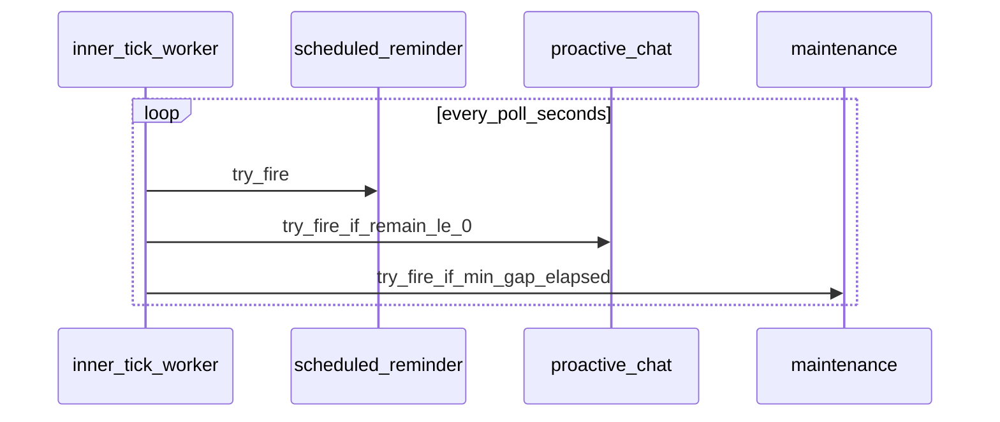

# Inner-tick 调度

WebSocket 连接上 **何时** 会尝试 scheduled reminder、proactive chat、maintenance inner-tick，以及 proactive **rhythm** 如何计算。

## Unified inner-tick worker

每条已签入的 WebSocket 连接启动一个循环任务 `companion_ws_inner_tick_worker`（`/app/api/v1/endpoints/chat.py`）。

| 项 | 当前事实 |
| --- | --- |
| **唤醒周期** | `poll = companion_ws_proactive_chat_poll_seconds`（`config.yaml`），默认 **60s**。不是「到点唤醒」；rhythm 归零后仍可能多等接近一整轮 poll。 |
| **每轮顺序** | scheduled → proactive → maintenance（同一次 wake 内依次尝试）。 |
| **坐标** | 无 `user_signed_on` 武装的 snapshot 时，整轮跳过（日志 `no_inner_tick_coords` / 历史别名 `no_heartbeat_coords`）。 |
| **串行** | 用户轮、greeting、inner-tick、tool background 补帧组装共用连接级 `turn_lock`；inner-tick 还会看 session 级 `tool_bg_idle`，避免与上一轮 proactive 的 tool background 重叠。 |

## Proactive chat rhythm

### 硬门槛

- `transcript.jsonl` 为空，或 **最后一行不是 `assistant`**（例如用户刚发消息、assistant 尚未落库）。
- 没有任何 assistant 行。
- （非 WS 路径可配）`len(transcript) < min_transcript_lines`；**WS 使用默认 `min_transcript_lines=0`**，不因行数过少而禁用。

### 时间锚点

- 起算时刻 = **最后一条 assistant 消息的 `ts`**（从 transcript 尾部向前找第一个 `role=assistant`）。
- **包含**上一轮 proactive 的 assistant 回复；**不是**「距真实用户最后一条消息多久」。
- 合成 proactive user 行（`proactive_chat: true`）**不参与** rhythm 计算，仅参与 prompt 占位文案。

### Rhythm 公式

记 `base_idle` = `companion_ws_proactive_chat_base_idle_seconds`（默认 **30**，合法范围 10–3600）。

1. 在 transcript 中取所有 **真实用户** 消息时间戳（`role=user` 且 `proactive_chat` 不为 true），算相邻间隔，保留 **最近 5 段** gap。
2. 若 gap 少于 **2** 段 → `rhythm = base_idle`。
3. 否则 → `rhythm = min(base_idle × 2, median(gaps) × 0.65 + 20)`。

默认配置下 rhythm 落在 **[30, 60]** 秒。无下界钳制（除 cap 外）；慢聊用户 median 大时顶到 `2×base_idle`。

**最早可触发时刻**：`last_assistant_ts + rhythm`。`remain = earliest - now`（UTC）。

- `build_proactive_chat_transcript_user_marker` 在 proactive 回合内向模型描述「距真实用户 / assistant 多久」——用于向模型提供回复的时间间隔，模拟人对等待和主动发消息的思考。
- Proactive 回合的 user/assistant 写入 **`transcript.jsonl`**（主轨）不是 `transcript_inner_tick.jsonl`（仅 maintenance）。

### WebSocket 执行层（在 rhythm 已满足之后）

| 行为 | 说明 |
| --- | --- |
| **`[SILENT]` / 空正文** | 回合可能已把行写入 `transcript.jsonl`，但 **不** 向客户端推业务下行。 |
| **`prev_inner_tick_tool_bg`** | 上一轮 proactive 启动了 tool background 且尚未 idle → 本轮 proactive（及 scheduled）跳过。 |
| **日限额** | proactive **不**按日 chat 条数门禁（与 maintenance 不同）。 |

### 观测到的 wall-clock 间隔

REPL 上两条 `inner-tick proactive-chat` 时间戳 **不是** 单一配置项：

- 下界 ≈ **rhythm**（30–60s 常见）。
- 上界还要加 **最多约一轮 poll**（≤60s）+ LLM 耗时 + `turn_lock` 排队（含 maintenance / 用户轮）。

因此连续 proactive 出现 **~1 分钟** 与 **~2–3 分钟** 都可能在当前设计下成立。

## Maintenance inner-tick 节流

与 proactive **独立**：使用 `app/core/companion_harness/companion/inner_tick_schedule.py` 的 `next_inner_tick_wait_seconds`，由 WS 传入 `InnerTickScheduleOverrides`：

| 覆盖字段 | WS 来源 | 默认 |
| --- | --- | --- |
| `min_gap_seconds` | `companion_ws_maintenance_inner_tick_min_gap_seconds` | **120s**（连接上两次**成功** maintenance 之间） |
| `poll_seconds` | 与 proactive 相同 `companion_ws_proactive_chat_poll_seconds` | 60s（用于 transcript 未就绪时的阻塞睡眠上限） |
| `last_inner_fire_monotonic` | `CompanionWebSocketCoordinator.last_maintenance_inner_tick_monotonic()` | 无则立即可试 |

另需满足：feature `companion_ws_maintenance_inner_tick_enabled`、订阅日 chat 限额、无 pending maintenance 前台、chat_id 与坐标一致等；**`context.json` 的 `context_mode` 为 `bootstrap` 时不调度 maintenance**（`next_inner_tick_wait_seconds` 返回极大等待）；日志见 RUNBOOK。

维护轮写入 **`transcript_inner_tick.jsonl`**；与 proactive rhythm 无共用公式。

## REPL / 原型路径（非生产 WS）

`inner_tick_schedule.py` 另支持环境变量（本地 REPL idle 实验，**非** `/api/v1/chat/ws`）：

| 变量 | 默认 |
| --- | --- |
| `INTY_V2_PROTO_INNER_TICK_ENABLED` | 启用 |
| `INTY_V2_PROTO_INNER_TICK_SEC` | poll **90s** |
| `INTY_V2_PROTO_INNER_TICK_MIN_GAP_SEC` | min gap **120s** |

**`tools/inty_v2_repl` 以 `backend-ws` 连 Ops 时走本文「Unified worker」与「Proactive rhythm」节，不走上述 env。**

## 配置（`config.yaml` → `app.features`）

| 字段 | 默认 | 作用 |
| --- | --- | --- |
| `companion_ws_proactive_chat_base_idle_seconds` | 30 | proactive rhythm 的 `base_idle` 与 `2×` 上限 |
| `companion_ws_proactive_chat_poll_seconds` | 60 | inner-tick worker 周期；maintenance 调度中的 poll 上限 |
| `companion_ws_maintenance_inner_tick_enabled` | true | 是否在 worker 中尝试 maintenance |
| `companion_ws_maintenance_inner_tick_min_gap_seconds` | 120 | 单连接两次成功 maintenance 最小间隔 |

校验逻辑见 `app/utils/config.py` 的 `validate_config`。
