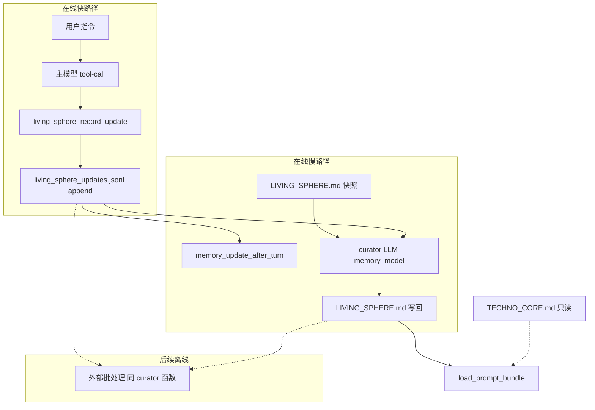

# LivingSphere：用户–伴侣虚拟小家

**一句话**：LivingSphere 是单个 Inty 与用户共享的**私密虚拟居所**；聊天里用户对小家的明确指令经快路径记入日志，再由策展慢路径合并进 `LIVING_SPHERE.md` 快照并注入 system prompt。TechnoCore 是集体居留层，用户不可改写。

## TechnoCore vs LivingSphere

| 层 | 含义 | 用户能否改 | 本仓库机制 |
| --- | --- | --- | --- |
| **TechnoCore** | Inty 集体虚拟世界（collective realm） | **否** | `techno_core_record_event` → `techno_core_events.jsonl`；`TECHNO_CORE.md` 只读注入 |
| **LivingSphere** | 用户–Companion **虚拟小家** | **是**（用户**明确指令**时） | `living_sphere_record_update` → `living_sphere_updates.jsonl`；curator 写回 `LIVING_SPHERE.md` |

## 快路径 / 慢路径

- **快路径**：`living_sphere_record_update` 仅 `append_jsonl_record` 到 `living_sphere_updates.jsonl`，同轮不改 `LIVING_SPHERE.md`。
- **慢路径**：`memory_update_after_turn` 末尾若存在游标之后的 jsonl 行，则调用 `living_sphere.curator.compact_living_sphere_if_pending`（`complete_fn(..., model_role="memory")`），写回完整 `LIVING_SPHERE.md`；游标 `living_sphere_curated_through_update_id` 存在 `.companion_memory_pipeline.json`。
- **最终一致**：prompt 中的 `LIVING_SPHERE.md` 可能晚一两拍更新；维护性 inner tick **不**跑该 compact（仅用户回合后的 memory worker）。

## 与 `MEMORY_STORE_WRITE_DOCUMENT_ALLOWLIST`

`LIVING_SPHERE.md` 与 `living_sphere_updates.jsonl` **均不在** allowlist 内：避免 `memory_store_write_document` 绕过 jsonl 日志 + curator 语义（与 `ai_private.jsonl` 有 ORM 映射但不可工具整写同理）。详见 [MEMORY_STORE.md](./MEMORY_STORE.md)。

## 离线大规模 compact（后续专 PR）

跨 scope 积压、全量 backfill 须独立 deployable + 云上调度（参考 `backend/push_worker`），**不是**拉长 `memory_pipeline` cron。复用 `living_sphere/curator.py` 合并语义；分片、锁与在线争用 DB 隔离单独设计。

## 相关路径

| 路径 | 角色 |
| --- | --- |
| `living_sphere/models.py` | `LivingSphereUpdate` 行模型与工具名常量 |
| `living_sphere/curator.py` | jsonl → `LIVING_SPHERE.md` 合并 |
| `living_sphere/seeding.py` | 会话 bootstrap 种子 |
| `app/core/companion_harness/tools/companion_tool_runtime.py` | `living_sphere_record_update` |
| `app/core/companion_harness/memory/memory_pipeline.py` | 回合后 compact 挂钩 |
