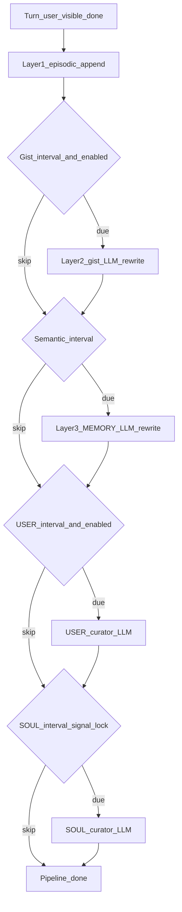
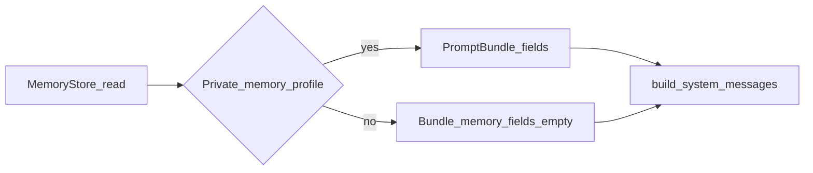

# Companion 记忆管线综述（MemoryStore 路径）

## 导读：是什么、和谁相关、何时读本文

- **是什么**：在单次会话的 **MemoryStore 工作区**里，用若干 Markdown 文件把对话沉淀成 **三层时间尺度**——当日流水、当日结构化纪要、跨日语义定稿；必要时同一管线还会 **策展** `USER.md` / `SOUL.md`，与「向量检索式长期记忆」不是同一条路。
- **解决什么问题**：长对话无法整段塞进模型上下文；管线把「刚发生的事」与「可复用的稳定事实」**分层压缩**，再由 system prompt **按体验配置**选择性注入，让模型在可控篇幅内保持关系连贯。
- **何时读本文**：调记忆更新频率、判断「为什么模型没看到某日摘要 / MEMORY」、对齐 episodic / gist / semantic 产品语言与路径、或排查与 **体验 profile（context_mode）** 相关的注入差异时。
- **不读代码能得到的结论**：每轮用户可见对话结束后会 **先追加情景层**；**gist 与语义层**按「每 N 轮」用独立 LLM 调用重写（可关）；**是否把三层 + `MEMORY.md` 正文装入 bundle** 由 `experience_profile_injects_private_memory` 决定（见下文「体验门控」）。
- **分工（避免双写）**  
  - **工作区里还有哪些 artifact、未来向量 LTM 往哪走**：[MEMORY_STORE.md](/docs/companion_harness/MEMORY_STORE.md)（含 `FR_COMPANION_HARNESS_MEMORY_STORE`）。  
  - **路径命名、持久化版本表、scope 键**：[`app/core/companion_harness/companion/AGENTS.md`](/app/core/companion_harness/companion/AGENTS.md)「分层记忆」「持久化与数据表」。  
  - **本文范围**：**已实现** 的 Markdown 分层管线写入与读出链；**不涉及** legacy 主站 `memory` 表；与向量 LTM **正交**。

---

## 一句话

Companion 在 MemoryStore 里维护三层 Markdown：**情景**（当日流水）、**gist**（当日纪要）、**语义**（`MEMORY.md` 跨日整合）；每轮先追加流水，再按间隔用策展模型重写 gist / 语义，并可按间隔更新 USER / SOUL（SOUL 还可要求本轮出现「基调 / 边界」类信号）；只有「私人记忆注入」为真的体验配置才把当日流水、当日纪要与 `MEMORY.md` 正文装入后续模型调用的 prompt bundle。

---

## 一段话

每轮 **用户可见** 对话结束后，管线向当日 **情景** 文件追加一行带时间戳、经长度裁剪的 user/assistant 摘要。当累计轮次满足「每 N 轮」且未禁用日摘要时，用当日情景全文、上一版当日纪要文件与 **最新一轮** 对话调用 LLM，重写 **gist** 单日结构化纪要。在同一管线内，语义层 `MEMORY.md` 按另一组「每 N 轮」触发 **memory curator**，综合当日 gist（若取用）、当前 `MEMORY.md` 与最新一轮，输出更新后的跨日正文。USER、SOUL 亦可在各自间隔下由独立策展提示词重写；SOUL 默认还要求本轮文本命中「根本性互动」信号，且交互式 bootstrap 结束后可能被锁定不再自动策展。组装下一轮的 prompt 时：`load_prompt_bundle` 依据 **context_mode** 判断是否读取 `memory/daily/<今日>.md`、`memory/<今日>.md` 以及是否保留 `MEMORY.md` 注入正文；`build_system_messages` 再用固定区块标题把各层挂进多段 system（标题真源见 `memory_taxonomy.py`，与 `companion/AGENTS.md` 表格一致）。

---

## 数据流（抽象）

**写入（每轮结束后；生产路径上可由 worker 异步执行 `schedule_memory_update_after_turn`，本地/调试可同步 `memory_update_after_turn`）**

**读出（下一轮 `run_turn` 组装 prompt 前）**

---

## 三层 + 策展：时间尺度、触发、进入模型

| 层（中 / EN） | 逻辑路径 | 时间粒度 | 何时更新 | 进入模型的条件 |
|---------------|----------|----------|----------|----------------|
| 情景 / episodic | `memory/daily/{date}.md` | 当日 | **每轮**追加一行 | 仅当 **私人记忆注入** 为真：作为「当日情景」块注入（有长度上限）。 |
| gist / day summary | `memory/{date}.md` | 当日 | **每 N 轮** LLM 全文重写（可整体禁用） | 同上：作为「当日纪要」块注入（有长度上限）。 |
| 语义 / semantic | `MEMORY.md` | 跨会话日 | **每 N 轮** LLM 全文重写 | 同上：作为语义记忆块注入；**不注入时 bundle 内 `memory_md` 置空**（仍读 IDENTITY / SOUL / USER 等其它稿）。 |
| USER 策展 | `USER.md` | 长期 | **每 N 轮**可选 LLM 重写（可禁用） | 非记忆管线门控；随 system 组装照常注入正文（与 episodic/gist 是否加载无关）。 |
| SOUL 策展 | `SOUL.md` | 长期 | **每 N 轮**且（默认可选）**根本性信号**通过；bootstrap 后可能锁定 | 同上。 |

N 与禁用开关由 **`MemoryPipelineConfig`**（及 `CompanionManager` 注入的配置）统一约束：日摘要 `day_summary_every_n_turns` / `day_summary_disabled`，语义 `memory_update_every_n_turns`，USER `user_update_every_n_turns` / `user_update_disabled`，SOUL `soul_update_every_n_turns` / `soul_update_disabled` / `soul_require_fundamental_signal`。轮次计数持久化在工作区状态 JSON（见实现索引）。

---

## 体验门控（context_mode）

- **判定函数**：`experience_profile_injects_private_memory(profile_id)`（[`experience_profile.py`](/app/core/companion_harness/experience_profile.py)）。
- **当前会注入「当日流水 + 当日纪要 + `MEMORY.md` 正文」的 profile id**：`unspecific`、`intimate`、`emotional_companion`、`bootstrap`（集合以源码 `_PRIVATE_MEMORY_PROFILE_IDS` 为准）。
- **典型不注入私人记忆三层的模式**：`roleplay`、`interactive_fiction`、`public`；此时 `load_prompt_bundle` **不读** `memory/daily/<今日>.md` 与 `memory/<今日>.md`，并将 **`MEMORY.md` 注入正文置空**（与 `models.load_prompt_bundle` docstring 一致）。
- **与 system 文案的关系**：`experience_profile_system_clause` 对各模式另有说明段落（例如 roleplay 强调不引私人档案）；注入判定以上述布尔函数为准，二者需对照阅读。

---

## 切片枚举与路径（设计意图）

- **`PromptSliceId.MEMORY` 仅对应工作区根目录 `MEMORY.md`**（语义层、可被 `companion_update_prompt_slice` 等路径约束）。
- **情景 / gist 使用带日期的子路径**，由 `load_prompt_bundle` 按「今日」解析装入 bundle 的专用字段，**不**通过该枚举映射；避免把「当日流水」误登记为与根 `MEMORY.md` 同一切片。

---

## 实现索引

| 主题 | 路径 | 主要职责 |
|------|------|----------|
| 管线实现 | [`app/core/companion_harness/companion/memory_pipeline.py`](/app/core/companion_harness/companion/memory_pipeline.py) | 回合后追加情景、按间隔 LLM 重写 gist / `MEMORY.md` / `USER.md` / `SOUL.md`；提供同步与队列调度入口。 |
| 读出与 bundle | [`app/core/companion_harness/companion/models.py`](/app/core/companion_harness/companion/models.py) `load_prompt_bundle` | 从 MemoryStore 读取各稿；按 `experience_profile_injects_private_memory` 决定是否装载日程层与 `MEMORY.md` 正文。 |
| 私人记忆门控 | [`app/core/companion_harness/experience_profile.py`](/app/core/companion_harness/experience_profile.py) | `experience_profile_injects_private_memory` 与各模式 system 条款文案。 |
| System 注入标题 | [`app/core/companion_harness/companion/memory_taxonomy.py`](/app/core/companion_harness/companion/memory_taxonomy.py) | 各记忆层在 prompt 中的固定标题与中英术语。 |
| System 组装 | [`app/core/companion_harness/companion/prompts/system_messages.py`](/app/core/companion_harness/companion/prompts/system_messages.py) `build_system_messages` | 将 `PromptBundle` 与包内模版拼成多段 system。 |
| 路径与 document kind | [`app/core/companion_harness/companion/memory_store_document_mapping.py`](/app/core/companion_harness/companion/memory_store_document_mapping.py) | 逻辑路径与持久化 `document_kind` 对应。 |
| 回合编排入口 | [`app/core/companion_harness/companion/turn.py`](/app/core/companion_harness/companion/turn.py) | `memory_update_after_turn` / `schedule_memory_update_after_turn` 调用点（与 `defer_memory_update` 等配合）。 |
| 子包概述 | [`app/core/companion_harness/companion/AGENTS.md`](/app/core/companion_harness/companion/AGENTS.md) | 分层术语表、持久化与 system 层级说明。 |
