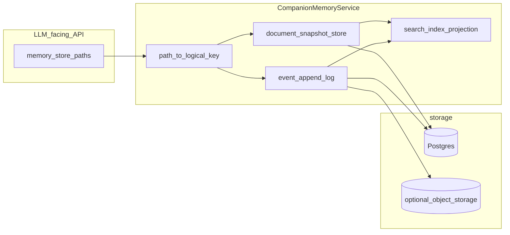

# Companion Memory Store

## 一句话

MemoryStore 是 Companion Harness 的「工作区状态层」——以 POSIX 路径暴露给 LLM 与工具读写的人设、对话与控制面文档，正文落在 Postgres `companion_memory_document_versions`；规划中的向量长期记忆（FR_COMPANION_HARNESS_MEMORY_STORE）是与之**正交**的另一条纵轴，不复用 legacy `memory` 表。

## 读者定位

本文给**理解 Companion 状态边界、做产品判断与架构演进**的读者。读完应能判断：哪些状态今天已有、谁负责更新它、为何这样切片，以及未来向量 LTM 落地时与现有 MemoryStore 的边界在哪里。

- 不在范围：分层 Markdown 记忆（episodic / gist / semantic）的策展机制 —— 见 [`MEMORY_PIPELINE.md`](/docs/companion_harness/MEMORY_PIPELINE.md)。
- 不在范围：跨 transport / turn / tool 的整体职责切分 —— 见 [`ARCH.md`](/docs/companion_harness/ARCH.md)。
- 不在范围：legacy 主站 `memory` 表与节日 / 日常抽取管线（本 FR 强制不沿用、不扩展）。

---

## 当前 MemoryStore：四类状态

MemoryStore 把一次 companion 会话的状态切成四个角色。逻辑接口都是 POSIX 相对路径（对模型友好），权威存储在 Postgres `companion_memory_document_versions`，每条文档由 `document_kind` 标签分类。

### 1. 人设根稿（IDENTITY / SOUL / USER / MEMORY）

- companion 的身份、稳定边界、对用户的长期理解，以及跨日的语义记忆。
- 由记忆管线与少量工具策展更新；通常只读注入到 system prompt。
- 分层与触发机制详见 [`MEMORY_PIPELINE.md`](/docs/companion_harness/MEMORY_PIPELINE.md)，本文不重复。

### 2. 对话轨迹（transcript / inner_tick / ai_private）

- **`transcript.jsonl`**：用户可见对话主轨；每轮末追加 user / assistant，作为下一轮上下文与压实输入；体积大时带截窗读取。
- **`transcript_inner_tick.jsonl`**：仅承载**维护型**内在节拍；与主 transcript 按时间合并后供 inner_tick scene；proactive heartbeat 仍写主轨。
- **`ai_private.md`**：内在节拍等非用户主对话轮的正文，注入 `## 内在活动（ai_private）` system 块；`ai_private.jsonl` 同属 MemoryStore，读路径以代码为准。

> 设计要点：用户可见 vs 维护型轨迹**物理分文件**，否则上下文压实与 LangSmith trace 都会混入半相关的对白。

### 3. 控制面状态（context.json + `.companion_*` / `.inty_v2_*` JSON）

- **`context.json`**：会话元数据 —— experience profile、bootstrap 标志、跳过开关、session id。**禁止**用通用文档写工具直接覆盖；改用字段级 setter 工具（如 experience profile 工具）确保语义。
- **`.companion_*` / `.inty_v2_*` 状态文件**：管线节拍计数、压实状态、定时队列等快照；由各子系统覆盖式写入，间接影响管线触发与上下文规模。
- 这一层不属于人设 system 切片；它决定**这一轮怎么走**，不决定**这一轮说什么**。

### 4. 生图索引（`generated_images/`）

- 索引行（`index.jsonl`）随 MemoryStore 一致管理；二进制产物可走对象存储，索引行可记 `gcs_http_url` 等。
- `generate_image` / `modify_image` 成功后追加索引；后续改图工具按最新记录解析默认源。

---

## 设计方向（不绑定排期，仅架构目标）

面向「长期关系型 Companion Harness」的四类记忆需求 —— 情景事件、语义摘要、结构化事实、可追溯治理 —— 下面 5 条是底层演进方向；当前生产仍是单表 append-only 的过渡形态。

1. **分层存储模型**（逻辑上拆分，不必一次改完表）
   - **事件流**：transcript / runtime events / 工具轨迹用行级事件或对象存储 + 游标，避免每行 JSONL 都触发整文件快照。
   - **可编辑文档**：人设根稿保留「当前版本 + 可选历史」；写入带显式 revision 元数据（作者、turn_id、模型 id）。
   - **检索层**：从事件与文档派生 chunk + embedding，与正文表共享 `revision` / `event_id`。
2. **单一 scope 真理源**：弱化「从路径拆解三元组」；以显式 `session_id` / `scope_id`（UUID）作为主外键，`path` 仅作 LLM 侧视图。
3. **跨会话记忆**：引入 user-scoped / companion-scoped 人格层 vs chat-scoped 对话层；用 projection job 把 chat 层稳定事实合并到上层（带冲突策略）。
4. **并发与一致性**：「读-改-写」类文档采用乐观锁（expected revision）或 DB 单行 current + 异步归档；JSONL 只追加物理行而非重复存全文件。
5. **保留 POSIX 路径接口**：模型友好的路径式工具 API 不变；底层实现替换为分段 repository。

---

## 向量长期记忆（FR_COMPANION_HARNESS_MEMORY_STORE）

**规划中**：为 Companion Harness 提供专用的、可命名、可追溯、可层次化的长期记忆 —— PostgreSQL + pgvector 持久化，向量 + 全文混合检索，进程内运行时缓存，与现有工作区 MemoryStore 正交，与 legacy 主站 `memory` 表强制隔离。

### 边界与隔离（不可变约束）

- **不复用 legacy**：本 FR 不读不写 legacy `memory` 表，不共享 ORM、不共享 Repository，LTM 行不 `FOREIGN KEY` 指向 `memory.id`；嵌入与抽取**不调用** legacy 抽取任务。主 App 的 legacy 记忆继续服务旧客户端；是否在产品上并行展示由产品另定。
- **与工作区 MemoryStore 正交**：禁止把 LTM 读写混进 `MemoryStore` 既有语义或替换 `SqlAlchemyMemoryRepository`。两条纵轴并存，提示词组装必须**单一入口**决定二者顺序，避免重复塞入两套「记忆」。
- **租户硬过滤**：每条 SQL 必须带 `user_id`（及既定 `agent_id` / `chat_id`）谓词；禁止仅靠向量相似度的全表扫描。

### 数据模型（按列簇说明，落地以 Alembic 为准）

新表前缀为 `companion_harness_ltm_*`（最终命名以实现为准），包含三类实体：

- **主记忆表**：身份与作用域（`user_id` / `agent_id` / `chat_id` / `parent_id`）、内容（`name` slug + `content`，slug 在 `(user_id, agent_id, chat_id)` 内唯一）、嵌入（`embedding` + `embedding_model` + `embedding_version`）、全文索引（`tsvector` + GIN）、时序与审计（`valid_from` / `valid_to` / `created_at` / `updated_at`）。
- **来源表（provenance）**：每条记忆对应若干来源行 —— `source_type`（`chat_message` / `chat_window` / `tool` / `document`）、`source_id`、可选截断 `excerpt`、JSONB `meta`（提炼器版本、prompt 哈希）。
- **可选边表（edge）**：表达 DAG 关系 —— `related_to` / `supersedes` / `derived_from`，超出树形 `parent_id` 的关联。

索引层：B-tree 覆盖 `(user_id, agent_id, parent_id)`、`(user_id, agent_id, name)` 唯一；HNSW 覆盖 `embedding`，**opclass 与查询距离一致**；GIN 覆盖 `content_tsv`。

### 写入与检索流水线

**写入**：调用方（companion 回合或后台任务）输出 `name` / `content` / `parent_id` 与多行 provenance；管线归一化 slug、同名合并或升版本；调用嵌入服务，失败入队重试并以状态列记录；同事务写主表 + provenance + `tsv`；最后通知运行时缓存失效。嵌入是**异步可延迟**的，不阻塞用户可见回合完成。

**检索**：从最新用户话轮或聚合查询生成 `query_embedding`；先做 SQL 租户 / 层次过滤；并行向量分支（`ORDER BY embedding <=> :q`）与全文分支（`ts_rank_cd`）；用 RRF 或加权融合，可选 Top M 交叉编码器重排（特性开关）；最后**层次感知打包** —— 在 token 预算内组合祖先摘要与叶子细节。

### 提示词单一入口

- LTM 切片由 **companion 回合路径**单一函数注入（`companion/prompts/system_messages.py` 的 `build_system_messages` 链路），不与主站 `prompting/assembler.py` 并行注入。
- 与现有切片的顺序约定：静态 axiom → 工作区文档块 → **向量 LTM 块** → 工具策略 → 近期 transcript；各切片独立 `max_tokens`，记忆切片先丢融合分最低项。
- 基线测试断言：LTM 块只出现一次、与工作区 markdown 记忆块顺序可配置。

### 运行时注册策略（对齐 `memory_registry` 模式）

| 层级 | 共享 / 隔离 | 说明 |
|------|------------|------|
| 代码与无状态服务 | 共享 | Repository 类、查询融合逻辑、（可选）全局限流后的嵌入客户端 |
| 数据库连接池 | 共享 | 与现有后端共用 PG 连接池或 DSN 工厂；表前缀独立 |
| 有状态运行时句柄 | **按作用域一份** | 仿 `get_memory_store`：按 `(user_id, companion_id, chat_id)` 注册 LTM 运行时，含工作集缓存与写合并队列；禁止全局单例承载租户状态 |
| OS 进程 | 默认共享 | 不为每个 companion 独占进程；仅当合规要求硬进程隔离时再评估 |

### 多智能体与 iMate 后端：能力与缺口

- **已有**：单用户多 chat 由 `CompanionSession` 与 scope 化 store 提供逻辑隔离；多 companion 共享代码与连接池是自然部署形态。
- **缺口**：跨 companion 共享「用户级」LTM 需 schema 中显式 `agent_id` 可空语义与检索策略选择（用户级 / 角色级 / 会话级），不能默认仅 `chat_id`。
- **不在本 FR**：多 agent 编排、handoff、共享黑板属于 Harness 之上的编排层；本 FR 的 LTM 仅提供可被多调用方共享读写的存储与检索，不替代编排引擎。

### 风险与依赖

带 pgvector 的 Postgres 实例与嵌入服务配额是硬依赖；DSN 可与现网 PG 同实例不同表，但**连接与配置须独立**于 legacy 记忆服务。主要风险：大表 HNSW 构建窗口、过窄过滤下的召回调参、provenance 含 PII（与聊天记录同等留存与权限）、记忆投毒（用 Top-K 多样性、置信度标记、高影响写入可选审核队列缓解）。

---

## 代码索引

| 主题 | 路径 |
|------|------|
| context 读取 | [`companion/models.py`](/app/core/companion_harness/companion/models.py) (`load_context_meta`) |
| transcript 写入与压实 | [`companion/turn.py`](/app/core/companion_harness/companion/turn.py)、[`transcript_compaction.py`](/app/core/companion_harness/companion/transcript_compaction.py) |
| ai_private 注入 | [`companion/ai_private_prompt.py`](/app/core/companion_harness/companion/ai_private_prompt.py)、[`prompts/system_messages.py`](/app/core/companion_harness/companion/prompts/system_messages.py) |
| 路径 → document_kind | [`memory_store_document_mapping.py`](/app/core/companion_harness/companion/memory_store_document_mapping.py) |
| scope 路径辅助 | [`memory_store_scope.py`](/app/core/companion_harness/companion/memory_store_scope.py) (`MemoryStoreScopePaths`) |
| 生图索引 | [`image_gate.py`](/app/core/companion_harness/companion/image_gate.py) |
| 工作区 store / registry | [`memory_store.py`](/app/core/companion_harness/companion/memory_store.py)、[`memory_registry.py`](/app/core/companion_harness/companion/memory_registry.py) |
| Markdown 记忆策展 | [`memory_pipeline.py`](/app/core/companion_harness/companion/memory_pipeline.py)（详见 [`MEMORY_PIPELINE.md`](/docs/companion_harness/MEMORY_PIPELINE.md)） |
| 单轮编排抽象 | [`runtime/turn_orchestrator.py`](/app/core/companion_harness/runtime/turn_orchestrator.py) |
| companion 提示词链路 | [`companion/prompts/system_messages.py`](/app/core/companion_harness/companion/prompts/system_messages.py)（`build_system_messages`，LTM 切片首选注入点） |
| 主站 Agent 提示拼装 | [`prompting/assembler.py`](/app/core/companion_harness/prompting/assembler.py)（与 companion 路径互斥选一） |
| 服务边界 / DSN 注入 | [`app/services/companion_chat_service.py`](/app/services/companion_chat_service.py) |
| Legacy `memory` 表（仅对照） | [`backend/alembic/versions/20260127_120000_add_memory_tables.py`](/backend/alembic/versions/20260127_120000_add_memory_tables.py) |
| Alembic 迁移流程 | [`backend/alembic/AGENTS.md`](/backend/alembic/AGENTS.md) |
| pgvector / compose | [`backend/ARCH.md`](/backend/ARCH.md)、[`backend/AGENTS.md`](/backend/AGENTS.md) |
| 提示词清洁化方向 | [`docs/FR_CLEAN_AGENT_PROMPTS_SYSTEM.md`](/docs/FR_CLEAN_AGENT_PROMPTS_SYSTEM.md) |
