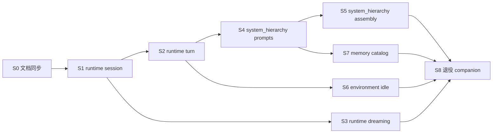

# REFACTOR_PLAN Phase 3 — 最小迁移切片（issue 粒度）

> 生成说明：在 `main` @ `9c20900e1`（含 #3290 dreaming-only、#3297 `CompanionTurnDeps`、#3298 `turn_invariants`）上盘点。目标是把 [REFACTOR_PLAN.md](./REFACTOR_PLAN.md) Phase 3.1–3.6 收成 **可独立 merge 的 tracer bullet**，每刀只做 `git mv` + import/测试路径更新，**不改行为**。

## 当前进度（相对 REFACTOR_PLAN 目标结构）

| Phase | 目标包 | 状态 |
|-------|--------|------|
| 3.1 `memory/` | MemoryStore、scope、mapping、`dreaming_consolidation` | **大部分完成** |
| 3.2 `system_hierarchy/` | prompts、system_messages、prompt_slices | **完成**（S4+S5；`prompting/` 已退役） |
| 3.3 `tools/` | tool runtime、background、dispatchers | **大部分完成** |
| 3.4 `runtime/` | turn、manager、session、WS coordinator | **完成**（S1–S3b+S8） |
| 3.5 `environment/` | inner tick、implicit signals、proactive chat | **完成**（S6） |
| 3.6 清空 `companion/` | 无 `app.core.companion_harness.companion` import | **完成**（S8） |

## 原则（继承 Phase 3.0）

- 每切片：**同一层**文件 `git mv`，全仓 import + 测试路径，跑 **该层相关 pytest**，不夹带产品行为重写。
- 依赖方向：`runtime/` → `memory/`、`system_hierarchy/`、`tools/`；`memory/` **不** import `runtime/`。
- 验收：切片前后 `pytest tests/app/core/companion_harness` 通过；架构测试 `test_turn_invariants_architecture` / `check_companion_turn_invariants.py` 仍绿。

## 切片总览（推荐顺序）

| ID | 标题 | Type | Blocked by | 预期 blast radius |
|----|------|------|------------|-------------------|
| S0 | 同步 REFACTOR_PLAN 与 memory 文档 | AFK | — | 仅 `docs/` |
| S1 | 拆出 `runtime/`：session spine | AFK | S0 | `manager`、`scope`、`turn_deps` + 调用方 import |
| S2 | 拆出 `runtime/`：turn 编排 | AFK | S1 | `turn*`、`turn_pipeline`、`turn_invariants` |
| S3 | 拆出 `runtime/`：dreaming 编排 seam | AFK | S1 | `dreaming*`；收敛 `companion_chat_service` 单入口文档 |
| S4 | 拆出 `system_hierarchy/`：静态 prompt 资源 | AFK | S2 | `companion/prompts/`、`system_messages` |
| S5 | 拆出 `system_hierarchy/`：prompt 组装 | AFK | S4 | `prompt_slices`、`prompt_stack`、`prompting/bundle` |
| S6 | 拆出 `environment/`：idle / inner-tick 刺激 | AFK | S2 | `inner_tick_schedule`、`implicit_signal*`、`proactive_chat` |
| S7 | `memory/`：MemoryDocumentCatalog 单表 | AFK | S4 | scope + mapping + bundle 字段一致性测试 |
| S8 | Phase 3.6：退役 `companion/` namespace | AFK | S3,S5,S6,S7 | 全仓 grep + 删空目录 |

---

## S0 — 文档与 REFACTOR_PLAN 同步

**What**：把图纸与代码对齐，避免后续迁移按错误文件名搜。

**Scope**：

- [REFACTOR_PLAN.md](./REFACTOR_PLAN.md) Phase 3.1：`memory_pipeline.py` → `dreaming_consolidation.py`；标 3.1/3.3 **部分完成**。
- [MEMORY_PIPELINE.md](./MEMORY_PIPELINE.md)：重命名或文首注明「已由 dreaming-only consolidation 取代」。
- `.cursor/skills/inspect-companion-harness/SKILL.md`：`memory_day_summary` / 双 daily 层描述更新（若仍过时）。

**Acceptance**：

- [ ] `rg memory_pipeline` 在 `docs/` 与 `.cursor/skills/` 无过时 **路径级** 引用（历史 changelog 可保留）。
- [ ] Phase 3 切片表链到本文件。

---

## S1 — `runtime/` package：session spine（tracer bullet #1）

**What**：建立 `app/core/companion_harness/runtime/`，迁入 session 生命周期真源。

**Move**（`git mv`，行为不变）：

- `companion/manager.py` → `runtime/manager.py`
- `companion/scope.py` → `runtime/scope.py`
- `companion/turn_deps.py` → `runtime/turn_deps.py`
- `companion/models.py` 中 **仅** `CompanionConfig` / `CompanionSession` 相关 vs 全文件 — **HITL 决策**：整文件迁 `runtime/models.py` 或拆 Pydantic（建议整文件迁，减少半拆）。

**Tests**：`test_manager_turn_tracks.py`、`test_models.py`（随路径迁移）。

**Acceptance**：

- [ ] `runtime/__init__.py` 仅 docstring。
- [ ] `app.services.companion_chat_service` 等调用方 import 更新。
- [ ] `pytest tests/app/core/companion_harness/companion/test_manager_turn_tracks.py`（迁后路径）通过。

---

## S2 — `runtime/`：turn 编排（tracer bullet #2）

**What**：turn 相关模块离开 `companion/`，下次改 turn 参数/轨道只碰 `runtime/`。

**Move**：

- `turn.py`, `turn_engine.py`, `turn_pipeline.py`, `turn_routes.py`, `turn_tracks.py`, `turn_track.py`
- `turn_invariants.py`
- `runtime_events.py`, `message_format.py`, `utc.py`（REFACTOR_PLAN 3.4 列出）

**Acceptance**：

- [ ] `run_turn` / dual-LLM / inner-tick track 测试绿：`test_turn*`、`test_turn_pipeline_dreaming.py`。
- [ ] `check_companion_turn_invariants.py` 路径常量更新后仍通过。

---

## S3 — `runtime/`：DreamingBatch 编排 seam

**What**：dreaming 调度与 checkpoint 归入 `runtime/`，与 AwakeTurn 同包、异入口；**不**移动 `dreaming_consolidation`（留在 `memory/`）。

**Move**：

- `companion/dreaming.py` → `runtime/dreaming.py`
- `companion/dreaming_observability.py` → `runtime/dreaming_observability.py`

**Doc**：`runtime/AGENTS.md` 写明：`run_dreaming_batch_for_session`（service 层）→ `consolidate_memory_during_dreaming`（memory 层）调用链。

**Acceptance**：

- [ ] `test_dreaming.py`、`test_dreaming_observability.py`、`test_companion_chat_service_dreaming_lock.py` 通过。
- [ ] `memory/` 无 import `runtime.dreaming`（依赖方向）。

---

## S4 — `system_hierarchy/`：静态 prompt 资源

**What**：AXIOM/BOOTSTRAP/TOOLS 等与 `load_template_seed_text` 读路径迁到单一包。

**Move**：

- `companion/prompts/` → `system_hierarchy/prompts/`
- 更新 `memory/memory_store_scope.py` 中 `_PROMPTS_DIR` 指向。

**Acceptance**：

- [ ] `test_system_messages.py`、bootstrap prompt 读取测试通过。
- [ ] iMate 首条 AXIOM 注入 smoke 不变。

---

## S5 — `system_hierarchy/`：prompt 组装

**What**：注入栈真源收敛，废弃 `prompting/` 过渡包（迁完删除或留空壳一轮）。

**Move**：

- `prompt_slices.py`, `prompt_stack.py`, `ai_private_prompt.py`, `dual_llm_chat_branch_envelope.py`
- `prompting/bundle.py` → `system_hierarchy/bundle.py`（或 `contracts/` 若更贴切 — 默认放 system_hierarchy）

**Acceptance**：

- [ ] `test_prompt_slices.py`, `test_ai_private_prompt.py`, `test_significance_perception_envelope.py`, `prompting/test_bundle.py` 通过。
- [ ] 全仓无 `app.core.companion_harness.prompting` import。

---

## S6 — `environment/`：idle / inner-tick 刺激

**What**：与「用户不在场时的环境输入」相关模块离 turn 核心。

**Move**：

- `inner_tick_schedule.py`, `implicit_signal_messages.py`, `proactive_chat.py`, `schedule_queue.py`（队列偏 sidecar，REFACTOR_PLAN 放 runtime；可放 runtime 若 S6 范围过大 — **默认放 environment**）

**Acceptance**：

- [ ] `test_inner_tick_schedule.py`, `test_implicit_signal_messages.py`, `test_proactive_chat.py`, `test_schedule_queue.py` 通过。

---

## S7 — `memory/`：MemoryDocumentCatalog

**What**：消灭「改一个 MemoryDoc 路径 touch 4 个模块」；**行为不变**，加单表 + 一致性测试。

**Build**（本切片允许少量新代码，非纯 mv）：

- `memory/document_catalog.py`：`path` ↔ `document_kind` ↔ `PromptBundle` 字段 ↔ `writer`（`awake_append` | `dreaming_curation` | `seed` | `tool`）
- 测试：catalog 与现有 `memory_store_scope` / `document_mapping` / `bundle` 交叉校验。

**Acceptance**：

- [ ] 新增/删除 daily gist 路径时 **只改 catalog + 测试**（演练：在 PR 描述里列 touched files ≤3）。
- [ ] 现有 memory store 测试仍绿。

---

## S8 — Phase 3.6：退役 `companion/` namespace

**What**：迁入剩余文件（`bootstrap.py`, `llm_client.py`, `websocket_coordinator.py`, …），删除 `companion/` 与对应测试目录；`companion/AGENTS.md` 内容拆到 `runtime/AGENTS.md`、`docs/companion_harness/`。

**Acceptance**：

- [ ] `rg 'app\.core\.companion_harness\.companion'` 生产代码与测试为 0。
- [ ] `pytest tests/app/core/companion_harness` 全绿。
- [ ] [REFACTOR_PLAN.md](./REFACTOR_PLAN.md) Phase 3 标为完成。

---

## 非目标（所有切片）

- 不改 DB `document_kind` 枚举名、不改 WS/API 字段。
- 不重写 `consolidate_memory_during_dreaming` 算法。
- 不在迁移切片中做 `CompanionTurnDeps` 以外的新 API 设计。

## 与 GitHub 的对应

Epic 与子 issue 见 GitHub **[Epic] agentic_companion — Phase 3 companion/ 拆包**（创建后在本文件顶部补 issue 链接）。
