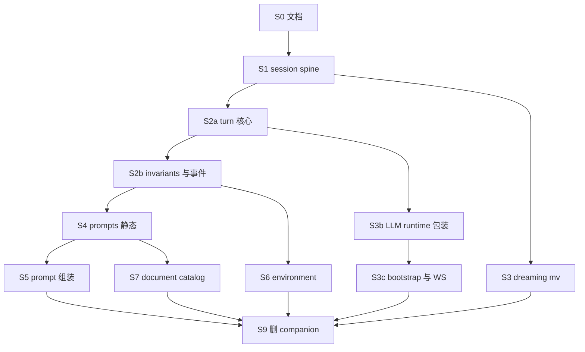

# REFACTOR_PLAN Phase 3 — 最小迁移切片（issue / PR 粒度）

> **基线**：`main` @ `5de01e939`（#3301 `runtime/dreaming_batch.py`、#3297 `CompanionTurnDeps`、#3298 `turn_invariants`、#3290 `dreaming_consolidation`）。  
> **目标**：把 [REFACTOR_PLAN.md](./REFACTOR_PLAN.md) Phase 3.1–3.6 收成 **可独立 merge 的 tracer bullet**；每刀 `git mv` + import/测试路径，**不改行为**。  
> **教训**（#3304 monolith 废弃）：禁止多切片积压在单分支；**一 slice 一 PR，merge 后再开下一刀**。

## 当前进度（代码实况）

| Phase | 目标包 | 状态 |
|-------|--------|------|
| 3.1 `memory/` | MemoryStore、scope、mapping、`dreaming_consolidation` | **大部分完成**；`REFACTOR_PLAN.md` L57 仍写 `memory_pipeline.py` |
| 3.2 `system_hierarchy/` | prompts、prompt 组装 | **未开始**（仍在 `companion/` + `prompting/bundle.py`） |
| 3.3 `tools/` | tool runtime、background | **大部分完成** |
| 3.4 `runtime/` | turn、manager、session、WS | **进行中** — 仅有 `runtime/dreaming_batch.py`；其余在 `companion/` |
| 3.5 `environment/` | inner tick、implicit signals、proactive chat | **未开始** |
| 3.6 清空 `companion/` | 无 `app.core.companion_harness.companion` import | **未开始**（`companion/` 仍有 ~35 个 `.py`） |

## 执行硬约束（#3304 后新增）

1. **一 slice → 一 PR → merge `main` → 再切下一分支**（分支名 `cursor/phase3-sN-<short>-e9a5`）。
2. **单 PR 规模上限**：`git diff --stat` ≤ **35 files** 且 ≤ **500 insertions**（纯 rename 仍计）；超出必须再切子切片（如 S2a/S2b）。
3. **import 替换**：只改 `app.core.companion_harness.companion.<module>` 全路径；**禁止**对测试 helper 文件名做子串替换（例：保留 `companion_memory_registry_dsn.py`）。
4. **依赖方向**：`runtime/` → `memory/` / `system_hierarchy/` / `tools/`；`memory/` **不得** import `runtime/`（迁 `models.py` 前见 S1 备注）。
5. **S7（新代码）** 与任意 `git mv` 切片 **不得** 同 PR。
6. **S8 终局** 只做删空目录 + grep；**禁止** 把 bulk 余文件搬迁塞进 S8（须在前序 slice 迁完）。

## 切片总览



| ID | 标题 | Blocked by | 预期 files |
|----|------|------------|------------|
| S0 | 文档与 REFACTOR_PLAN 同步 | — | ≤10 |
| S1 | `runtime/` session spine | S0 | ~25 |
| S2a | `runtime/` turn 编排（核心） | S1 | ~30 |
| S2b | `runtime/` invariants + events + utc | S2a | ~25 |
| S3 | `runtime/` dreaming.py 迁入 | S1 | ~15 |
| S3b | `runtime/` LLM 调用包装 | S2a | ~20 |
| S3c | `runtime/` bootstrap + WS + channel | S2a | ~20 |
| S4 | `system_hierarchy/` 静态 prompts | S2b | ~25 |
| S5 | `system_hierarchy/` prompt 组装 | S4 | ~30 |
| S6 | `environment/` idle 刺激 | S2b | ~20 |
| S7 | `memory/document_catalog.py` | S4 | ≤5（含新文件） |
| S9 | 删空 `companion/` + 终验 | S3,S3c,S5,S6,S7 | ~15 |

---

## S0 — 文档同步

- [REFACTOR_PLAN.md](./REFACTOR_PLAN.md)：`memory_pipeline.py` → `dreaming_consolidation.py`；3.4 注 `runtime/dreaming_batch` 已存在；链到本文件。
- `.cursor/skills/inspect-companion-harness/SKILL.md`：去掉过时 `memory_day_summary` / 双 daily 层（若仍存在）。

**验收**：`rg memory_pipeline docs/ .cursor/skills/` 无过时路径引用。

---

## S1 — `runtime/` session spine

**Move**：`manager.py`、`scope.py`、`turn_deps.py`、整文件 `models.py` → `runtime/`。

**备注（依赖）**：整文件迁 `models.py` 会使 `memory/` 短期 import `runtime.models`；接受为 **已知技术债**，在 S7 前不拆；勿在 S1 夹带 memory 重构。

**Tests**：`test_manager_turn_tracks.py`、`test_models.py` → `tests/.../runtime/`。

**验收**：切片 pytest + `check_companion_turn_invariants.py`。

---

## S2a — `runtime/` turn 核心

**Move**：`turn.py`、`turn_engine.py`、`turn_pipeline.py`、`turn_routes.py`、`turn_tracks.py`、`turn_track.py`。

**Tests**：`test_turn*.py`（不含 `test_turn_invariants_architecture`）。

---

## S2b — `runtime/` invariants 与运行时辅助

**Move**：`turn_invariants.py`、`runtime_events.py`、`message_format.py`、`utc.py`。

**须改**：`turn_invariants` 内 `AWAKE_TURN_ORCHESTRATOR_RELATIVE_PATHS`；`check_companion_turn_invariants.py`。

**Tests**：`test_turn_invariants_architecture.py`、`test_llm_runtime_events.py`、`test_ws_channel_runtime_events.py`。

---

## S3 — `runtime/` dreaming 模块迁入

**Move**：`dreaming.py`、`dreaming_observability.py`；`dreaming_batch.py` 改同包 import。

**Doc**：`runtime/AGENTS.md`（AwakeTurn vs DreamingBatch 调用链）。

**约束**：`memory/dreaming_consolidation.py` 不新增对 `runtime/` 的 import。

---

## S3b — `runtime/` LLM 包装

**Move**：`llm_client.py`、`llm_chat_runtime.py`、`llm_runtime_events.py`、`llm_inference_errors.py`、`langsmith_parent_policy.py`。

**Tests**：`test_companion_llm_client.py`、`test_llm_runtime_events.py`、`test_langsmith_turn_parent.py`（相关部分）。

---

## S3c — `runtime/` bootstrap 与连接

**Move**：`bootstrap.py`、`runtime_channel.py`、`websocket_coordinator.py`、`env_flags.py`、`user_time_context_llm_slice.py`。

**须改**：`bootstrap.py` 内 `BOOTSTRAP.md` 路径 → `system_hierarchy/prompts/`（若 S4 未 merge，本切片暂保留 companion 相对路径，S4 后再修 — **优先 S4 在 S3c 前** 或 S3c 同时改路径）。

**Tests**：`test_bootstrap.py`、`test_websocket_coordinator.py`。

---

## S4 — `system_hierarchy/` 静态 prompts

**Move**：`companion/prompts/` → `system_hierarchy/prompts/`；更新 `memory_store_scope._PROMPTS_DIR`。

**Tests**：`prompts/test_system_messages.py`、`prompts/test_inner_tick_ls_tc.py`。

---

## S5 — `system_hierarchy/` prompt 组装

**Move**：`prompt_slices.py`、`prompt_stack.py`、`ai_private_prompt.py`、`dual_llm_chat_branch_envelope.py`、`prompting/bundle.py`；删除 `prompting/`。

**Tests**：`test_prompt_slices.py`、`test_ai_private_prompt.py`、`test_significance_perception_envelope.py`、`test_bundle.py`。

---

## S6 — `environment/`

**Move**：`inner_tick_schedule.py`、`implicit_signal_messages.py`、`proactive_chat.py`、`schedule_queue.py`。

**Tests**：对应 4 个 `test_*.py`。

---

## S7 — `memory/document_catalog.py`（唯一允许新逻辑）

**Build**：`path` ↔ `document_kind` ↔ `PromptBundle` 字段 ↔ `writer` enum + 交叉校验测试。

**验收**：改 daily gist 路径时 touched files ≤ 3（演练写进 PR 描述）。

---

## S9 — 退役 `companion/`（非 S8：避免「剩余一切」）

**前提**：`companion/` 下应无 `.py`（仅余 `AGENTS.md` 可删）。

**动作**：删 `companion/`、`tests/.../companion/`；`runtime/AGENTS.md` 吸收有效说明。

**终验**：

```bash
rg 'app\.core\.companion_harness\.companion' app/ tests/   # 0
pytest tests/app/core/companion_harness -q
python .cursor/skills/scripts/check_companion_turn_invariants.py
```

---

## 非目标

- 不改 DB `document_kind`、WS/API 字段。
- 不改 `consolidate_memory_during_dreaming` 算法。
- 不做 monolith 集成 PR。

## 推荐 merge 顺序（串行主干）

`S0 → S1 → S2a → S2b → S3 ∥ S4`（S3 与 S4 可并行若人力允许）`→ S5、S6`（可并行）`→ S3b → S3c → S7 → S9`。

并行分支必须在 **同一 blocked-by 节点已 merge 的 `main`** 上 rebase，禁止长期集成分支。
