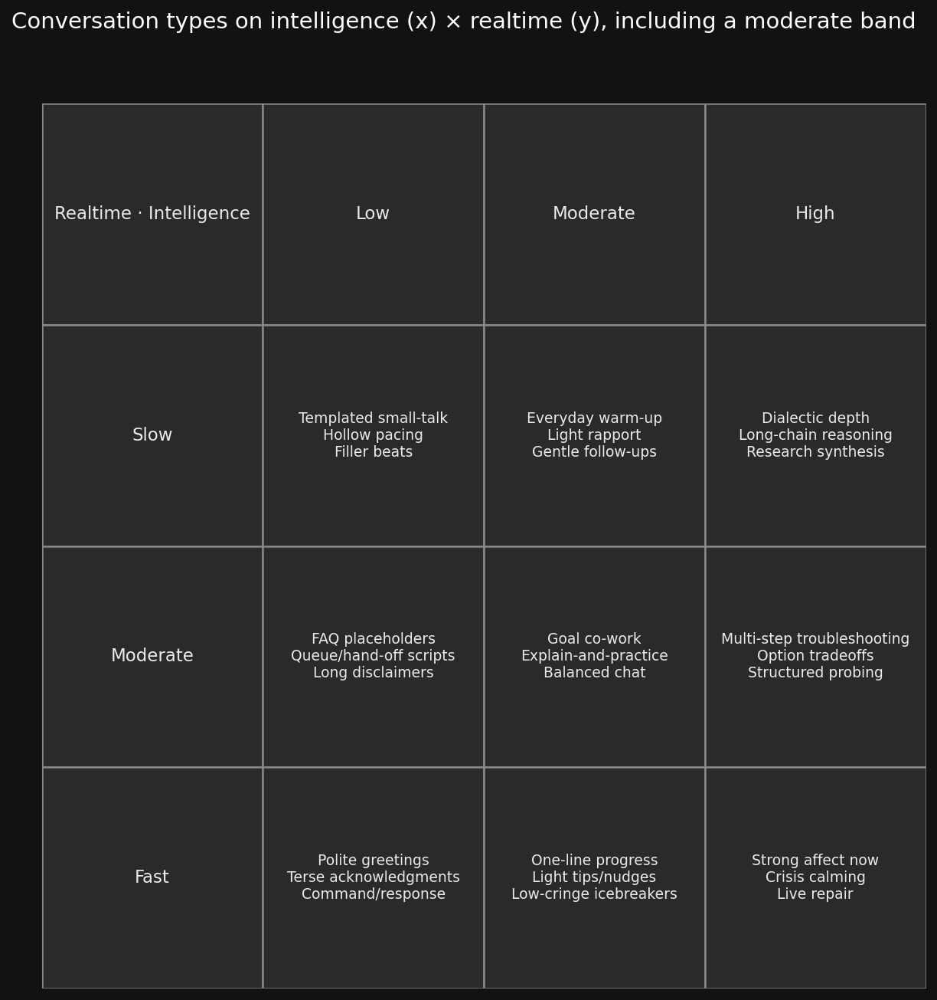

# Conversation grid: intelligence vs realtime

Axes: x = Low / Moderate / High intelligence (columns); y = Slow / Moderate / Fast realtime (rows). Top row labels the x-axis; left column labels the y-axis.

**Figure (matplotlib + YAML):** regenerate with

```bash
python3 tools/scripts/draw_labeled_grid.py \
  docs/companion_harness/conversation_intelligence_realtime_grid.yaml \
  -o docs/companion_harness/conversation_intelligence_realtime_grid.png
```

Source data: [conversation_intelligence_realtime_grid.yaml](/docs/companion_harness/conversation_intelligence_realtime_grid.yaml). Skill: [.cursor/skills/conversation-grid-matplotlib/SKILL.md](/.cursor/skills/conversation-grid-matplotlib/SKILL.md).


