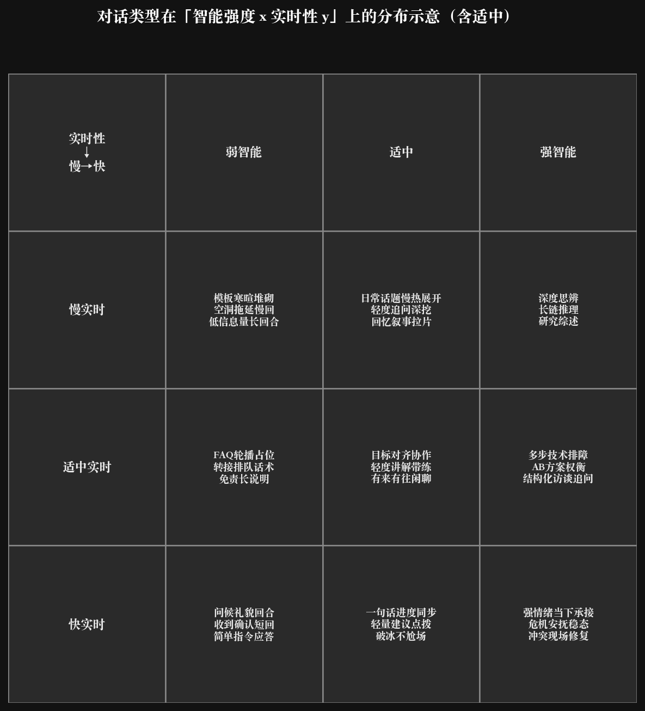

# Conversation grid: intelligence vs realtime

Axes: x = 弱智能 / 适中 / 强智能 (columns); y = 慢实时 / 适中实时 / 快实时 (rows). Top row labels the x-axis; left column labels the y-axis.

**Figure (matplotlib + YAML):** regenerate with

```bash
python3 .cursor/skills/conversation-grid-matplotlib/scripts/draw_labeled_grid.py \
  .cursor/skills/conversation-grid-matplotlib/examples/conversation_intelligence_realtime_grid.yaml \
  -o docs/conversation_intelligence_realtime_grid.png
```

Source data: [.cursor/skills/conversation-grid-matplotlib/examples/conversation_intelligence_realtime_grid.yaml](../.cursor/skills/conversation-grid-matplotlib/examples/conversation_intelligence_realtime_grid.yaml). Skill: [.cursor/skills/conversation-grid-matplotlib/SKILL.md](../.cursor/skills/conversation-grid-matplotlib/SKILL.md).

Optional Mermaid `block` source (editor preview only, duplicates YAML; edit [.mmd](conversation_intelligence_realtime_grid.mmd) if you use it): [conversation_intelligence_realtime_grid.mmd](conversation_intelligence_realtime_grid.mmd).


