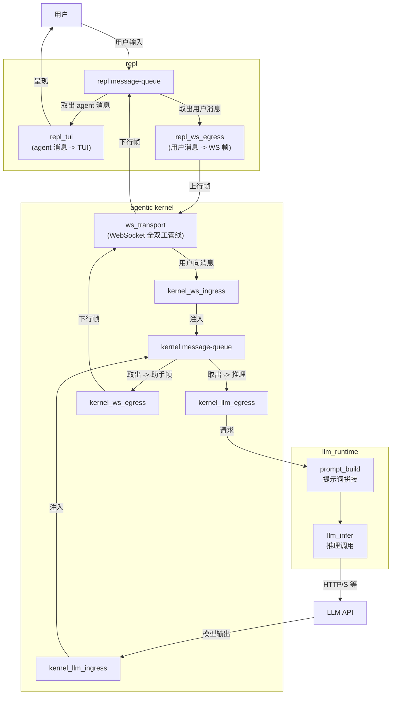

# iMate / Agentic Companion：概念架构

面向 **Android iMate** 与后端 **Agentic Companion Kernel** 对齐的阅读材料：描述客户端经 WebSocket 与 `run_turn`、上游 LLM 之间的**概念关系**（不展开实现细节）。

- 代码入口：`app/api/v1/endpoints/chat.py`（`/api/v1/chat/ws`）、`app/services/companion_chat_service.py`、`app/core/agentic_kernel/companion/turn.py`
- API 行为与 WS 约定：`[app/api/ENDPOINTS.md](../../app/api/ENDPOINTS.md)`

启用异步双路（Dual-LLM）时，前台 chat 先随一轮 WS 响应返回；后台 tool 侧完成后可能经**同一连接**再推送 assistant 帧；连接级队列与落库规则以前述文档为准。

**分层（传输 vs 逻辑）**：WebSocket 在 **repl/client 与 agent 的逻辑会话之下**。同一 TCP/WebSocket 连接上：

- **传输层 / 连接确认**：ping、pong、`client_context_ack` 等由路由 **直接** `send_json`，不入队；仅表示链路存活与时间上下文校验。
- **逻辑层 / 对话下行**：发往客户端的助手业务 JSON（foreground、tool 异步补帧、kickoff、HTTP 映射错误帧）经 `**asyncio.Queue`** + `**chat_ws_outbound_pump`**（`[app/services/chat_websocket_session.py](../../app/services/chat_websocket_session.py)`）FIFO `send_json`，与 REPL 客户端侧约定的 agent 对话顺序一致。

**REPL 客户端队列（`tools/inty_v2_repl`）**：上行用户帧 `[post_turn](../../tools/inty_v2_repl/backend_chat_ws.py)` 仅 `ws.send`，在 **WebSocket/TCP 发送侧 FIFO** 排队（服务端仍按连接串行处理对话）；下行助手与错误 JSON 由 recv 协程写入 `**_response_q`**（`asyncio.Queue`），终端经 `[pop_downlink_item](../../tools/inty_v2_repl/repl_message_io.py)` 非阻塞取出。

**队列中心化下行（inty-ws）**：生产路径 `/api/v1/chat/ws` 使用上述队列与 pump。`**/ws/verify`** 也使用同一套 queue + pump（与 `/ws` 一致的业务 FIFO），但每帧仅做一次最简 `chat.completions`（system + user），不经 Agent runtime / companion；不落 chat_history（详见 `chat_completions_websocket_verify` docstring）。

**逻辑架构（消息路径）**：先约定逻辑名称（与实现符号不必一一同名），再按**消息传递方向**画图。

| 逻辑名                      | 含义                                                                       |
| ------------------------ | ------------------------------------------------------------------------ |
| **用户**                   | 人机边界                                                                     |
| **repl**                 | REPL 会话壳：内含 **repl message-queue** 与两个消费者                                |
| **repl message-queue**   | 收集并暂存：**用户输入**、**经 WS 下行的 agent 侧消息**                                    |
| **repl_tui**             | 从 repl message-queue **取出 agent 消息**，驱动 **TUI** 呈现给用户                    |
| **repl_ws_egress**       | 从 repl message-queue **取出用户消息**，封装为 **上行 WS 帧**                          |
| **ws_transport**         | **WebSocket 全双工管线**：只做比特/帧级双向搬运，**不含**回合语义                               |
| **agentic_kernel**       | 编排壳：内含 **kernel message-queue** 与四个方向的适配                                 |
| **kernel message-queue** | 收集并暂存：**经 WS 来自用户的消息**、**经 llm_runtime 来自 LLM 的消息**（含多轮/异步帧时在逻辑上仍汇总为此队列） |
| **kernel_ws_ingress**    | 从 ws_transport **接收用户向消息**，**注入** kernel message-queue                   |
| **kernel_llm_ingress**   | 从 **LLM API** 侧 **接收模型输出**，**注入** kernel message-queue                   |
| **kernel_llm_egress**    | 从 kernel message-queue **取出**待推理上下文，交给 llm_runtime                       |
| **kernel_ws_egress**     | 从 kernel message-queue **取出**待发助手帧，送到 ws_transport                       |
| **llm_runtime**          | **提示词拼接** + **LLM inference 调用**（对 kernel 暴露「一次调用」边界）                    |
| **LLM API**              | 外部模型服务                                                                   |

下图箭头均为**消息**流向（谁写入谁、谁读出谁）；控制帧、鉴权、队列泵等实现细节见上文「分层」与下一张实现细化图。

**小结（逻辑图 vs 实现）**：上图为**理想化**消息路径；下表将图中要素与仓库行为逐条对照（「是否合理」指作为教学抽象是否自洽，「与代码」指是否宜按字面当作逐函数实现）。

| 图上要素                            | 是否合理   | 与代码                                              |
| ------------------------------- | ------ | ------------------------------------------------ |
| 全双工 WS 管线                       | 是      | 一致                                               |
| repl 下行：WS -> 队列 -> TUI         | 是      | 与 `_response_q` 与 `pop_downlink_item` 等 drain 一致 |
| repl 上行：队列 -> WS                | 弱      | 实为 `post_turn` 直连 `ws.send`，非从同一队列出队             |
| 单一 kernel message-queue         | 教学上可接受 | 实为 recv 路径、`outbound_queue`、`bg_queue`、进程内状态等多结构 |
| LLM 输出注入同一 kernel message-queue | 概念汇总   | 实为调用链返回与组帧，经 `outbound_queue` 等写出，非独立「先入全局队列」    |

**实现细化**：同一链路在仓库中的近似映射（路由、`run_turn`、连接级队列名），可与上表逻辑名对照。

控制帧（ping/pong、client_context_ack）不经 `outbound_queue`，由 `_handle_chat_websocket_control_json` 直连 `send_json`（见上文「分层」）。上图仅描述生产 `/api/v1/chat/ws`；`/ws/verify` 共用**服务端出站 message-queue + 顺序写出**，编排为最简 `chat.completions`，不经 CCS/CM/RT。