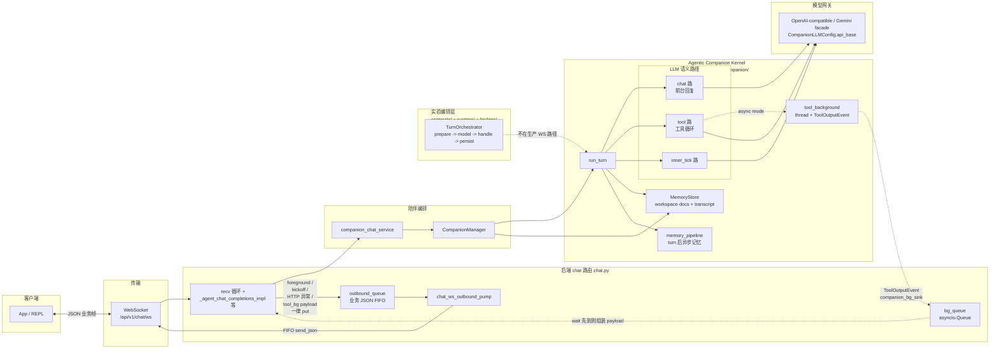

# iMate / Agentic Companion：概念架构

面向 **Android iMate** 与后端 **Agentic Companion Kernel** 对齐的阅读材料：描述客户端经 WebSocket 与 `run_turn`、上游 LLM 之间的**概念关系**（不展开实现细节）。

- 代码入口：`app/api/v1/endpoints/chat.py`（`/api/v1/chat/ws`）、`app/services/companion_chat_service.py`、`app/core/agentic_kernel/companion/turn.py`
- API 行为与 WS 约定：[`app/api/ENDPOINTS.md`](../../app/api/ENDPOINTS.md)
- Companion kernel 存储、prompt 切片与 `context.json` 细节：[`app/core/agentic_kernel/companion/README.md`](../../app/core/agentic_kernel/companion/README.md)

启用异步双路（Dual-LLM）时，前台 chat 先随一轮 WS 响应返回；后台 tool 侧完成后可能经**同一连接**再推送 assistant 帧；连接级队列与落库规则以前述文档为准。异步双路在 kernel 内拆成两套 prompt：前台 chat 路使用面向自然回复与 significance perception 的 system，后台 tool 路使用更紧凑的工具 system。

**分层（传输 vs 逻辑）**：WebSocket 在 **repl/client 与 agent 的逻辑会话之下**。同一 TCP/WebSocket 连接上：
- **传输层 / 连接确认**：ping、pong、`client_context_ack` 等由路由 **直接** `send_json`，不入队；仅表示链路存活与时间上下文校验。
- **逻辑层 / 对话下行**：发往客户端的助手业务 JSON（foreground、tool 异步补帧、kickoff、HTTP 映射错误帧）经 **`asyncio.Queue`** + **`chat_ws_outbound_pump`**（[`app/services/chat_websocket_session.py`](../../app/services/chat_websocket_session.py)）FIFO `send_json`，与 REPL / App 侧约定的 agent 对话顺序一致。

**队列中心化下行（inty-ws）**：生产路径 `/api/v1/chat/ws` 使用上述队列与 pump。**`/ws/verify`** 也使用同一套 queue + pump（与 `/ws` 一致的业务 FIFO），但每帧仅做一次最简 `chat.completions`（system + user），不经 Agent runtime / companion；不落 chat_history（详见 `chat_completions_websocket_verify` docstring）。

控制帧（ping/pong、client_context_ack）不经 `outbound_queue`，由 `_handle_chat_websocket_control_json` 直连 `send_json`（见上文「分层」）。上图仅描述生产 `/api/v1/chat/ws`；`/ws/verify` 共用 **OQ + PUMP**，编排为最简 `chat.completions`，不经 CCS/CM/RT。

## 当前代码结构

- **生产路径在 `companion/`**：`companion_chat_service.run_companion_chat_turn_for_api` 按已选模型和 runtime fingerprint 取得 `CompanionManager`，再以 `(user_id, agent_id, chat_id)` 建立 `CompanionSession`。API 里的 `agent_id` 在 kernel 内作为 `companion_id`。
- **会话与存储**：`CompanionManager` 复用一个 `CompanionLLMClient`，为每个 session 绑定 `MemoryStore`。启用数据库 DSN 时，`IDENTITY.md` / `SOUL.md` / `USER.md` / `MEMORY.md` / `transcript.jsonl` / `context.json` 等逻辑路径写入 `companion_workspace_document_versions`，以 append-only 版本表的最新版本为准。
- **单轮执行**：`companion/turn.py::run_turn` 加载 `context.json`、workspace prompt bundle、transcript window，可选 transcript compaction；随后由 `prompt_stack.companion_turn_tools_and_system_messages` 生成 tools、system messages 和 `TurnRouteMode`。
- **路由模式**：`TurnRouteMode` 覆盖 `chat_only_sync`、`sync_tool_loop`、`async_foreground_chat_background_tool`、`inner_tick_sync`、`heartbeat_sync`。同步 tool loop 在 `run_turn` 内最多 24 轮调用模型和工具；异步双路由 `tool_background.start_tool_background_job` 在线程里完成工具 loop，前台 chat 用 `asyncio.to_thread` 加 timeout 返回。
- **写入与记忆**：普通用户轮次和 assistant 前台回复由 `run_turn` 写入 `transcript.jsonl`；后台工具若产生用户可见输出，会追加 `source=tool_bg` 的 assistant 行和 `tool_background.jsonl` 日志。非 inner_tick 轮次会调度或同步执行 `memory_pipeline`。
- **实验编排层不在生产 WS 路径**：`contracts/`、`runtime/TurnOrchestrator`、`bridges/experimental_bridge.py` 提供 `prepare_turn -> invoke_model -> handle_response -> persist` 的通用实验接口；当前 `/api/v1/chat/ws` 生产调用链没有经过 `TurnOrchestrator`。
- **Provider 边界**：生产 companion 配置从 `config.yaml` 的 `agent.chat_llm_base_url` / `agent.base_url` 生成 `CompanionLLMConfig.api_base`，默认回退 OpenRouter；`providers/` 目录保留 OpenAI-compatible 和 Gemini facade 能力。

## 架构评审

- **生产 kernel 与实验 orchestrator 并存**：`run_turn` 是真实生产核心，但 `TurnOrchestrator` 也是 "runtime" 命名，且只被 experimental bridge 使用。读者容易把两者都理解为主路径，维护者也需要同时记住两套抽象边界。
- **`run_turn` 职责过宽**：同一函数内包含 prompt 装配、transcript compaction、LangSmith trace、同步/异步 LLM 分支、工具执行、transcript 持久化和 memory pipeline 调度。功能集中降低了跨路径漂移，但让局部测试、错误隔离和后续拆分成本变高。
- **异步双路并发边界复杂**：生产 WS 路径使用 `asyncio.Queue` 保证业务帧 FIFO；后台工具路径又使用线程、`queue.Queue`、主 event loop 的 `call_soon_threadsafe` 和 abort flag。取消、补帧、落库与 LangSmith parent run 结束语义分散在 `turn.py`、`tool_background.py` 和 `chat.py`。
- **prompt 真源存在重复装配**：普通路径先生成一套 system messages；异步双路会再次生成 tool-side 和 chat-side system。这样可以针对不同 LLM 任务降噪，但 prompt slice、工具列表与 significance perception 的演进需要额外保持一致。
- **存储边界清晰但入口文档不足**：companion README 已解释 `MemoryStore` 和版本表，但本架构文档原先只画了 LLM 路径，缺少 transcript、workspace docs、memory pipeline 与后台工具补帧的整体关系。

## 改进方向

- **收敛生产 turn 编排边界**：把 `run_turn` 中稳定的阶段显式拆成内部步骤对象或小函数，例如 `load_turn_context`、`resolve_turn_route`、`execute_turn_route`、`persist_turn_outputs`。第一步不改变外部 API，只让生产路径拥有与实验 `TurnOrchestrator` 类似的可读阶段边界；随后再决定是否让 `TurnOrchestrator` 接管这些阶段，或将实验层重命名为非生产 bridge，避免两套 "runtime" 概念长期并存。
