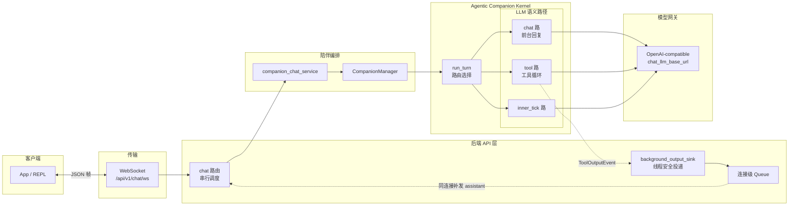

# iMate / Agentic Companion：概念架构

面向 **Android iMate** 与后端 **Agentic Companion Kernel** 对齐的阅读材料：描述客户端经 WebSocket 与 `run_turn`、上游 LLM 之间的**概念关系**（不展开实现细节）。

- 代码入口：`app/api/v1/endpoints/chat.py`（`/api/v1/chat/ws`）、`app/services/companion_chat_service.py`、`app/core/agentic_kernel/companion/turn.py`
- 契约与集成清单：[`docs/FR_INTY_V2_CHAT_WS_INTEGRATION_PLAN.md`](../FR_INTY_V2_CHAT_WS_INTEGRATION_PLAN.md)
- API 行为摘要：[`app/api/ENDPOINTS.md`](../../app/api/ENDPOINTS.md)

启用异步双路（Dual-LLM）时，前台 chat 先随一轮 WS 响应返回；后台 tool 侧完成后可能经**同一连接**再推送 assistant 帧；连接级队列与落库规则以前述文档为准。

