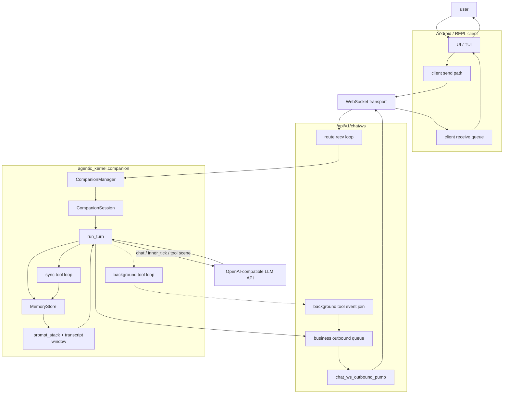
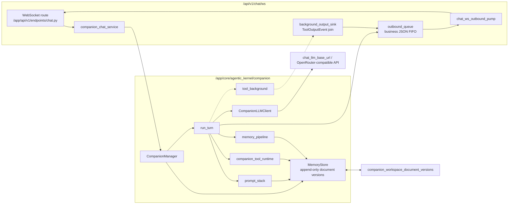

# iMate / Agentic Companion: architecture review

This document aligns Android iMate, the backend WebSocket chat path, and the current Agentic Companion Kernel implementation. It is for engineers deciding where a behavior belongs: transport framing lives in the WebSocket service, turn semantics live in `/app/core/agentic_kernel/companion`, and persistent companion state is stored as versioned workspace documents through `MemoryStore`.

- Code entry points: `/app/api/v1/endpoints/chat.py` (`/api/v1/chat/ws`), `/app/services/companion_chat_service.py`, `/app/core/agentic_kernel/companion/manager.py`, `/app/core/agentic_kernel/companion/turn.py`
- API behavior and WebSocket contract: `/app/api/ENDPOINTS.md`
- Companion package notes: `/app/core/agentic_kernel/companion/README.md`

## Current architecture

### Production turn path

The production chat path is not a generic "agent runtime" wrapper. It is the companion-specific stack:

1. `/api/v1/chat/ws` receives user JSON and resolves chat/session context.
2. `/app/services/companion_chat_service.py` builds or reuses a cached `CompanionManager` for the resolved chat model and runtime config.
3. `CompanionManager.get_or_create_session` maps `(user_id, companion_id, chat_id)` to a `CompanionSession`, a synthetic workspace path, a shared `CompanionLLMClient`, and a `MemoryStore`.
4. `CompanionManager.run_turn` delegates directly to `/app/core/agentic_kernel/companion/turn.py::run_turn`.
5. `run_turn` loads context, prompt bundle, transcript, and optional transcript compaction state; builds the system prompt stack and tool schemas; calls the LLM; executes tool loops when needed; appends transcript rows; and schedules or runs the memory pipeline.

`/app/core/agentic_kernel/runtime/turn_orchestrator.py` and `/app/core/agentic_kernel/contracts/turn.py` are a separate experimental abstraction. They are reachable through `/app/core/agentic_kernel/bridges/experimental_bridge.py`, but the production WebSocket companion path does not call `TurnOrchestrator`.

### Package roles

| Path | Current role |
| --- | --- |
| `/app/core/agentic_kernel/companion` | Production companion implementation: session manager, turn execution, prompt stack, tools, memory pipeline, background tools, heartbeat/inner tick, runtime inspection. |
| `/app/core/agentic_kernel/contracts` | Minimal Pydantic contracts for the experimental orchestrator path. |
| `/app/core/agentic_kernel/runtime` | Generic `TurnOrchestrator` and persistence protocol used by experimental bridge, not by production `run_turn`. |
| `/app/core/agentic_kernel/bridges` | Experimental adapter from workspace-style payloads to `TurnInput`. |
| `/app/core/agentic_kernel/providers` | Provider facades for OpenAI-compatible and Gemini APIs. |
| `/app/core/agentic_kernel/tools` | Reusable tool registry/runtime utilities used by companion background tool execution and dispatchers. |
| `/app/core/agentic_kernel/prompting` | LangChain-style prompt assembler path, separate from the production companion `prompt_stack`. |

### State and persistence

- Session cache: `CompanionManager._sessions` keeps process-local `CompanionSession` objects keyed by `user_id:companion_id:chat_id`.
- Workspace identity: production API uses `/var/lib/inty/companion_workspaces/{user_id}/{companion_id}/{chat_id}` as a synthetic workspace root. The path scopes state, but production text state is authoritative in `MemoryStore`.
- Document store: with PostgreSQL configured, `MemoryStore` uses `SqlAlchemyMemoryRepository` and appends versions to `companion_workspace_document_versions`; latest state is the greatest `sequence_id` for `(user_id, companion_id, chat_id, document_kind[, calendar_date])`.
- In-memory fallback: without a repository, `MemoryStore` is process-local and suitable for local harnesses/tests.
- Turn persistence: production `run_turn` writes `transcript.jsonl` rows and memory documents directly through `MemoryStore`; it does not use `runtime.persistence.TurnPersistence`.
- Memory pipeline: normal chat turns append user/assistant transcript rows and then call `schedule_memory_update_after_turn` by default. Inner tick turns persist transcript rows but skip the memory pipeline.

### Prompt and LLM routing

- `run_turn` loads `ContextMeta`, `PromptBundle`, and transcript rows, then calls `companion_turn_tools_and_system_messages` in `/app/core/agentic_kernel/companion/prompt_stack.py`.
- System messages come from package prompts, workspace documents such as `IDENTITY.md`, `SOUL.md`, `USER.md`, `MEMORY.md`, runtime context, bootstrap state, implicit signals, and optional significance-perception slices.
- The LLM client is `CompanionLLMClient`; production config is assembled in `/app/services/companion_chat_service.py` from `agent.chat_llm_base_url`/`agent.base_url`, API keys, and the resolved chat model. The default fallback base URL is OpenRouter-compatible.
- The three labels "chat", "tool", and "inner_tick" are scene/model-routing roles inside the same companion turn executor, not three independent runtimes.

### Tool and async background routing

`run_turn` has two main execution modes:

- Synchronous tool loop: up to `_MAX_TOOL_ROUNDS`, call `CompanionLLMClient.chat_completion`, execute each tool call through `companion_tool_runtime.execute_tool_call`, append tool messages, refresh prompt stack, and continue.
- Async foreground chat + background tool: when `TurnRouteMode.ASYNC_FOREGROUND_CHAT_BACKGROUND_TOOL` is selected, the foreground chat path calls the chat model without tools and returns the assistant text first. In parallel, `start_tool_background_job` runs a tool-side model loop and emits `ToolOutputEvent` through `BackgroundToolEventSink` or the module queue.

The WebSocket service is responsible for turning foreground results, kickoff frames, errors, and background tool payloads into outbound business JSON.

## Transport vs turn logic

WebSocket sits below the logical companion session. On the same TCP/WebSocket connection:

- Transport/control frames: ping, pong, and `client_context_ack` are sent directly by the route handler and are not put into the business outbound queue.
- Business assistant frames: foreground replies, async tool follow-up frames, kickoff frames, and mapped HTTP errors go through an `asyncio.Queue` plus `chat_ws_outbound_pump` in `/app/services/chat_websocket_session.py` for FIFO `send_json`.
- `/ws/verify` shares the same outbound queue/pump pattern, but each frame runs a minimal `chat.completions` request and does not enter `CompanionManager` or `run_turn`.

## Logical message diagram

The diagram is an abstraction. It shows direction of messages, not a one-to-one mapping to functions or queues.

## Implementation mapping

## Architecture critique

- The production companion path and the generic `TurnOrchestrator` path overlap conceptually but are not integrated. This makes "agentic kernel" ambiguous: a reader can reasonably assume `contracts/turn.py` and `runtime/turn_orchestrator.py` define the production boundary, while production actually depends on companion-specific types and direct `MemoryStore` writes.
- `run_turn` owns too many responsibilities: transcript loading/compaction, prompt assembly, route selection, LLM calls, sync tool loop, async background launch, LangSmith parent-run lifecycle, transcript persistence, and memory scheduling. The result is a strong single-function invariant but a weak subsystem boundary.
- Persistence is split by convention rather than by one explicit turn contract. Production transcript and memory state are written inside `run_turn`; background tools also write through store-aware tool runtime; the experimental orchestrator has a separate `TurnPersistence` protocol that production does not use.
- The async foreground/background mode is behaviorally useful but crosses layers: kernel background events are shaped for WebSocket delivery through `BackgroundToolEventSink`, while WebSocket code owns client ordering and payload construction. This is acceptable now, but the boundary is not obvious from type names alone.
- Prompt construction is split across `companion/prompt_stack.py`, `companion/prompts`, workspace document loading, and a separate `/app/core/agentic_kernel/prompting` package. The current production rule is discoverable only after reading code.

## Improvement

Define and migrate toward a single production `CompanionTurnEngine` boundary that keeps existing behavior but separates `run_turn` into explicit steps:

1. `load_turn_context`: read `ContextMeta`, transcript window, compaction state, and prompt bundle from `MemoryStore`.
2. `build_turn_plan`: produce route mode, system messages, tool schemas, model scene, and persistence intent.
3. `execute_turn_plan`: run foreground chat, synchronous tool loop, or async background launch.
4. `commit_turn`: append transcript rows, update compaction/memory state, and emit structured events.

The first concrete improvement should be to introduce the boundary as an internal companion abstraction, not to switch production to the experimental `TurnOrchestrator`. That keeps the stable WebSocket/API behavior intact while making state, persistence, and event emission testable as separate units. After this boundary exists, the generic `TurnOrchestrator` can either be adapted to this companion engine or removed from the production-facing architecture docs as experimental-only.
