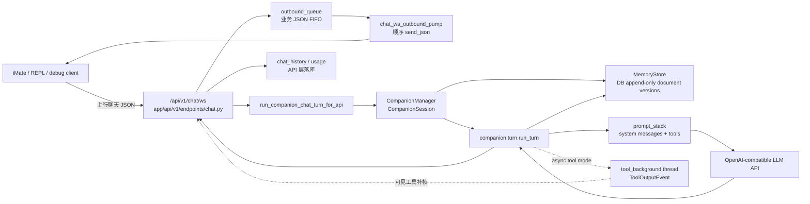

# iMate / Agentic Companion: 当前架构

本文面向维护 iMate Android、REPL 调试工具和后端 companion kernel 的工程师。它描述仓库当前实现, 重点回答三件事: 客户端消息如何进入 `/api/v1/chat/ws`, 生产 companion 回合如何由 `run_turn` 执行, 以及长期记忆和工作区文档如何成为一个虚拟伴侣的状态来源。本文不是未来设计稿, 也不把 legacy HTTP chat completions 路径描述为 agentic companion 主路径。

- 生产 WebSocket 入口: [`/app/api/v1/endpoints/chat.py`](/app/api/v1/endpoints/chat.py) 的 `_agent_chat_completions_impl`
- API 与帧约定: [`/app/api/ENDPOINTS.md`](/app/api/ENDPOINTS.md)
- Companion API 适配层: [`/app/services/companion_chat_service.py`](/app/services/companion_chat_service.py)
- Companion kernel 主执行器: [`/app/core/agentic_kernel/companion/turn.py`](/app/core/agentic_kernel/companion/turn.py)
- Companion 包内说明: [`/app/core/agentic_kernel/companion/README.md`](/app/core/agentic_kernel/companion/README.md)
- 分层记忆说明: [`/docs/imate/MEMORY_PIPELINE.md`](/docs/imate/MEMORY_PIPELINE.md)

## 范围与边界

| 区域 | 当前事实 |
| --- | --- |
| iMate Android | [`ChatWebSocketRemoteDataSource`](/imate_android_app/app/src/main/java/com/inty/imate/chat/data/datasource/ChatWebSocketRemoteDataSource.kt) 连接 `api/v1/chat/ws`, 上行聊天帧和 `user_signed_on` 控制帧, 下行由 [`ChatMainRepository`](/imate_android_app/app/src/main/java/com/inty/imate/chat/data/ChatMainRepository.kt) 写入本地消息流。 |
| IntelliMate Android | 仍可保持主 WebSocket 连接; release 发送聊天仍以 HTTP completions 为主, debug 可走 WebSocket。具体见 [`/app/api/ENDPOINTS.md`](/app/api/ENDPOINTS.md)。 |
| 生产 companion 后端 | 只有 WebSocket chat route 会把一轮聊天交给 `app.core.agentic_kernel.companion`。HTTP completions 仍是 legacy agent 路径。 |
| `/api/v1/chat/ws/verify` | 共用 WebSocket 出站队列和 pump, 但只做单次 `chat.completions`; 不经过 `CompanionManager` / `run_turn`, 不写 chat_history。 |
| WebSocket companion 连接 | 每个连接用 `companion_turn_lock` 串行化普通用户回合、proactive heartbeat 和 async tool background 补帧落库; assistant 业务帧仍经 outbound queue。 |
| `runtime/TurnOrchestrator` | 是通用 turn 合同和实验桥使用的并行管线, 当前生产 companion 主链路不经过它。 |

## 生产消息路径



控制帧和业务帧分层处理:

- `ping`、`client_context_ack` 等连接控制帧由路由直接 `send_json`, 不进入业务下行队列。
- assistant 业务 JSON、LLM 错误映射帧、异步 tool 可见补帧经 `asyncio.Queue` 和 [`chat_ws_outbound_pump`](/app/services/chat_websocket_session.py) FIFO 写回客户端。
- REPL 的上行 `post_turn` 直接 `ws.send`; 下行由 `_response_q` 和 [`pop_downlink_item`](/tools/inty_v2_repl/repl_message_io.py) 消费。它不是和服务端共用一个端到端消息队列, 只是传输侧各自维护 FIFO。

### WebSocket 序列化与后台 tool 汇合

[`chat_completions_websocket`](/app/api/v1/endpoints/chat.py) 在单个连接内维护四类 companion 协调状态:

- `companion_turn_lock`: 串行化 `_agent_chat_completions_impl`、proactive heartbeat 和 async tool background 补帧的 chat_history / transcript 相关副作用。
- `bg_queue`: `companion_bg_sink` 从后台 tool 线程用 `loop.call_soon_threadsafe` 投递 `ToolOutputEvent`, WebSocket 主循环与 `receive_text()` 竞争消费。
- `ws_fg_pending`: 保存前台 assistant 帧对应的 user message 上下文, 后台可见 tool 结果到达后用同一个 `user_msg_uuid` 关联补帧。
- `companion_hb_ctx`: 记录 `user_signed_on` 或成功聊天后的 heartbeat 坐标, 供连接内 proactive heartbeat worker 触发 synthetic inner tick。

proactive heartbeat 不是客户端上行聊天帧: worker 通过 [`_try_fire_companion_ws_proactive_heartbeat`](/app/api/v1/endpoints/chat.py) 直接调用 `run_companion_chat_turn_for_api`, 传入 `inner_tick_turn=True` 和 `background_output_sink=None`, 然后由 API 层写 `chat_history` 并把 assistant 业务帧放入 outbound queue。

## `app/core/agentic_kernel` 包结构

| 路径 | 职责 |
| --- | --- |
| [`companion/`](/app/core/agentic_kernel/companion) | 生产 companion 内核。包含 `CompanionManager`, `run_turn`, prompt stack, workspace 文档, MemoryStore, tool runtime, memory pipeline, inner tick, async tool background。 |
| [`companion/turn_engine.py`](/app/core/agentic_kernel/companion/turn_engine.py) | REPL-grade 消息组装与 transcript 写入辅助; 复用部分 prompt / transcript 约定, 但不是生产 WebSocket 主执行器。 |
| [`contracts/turn.py`](/app/core/agentic_kernel/contracts/turn.py) | `TurnInput` / `TurnOutput` / `MessageSnapshot` 通用合同。 |
| [`runtime/turn_orchestrator.py`](/app/core/agentic_kernel/runtime/turn_orchestrator.py) | `prepare_turn -> invoke_model -> handle_response -> persist` 的薄编排器。当前不承载生产 companion 回合。 |
| [`bridges/experimental_bridge.py`](/app/core/agentic_kernel/bridges/experimental_bridge.py) | 把通用 `TurnOrchestrator` 暴露成实验入口。 |
| [`llm/`](/app/core/agentic_kernel/llm) | OpenAI-compatible `chat.completions` 端口、OpenRouter tool 参数、LangSmith completion enrichment。 |
| [`providers/`](/app/core/agentic_kernel/providers) | OpenAI-compatible 与 Gemini provider facade。 |
| [`tools/`](/app/core/agentic_kernel/tools) | 通用 tool registry 和 official assistant 风格 tool loop; 与 companion 自己的 tool runtime 并存。 |
| [`prompting/assembler.py`](/app/core/agentic_kernel/prompting/assembler.py) | LangChain 风格提示拼装线, 不是生产 companion 的主要 prompt stack。 |

## Companion 回合执行

`run_companion_chat_turn_for_api` 先用 `user_id + agent_id + chat_id` 取 `CompanionSession`; 其中 API 的 `agent_id` 原样作为 companion 层的 `companion_id`。`CompanionManager` 初始化 `MemoryStore`, 写入 `context.json`, 并确保 `IDENTITY.md`、`SOUL.md`、`USER.md`、`MEMORY.md`、`transcript.jsonl` 五件套存在。

`USER_INTERACTIVE` bootstrap 下, API 适配层在调用 `run_turn` 前可能执行 `_maybe_append_companion_ws_session_system`: 对当前 WebSocket session 写一条 `companion_ws_session_system` system message 到 PostgreSQL `chat_history` 和 companion `transcript.jsonl`, 并在 `context.json` 中标记 `companion_ws_session_system_written=true`, 避免同一 session 重复注入。

`run_turn` 一轮执行包含以下阶段:

1. **加载状态**: 从 `MemoryStore` 读取 `context.json`, prompt bundle, `transcript.jsonl`; 如启用 transcript compaction, 先把旧对话折叠成 system snapshot。
2. **组装 prompt**: [`prompt_stack.companion_turn_tools_and_system_messages`](/app/core/agentic_kernel/companion/prompt_stack.py) 读取 `ContextMeta`、prompt bundle、inner tick 状态和 implicit signal, 生成多段 system messages 和本轮 tools。
3. **选择路由**: [`turn_routes.resolve_turn_route_mode`](/app/core/agentic_kernel/companion/turn_routes.py) 给本轮标记执行策略。
4. **调用模型**: `CompanionLLMClient` 走 `chat_llm_base_url` 的 OpenAI-compatible `chat.completions`。
5. **执行工具**: 同步 tool loop 最多 24 轮; 每轮 tool 结果后重新刷新 prompt stack 和 tools。异步双路模式则前台 chat 先返回, 后台 tool thread 独立跑工具链。
6. **落 transcript**: 用户行和助手行 append 到 `transcript.jsonl`; tool background 可额外 append `source=tool_bg` 助手行和 `tool_background.jsonl`。
7. **更新记忆**: 普通用户回合调度 `memory_update_after_turn`; inner tick 不走记忆管线。
8. **观测**: runtime inspect 与 LangSmith parent run 贯穿前台和 tool background。

### 路由模式

| `TurnRouteMode` | 触发条件 | 行为 |
| --- | --- | --- |
| `CHAT_ONLY_SYNC` | 非 inner tick, 本轮无 tools | 单次 chat completion; 可使用 dual structured response 解析 `significance_perception`。 |
| `SYNC_TOOL_LOOP` | 本轮有 tools 且未启用 async tool background | 同步多轮 tool loop, 最多 24 轮。 |
| `ASYNC_FOREGROUND_CHAT_BACKGROUND_TOOL` | 本轮有 tools 且启用 async tool background | 前台 chat 分支无 tools 先回复; tool 分支在后台线程执行, 有用户可见结果时经同一 WebSocket 连接补 assistant 帧。 |
| `INNER_TICK_SYNC` | `inner_tick_turn=True`, maintenance | 合成用户文本驱动内在维护; 可使用 inner tick tools; 跳过普通记忆更新管线。 |
| `HEARTBEAT_SYNC` | `inner_tick_turn=True`, proactive chat | 合成 proactive heartbeat 用户标记; 不启用 tools。 |

特殊上行 `messageType=IMPLICIT_USER_SIGNED_ON` 由 WebSocket companion 支持: API 层不写该用户行到 PostgreSQL `chat_history`, companion transcript 会写 synthetic user 行; prompt stack 会去掉 tools, 使模型做 chat-only 问候。

## 状态与持久化

当前 companion 的世界不是独立 world engine, 而是 `MemoryStore` 中的一组版本化文档加工具副作用:

| 文档或状态 | 作用 |
| --- | --- |
| `IDENTITY.md` | companion 身份和角色定位。 |
| `SOUL.md` | 稳定价值观、边界、互动承诺。 |
| `USER.md` | 对用户的长期理解。 |
| `MEMORY.md` | 跨日语义记忆。 |
| `memory/daily/{date}.md` | 当日逐轮情景记忆。 |
| `memory/{date}.md` | 当日 gist 摘要。 |
| `transcript.jsonl` | 权威对话轨迹, 也是下一轮上下文来源。 |
| `context.json` | `ContextMeta`, 包括 `context_mode`、`user_id`、`companion_id`、`chat_id` 和 bootstrap 标志。 |
| `.companion_*` JSON | memory pipeline 状态、context compaction 状态、schedule queue、image gate 等运行状态。 |

启用 PostgreSQL DSN 时, `MemoryStore` 通过 `SqlAlchemyMemoryRepository` 写入 `companion_workspace_document_versions`。同一 `(user_id, companion_id, chat_id, document_kind, calendar_date)` 下 append-only 追加版本, 读取时取最新 `sequence_id`。生产配置 `repository_only_workspace_text=True`, 因此 `/var/lib/inty/companion_workspaces/...` 是用于路径归一化的合成根, 不是权威磁盘工作区。

## 记忆管线

普通用户回合结束后, `schedule_memory_update_after_turn` 默认异步执行:

1. 追加情景记忆: `memory/daily/{date}.md`
2. 按节拍重写单日摘要: `memory/{date}.md`
3. 按节拍重写语义记忆: `MEMORY.md`
4. 按节拍策展 `USER.md` 和 `SOUL.md`

`context_mode` 由 [`experience_profile.py`](/app/core/agentic_kernel/experience_profile.py) 规范化, 并决定是否把私人记忆层注入 system prompt。内在节拍回合用于维护和主动心跳, 不触发普通记忆管线。

## 架构批判

| 观察 | 风险 |
| --- | --- |
| 生产 companion 主链路在 `companion.turn.run_turn`, 但包内另有 `runtime/TurnOrchestrator` 和实验桥。 | 新维护者容易误以为 `TurnOrchestrator` 是生产内核入口, 文档和代码命名需要持续澄清。 |
| `run_turn` 同时负责状态加载、prompt 组装、路由、LLM 调用、tool loop、持久化、记忆调度和观测。 | 单函数语义负载高; 修改路由或持久化时容易误伤其他阶段, 单元测试也难以只覆盖一个阶段。 |
| 同步 tool loop、async foreground/background tool loop、official assistant tool loop 三套机制并存。 | 工具协议和 prompt 刷新规则需要人工保持一致; 背景线程和全局 queue 增加竞态、取消和可观测性复杂度。 |
| MemoryStore 已经是生产权威, 但大量概念仍叫 workspace/path/file。 | 对线上排障不友好; 容易把合成路径误解为磁盘状态, 或漏查 append-only 版本表。 |
| `chat.py` 的 WebSocket 适配层同时承担鉴权、订阅、chat_history、companion 调用、错误映射和背景补帧汇合。 | 传输协议、业务落库和 agent runtime 的边界偏厚; WebSocket 相关回归测试成本上升。 |
| 连接内 `companion_turn_lock`、`bg_queue`、`ws_fg_pending`、heartbeat worker 分散在 WebSocket endpoint 局部闭包中。 | 当前并发约束只能靠读长函数理解; 新增控制帧、后台事件或主动消息时容易破坏同一连接内的顺序和落库一致性。 |

## 改进方向

优先改进点: **抽出生产 WebSocket companion 协调器, 先固定连接边界, 再拆 `run_turn` 阶段**。

建议新增一个面向 `/api/v1/chat/ws` 的 `CompanionWebSocketCoordinator` 或等价结构, 将当前 endpoint 局部状态显式化:

```text
receive_frame/control_frame
  -> serialize_companion_turn
  -> dispatch_foreground_turn | dispatch_proactive_heartbeat
  -> correlate_background_tool_event
  -> enqueue_business_payload
```

收益:

- 把 `companion_turn_lock`、`bg_queue`、`ws_fg_pending`、`companion_hb_ctx`、heartbeat worker 的职责收拢到一个可测试边界。
- 让 endpoint 保持鉴权、依赖注入和帧解析职责, companion 协调器负责连接内顺序、后台事件关联和业务下行。
- 更容易补 WebSocket 级回归测试: 普通前台回合、后台 tool 补帧、proactive heartbeat 三类路径可共享同一协调器夹具。
- 为后续拆分 `run_turn` 阶段提供稳定入口, 避免同时改 transport 边界和 kernel 内部阶段。

后续改进点: **把生产 companion 回合拆成显式阶段合同, 但不立即替换现有行为**。

建议新增一个面向生产的 `CompanionTurnPipeline` 或等价结构, 将 `run_turn` 当前隐含阶段显式化:

```text
load_state -> assemble_prompt -> resolve_route -> execute_route -> persist_turn -> schedule_memory -> build_result
```

收益:

- 让生产主链路拥有比通用 `TurnOrchestrator` 更贴近 companion 语义的阶段边界。
- 同步 tool loop 与 async tool background 可共享 `assemble_prompt`、`refresh_prompt_stack`、`persist_turn` 合同, 降低并行机制漂移。
- `MemoryStore`、transcript、chat_history、ToolOutputEvent 的写入边界更清楚, 便于为每个阶段增加窄测试。
- 后续若要把 `TurnOrchestrator` 合同用于生产, 可以通过 adapter 渐进迁移, 而不是一次性重写 `run_turn`。

不建议的改进顺序: 先抽象一个全局 kernel message queue。当前实现没有单一 kernel queue; 强行引入会掩盖 API 入站、出站 business queue、background tool queue、transcript store 之间的真实边界。
