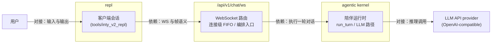
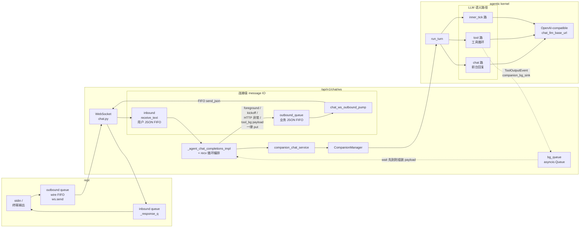

# iMate / Agentic Companion：概念架构

面向 **Android iMate** 与后端 **Agentic Companion Kernel** 对齐的阅读材料：描述客户端经 WebSocket 与 `run_turn`、上游 LLM 之间的**概念关系**（不展开实现细节）。

- 代码入口：`app/api/v1/endpoints/chat.py`（`/api/v1/chat/ws`）、`app/services/companion_chat_service.py`、`app/core/agentic_kernel/companion/turn.py`
- API 行为与 WS 约定：`[app/api/ENDPOINTS.md](../../app/api/ENDPOINTS.md)`

启用异步双路（Dual-LLM）时，前台 chat 先随一轮 WS 响应返回；后台 tool 侧完成后可能经**同一连接**再推送 assistant 帧；连接级队列与落库规则以前述文档为准。

**分层（传输 vs 逻辑）**：WebSocket 在 **repl/client 与 agent 的逻辑会话之下**。同一 TCP/WebSocket 连接上：

- **传输层 / 连接确认**：ping、pong、`client_context_ack` 等由路由 **直接** `send_json`，不入队；仅表示链路存活与时间上下文校验。
- **逻辑层 / 对话下行**：发往客户端的助手业务 JSON（foreground、tool 异步补帧、kickoff、HTTP 映射错误帧）经 `**asyncio.Queue`** + `**chat_ws_outbound_pump`**（`[app/services/chat_websocket_session.py](../../app/services/chat_websocket_session.py)`）FIFO `send_json`，与 REPL 客户端侧约定的 agent 对话顺序一致。

**REPL 客户端队列（`tools/inty_v2_repl`）**：上行用户帧 `[post_turn](../../tools/inty_v2_repl/backend_chat_ws.py)` 仅 `ws.send`，在 **WebSocket/TCP 发送侧 FIFO** 排队（服务端仍按连接串行处理对话）；下行助手与错误 JSON 由 recv 协程写入 `**_response_q`**（`asyncio.Queue`），终端经 `[pop_downlink_item](../../tools/inty_v2_repl/repl_message_io.py)` 非阻塞取出。

**队列中心化下行（inty-ws）**：生产路径 `/api/v1/chat/ws` 使用上述队列与 pump。`**/ws/verify`** 也使用同一套 queue + pump（与 `/ws` 一致的业务 FIFO），但每帧仅做一次最简 `chat.completions`（system + user），不经 Agent runtime / companion；不落 chat_history（详见 `chat_completions_websocket_verify` docstring）。

**逻辑块依赖（理想视图）**：下图只保留 `**repl`**、`**/api/v1/chat/ws**`、`**agentic kernel**` 三块；箭头表示**依赖方向**（调用方依赖被指向方提供的能力）。**用户**在图内与 `**repl`** 对接（打字与阅读终端）；**LLM API provider** 在图内与 `**agentic kernel`** 对接（kernel 发起推理）。陪伴编排仍落在 WS 路由路径上时，依赖关系仍归纳为「WS 块依赖 kernel」。

控制帧（ping/pong、client_context_ack）不经 `outbound_queue`，由 `_handle_chat_websocket_control_json` 直连 `send_json`（见上文「分层」）。上图仅描述生产 `/api/v1/chat/ws`；`/ws/verify` 共用 **OQ + PUMP**，编排为最简 `chat.completions`，不经 CCS/CM/RT。