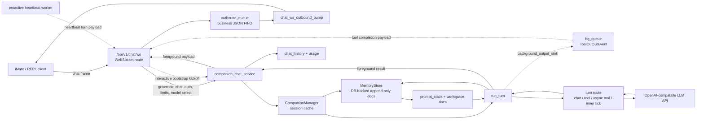

# iMate / Agentic Companion: current architecture

iMate 的后端智能体能力由 `/app/core/agentic_kernel/companion` 承载，并通过 `/app/api/v1/endpoints/chat.py` 的 `/api/v1/chat/ws` 暴露给客户端。本文用于把 Android iMate、REPL、WebSocket 路由、Companion kernel、LLM provider、PostgreSQL 工作区文档版本表之间的关系对齐到当前代码状态；如果只需要排查 API 帧形状，先读 `/app/api/ENDPOINTS.md`，如果只需要排查 Companion 工作区文档与持久化，先读 `/app/core/agentic_kernel/companion/README.md`。

- 生产入口: `/app/api/v1/endpoints/chat.py` (`/api/v1/chat/ws`)
- API 到 kernel 适配: `/app/services/companion_chat_service.py`
- 会话生命周期: `/app/core/agentic_kernel/companion/manager.py`
- 单轮主编排: `/app/core/agentic_kernel/companion/turn.py`
- 下行业务 FIFO: `/app/services/chat_websocket_session.py`
- 工作区文档权威源: `companion_workspace_document_versions` via `/app/core/agentic_kernel/companion/memory_store.py`

## Current state summary

- `/api/v1/chat/ws` 是 iMate companion 的生产对话路径；HTTP completions 仍保留旧 Agent 路径。
- WebSocket 只负责连接与帧传输；业务下行统一进入连接级 `outbound_queue` 后由 `chat_ws_outbound_pump` 顺序 `send_json`。
- 控制帧 `ping`、`client_context`、`user_signed_on` 的 ack 直接 `send_json`，不进入 `outbound_queue`。
- Companion session 以 `(user_id, companion_id, chat_id)` 定位；API 层把 `agent_id` 原样作为 `companion_id`。
- 生产配置下 `MemoryStore` 使用 PostgreSQL append-only 文档版本表作为工作区权威源，不以磁盘目录为权威状态。
- `run_turn` 是当前实际主编排；同包下 `runtime/turn_orchestrator.py` 是更通用但尚未接管 companion 生产路径的抽象。
- 当前一轮推理可能走同步 chat、同步 tool loop、异步 foreground chat + background tool、inner tick、proactive heartbeat 等路由。

## Transport vs logical conversation

同一 TCP/WebSocket 连接上有两类流量:

- 传输层 / 连接确认: `ping` / `pong`、`client_context_ack`、`user_signed_on_ack`。这些帧由路由直接写 WebSocket，用于链路、时间上下文、上线信号坐标确认，不表示 assistant 业务回复顺序。
- 逻辑层 / 对话下行: 前台 assistant、tool 背景补帧、interactive bootstrap kickoff、proactive heartbeat、HTTP 映射错误帧、`/ws/verify` 最简回复。它们进入 `asyncio.Queue` 后由 `chat_ws_outbound_pump` FIFO 写出。

`/api/v1/chat/ws/verify` 复用同一套连接级 `outbound_queue` + pump，但每个聊天帧只做一次最简 `chat.completions` 调用，不经 Agent runtime / Companion kernel，也不写 `chat_history`。

## Main production path

## Session and workspace state

`CompanionManager.get_or_create_session` creates one process-local `CompanionSession` per `(user_id, companion_id, chat_id)`. In API production, `companion_chat_service` passes:

- `user_id`: authenticated user id
- `companion_id`: `agent_id`
- `chat_id`: chat row id
- `resolved_chat_model_id`: result of `select_chat_model`

`CompanionConfig.memory_pg_dsn` is set from `cfg.database.url`, so the session's `MemoryStore` is repository-backed. Important consequences:

- Workspace files such as `IDENTITY.md`, `SOUL.md`, `USER.md`, `MEMORY.md`, `transcript.jsonl`, `context.json`, `ai_private.jsonl`, schedule/image-gate files are logical paths persisted to `companion_workspace_document_versions`.
- Each write appends a new row; current content is the newest `sequence_id` for the document kind and calendar date.
- `repository_only_workspace_text=True` means production code should treat the DB-backed store as the source of truth, not a local workspace directory.
- Local tests and REPL harnesses may still use in-memory `MemoryStore(repository=None)`.

## `run_turn` routes

`companion_turn_tools_and_system_messages` builds tools, system-message stack, and `TurnRouteMode`. `run_turn` then chooses the execution behavior:

| Route | Current behavior |
| --- | --- |
| `CHAT_ONLY_SYNC` | No tools; one foreground chat completion. If applicable, structured dual-LLM envelope is parsed into assistant text and significance metadata. |
| `SYNC_TOOL_LOOP` | Foreground loop with tool calls, up to `_MAX_TOOL_ROUNDS`; after each tool result the prompt stack can be refreshed from workspace state. |
| `ASYNC_FOREGROUND_CHAT_BACKGROUND_TOOL` | Split path: foreground chat completion returns quickly; a background thread runs the tool path and emits `ToolOutputEvent` back to the WS route. |
| `INNER_TICK_SYNC` | Synthetic maintenance turn; can read `ai_private` prompt text and skips memory pipeline after transcript persistence. |
| `HEARTBEAT_SYNC` | Proactive chat heartbeat; represented as an inner-tick mode without tools and surfaced to clients through the WS outbound queue. |

All successful normal chat turns append transcript rows through `MemoryStore`; non-inner-tick turns schedule or run the memory pipeline. `implicit_user_signed_on` does not write an empty user row to the kernel transcript; it appends a tail system trigger and marks the assistant metadata.

## WS downlink producers

The production `/ws` route currently has these business downlink producers:

- Foreground response from `_agent_chat_completions_impl`.
- Background tool completion from `bg_queue` / `_build_companion_tool_background_ws_payload`.
- Interactive bootstrap kickoff when the WS query includes `agent_id` and `USER_INTERACTIVE` bootstrap is incomplete.
- Proactive heartbeat worker when connection-local heartbeat coordinates are known and `next_heartbeat_wait_seconds` says a proactive turn is due.
- Validation and HTTP-style error payloads for malformed chat frames or route exceptions.

Because all of the above use the same `outbound_queue`, assistant/business JSON is serialized per connection. Control ack frames remain outside this queue by design.

## Architecture critique

- The conceptual layering is strong: transport, route adapter, session manager, workspace store, prompt stack, turn executor, tool runtime, and provider facade are separable enough to reason about independently.
- The DB-backed append-only workspace is a good fit for long-term companion state: it preserves history, supports audit/debugging, and avoids relying on ephemeral VM disk.
- The current hot path still concentrates too much orchestration in `chat.py` and `turn.py`: subscription checks, chat_history writes, foreground pending maps, heartbeat worker coordination, background tool payload assembly, and companion turn locking are spread across one large route module.
- There is a naming gap between the "kernel message-queue" concept and implementation. The implementation has `outbound_queue`, `bg_queue`, MemoryStore/cache, and direct call returns, but no single kernel message queue. Treating the old diagram literally would mislead maintainers.
- `run_turn` already imports a wide set of concerns: prompt refresh, route selection, LangSmith tracing, transcript compaction, tool execution, background tool startup, memory pipeline scheduling, implicit signals, and heartbeat handling. This makes it difficult to test a route in isolation.
- The generic `TurnOrchestrator` abstraction exists but production companion turns do not use it, so there are two architectural stories in the tree.

## Identified improvement

Prioritize extracting a `CompanionTurnRouter` boundary from `turn.py` before further feature work in this area.

Target shape:

- Input: immutable turn context containing messages, tools, route mode, LLM client, workspace/store references, tracing ids, and optional background sink.
- Output: foreground assistant text, significance metadata, route metadata, async/background handles or events.
- Responsibilities moved out of `run_turn`: route-specific LLM/tool execution for `CHAT_ONLY_SYNC`, `SYNC_TOOL_LOOP`, `ASYNC_FOREGROUND_CHAT_BACKGROUND_TOOL`, `INNER_TICK_SYNC`, and `HEARTBEAT_SYNC`.
- Responsibilities kept in `run_turn`: loading context/prompt/transcript, transcript persistence, memory pipeline scheduling, final `CompanionTurnResult` assembly.

This is the highest-leverage improvement because it reduces the largest coupling point without changing API behavior, makes route-specific tests smaller, and gives the existing generic `TurnOrchestrator` either a clear integration path or a clear reason to remain outside the companion production path.
