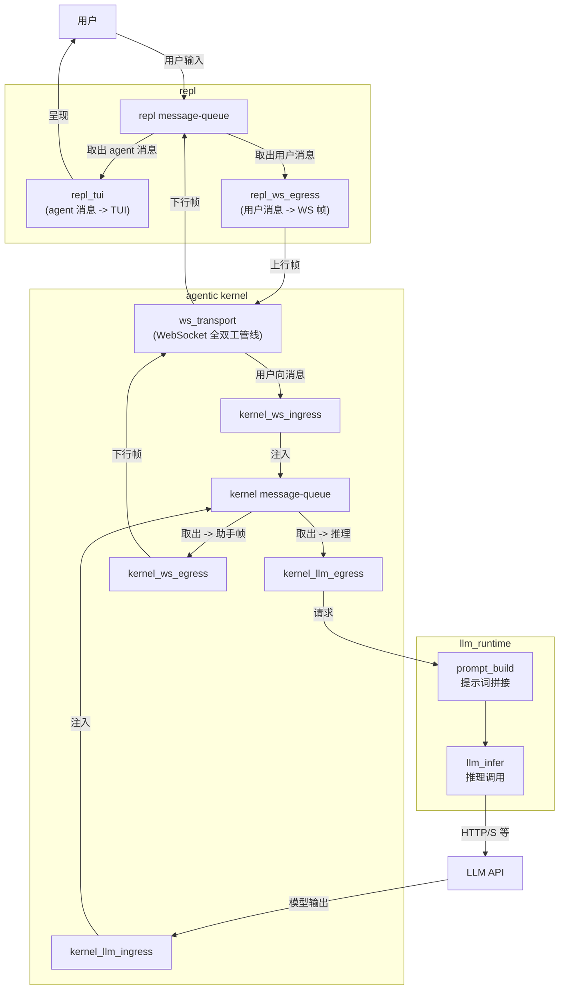

# iMate / Agentic Companion：概念架构

面向 **Android iMate**、后端聊天 WebSocket、Agentic Companion Kernel 与维护者的架构阅读材料。本文描述生产链路中的会话编排、状态存储、prompt / tool / memory 流，以及 `agentic_kernel` 内并存但尚未承载生产 Companion 主线的实验性 runtime 抽象；用于判断一次对话从客户端进入后如何被编排、持久化、异步补帧与更新长期记忆。

- 生产入口：`/app/api/v1/endpoints/chat.py`（`/api/v1/chat/ws`）、`/app/services/companion_chat_service.py`、`/app/core/agentic_kernel/companion/manager.py`、`/app/core/agentic_kernel/companion/turn.py`
- API 行为与 WS 约定：`/app/api/ENDPOINTS.md`
- 实验性 runtime 抽象：`/app/core/agentic_kernel/contracts/turn.py`、`/app/core/agentic_kernel/runtime/turn_orchestrator.py`、`/app/core/agentic_kernel/bridges/experimental_bridge.py`

启用异步双路（Dual-LLM）时，前台 chat 先随一轮 WS 响应返回；后台 tool 侧完成后可能经**同一连接**再推送 assistant 帧；连接级队列与落库规则以前述文档为准。

**分层（传输 vs 逻辑）**：WebSocket 在 **repl/client 与 agent 的逻辑会话之下**。同一 TCP/WebSocket 连接上：

- **传输层 / 连接确认**：ping、pong、`client_context_ack` 等由路由 **直接** `send_json`，不入队；仅表示链路存活与时间上下文校验。
- **逻辑层 / 对话下行**：发往客户端的助手业务 JSON（foreground、tool 异步补帧、kickoff、HTTP 映射错误帧）经 **`asyncio.Queue`** + **`chat_ws_outbound_pump`**（`/app/services/chat_websocket_session.py`）FIFO `send_json`，与 REPL 客户端侧约定的 agent 对话顺序一致。

**REPL 客户端队列（`/tools/inty_v2_repl`）**：上行用户帧 `post_turn`（`/tools/inty_v2_repl/backend_chat_ws.py`）仅 `ws.send`，在 **WebSocket/TCP 发送侧 FIFO** 排队（服务端仍按连接串行处理对话）；下行助手与错误 JSON 由 recv 协程写入 **`_response_q`**（`asyncio.Queue`），终端经 `pop_downlink_item`（`/tools/inty_v2_repl/repl_message_io.py`）非阻塞取出。

**队列中心化下行（inty-ws）**：生产路径 `/api/v1/chat/ws` 使用上述队列与 pump。**`/ws/verify`** 也使用同一套 queue + pump（与 `/ws` 一致的业务 FIFO），但每帧仅做一次最简 `chat.completions`（system + user），不经 Agent runtime / companion；不落 chat_history（详见 `chat_completions_websocket_verify` docstring）。

**逻辑架构（消息路径）**：先约定逻辑名称（与实现符号不必一一同名），再按**消息传递方向**画图。

| 逻辑名                      | 含义                                                                       |
| ------------------------ | ------------------------------------------------------------------------ |
| **用户**                   | 人机边界                                                                     |
| **repl**                 | REPL 会话壳：内含 **repl message-queue** 与两个消费者                                |
| **repl message-queue**   | 收集并暂存：**用户输入**、**经 WS 下行的 agent 侧消息**                                    |
| **repl_tui**             | 从 repl message-queue **取出 agent 消息**，驱动 **TUI** 呈现给用户                    |
| **repl_ws_egress**       | 从 repl message-queue **取出用户消息**，封装为 **上行 WS 帧**                          |
| **ws_transport**         | **WebSocket 全双工管线**：只做比特/帧级双向搬运，**不含**回合语义                               |
| **agentic_kernel**       | 编排壳：内含 **kernel message-queue** 与四个方向的适配                                 |
| **kernel message-queue** | 收集并暂存：**经 WS 来自用户的消息**、**经 llm_runtime 来自 LLM 的消息**（含多轮/异步帧时在逻辑上仍汇总为此队列） |
| **kernel_ws_ingress**    | 从 ws_transport **接收用户向消息**，**注入** kernel message-queue                   |
| **kernel_llm_ingress**   | 从 **LLM API** 侧 **接收模型输出**，**注入** kernel message-queue                   |
| **kernel_llm_egress**    | 从 kernel message-queue **取出**待推理上下文，交给 llm_runtime                       |
| **kernel_ws_egress**     | 从 kernel message-queue **取出**待发助手帧，送到 ws_transport                       |
| **llm_runtime**          | **提示词拼接** + **LLM inference 调用**（对 kernel 暴露「一次调用」边界）                    |
| **LLM API**              | 外部模型服务                                                                   |

下图箭头均为**消息**流向（谁写入谁、谁读出谁）；控制帧、鉴权、队列泵等实现细节见上文「分层」与下一张实现细化图。

**小结（逻辑图 vs 实现）**：上图为**理想化**消息路径；下表将图中要素与仓库行为逐条对照（「是否合理」指作为教学抽象是否自洽，「与代码」指是否宜按字面当作逐函数实现）。

| 图上要素                            | 是否合理   | 与代码                                              |
| ------------------------------- | ------ | ------------------------------------------------ |
| 全双工 WS 管线                       | 是      | 一致                                               |
| repl 下行：WS -> 队列 -> TUI         | 是      | 与 `_response_q` 与 `pop_downlink_item` 等 drain 一致 |
| repl 上行：队列 -> WS                | 弱      | 实为 `post_turn` 直连 `ws.send`，非从同一队列出队             |
| 单一 kernel message-queue         | 教学上可接受 | 实为 recv 路径、`outbound_queue`、`bg_queue`、进程内状态等多结构 |
| LLM 输出注入同一 kernel message-queue | 概念汇总   | 实为调用链返回与组帧，经 `outbound_queue` 等写出，非独立「先入全局队列」    |

**实现细化**：同一链路在仓库中的近似映射（路由、`run_turn`、连接级队列名），可与上表逻辑名对照。

控制帧（ping/pong、client_context_ack）不经 `outbound_queue`，由 `_handle_chat_websocket_control_json` 直连 `send_json`（见上文「分层」）。上图仅描述生产 `/api/v1/chat/ws`；`/ws/verify` 共用**服务端出站 message-queue + 顺序写出**，编排为最简 `chat.completions`，不经 CCS/CM/RT。

## 当前生产内核架构

生产 Companion 主线不是单一全局 kernel queue，而是「连接级队列 + 会话管理器 + MemoryStore + 单轮执行器」组成的分层链路：

| 层 | 生产职责 | 关键实现 |
| --- | --- | --- |
| WebSocket route | 鉴权、控制帧、用户帧接收、业务下行 FIFO、HTTP/WS 错误映射、后台 tool 补帧汇合 | `/app/api/v1/endpoints/chat.py`、`/app/services/chat_websocket_session.py` |
| Companion service | 按用户、agent、chat、模型配置选择或复用 `CompanionManager`，追加 WS 入线 system turn，触发交互式 bootstrap kickoff 或普通对话 turn | `/app/services/companion_chat_service.py` |
| Session manager | 创建 `CompanionSession`，绑定 `MemoryStore`、共享 `CompanionLLMClient`、workspace root 与配置 | `/app/core/agentic_kernel/companion/manager.py` |
| Turn executor | 加载 context、prompt bundle、transcript，选择 route，调用 LLM/tool loop，追加 transcript，调度记忆更新 | `/app/core/agentic_kernel/companion/turn.py` |
| Prompt / route | 根据 bootstrap、inner tick、async tool、implicit signal 组装 system messages 与 tools schema | `/app/core/agentic_kernel/companion/prompt_stack.py`、`/app/core/agentic_kernel/companion/turn_routes.py` |
| State / memory | 以 `MemoryStore` 读写 `context.json`、`transcript.jsonl`、`MEMORY.md`、`USER.md`、`SOUL.md`、daily memory、compaction state 等文档；PostgreSQL 环境通过 append-only document version 表持久化 | `/app/core/agentic_kernel/companion/memory_store.py`、`/app/core/agentic_kernel/companion/memory_pipeline.py`、`/app/core/agentic_kernel/companion/workspace_doc_mapping.py` |
| Model providers | `CompanionLLMClient` 按 chat/tool/memory/day_summary/user/soul/inner_tick 场景调用 OpenAI-compatible provider | `/app/core/agentic_kernel/companion/llm_client.py`、`/app/core/agentic_kernel/providers/facade.py` |

### 单轮生产数据流

1. `/api/v1/chat/ws` 收到用户业务帧后，经 `companion_chat_service.run_companion_chat_turn_for_api` 进入当前 `CompanionSession`。
2. `CompanionManager` 从 `MemoryStore` 取或建会话状态；生产配置中 workspace 文档以 DB-backed `MemoryStore` 为权威，路径只作为 workspace key 与兼容边界。
3. `run_turn` 读取 `context.json`、prompt bundle、transcript window，并可按 `transcript_compaction` 把旧对话折叠成 system snapshot。
4. `prompt_stack.companion_turn_tools_and_system_messages` 根据 inner tick、interactive bootstrap、async tool、implicit signal 生成 tools 与 system messages，并由 `turn_routes.resolve_turn_route_mode` 选择 `CHAT_ONLY_SYNC`、`SYNC_TOOL_LOOP`、`ASYNC_FOREGROUND_CHAT_BACKGROUND_TOOL`、`INNER_TICK_SYNC` 或 `HEARTBEAT_SYNC`。
5. 同步路径在一个 completion/tool loop 内完成；异步 Dual-LLM 路径把前台 chat completion 与后台 tool loop 分叉，前台先返回 assistant 文本，后台 tool 完成后通过 `BackgroundToolEventSink` 或 `tool_background` 输出事件补帧。
6. `run_turn` 追加 user/assistant transcript，并按配置同步执行或后台调度 `memory_pipeline`，更新 episodic daily memory、day gist、semantic `MEMORY.md`、`USER.md`、`SOUL.md`。
7. WS route 把 foreground/kickoff/error/tool-bg payload 放入 `outbound_queue`，由 `chat_ws_outbound_pump` 顺序 `send_json`。

### 状态与文档边界

- `MemoryStore` 是 Companion 持久状态的统一访问层：有 repository 时读写 append-only document versions，无 repository 时退回进程内缓存。
- `CompanionConfig.repository_only_workspace_text=True` 表示 transcript、context、ai_private 等约定文档不再直接读取用户工作区文件。
- `WorkspacePaths` 仍提供稳定相对路径约定，使 prompt stack、tools、memory pipeline 与 compaction 使用同一组文档名。
- `companion_workspace_bootstrap_type=USER_INTERACTIVE` 时，`context.json` 中的 bootstrap 标记控制入线 system turn、kickoff turn 与 bootstrap tools 的启停。
- `implicit_signal_bundle.user_signed_on` 会在 turn prompt 与 transcript 中加入用户上线信号，使 Companion 可自然回应非显式消息。

### 实验性 runtime 抽象的边界

`/app/core/agentic_kernel/contracts/turn.py`、`/app/core/agentic_kernel/runtime/turn_orchestrator.py` 与 `/app/core/agentic_kernel/bridges/experimental_bridge.py` 定义了更通用的 `TurnInput -> prepare_turn -> invoke_model -> handle_response -> TurnOutput` 管线，并可接 `TurnPersistence`。这套抽象当前是并存的实验性 kernel runtime，不是 `/api/v1/chat/ws` 生产 Companion 链路的入口；生产链路仍由 `CompanionManager.run_turn` 与 companion 目录内的 prompt/tool/memory 代码直接编排。

## 架构批判

- **概念边界不够收敛**：生产 Companion 使用 `run_turn` 专用编排，仓库内同时存在通用 `TurnOrchestrator` 抽象；两者的输入输出、持久化与 provider 边界未统一，维护者需要同时理解两套 turn 模型。
- **`run_turn` 承担过多职责**：同一个函数负责 context/transcript 加载、prompt 组装、route 分支、LLM 调用、tool loop、LangSmith trace、transcript 持久化与 memory pipeline 调度，局部修改容易牵动多条路径。
- **异步 Dual-LLM 分叉语义隐含在实现中**：前台 chat 与后台 tool 共享同一用户回合、trace、transcript 与补帧协议，但这些约束主要散落在 `turn.py`、`tool_background.py` 与 WS route 中，缺少显式的 turn plan / event contract。
- **状态层抽象仍带 workspace 形状**：`MemoryStore` 已成为权威状态层，但 API、工具与 prompt 仍通过 workspace path 和相对文件名表达文档，概念上像文件系统，实际生产读写是 DB document version。

## 已识别的架构改进

优先引入显式 `CompanionTurnPlan`（或等价结构）作为 `run_turn` 内部边界：

- 在加载 context、bundle、transcript 后一次性生成 route、tools、system messages、chat/tool 分支 messages、transcript window、memory/compaction 配置摘要。
- 前台 chat、同步 tool loop、后台 tool loop、runtime inspect 与 trace 都消费同一个 plan，避免 async Dual-LLM 路径重复调用 `companion_turn_tools_and_system_messages` 组装相近但不完全相同的 system stack。
- plan 可成为生产 `run_turn` 与实验性 `TurnOrchestrator` 之间的桥接点：先不迁移行为，只把「准备 turn」和「执行 turn」切开，降低后续统一 runtime contracts 的风险。
- 验收重点应覆盖 `CHAT_ONLY_SYNC`、`SYNC_TOOL_LOOP`、`ASYNC_FOREGROUND_CHAT_BACKGROUND_TOOL`、`INNER_TICK_SYNC`、interactive bootstrap 与 implicit sign-on，确保 prompt slice、tools schema、transcript append 与后台补帧行为不变。

本次只更新架构文档，不改变运行时代码；现有测试不需要同步修改。若按上述改进拆分 `run_turn`，应补充 companion turn plan 的单元测试，并保留 `/tests/app/api/v1/endpoints/test_chat.py`、`/tests/real_agents/test_agentic_kernel_run_turn_tool_call.py` 等 WS / tool 回归面。