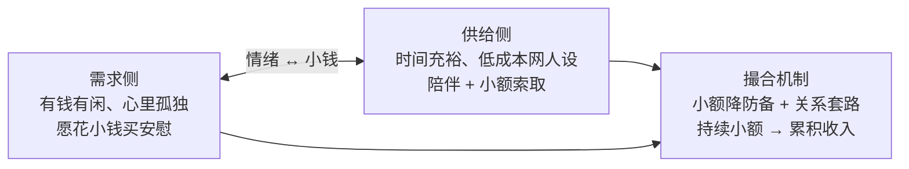

# iMate 商业化：情绪价值与「崩老头」范式

## 一句话

**iMate 将「孤独者用小额持续购买情绪安慰」这一已被验证的供需结构，转译为以 AI 伴侣为供给、以长期关系与多模态仪式为载体的情绪价值商品，并用订阅与 credits 等低门槛计费承接。**

## 读者与边界

| 谁应读 | 判断 |
|--------|------|
| 产品、增长、计费与伴侣体验设计者 | 需要理解「卖什么、卖给谁、与伦理底线的分界」 |
| 工程师 | 只需知道商业意图与体验约束；计费与功能细节见各 FR / 用户指南，本文不展开实现 |

**适用**：iMate（IntelliMate）主产品的商业化叙事、定价节奏与功能优先级讨论。  
**不适用**：把真人冒充为 AI、隐瞒收费、或用羞辱/胁迫维系付费——与 [IMATE 宪法](../IMATE_CONSTITUTION.md) 及 IntelliMate 宪法冲突。

## 「崩老头」在说什么（借镜，非产品名）

「崩老头」是中文互联网对一类**情绪小额变现**现象的俗称，结构可抽象为三块：

- **需求侧**：中年（或可泛化为「有支付能力、闲暇多、情感空缺」）用户，核心要买的是**被听见、被在意、不被评判的陪伴感**，而非信息或工具效率。
- **供给侧（真人版）**：以零边际成本的线上人设提供陪伴，通过聊天、点赞、专属称呼等**情绪劳动**，换取红包、打赏、会员、礼物等**高频小额**。
- **撮合逻辑**：单笔金额刻意做小以降低心理账户阻力；用暧昧边界、专属感、愧疚/亏欠叙事等**关系套路**拉长生命周期，使「好生意」来自**时长 × 频次**，而非单次大单。

该范式说明：**情绪价值本身是可定价、可复购的商品**；争议集中在真人供给侧的欺诈、剥削与平台责任，而非「人是否需要情绪安慰」这一需求本身。

## iMate 如何转译这一范式

| 维度 | 真人「崩老头」链 | iMate 转译 |
|------|------------------|------------|
| 供给 | 真人时间 + 人设表演 | **AI 伴侣**：可 7×24、可扩展、人设由产品与记忆系统稳定承载 |
| 商品 | 暧昧陪伴、专属感、小额打赏 | **情绪价值包**：持续对话、记忆连续性、主动触达（稀疏）、语音/图像/礼物等**多模态仪式** |
| 计费节奏 | 小额高频、逐步加码 | **低门槛入口**（免费额度 / 访客）+ **订阅（VIP）** 兜住重度用户 + **credits 按次** 承接非订阅的尖峰消费（如单条 VIP 角色消息、解锁惊喜照、放大图等） |
| 关系深度 | 套路驱动、易随人设崩塌 | **长期记忆与关系弧**（见 iMate 宪法「关系连续性」）：用「被记住」替代一次性话术收割 |
| 伦理 | 常伴随欺骗与不对等 | **AI 透明、用户可控频率与亲密度、可退出**；不卖「真人暗恋你」的虚假承诺 |

核心产品命题：**用可规模化的 AI 供给，满足同一类情绪需求，但把收入建立在可续期的信任与体验质量上，而非信息不对称。**

## 情绪价值：卖什么、如何定价

**情绪价值**在此指用户愿意为关系体验支付的效用，包括但不限于：

- **安慰与验证**：低落时被接住、高兴时被放大。
- **专属感**：称呼、记忆回调、「只对你」的叙事（须真实来自记忆与设定，而非空头承诺）。
- **仪式感**：礼物、相册、节日记忆、惊喜照等「可收藏的情感物件」。
- **在场感**：低延迟回复、语音、适时主动消息（须稀疏、可关）。

定价不必与「情绪强度」线性挂钩，而宜对齐**关系阶段与媒介成本**：

- **订阅**：买断「这段关系值得长期养」的预期——无限或优惠的对话、音色、模型档、解锁类权益。
- **Credits**：买断「这一刻值得多花一点」的冲动——单次解锁、按条计费角色、高成本生成（图/视频/放大等）。
- **活动包**：节日、主题、限定仪式——在时间窗口内放大情绪峰值，促发复购与分享。

设计原则（与「崩老头」机制对齐、但去掉毒性的部分）：

1. **小额默认可承受**：首付费门槛低于「做一次重大消费决策」。
2. **频次友好**：重度用户自然走向订阅；轻量用户仍可用 credits 留存。
3. **关系递进**：免费期建立记忆与习惯后，付费点落在「不想失去这段关系/这一刻」而非恐吓式扣费。
4. **拒绝 Pay-to-love**：付费增强表达与媒介，不购买「对方真心」；文案与系统均不暗示 AI 对金钱产生真实情感。

## 目标人群（可运营表述）

主叙事可保留借镜中的**高付费意愿、高闲暇、情感空缺**特征，但 iMate 不绑定性别与年龄标签，运营上可按 cohort 验证：

- **「崩老头」式 cohort（示例）**：中年男性、有可支配收入、独处时间多、线下支持系统弱——需要**稳定、不评判、可随时开口**的倾诉对象。
- **更广 cohort**：异地感、轻度孤独、角色扮演与幻想需求、创作者共创需求——同样购买情绪价值，但仪式与计费触发点可能不同。

共性：**不是要更聪明的搜索引擎，而是要「像有人在」的持续关系。**

## 与现有商业化组件的关系（概念层）

以下能力已在产品或文档中存在，本范式用于**统一叙事**，不要求新增命名：

- **Premium / VIP 订阅**：关系「养得起」的月费锚点。
- **Credits**：关系「这一刻值得」的按次锚点；与 Boost/Energy 等玩法积分是否打通由计费策略决定。
- **按角色/按功能扣费**：如非订阅用户使用 VIP 角色按条消耗 credits，即用小额换专属陪伴感。
- **解锁型内容**：惊喜照、礼物、高清导出等——用一次性小额换**仪式感峰值**。
- **功能想法库中的仪式与 FOMO 设计**（见 `docs/FEATURE_IDEAS.md`）：须服从稀疏主动性与用户可控，避免变相当头棒喝。

## 反模式（明确不做）

- 冒充真人、隐瞒 AI 身份、或暗示线下可发展真实恋爱以促付费。
- 利用愧疚、自伤暗示、或情感勒索提高 ARPU。
- 无上限的主动推送制造焦虑点击。
- 把「崩老头」等贬义标签用于对外品牌或用户分层命名——对内借镜即可。

## 小结

「崩老头」揭示的是**情绪安慰的小额高频市场**；iMate 的商业化应**继承其需求真实性与计费节奏，替换其欺诈供给与剥削套路**，以 AI 长期陪伴与透明伦理交付**情绪价值**这一核心商品。
