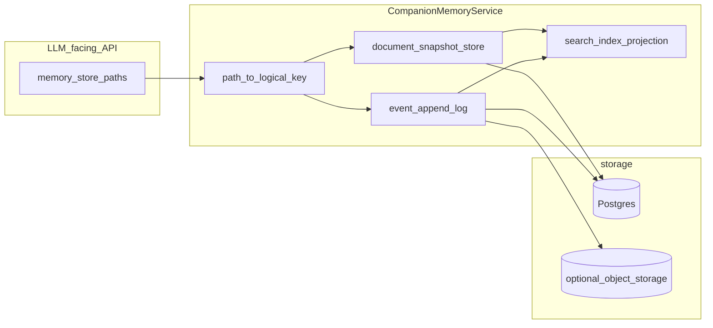

# Companion Memory Store

本文汇总 agentic companion 与工作区 **MemoryStore** 相关的两类说明：(1) **已实现** 的运行时与控制面 artifact（context、transcript、状态 JSON、生图索引等）；(2) **规划中** 的命名向量长期记忆（FR：`FR_AGENTIC_MEMORY_STORE`，PostgreSQL + pgvector）。Markdown 分层记忆管线（episodic / gist / semantic 策展）见 [`/docs/imate/MEMORY_PIPELINE.md`](/docs/imate/MEMORY_PIPELINE.md)。

## 期望设计方向（不绑定具体排期，仅架构目标）

以下面向「长期关系型 agentic companion」常见的四类记忆需求：**情景事件、语义摘要、结构化事实、可追溯治理**。与当前 Postgres 版本表实现的关系性说明见 [`/docs/FR_COMPANION_MEMORYSTORE_PERSISTENCE.md`](/docs/FR_COMPANION_MEMORYSTORE_PERSISTENCE.md)。

1. **分层存储模型（逻辑上拆分，不必一次改完表）**  
   - **事件流（append-only delta）**：transcript、runtime events、工具轨迹等用 **行级事件** 或 **对象存储 + 游标**，避免每行 JSONL 都整文件快照。  
   - **可编辑文档（snapshot / CRDT 可选）**：`IDENTITY` / `USER` / `MEMORY` 等保留「当前版本 + 可选历史」；写入可选 **内容寻址** 或 **显式 revision** 元数据（作者、turn_id、模型 id）。  
   - **检索层（vector / keyword）**：从事件与文档派生 **chunk + embedding**，与正文表引用同一 `revision` 或 `event_id`，供 RAG / 归档压缩。

2. **单一 scope 真理源**  
   - 弱化「从路径拆解三元组」；以显式 **`session_id` / `scope_id`（UUID）** 作为主外键，`path` 仅作 LLM 侧视图。

3. **跨会话记忆**  
   - 引入 **user-scoped 或与 companion 绑定的人格层** vs **chat-scoped 对话层**；用 **projection job** 把 chat 层稳定事实合并到上层（带冲突策略）。

4. **并发与一致性**  
   - 对「读-改-写」类文档：**乐观锁（expected revision）或 DB 单行 current + 异步归档**，避免 lost update；或对 JSONL **只追加物理行**而非重复存全文件。

5. **保留现有优点**  
   - 继续暴露 **POSIX 路径式工具接口**（对模型友好）；底层实现替换为分段 repository，不必推翻 API。

## 工作区 MemoryStore（运行时与控制面）

本文与分层记忆稿（[`/docs/imate/MEMORY_PIPELINE.md`](/docs/imate/MEMORY_PIPELINE.md)）正交：记录 **context / transcript / ai_private / 状态 JSON / 生图索引** 在 MemoryStore 中的角色。人设根稿（`IDENTITY.md` / `SOUL.md` / `USER.md`）随交互由工具与记忆管线策展更新。规划中的向量 LTM 见下文「FR_AGENTIC_MEMORY_STORE（向量长期记忆）」。

### 存储、更新与效果

| 项 | 存储方式 | 更新方式 | 使用效果 |
|----|----------|----------|----------|
| **context.json** | MemoryStore 单文件正文；生产环境与其它工作区文档一致，走 `companion_memory_document_versions` append-only，`document_kind=context_json`。 | 建会话时 `CompanionManager.get_or_create_session` 可写入默认；运行中工具 **`companion_set_experience_profile`**（及 bootstrap 完成类工具）更新 JSON；**禁止**用 `memory_store_write_document` 直接覆盖（见工具说明）。 | `load_context_meta` 解析为 `ContextMeta`：驱动 **experience profile**（是否注入私人记忆层、system 中的 profile 条款）、bootstrap / WebSocket 相关跳过标志、会话 id 等。 |
| **transcript.jsonl** | MemoryStore **JSONL**：每行一条与 `ChatMessage` 兼容的 JSON。 | `run_turn` / `turn_engine` 在每轮结束后 **`append_jsonl_record`** 追加 user/assistant（及标记字段）；可用工具读全文核对（体积大时常带 `max_chars`）。 | `transcript_for_llm_turn` 截窗进入当前请求消息列表；**上下文压实**读取并重写前文为快照；承载交互语义，不是人设稿。 |
| **ai_private.md / ai_private.jsonl** | 二者均在 `memory_store_document_mapping` 注册为独立 `document_kind`，与其它文档同属 MemoryStore。 | 注入路径 **`get_ai_private_text_for_prompt`** 仅读取 **`ai_private.md`**（长度可经环境变量上限裁剪）；`ai_private.jsonl` 在映射中存在，写入路径以代码为准。 | **内在节拍**等非用户主对话轮：正文进入 `## 内在活动（ai_private）` system 块；不向用户解释机制。 |
| **`.companion_*` / `.inty_v2_*` 状态 JSON** | 同一 MemoryStore：`MemoryStoreScopePaths` 通过 `state_file_prefix` 在 **`.companion_...` 与 `.inty_v2_...`** 两套前缀间切换（记忆管线节拍、压实状态、定时队列、image gate 等）。 | 各子系统 **`write_document` 覆盖当前快照**；例如记忆管线更新节拍、压实保存状态、`schedule_task` 写队列、`image_gate` 写门控。 | **控制面**：节拍计数、是否允许生图、定时任务、压实进度等；间接影响管线触发、上下文规模与工具可用性；一般不当作人设 system 切片注入。 |
| **`generated_images/index.jsonl` 与 `generated_images/...`** | 索引为 MemoryStore 文档；产物二进制可走对象存储（索引行可含 `gcs_http_url` 等），详见服务端部署说明。 | **`generate_image` / `modify_image`** 成功后向索引 **追加**记录；可按最新记录解析默认改图源。 | 支撑生图/改图工具链与用户可见交付；与文本提示词切片职责分离。 |

### 代码索引

| 主题 | 路径 |
|------|------|
| context 读取 | `app/core/agentic_kernel/companion/models.py` (`load_context_meta`) |
| transcript / 压实 | `app/core/agentic_kernel/companion/turn.py`, `transcript_compaction.py`, `models.py` |
| ai_private 注入 | `app/core/agentic_kernel/companion/ai_private_prompt.py`, `prompts/system_messages.py` |
| 路径 kind | `app/core/agentic_kernel/companion/memory_store_document_mapping.py` |
| scope 路径辅助 | `app/core/agentic_kernel/companion/memory_store_scope.py` (`MemoryStoreScopePaths`) |
| 生图索引 | `app/core/agentic_kernel/companion/image_gate.py` |

## FR_AGENTIC_MEMORY_STORE（向量长期记忆）

### 中文执行计划

本 FR 目标：为 **AGENTIC kernel**（`app/core/agentic_kernel/` 下的 companion 运行时）提供**专用**长期记忆：可持久化的命名记忆、可审计来源、层次结构、PostgreSQL + pgvector 与全文混合检索、进程内运行时缓存，以及与其它提示词切片统一的 LLM 上下文组装能力。

**与 legacy 记忆系统的关系（强制边界）**

- **Legacy** 指：既有 PostgreSQL `memory` 表、节日/日常记忆抽取与推送、`memory_extraction_log` 等主 App 管线；**本 FR 不沿用、不扩展、不在读写路径上耦合**该表或该管线。
- **Agentic kernel 记忆** 使用**独立表名与独立 Repository/服务**（例如 `agentic_kernel_ltm` + `agentic_kernel_ltm_provenance`，名称以最终实现为准），仅由 kernel 编排层与可选的后台任务访问。
- 主 App 的 legacy 记忆可继续服务旧客户端；agentic 路径是否**并行展示**由产品另定，但**存储与代码边界保持分离**。

#### 前置决策（阶段 0）

- 固化 **新表前缀与模块布局**（全部落在 agentic kernel 或明确标注的 `backend` 子模块，禁止混入 legacy `memory` 的 ORM 模型）。
- 固化 **作用域键**：`user_id` 必选；`agent_id` / `chat_id` / `workspace` 或 kernel 会话键是否参与过滤与唯一约束写清。
- 固化 **嵌入合同**：模型 id、向量维度、是否归一化、距离算子（与 HNSW opclass 一致）、`embedding_version` 升级与全量重算策略。

#### 分阶段交付

| 阶段 | 中文说明 | 主要产出 |
|------|----------|----------|
| 0 | 决策与契约 | 表前缀、作用域键、嵌入合同、与 legacy 的隔离清单（代码路径级） |
| 1 | 数据库 | Alembic：`CREATE EXTENSION vector`、新表、B-tree / HNSW / GIN 索引 |
| 2 | 数据访问层 | SQLAlchemy 模型、Repository、嵌入失败状态与重试钩子 |
| 3 | 写入流水线 | 提炼 -> 归一化/去重 -> 调嵌入 API -> 同事务写主表与 provenance -> 通知缓存失效 |
| 4 | 运行时内存 | 工作集、热点 LRU、写合并；**以 PG 为准**，进程可冷启动重建 |
| 5 | 检索服务 | 过滤后向量 Top-K + 全文 Top-K -> RRF/加权融合 -> 可选重排；层次打包进 token 预算 |
| 6 | 提示词组装 | 在 **companion 唯一出口** 注入 LTM 块；与工作区 `memory_pipeline` 文档块顺序可配置；与 `prompting/assembler.py` 路径去重 |
| 7 | 对外 API（若需要） | HTTP 契约；同步 `app/schemas` 与 Kotlin `api/model` |
| 8 | 质量与观测 | 集成测试；**断言** agentic 读写从不触及 legacy `memory` 表；延迟与嵌入失败率指标 |
| 9 | 上线 | 功能开关、重嵌入与索引重建运维说明 |

#### 关键依赖与风险

- **依赖**：带 pgvector 的 Postgres 镜像或实例；嵌入服务配额与密钥；DSN 可与现网 PG **同实例不同表**，但连接与配置须**独立**于 legacy 记忆服务（避免共享 Repository）。
- **风险**：大表 HNSW 构建窗口；过滤过窄时预过滤与召回需调参；来源字段含 PII 须与聊天记录同等留存与权限；检索需防跨租户（禁止仅按向量查）。

#### 详细规格说明（与实现对齐）

以下与上文「分阶段交付」一致，补充字段级与流水线级说明。

### 目标与非目标

**目标**（仅 `app/core/agentic_kernel/` 使用）：

1. 每条记忆有稳定 **命名**（作用域内 slug）与 **来源**（provenance：哪些对话片段与元数据支撑提炼）。
2. **层次化**：`parent_id` 树，可选 `agentic_kernel_ltm_edge` 表达 DAG（关联、替代、派生）。
3. **持久化**：PostgreSQL + **pgvector** 语义检索，配合 **全文**（`tsvector` + GIN）做混合排序。
4. **进程内运行时**：工作集、热点缓存、写合并；**PostgreSQL 为权威数据源**。
5. **提示词组装**：独立「记忆切片」，与静态系统切片、工具策略切片、近期对话等拼装为发给 LLM 的上下文。

**非目标**：复用、迁移或扩展 legacy `memory` 表及其抽取管线；向 legacy 表双写 kernel LTM。

表名与列名为提案，**禁止**与 legacy `memory` 同名冲突。

### 与现有系统的关系

#### Legacy `memory`（本设计不触碰）

- 历史主 App 能力：`memory` 表（见 `alembic/versions/20260127_120000_add_memory_tables.py`）、节日/日常抽取与推送等。
- **本 FR 不读不写** legacy `memory`：不共享 ORM、不共享 Repository、LTM 行不 `FOREIGN KEY` 指向 `memory.id`。

#### Agentic kernel 工作区存储（正交）

- 代码：`app/core/agentic_kernel/companion/memory_store.py`、`memory_registry.py`、`turn_engine.py`。
- 现状：工作区级状态（如 compaction），**不是** kernel LTM。职责拆分：**工作区 store** 与 **`AgenticKernelLtmStore`**（示例名，以代码为准）及新表。

**集成**：在 **kernel 回合组装** 路径上引入专用 **读穿/写穿** `AgenticKernelLtmRuntime`（示例名）。DSN 可与业务共用同一 PG 集群，但 **LTM 迁移与代码归 kernel 侧拥有**；进程重启后从 PG 重建内存侧索引。

#### 编排边界

- `companion_chat_service.py` 仅可传入 **DSN 或 session 工厂**；不得把 kernel LTM 路由到 legacy 记忆服务。嵌入可异步/延迟，**不得**调用 legacy 抽取任务。

#### 提示词组装

- 对齐 `docs/FR_CLEAN_AGENT_PROMPTS_SYSTEM.md`（类型化切片边界）。
- 记忆块须由 **单一入口** 生成（ companion 侧专用小模块或扩展现有 `build_system_messages` 链路），避免多处字符串拼接。
- **`app/core/agentic_kernel/prompting/assembler.py`** 偏向主站 Agent 的 LangChain 拼装；**本 FR 的向量 LTM 切片默认挂在 companion 回合路径**（如 `companion/prompts.py` / `build_system_messages` / `turn_engine.py` 的最终 message list），与 assembler 并行存在时须 **明确只选一条主路径** 注入，避免重复塞入两套「记忆」。

### 架构审查结论（纳入本 FR）

本节吸收对当前 `agentic_kernel/` 代码的对照结论，作为实现约束。

#### 与现有 companion 运行时的兼容度（高）

- **`CompanionManager`**（`companion/manager.py`）按 `user_id` + `companion_id` + `chat_id` 管理 `CompanionSession`，工作区目录为 `workspaces_base_dir/user_id/companion_id/chat_id`，与 FR 中 LTM **作用域键** 一致。
- **`get_memory_store`**（`companion/memory_registry.py`）以 `CompanionScope.registry_key()` 为键，在 **单进程内** 对同一三元组复用同一个 `MemoryStore`，Repository 绑定相同作用域；LTM 的租户隔离语义与此 **同构**，不冲突。
- **`runtime/turn_orchestrator.py`** 提供通用单轮 `prepare / invoke / handle / persist`；LTM 的检索与写入可挂在 `prepare_turn`（注入上下文）与 `persistence` 或会话尾部，无需推翻该抽象。

#### 与 `memory_pipeline`（工作区文档记忆）正交（须保持）

- **`companion/memory_pipeline.py`** 负责基于工作区文件的 **MEMORY / SOUL / USER、日记与日总结** 等 **markdown 策展管线**，属于 **工作区 store** 能力。
- FR 定义的 **pgvector LTM**（命名 + provenance + 层次）是 **另一条纵轴**；实现上 **禁止** 把 LTM 读写混进 `MemoryStore` 既有语义或替换 `SqlAlchemyMemoryRepository` 的职责。
- **提示词顺序**须产品化约定：例如 **静态 axiom -> 工作区文档块（若有）-> 向量 LTM 块 -> 工具策略 -> 近期 transcript**；实现时在 **单一组装函数** 内用配置固定顺序，避免两处各塞一半上下文。

#### LTM 运行时注册策略（对齐 `memory_registry` 模式，已决案）

| 层级 | 是否共享 | 说明 |
|------|----------|------|
| **代码与无状态服务** | 共享 | 全进程一份 LTM Repository 类、查询与融合逻辑、（可选）全局限流后的嵌入客户端。 |
| **数据库连接池** | 共享 | 与现有后端共用同一 PG 连接池或 DSN 工厂即可；表前缀独立。 |
| **有状态运行时句柄** | **按作用域一份** | 仿 `get_memory_store`：按 `(user_id, companion_id, chat_id)`（或与 FR 一致的 scope key）注册 **`AgenticKernelLtmRuntime`（示例名）**，内含该 scope 的工作集缓存、写合并队列；**禁止** 无 scope 的全局单例承载租户状态。 |
| **OS 进程** | 默认共享 | **不**为每个 companion 默认独占一整套 OS 进程级「记忆模块」（不符合 WebSocket 多连接与弹性伸缩）；仅当合规明确要求 **硬进程隔离** 时再单独评估。 |

**持久化隔离**：一切 SQL 必须带 **`user_id`（及既定 `agent_id`/`chat_id`）谓词**；禁止仅靠向量相似度、不带租户过滤的扫描。

#### 多智能体与 iMate 后端（能力与缺口）

**已有基础**

- **单用户、多会话 / 多 chat**：已由 `CompanionSession` 键与 scope 化 store 支持 **逻辑隔离**；LTM 表沿用相同 scope 列即可与 PG 层一致。
- **多 companion 共用基础设施**：同一进程内多连接、多会话共享连接池与 LTM 服务代码是自然部署形态。

**缺口（本 FR 不假装已解决，后续可单列 FR）**

- **跨 companion 共享知识**：若同一用户下多个 agent 需共享一条「用户级」LTM，须在 schema 中显式 **`memory_scope` 或 `agent_id` 可空语义** 与检索策略（仅用户级 / 角色级 / 会话级）；不能默认仅 `chat_id`。
- **多智能体编排**：`TurnOrchestrator` 是 **单次 turn** 抽象，**不包含** 多 agent 路由、handoff、共享黑板或跨 agent 消息总线；若产品要做「多智能体协作」，需要 **kernel 之上的编排层**，本 FR 的 LTM 仅提供 **可被多调用方共享读写的存储与检索**，不替代编排引擎。

#### 阶段 6 补充（提示词）

- 实现清单中须列出 **唯一** 的 companion 注入点文件名（落地时以 PR 为准），并增加 **基线测试**：LTM 块只出现一次、与工作区 markdown 记忆块顺序可配置。

### 存储选型

- **PostgreSQL + pgvector**：元数据、来源、租户过滤与向量同事务；与 `backend/ARCH.md`、`backend/AGENTS.md`、`docker compose up pgvector` 一致。
- **混合检索**：向量距离（如 `<=>` / `<->`，与归一化及 HNSW **opclass** 一致）+ `tsvector` 全文通道，RRF 或加权融合。

### 逻辑数据模型

#### 表 `agentic_kernel_ltm`（示例名，非 legacy `memory`）

| 列名 | 说明 |
|------|------|
| `id` | 主键 UUID 或 BIGSERIAL |
| `user_id` | 租户；每条查询必选过滤条件 |
| `agent_id` | 可空：用户全局记忆；否则绑定角色/ companion |
| `chat_id` | 可空：会话级更细粒度 |
| `parent_id` | 层次；根为 NULL |
| `name` | slug；在 `(user_id, agent_id, chat_id)` 等作用域内唯一（迁移中写死规则） |
| `content` | 写入 LLM 提示的正文 |
| `embedding` | `vector(N)`，`N` 与 `embedding_model` 绑定 |
| `embedding_model` | 模型 id 字符串 |
| `embedding_version` | 重嵌入批次标识 |
| `content_tsv` | 由 `content`（及可选 `name`）生成的 `tsvector` |
| `valid_from` / `valid_to` | 软删或替代 |
| `created_at` / `updated_at` | 审计 |

**索引（示例）**

- B-tree：`user_id`，`(user_id, agent_id)`，`(user_id, agent_id, parent_id)`。
- 唯一：`(user_id, agent_id, name)`；`agent_id` 可空时用部分索引或 surrogate scope。
- `embedding` 上 HNSW，**opclass 与查询距离一致**。
- `content_tsv` 上 GIN。

#### 表 `agentic_kernel_ltm_provenance`

| 列名 | 说明 |
|------|------|
| `id` | 主键 |
| `memory_id` | 外键指向 `agentic_kernel_ltm` |
| `source_type` | 如 `chat_message`、`chat_window`、`tool`、`document` |
| `source_id` | 外部 id |
| `excerpt` | 可选截断原文 |
| `meta` | JSONB：提炼器版本、prompt 哈希、偏移等 |

#### 可选表 `agentic_kernel_ltm_edge`

- 非树关系：`related_to`、`supersedes`、`derived_from`，行 `(from_id, to_id, kind)`。

### 进程内运行时子系统

**职责**

1. **工作集**：最近 N 轮或尚未对检索可见的待写数据。
2. **热点缓存**：当前 `user_id` / `agent_id` 下部分向量（LRU 或会话固定）。
3. **写队列**：按 `name` 去抖合并；安全时批量调用嵌入 API。

**规则**

- **以 PostgreSQL 为准**；内存结构可丢弃。
- PG 提交后按 `id` + 版本更新或失效缓存。
- 启动：不强制全量预热；按作用域首次检索懒加载。

### 写入流水线

1. **提炼**：LLM 或规则任务输出结构化字段（`name`、`content`、`parent_id`、多行 provenance）。
2. **归一化**：裁剪 `name`、唯一性策略、同名则合并或升版本。
3. **嵌入**：调用嵌入服务；失败则写 `embedding_status`（迁移中增加列）并入队重试。
4. **持久化**：单事务写 `agentic_kernel_ltm`、插入 provenance、若非生成列则更新 `content_tsv`。
5. **通知运行时**：失效或补丁式更新缓存。

异步：长耗时嵌入不阻塞用户可见回合完成；由 kernel 或调用方延迟，**不**走 legacy 抽取。

### 读取与检索流水线

1. 由最新用户话轮或聚合任务串生成 `query_embedding`。
2. SQL 过滤：`user_id = ?`，可选 `agent_id`、`chat_id`、`valid_to IS NULL`、层次条件。
3. 向量分支：`ORDER BY embedding <=> :q LIMIT k_vec`。
4. 全文分支：`ts_rank_cd` 或 `@@`，`LIMIT k_txt`。
5. 融合：RRF 或加权和；可选对 Top M 交叉编码器重排（特性开关）。
6. **层次感知打包**：在 token 预算内组合祖先摘要与叶子细节（可配置）。

### 提示词组装集成

建议消息顺序（与 clean prompt 体系统一时再对齐）：

1. 静态系统切片（人格、安全、格式）。
2. 工具与策略切片。
3. **记忆切片**：列表项含 `name`、`content`、一行来源引用（紧凑模式可仅 id）。
4. 近期对话窗口。

各切片在配置中设 `max_tokens`；记忆切片先丢融合分最低项。

### HTTP 与双端 schema

若移动端或 Ops 需列改记忆：更新 `app/schemas` 与 `android_app/core/data/src/main/kotlin/ai/sxwl/android/data/api/model`（仓库约定）。

### 安全

- 每条读路径必须带 **租户过滤**（`user_id`）；禁止仅靠向量检索。
- provenance 可能含 PII：留存与访问控制与聊天记录同级。
- 缓解记忆投毒：Top-K 多样性、置信度标记、高影响写入可选人工审核队列。

### 测试要点

1. 迁移：空库 `alembic upgrade head`，确认已安装 `vector` 扩展。
2. Repository 集成：插入、混合检索、唯一性、父链、替代。
3. **隔离**：静态分析或集成测试断言 kernel LTM 模块不 import legacy `memory` 模型或服务。
4. 负载烟测：固定行数，在 CI 体量 DB 上记录 p95 基线。

### 仓库路径索引

- `alembic/versions/20260127_120000_add_memory_tables.py`：legacy `memory`（仅对照，本 FR 不扩展）
- `alembic/AGENTS.md`：迁移流程
- `app/core/agentic_kernel/companion/manager.py`：`CompanionManager` / `CompanionSession`，会话 scope 来源
- `app/core/agentic_kernel/companion/memory_registry.py`：`get_memory_store` 注册表模式（LTM 运行时应对齐）
- `app/core/agentic_kernel/companion/memory_store.py`：工作区 store（与 LTM 正交）
- `app/core/agentic_kernel/companion/memory_pipeline.py`：工作区 markdown 记忆策展（与向量 LTM 并行，勿混）
- `app/core/agentic_kernel/companion/turn_engine.py`：回合与 transcript 持久化挂点
- `app/core/agentic_kernel/companion/prompts.py`：companion `build_system_messages` 等（LTM 切片首选注入链）
- `app/core/agentic_kernel/prompting/assembler.py`：主站 Agent 提示拼装（与 companion 路径区分）
- `app/core/agentic_kernel/runtime/turn_orchestrator.py`：单轮编排抽象（多 agent 编排不在此 FR）
- `app/services/companion_chat_service.py`：可选 DSN 注入边界
- `docs/FR_CLEAN_AGENT_PROMPTS_SYSTEM.md`：提示词组装方向
- `backend/ARCH.md`、`backend/AGENTS.md`：pgvector 与 compose 说明
