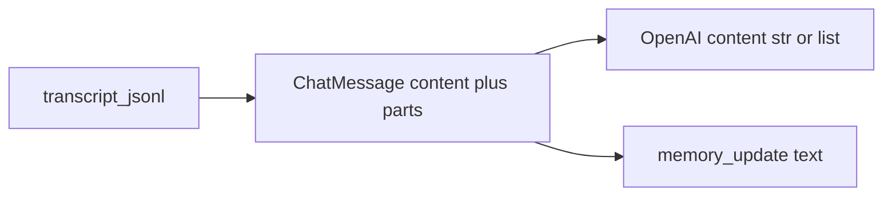

# FR: 原型内多模态与结构化消息（transcript + LLM 载荷）

**范围**：仅 [`experimental/inty_v2_text_chat_prototype/`](../)（不修改 `app/schemas` 与 Android Kotlin 模型）。

**目标**：扩展用户消息与助手消息的**内容类型**，支持 `text`、`emoji`（语义层）、`image`、`audio`、`video`、`gif` 等；一条消息可由多段 **parts** 组合（如文字+图片）。与现有 `transcript.jsonl` 行内 `content: str` **向后兼容**。

---

## 1. 现状

- [`models.py`](../models.py)：`ChatMessage.content` 为唯一正文（`str`）。
- [`orchestrator.py`](../orchestrator.py)：` _build_turn_base_messages` 历史与本轮 user 均为 `{"role", "content": str}`；`_persist_turn_rows` 写 JSONL；助手文本来 `_assistant_text_from_completion_response`（仅 string）。
- [`memory_update.py`](../memory_update.py)：`user_text` / `assistant_text` 全程纯文本。
- [`llm_trace.py`](../llm_trace.py)：`content` 非 `str` 时摘要为 `<non-str>`，需增强。
- [`image_gate.py`](../image_gate.py)：`prepare_image_gate_for_turn(root, user_text: str)` 仅字符串。

---

## 2. 设计原则

1. **向后兼容**：仅 `content`、无 `parts` 的旧行行为不变；新行可增加可选字段 `parts`。
2. **给模型的事实来源**：若存在 `parts`，用其组装 API 的 `content`（`str` 或 OpenAI 风格 `list[dict]`）。`content` 字段同时作为**人类可读 + 记忆/门控用扁平串**，须与 `parts` 语义一致（见第 3 节）。
3. **与 OpenAI 多模态对齐**：`image` / `gif` 在 API 侧统一为 `type: image_url`（gif 可用 metadata 区分）。`audio` / `video` 在 schema 中保留；若当前模型/路由不支持，须**显式降级**（例如把 URL/说明注入为 text），避免静默失败。
4. **emoji**：与 `text` 在 API 上等价；同一语义不要重复表示（要么只用 `text`，要么用 `type: emoji` 做产品/统计），映射到 API 时统一为 text 块。

---

## 3. `content` 与 `parts` 一致性

- **风险**：手工改 JSONL 或某写入点只更新一边时，模型与日记/门控所见不一致。
- **写入约定**：官方持久化路径（`orchestrator._persist_turn_rows` 及后续统一辅助函数）在存在 `parts` 时**必须**写入 `content = flatten_parts_for_memory(parts)`（或等价规范化串），禁止只写 `parts` 不写 `content`。
- **读取约定**：`load_transcript` 后 `normalize_chat_message` 或校验：若 `parts` 非空且规范化后与 `flatten_parts_for_memory(parts)` 不一致则 **`ValueError`**（默认严格）。如需兼容脏数据，可通过 **env 开关**放宽（默认关闭）。
- **Phase 2**：助手多段 `parts` 落盘时遵守同一规则。

---

## 4. 分阶段交付

| 阶段 | 内容 |
|------|------|
| **Phase 1** | transcript schema + `ChatMessage` / `load_transcript`；历史行用 `chat_message_openai_content` 进 API；持久化 user/assistant 可带 `parts`；`run_turn` 本轮 user 仍为 `str`（REPL 不变）；助手正文仍以 completion **字符串**为主。 |
| **Phase 2** | `run_turn` 支持 `user_parts`；解析 assistant 多模态 completion 或合并 tool 图片 URL 等为 `parts`；REPL/其他通道传文件等。 |

---

## 5. 体积上限

- 单 **part**（base64、`data:` URL、文本等）设最大字符或字节。
- 单条消息 **全部 parts 合计**再设上限。
- 超限 **`ValueError`**。

---

## 6. 数据模型（实现位置建议）

**文件**：[`models.py`](../models.py) 或拆出 [`message_content.py`](../message_content.py)（视行数）。

- **MessagePart**：Pydantic 判别联合（`Literal` + `Field(discriminator="type")`），覆盖：`text`、`emoji`、`image`（url / base64 data url）、`audio`、`video`、`gif`；可选 `mime`、`alt`、`duration_ms` 等。
- **ChatMessage**：增加 `parts: list[MessagePart] | None = None`。
- **函数**：
  - `flatten_parts_for_memory(parts) -> str`
  - `chat_message_openai_content(m: ChatMessage) -> str | list[dict[str, Any]]`
  - `normalize_chat_message(m: ChatMessage) -> ChatMessage`

---

## 7. 管线改动清单

| 组件 | 改动要点 |
|------|-----------|
| `orchestrator._build_turn_base_messages` | 历史每条用 `chat_message_openai_content(m)`；本轮 user 若未来结构化则同样产出 `str \| list`。 |
| `orchestrator._persist_turn_rows` | 有 `parts` 时序列化 `parts`；`content` 与 `parts` 一致。 |
| `orchestrator.run_turn` | Phase 1 保持 `user_text: str`。 |
| `_payload_chars_for_debug` | `list` 型 content 递归估算长度。 |
| `_assistant_text_from_completion_response` | Phase 1 仍返回 `str`；Phase 2 再扩展。 |
| 记忆入队 | 使用行上 `content`（已与 `parts` 一致）或统一 flatten。 |
| `prepare_image_gate_for_turn` | Phase 1 仍 `user_text`；Phase 2 合并 `user_parts` 的扁平串。 |
| `llm_trace.summarize_messages` | `content` 为 `list` 时输出多段类型统计与长度，避免巨长 URL。 |
| **Transcript 写入审计** | 搜索 `append_jsonl_with_db` / `transcript`：[`main.py`](../main.py) presence、[`tool_background.py`](../tool_background.py) 等，保证新行仍为合法 `ChatMessage`。 |

---

## 8. 提供方与双路 LLM

Phase 1 结束前至少一次：带 `image_url` 的 user `content`（list）走 OpenRouter，并覆盖 **async_tool_bg / dual_llm** 主路径，确认不因类型被拒。证据写在 [`AGENTS.md`](../AGENTS.md) 或 [`tests/docs/](../../../tests/docs/) 短说明（可手工、不强制 CI 外网）。

---

## 9. 文档与测试

- 更新 [`AGENTS.md`](../AGENTS.md)：`parts` 可选、`content` 契约、emoji/gif 映射、Phase 边界、体积上限 env/常量名。
- 新增 `tests/test_message_parts_schema.py`：旧行仅 `content`；含 `parts` round-trip；image+text 映射；flatten 稳定；**content/parts 不一致抛错**。
- 按需扩展 `tests/test_transcript_for_llm_turn.py`：窗口仍按「一行一条 `ChatMessage`」计数。

---

## 10. 非目标（Phase 1）

- 不修改仓库根 `app/schemas` 与 `android_app/.../api/model`。
- REPL 不实现粘贴图片/拖拽文件（Phase 2 再接通道）。

---

## 11. 数据流（简图）

---

## 12. 实施待办（执行时可勾）

- [ ] Schema：`MessagePart`、`ChatMessage.parts`、flatten / openai 映射、normalize、体积上限。
- [ ] 一致性：`load_transcript` 后校验或 normalize（可选 env 放宽）。
- [ ] Orchestrator：构建消息、持久化、payload 调试、记忆与 image_gate；写入点审计。
- [ ] `llm_trace`：list `content` 摘要。
- [ ] 提供方冒烟：image parts + OpenRouter + 双路路径。
- [ ] 测试 + `AGENTS.md`。
